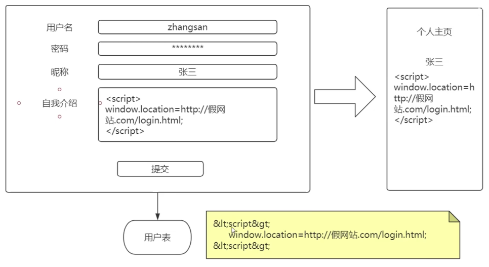

# 安全漏洞

[TOC]

## XSS

Cross-site scripting

[IT老齐 XSS 介绍](https://www.bilibili.com/video/BV1fP4y1572A)



XSS 攻击：利用网页开发时留下的漏洞，通过巧妙地方式，注入恶意指令代码到网页，使用户加载并执行攻击者恶意制造的网页程序。

解决方法：不要在前端对输入内容进行转义（表单欺诈），要在服务端做转义符转换（对 <> 进行转义）和有效性校验。

```java
// org.springframework.web.util.HtmlUitls

String escapedHtml = HtmlUtils.htmlEscape("<div>hello world</div>");
String source = HtmlUtils.htmlUnescape(escapedHtml);
```


## 密码泄露查询

https://monitor.firefox.com/


## 
