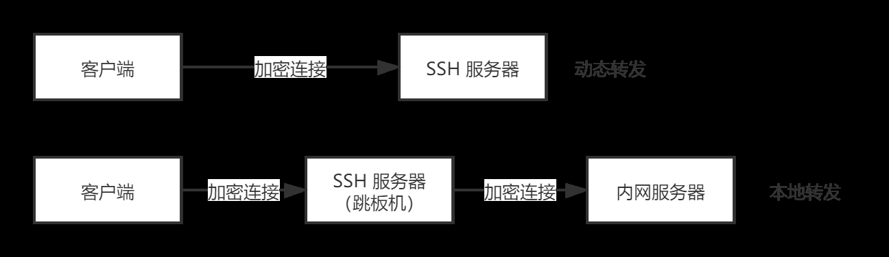

# SSH

[TOC]

[阮一峰 SSH 教程](https://wangdoc.com/ssh/)

## 基本知识

SSH 主要用于**远程登录**。由于采用 SSH 进行通信的客户端和服务端，使用了非对称加密加密了通话内容，所以 SSH 是 Secured 的

SSH（**Secure** Shell 的缩写）是一种网络协议，用于**加密**两台计算机之间的**通信**，并且支持各种**身份验证**机制。SSH 是协议，ssh 是基于 SSH 实现的软件。

**SSH 协议的开源实现**：**OpenSSH**

**SSH 架构**：CS 架构

**OpenSSH**：client-ssh，server-sshd，辅助工具：ssh-keygen, ssh-agent，客户端工具：scp，sftp

## ssh 客户端

```shell
usage: ssh [-46AaCfGgKkMNnqsTtVvXxYy] [-B bind_interface]
           [-b bind_address] [-c cipher_spec] [-D [bind_address:]port]
           [-E log_file] [-e escape_char] [-F configfile] [-I pkcs11]
           [-i identity_file] [-J [user@]host[:port]] [-L address]
           [-l login_name] [-m mac_spec] [-O ctl_cmd] [-o option] [-p port]
           [-Q query_option] [-R address] [-S ctl_path] [-W host:port]
           [-w local_tun[:remote_tun]] destination [command]
```

### install

```shell
# ubuntu, debian
sudo apt install openssh-client

# centos, fedora
sudo dnf install openssh-clients
```

二进制程序所在位置：`/usr/local/bin/ssh`，`\Program Files\OpenSSH\bin\ssh.exe`

### 登录服务器


密码登录用服务端的公钥加密；免密登录用客户端端的私钥加密。

```shell
# 登录远程主机，默认使用当前的用户进行远程登录
ssh hostname/ip/ 

# 指定登录哪一个用户
ssh user@hostname
ssh -l username host

# 如果本地用户名与远程用户名一致，登录时可以省略用户名。
ssh host

# 指定端口，默认 22 端口
ssh -p 8821 foo.com

# 在登录完服务器后，直接执行命令
ssh foo@server.example.com cat /etc/hosts
```

### 中间人攻击

SSH之所以能够保证安全，原因在于它采用了公钥加密。

整个过程是这样的：

1. 远程主机收到用户的登录请求，把自己的公钥发给用户。
2. 用户使用这个公钥，将登录密码加密后，发送回来。
3. 远程主机用自己的私钥，解密登录密码，如果密码正确，就同意用户登录。


这个过程本身是安全的，但是实施的时候存在一个风险：如果有人截获了登录请求，然后冒充远程主机，将伪造的公钥发给用户，那么用户很难辨别真伪。因为不像https协议，SSH协议的公钥是没有证书中心（CA）公证的，也就是说，都是自己签发的。

可以设想，如果攻击者插在用户与远程主机之间（比如在公共的wifi区域），用伪造的公钥，获取用户的登录密码。再用这个密码登录远程主机，那么SSH的安全机制就荡然无存了。这种风险就是著名的["中间人攻击"](https://en.wikipedia.org/wiki/Man-in-the-middle_attack)（Man-in-the-middle attack）。

### 连接流程

第一次连接服务器的时候，服务器会返回一个指纹

```
The authenticity of host 'foo.com (192.168.121.111)' can't be established.
ECDSA key fingerprint is SHA256:Vybt22mVXuNuB5unE++yowF7lgA/9/2bLSiO3qmYWBY.
Are you sure you want to continue connecting (yes/no)?
```

这个指纹，实际上是服务器公钥的签名，主要是因为服务器公钥太长，所以使用 md5 hash 算法对其进行一次 hash，获取一个摘要。

查看服务器公钥指纹的命令：

```shell
ssh-keygen -l -f /etc/ssh/ssh_host_ecdsa_key.pub

# -f filename
# -l Show fingerprint of specified public key file. Private RSA1 keys are also supported. For RSA and DSA keys ssh-keygen tries to find the matching public key file and prints its fingerprint. If combined with -v, an ASCII art representation of the key is supplied with the fingerprint.
```

假定经过风险衡量以后，用户决定接受这个远程主机的公钥。

> Are you sure you want to continue connecting (yes/no)? yes

系统会出现一句提示，表示 host 主机已经得到认可。

> Warning: Permanently added 'host,12.18.429.21' (RSA) to the list of known hosts.

然后，会要求输入密码。

> Password: (enter password)

如果密码正确，就可以登录了。ssh 密码登录过程是这样的：

1. 远程主机收到用户的登录请求，把自己的公钥发给用户。
2. 用户使用这个公钥，将登录密码加密后，发送回来。
3. 远程主机用自己的私钥，解密登录密码，如果密码正确，就同意用户登录。


当远程主机的公钥被接受以后，它就会被保存在文件$HOME/.ssh/known_hosts之中。下次再连接这台主机，系统就会认出它的公钥已经保存在本地了，从而跳过警告部分，直接提示输入密码。

每个SSH用户都有自己的known_hosts文件，此外系统也有一个这样的文件，通常是/etc/ssh/ssh_known_hosts，保存一些对所有用户都可信赖的远程主机的公钥。

如果服务器指纹变了，也就是重新生成了密钥（例如重装系统），那么再次 ssh 连接服务器的时候，会报错：

```
@@@@@@@@@@@@@@@@@@@@@@@@@@@@@@@@@@@@@@@@@@@@@@@@@@@@@@@@@@@
@    WARNING: REMOTE HOST IDENTIFICATION HAS CHANGED!     @
@@@@@@@@@@@@@@@@@@@@@@@@@@@@@@@@@@@@@@@@@@@@@@@@@@@@@@@@@@@
IT IS POSSIBLE THAT SOMEONE IS DOING SOMETHING NASTY!
Someone could be eavesdropping on you right now (man-in-the-middle attack)!
It is also possible that the RSA host key has just been changed.
The fingerprint for the RSA key sent by the remote host is
77:a5:69:81:9b:eb:40:76:7b:13:04:a9:6c:f4:9c:5d.
Please contact your system administrator.
Add correct host key in /home/me/.ssh/known_hosts to get rid of this message.
Offending key in /home/me/.ssh/known_hosts:36
```

意思是检测到的指纹，和本地 `~/.ssh/known_hosts` 存储的指纹不一样

那么就需要将该服务器的指纹从本地文件中删除(其中 hostname 就是服务器的 hostname)：

```
ssh-keygen -R hostname
```

也可以直接清空 `~/.ssh/known_hosts` 文件，重新缓存服务器的指纹。

## SSH 密钥登录

SSH 默认采用密码登录，这种方法有很多缺点，简单的密码不安全，复杂的密码不容易记忆，每次手动输入也很麻烦。密钥登录是更好的解决方案。

### 什么是密钥

SSH 密钥登录采用的是非对称加密，每个用户通过自己的密钥登录。其中，私钥必须私密保存，不能泄漏；公钥则是公开的，可以对外发送。它们的关系是，公钥和私钥是一一对应的，每一个私钥都有且仅有一个对应的公钥，反之亦然。

如果数据使用公钥加密，那么只有使用对应的私钥才能解密，其他密钥都不行；反过来，如果使用私钥加密（这个过程一般称为“签名”），也只有使用对应的公钥解密。

### SSH 密钥登录过程

预备步骤，客户端通过`ssh-keygen`生成自己的公钥和私钥。

第一步，手动将客户端的公钥放入远程服务器的指定位置。

第二步，客户端向服务器发起 SSH 登录的请求。

第三步，服务器收到用户 SSH 登录的请求，发送一些随机数据给用户，要求用户证明自己的身份。

第四步，客户端收到服务器发来的数据，使用私钥对数据进行签名，然后再发还给服务器。

第五步，服务器收到客户端发来的加密签名后，使用对应的公钥解密，然后跟原始数据比较。如果一致，就允许用户登录。

### ssh-keygen 密钥生成

生成公钥和私钥

```shell
ssh-keygen

# 指定密钥的加密算法，通常会选择 dsa 或 rsa 算法
ssh-keygen -t dsa
```

生成的公钥和私钥文件：公钥 `~/.ssh/id_dsa.pub`，私钥 `~/.ssh/id_dsa`，如果选择 rsa 算法，那么生成的密钥文件就是：`~/.ssh/id_rsa.pub`

查看所有的公钥：`$ ls -l ~/.ssh/id_*.pub`

```shell
# -t 选择加密算法
# -b 设置密钥长度
# -C 设置密钥文件的注释
ssh-keygen -t rsa -b 4096 -C "your_email@domain.com"

# -f 指定生成的文件名，生成 mykey 和 mykey.pub
ssh-keygen -t dsa -f mykey

# 检查某个主机名是否在 known_hosts 中
ssh-keygen -F example.com

# 将服务器的公钥指纹移出 known_hosts
ssh-keygen -R example.com
```

### ssh-keygen 上传公钥，免密登录

OpenSSH 规定，将客户机的公钥上传到服务机的对应用户的 `.ssh/authorized_keys` 文件中，就可以实现免密登录。

注意

1. 如果我们想要免密登录服务器的 root 用户，那么就需要将客户机的公钥上传到 `/root/.ssh/authorized_keys` 文件中，如果是想免密登录非 root 用户，例如 work 用户，则需要将公钥上传到 `/home/work/.ssh/authorized_keys` 中
2. authorized_keys 的权限要改成 644
3. `.ssh` 的权限要改成 700
4. `/home/work` 目录 必须是 755权限
4. 重启 `systemctl restart sshd`
5. 如果不能实现免密登录，去看一下 `tail -f /var/log/secure` 日志

不能免密登录的终极解决方案：

修改 sshd 的配置文件 `/etc/ssh/sshd_config`，更改 `LogLevel` 为 `DEBUG` 模式，然后重启 sshd `systemctl restart sshd`，再登录查看 sshd 的运行日志 `tail -f /var/log/secure`，就可以看到更详细的 debug 信息

如果他妈的还是不行的话，就更改安全环境：`chcon -Rv -t ssh_home_t ~/.ssh` `restorecon -FRvv ~/.ssh` [教程](https://stackoverflow.com/questions/20688844/sshd-gives-error-could-not-open-authorized-keys-although-permissions-seem-corre)

### ssh-copy-id 命令：自动上传公钥

OpenSSH 自带一个`ssh-copy-id`命令，可以自动将公钥拷贝到远程服务器的`~/.ssh/authorized_keys`文件。如果`~/.ssh/authorized_keys`文件不存在，`ssh-copy-id`命令会自动创建该文件。

用户在本地计算机执行下面的命令，就可以把本地的公钥拷贝到服务器。

```
$ ssh-copy-id -i key_file user@host
```

上面命令中，`-i`参数用来指定公钥文件，`user`是所要登录的账户名，`host`是服务器地址。如果省略用户名，默认为当前的本机用户名。执行完该命令，公钥就会拷贝到服务器。

注意，公钥文件可以不指定路径和`.pub`后缀名，`ssh-copy-id`会自动在`~/.ssh`目录里面寻找。

```
$ ssh-copy-id -i id_rsa user@host
```

上面命令中，公钥文件会自动匹配到`~/.ssh/id_rsa.pub`。

`ssh-copy-id`会采用密码登录，系统会提示输入远程服务器的密码。

注意，`ssh-copy-id`是直接将公钥添加到`authorized_keys`文件的末尾。如果`authorized_keys`文件的末尾不是一个换行符，会导致新的公钥添加到前一个公钥的末尾，两个公钥连在一起，使得它们都无法生效。所以，如果`authorized_keys`文件已经存在，使用`ssh-copy-id`命令之前，务必保证`authorized_keys`文件的末尾是换行符（假设该文件已经存在）。

关闭密码登录：

为了安全性，启用密钥登录之后，最好关闭服务器的密码登录。对于 OpenSSH，具体方法就是打开服务器 sshd 的配置文件`/etc/ssh/sshd_config`，将`PasswordAuthentication`这一项设为`no`。

## SSH 服务器

### 安装，启动

```shell
# install
# Debian
$ sudo aptitude install openssh-server
# Red Hat
$ sudo yum install openssh-server

# start
$ sshd # 或者 /usr/sbin/sshd 自动进入后台，命令后面不需要加 &

# 启动
$ sudo systemctl start sshd.service
# 停止
$ sudo systemctl stop sshd.service
# 重启
$ sudo systemctl restart sshd.service
```

## SSH 端口转发

### 是什么

SSH 除了登录服务器，还有一大用途，就是作为加密通信的中介，充当两台服务器之间的通信加密跳板，使得原本不加密的通信变成加密通信。这个功能称为端口转发（port forwarding），又称 SSH 隧道（tunnel）。

### 动态转发

动态转发指的是，本机与 SSH 服务器之间创建了一个加密连接，然后本机内部针对某个端口的通信，都通过这个加密连接转发。它的一个使用场景就是，访问所有外部网站，都通过 SSH 转发。

动态转发需要把本地端口绑定到 SSH 服务器。至于 SSH 服务器要去访问哪一个网站，完全是动态的，取决于原始通信，所以叫做动态转发。

```
$ ssh -D local-port tunnel-host -N
```

上面命令中，`-D`表示动态转发，`local-port`是本地端口，`tunnel-host`是 SSH 服务器，`-N`表示这个 SSH 连接只进行端口转发，不登录远程 Shell，不能执行远程命令，只能充当隧道。

举例来说，如果本地端口是`2121`，那么动态转发的命令就是下面这样。

```
$ ssh -D 2121 tunnel-host -N
```

注意，这种转发采用了 SOCKS5 协议。访问外部网站时，需要把 HTTP 请求转成 SOCKS5 协议，才能把本地端口的请求转发出去。

下面是 SSH 隧道建立后的一个使用实例。

```
$ curl -x socks5://localhost:2121 http://www.example.com
```

上面命令中，curl 的`-x`参数指定代理服务器，即通过 SOCKS5 协议的本地`2121`端口，访问`http://www.example.com`。

如果经常使用动态转发，可以将设置写入 SSH 客户端的用户个人配置文件（`~/.ssh/config`）。

```
DynamicForward tunnel-host:local-port
```

### 本地转发

本地转发（local forwarding）指的是，SSH 服务器作为中介的跳板机，建立本地计算机与特定目标网站之间的加密连接。本地转发是在本地计算机的 SSH 客户端建立的转发规则。

它会指定一个本地端口（local-port），所有发向那个端口的请求，都会转发到 SSH 跳板机（tunnel-host），然后 SSH 跳板机作为中介，将收到的请求发到目标服务器（target-host）的目标端口（target-port）。

```
$ ssh -L local-port:target-host:target-port tunnel-host
```

上面命令中，`-L`参数表示本地转发，`local-port`是本地端口，`target-host`是你想要访问的目标服务器，`target-port`是目标服务器的端口，`tunnel-host`是 SSH 跳板机。

举例来说，现在有一台 SSH 跳板机`tunnel-host`，我们想要通过这台机器，在本地`2121`端口与目标网站`www.example.com`的80端口之间建立 SSH 隧道，就可以写成下面这样。

```
$ ssh -L 2121:www.example.com:80 tunnel-host -N
```

然后，访问本机的`2121`端口，就是访问`www.example.com`的80端口。

```
$ curl http://localhost:2121
```

注意，本地端口转发采用 HTTP 协议，不用转成 SOCKS5 协议。

另一个例子是加密访问邮件获取协议 POP3。

```
$ ssh -L 1100:mail.example.com:110 mail.example.com
```

上面命令将本机的1100端口，绑定邮件服务器`mail.example.com`的110端口（POP3 协议的默认端口）。端口转发建立以后，POP3 邮件客户端只需要访问本机的1100端口，请求就会通过 SSH 跳板机（这里是`mail.example.com`），自动转发到`mail.example.com`的110端口。

上面这种情况有一个前提条件，就是`mail.example.com`必须运行 SSH 服务器。否则，就必须通过另一台 SSH 服务器中介，执行的命令要改成下面这样。

```
$ ssh -L 1100:mail.example.com:110 other.example.com
```

上面命令中，本机的1100端口还是绑定`mail.example.com`的110端口，但是由于`mail.example.com`没有运行 SSH 服务器，所以必须通过`other.example.com`中介。本机的 POP3 请求通过1100端口，先发给`other.example.com`的22端口（sshd 默认端口），再由后者转给`mail.example.com`，得到数据以后再原路返回。

注意，采用上面的中介方式，只有本机到`other.example.com`的这一段是加密的，`other.example.com`到`mail.example.com`的这一段并不加密。

这个命令最好加上`-N`参数，表示不在 SSH 跳板机执行远程命令，让 SSH 只充当隧道。另外还有一个`-f`参数表示 SSH 连接在后台运行。

如果经常使用本地转发，可以将设置写入 SSH 客户端的用户个人配置文件（`~/.ssh/config`）。

```
Host test.example.com
LocalForward client-IP:client-port server-IP:server-port
```

### 简易 VPN

VPN 用来在外网与内网之间建立一条加密通道。内网的服务器不能从外网直接访问，必须通过一个跳板机，如果本机可以访问跳板机，就可以使用 SSH 本地转发，简单实现一个 VPN。

```
$ ssh -L 2080:corp-server:80 -L 2443:corp-server:443 tunnel-host -N
```

上面命令通过 SSH 跳板机，将本机的`2080`端口绑定内网服务器的`80`端口，本机的`2443`端口绑定内网服务器的`443`端口。

### 动态转发和本地转发的区别



## scp 命令

### 是什么

scp: secure copy, 用于在两台主机之间加密传送文件。

### Demo

```shell
# 将远程主机（user@host）用户主目录下的foo.txt，复制为本机当前目录的bar.txt。可以看到，主机与文件之间要使用冒号（:）分隔
$ scp source destination
$ scp user@host:foo.txt bar.txt

# 支持一次复制多个文件
$ scp source1 source2 destination

# 本地文件复制到远程服务器
$ scp SourceFile user@host:directory
$ scp file.txt remote_username@10.10.0.2:/remote/directory

# 拷贝目录
# 将本机整个目录拷贝到远程目录下，可以同时拷贝多个文件夹
$ scp -r localmachine/path_to_the_directory username@server_ip:/path_to_remote_directory/
# 将本机目录下的所有内容拷贝到远程目录下
$ scp -r localmachine/path_to_the_directory/* username@server_ip:/path_to_remote_directory/

# 两个远程系统之间的复制
# 语法
$ scp user@host1:directory/SourceFile user@host2:directory/SourceFile
# 示例
$ scp user1@host1.com:/files/file.txt user2@host2.com:/files
```

### 配置项

```shell
# -q 参数用来关闭显示拷贝的进度条。
$ scp -q Label.pdf mrarianto@202.x.x.x:.

# -r 参数表示是否以递归方式复制目录。

# -v 参数用来显示详细的输出。
$ scp -v ~/test.txt root@192.168.1.3:/root/help2356.txt
```

## 其他命令

### rsync 

远程同步命令

rsync 是一个常用的 Linux 应用程序，用于文件同步。

### sftp

secure ftp

`sftp`是 SSH 提供的一个客户端应用程序，主要用来安全地访问 FTP。因为 FTP 是不加密协议，很不安全，`sftp`就相当于将 FTP 放入了 SSH。

下面的命令连接 FTP 主机。

```
$ sftp username@hostname
```

执行上面的命令，会要求输入 FTP 的密码。密码验证成功以后，就会出现 FTP 的提示符`sftp>`，下面是一个例子。

```
$ sftp USER@penguin.example.com
USER@penguin.example.com's password:
Connected to penguin.example.com.
sftp>
```

FTP 的提示符下面，就可以输入各种 FTP 命令了，这部分完全跟传统的 FTP 用法完全一样。

- `ls [directory]`：列出一个远程目录的内容。如果没有指定目标目录，则默认列出当前目录。
- `cd directory`：从当前目录改到指定目录。
- `mkdir directory`：创建一个远程目录。
- `rmdir path`：删除一个远程目录。
- `put localfile [remotefile]`：本地文件传输到远程主机。
- `get remotefile [localfile]`：远程文件传输到本地。
- `help`：显示帮助信息。
- `bye`：退出 sftp。
- `quit`：退出 sftp。
- `exit`：退出 sftp。