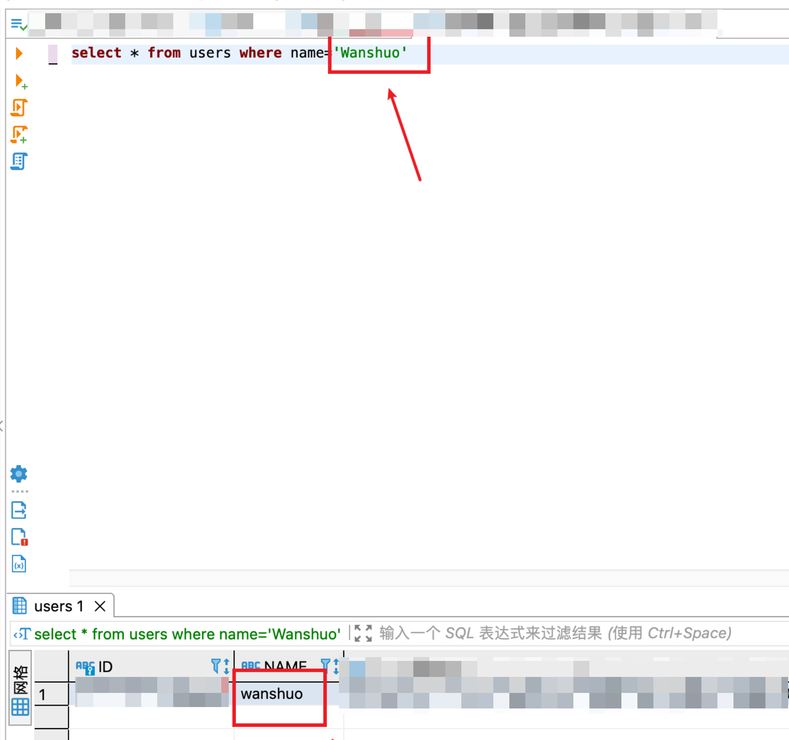

# 其他数据库产品

[TOC]


## 国产数据库


### 高斯

高斯数据库，基于 *PostgreSQL* 开发


### 达梦

达梦数据库类似 Oracle


### 金仓

类似 PostgreSQL


## 开源数据库

### PostgreSQL

*PostgreSQL* 是应用最广泛的开源数据库

PostgreSQL 不允许创建名为 user 的表，user 在 PostgreSQL 中是一个保留字……

尽量不要将 column 重命名为 name，可以加 as

```sql
❎ select a.name name from people a;
✔️ select a.name as name from people a;
```


## 内存数据库

### redis


### h2

h2 的访问路径：http://localhost:8080/h2-console/login.do


## 数据库比较

### MySQL 独有的特性

insert ignore: 主键重复则不插入

反引号：用来区分保留字


### MySQL vs PostgreSQL

 MySQL

* 数据库 varchar 能够接 Integer 类型
* 数据库 int 能够接 String 类型，传 3，3.1415926 都能自动接住，但是只能接住数字
* Boolean 类型可以和 0，1 进行比较，可以存储 0 1

PostgreSQL / 高斯数据库

* 数据库 varchar 能够接住 Integer 类型，会自动做 cast

* Boolean 类型不能和 0，1 进行比较

* 数据库 int 不能接 String 类型

  


### 字符字段大小写敏感

用 mysql 碰到这个问题，大小写不敏感。



查阅文档后 https://dev.mysql.com/doc/refman/8.0/en/case-sensitivity.html，发现 mysql 字符内容默认就是大小写不敏感，除非手动配置：

```sql
ALTER TABLE nrcloud.users modify name varchar(64) CHARACTER SET utf8 COLLATE utf8_bin NOT NULL COMMENT '用户登录名';
```


For nonbinary strings ([`CHAR`](https://dev.mysql.com/doc/refman/8.0/en/char.html), [`VARCHAR`](https://dev.mysql.com/doc/refman/8.0/en/char.html), [`TEXT`](https://dev.mysql.com/doc/refman/8.0/en/blob.html)), string searches use the collation of the comparison operands. For binary strings ([`BINARY`](https://dev.mysql.com/doc/refman/8.0/en/binary-varbinary.html), [`VARBINARY`](https://dev.mysql.com/doc/refman/8.0/en/binary-varbinary.html), [`BLOB`](https://dev.mysql.com/doc/refman/8.0/en/blob.html)), comparisons use the numeric values of the bytes in the operands; this means that for alphabetic characters, comparisons are case-sensitive.


经测试，Oracle 和 Postgre 都是默认大小写敏感的，这好像是 mysql 独有的问题……


参考文献：

* https://dev.mysql.com/doc/refman/8.0/en/case-sensitivity.html
* https://dev.mysql.com/doc/refman/8.0/en/create-table.html


## OLAP 数据库


### Databend

rust 开发的数据仓库，兼容 MySQL，国产


## 数据同步

### dataX

不支持分布式


### SeaTunnel

海量数据的管道

和 logstash 类似，通过配置的方式（低代码），实现海量数据的同步。分布式特性。

SeaTunnel 对 Spark 和 Flink 做了一层包装。SeaTunnel 的日常使用，就是编辑配置文件，然后配置文件被 SeaTunnel 转换成具体的 Spark 或 Flink 任务。


