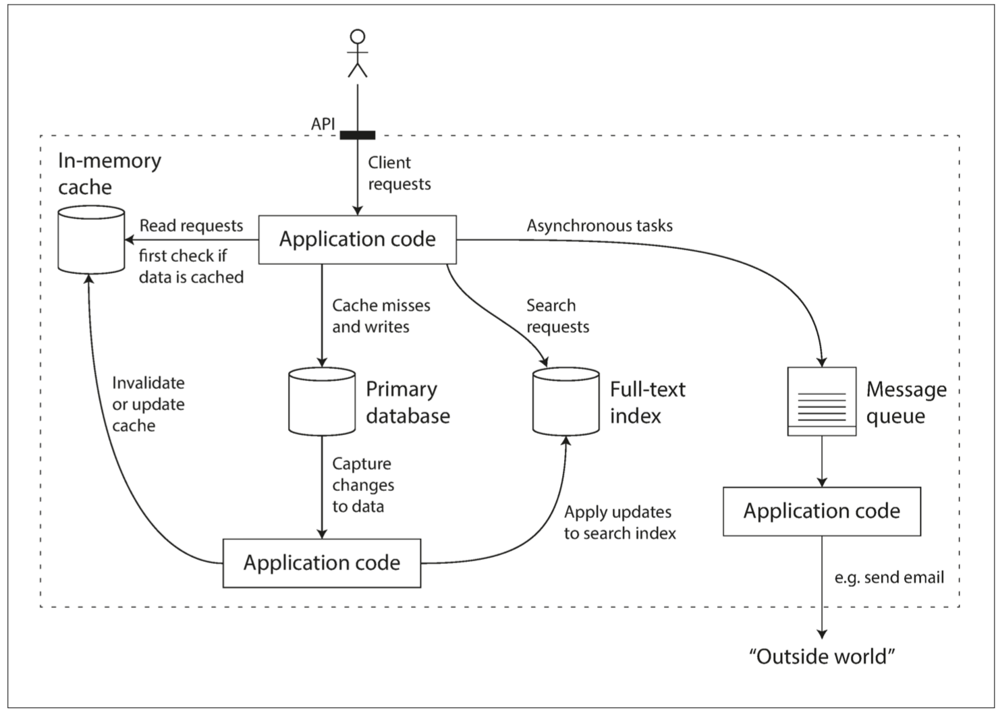
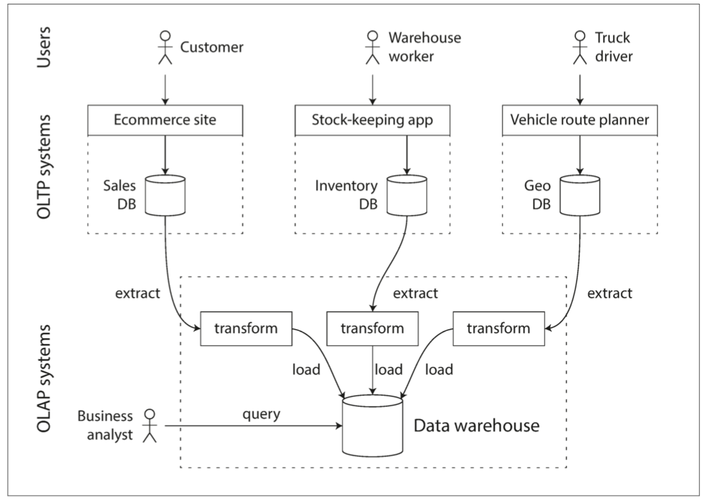
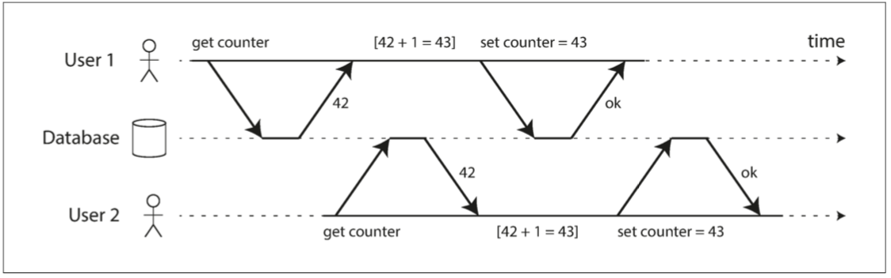

# Design Data Intensive App

[《Designing Data-Intensive Applications》](http://shop.oreilly.com/product/0636920032175.do)读书笔记，摘抄总结对我来说是盲点的知识。

[TOC]

## 学习目的和总结

* 了解主流数据库
* 结合业务场景进行技术选型
* 设计科学使用的 schema
* 掌握数据库出问题时候的科学解决思路

**数据库选型**

| 需求                                                         | 选型         | 备注 |
| ------------------------------------------------------------ | ------------ | ---- |
| schema 不确定，由外部系统决定；<br />存在许多不同类型的对象，将每种类型的对象放在自己的表中是不现实的；<br />应用程序经常需要访问整个文档（例如，将其渲染至网页）; | mongodb      |      |
| 一对一关系，一对多关系和少见的多对多关系                     | 关系型数据库 |      |
| 多对多关系很常见                                             | 图数据模型   |      |
|                                                              |              |      |

**数据库分类**

| 数据库类型   | 数据库产品 | 查询语言 | 应用场景                                           |
| ------------ | ---------- | -------- | -------------------------------------------------- |
| 关系型数据库 | mysql      | SQL      |                                                    |
| 文档数据库   | mongodb    |          | 数据通常是自我包含的，而且文档之间的关系非常稀少。 |
| 图形数据库   | neo4j      | Cypher   | 任意事物都可能与任何事物相关联。                   |
| 搜索数据库   | ES，Solr   |          |                                                    |

## 知识点

* NoSQL：not only sql
* MongoDB：被设计主要用来存储 json
* SQL 是一种声明式查询语言，和注解、函数式编程一样都是声明式的
* 消息队列其实是一种代理，消息代理 Message Broker


## 第一章：可靠性，可伸缩性，可维护性

### 关于数据系统的思考

数据系统可以分为以下几种：

 - 存储数据，以便自己或其他应用程序之后能再次找到 （***数据库（database）***）
 - 记住开销昂贵操作的结果，加快读取速度（***缓存（cache）***）
 - 允许用户按关键字搜索数据，或以各种方式对数据进行过滤（***搜索索引（search indexes）***）
 - 向其他进程发送消息，进行异步处理（***流处理（stream processing）***）
 - 定期处理累积的大批量数据（***批处理（batch processing）***）

**数据库产品越来越全能了**，不同数据库产品之间的界限越来越模糊，例如：**数据存储可以被当成消息队列用（Redis）**，**消息队列则带有类似数据库的持久保证（Apache Kafka）**。Elastic Search 既能做搜索，也能做存储。

其次，越来越多的应用程序有着各种严格而广泛的要求，单个工具不足以满足所有的数据处理和存储需求。取而代之的是，总体工作被拆分成一系列能被单个工具高效完成的任务，并通过应用代码将它们缝合起来。



本书着重讨论三个在大多数软件系统中都很重要的问题：

***可靠性（Reliability）***

​	系统在**困境（adversity）**（硬件故障、软件故障、人为错误）中仍可正常工作（正确完成功能，并能达到期望的性能水准）。请参阅“[可靠性](#可靠性)”。

***可伸缩性（Scalability）***

​	有合理的办法应对系统的增长（数据量、流量、复杂性）。请参阅“[可伸缩性](#可伸缩性)”。

***可维护性（Maintainability）***

​	许多不同的人（工程师、运维）在不同的生命周期，都能高效地在系统上工作（使系统保持现有行为，并适应新的应用场景）。请参阅“[可维护性](#可维护性)”。

​	人们经常追求这些词汇，却没有清楚理解它们到底意味着什么。为了工程的严谨性，本章的剩余部分将探讨可靠性、可伸缩性、可维护性的含义。为实现这些目标而使用的各种技术，架构和算法将在后续的章节中研究。

### 可靠性

提高软件可靠性的措施

* 将人们最容易犯错的地方与可能导致失效的地方**解耦（decouple）**。特别是提供一个功能齐全的非生产环境**沙箱（sandbox）**，使人们可以在不影响真实用户的情况下，使用真实数据安全地探索和实验。
* 快速迭代，敏捷开发，分批次发布新代码，以便任何意外错误只影响一小部分用户

## 第二章：数据模型与查询语言

### 对象关系不匹配

目前大多数应用程序开发都使用面向对象的编程语言来开发，这导致了对SQL数据模型的普遍批评：如果数据存储在关系表中，那么需要一个**笨拙的转换层**，处于应用程序代码中的对象和表，行，列的数据库模型之间。模型之间的不连贯有时被称为**阻抗不匹配（impedance mismatch）**[^i]。

[^i]: 一个从电子学借用的术语。每个电路的输入和输出都有一定的阻抗（交流电阻）。当你将一个电路的输出连接到另一个电路的输入时，如果两个电路的输出和输入阻抗匹配，则连接上的功率传输将被最大化。阻抗不匹配会导致信号反射及其他问题。

像ActiveRecord和Hibernate这样的 **对象关系映射（ORM object-relational mapping）** 框架可以减少这个转换层所需的样板代码的数量，但是它们不能完全隐藏这两个模型之间的差异。

### 一对多，多对多问题

如果数据库本身不支持连接，则必须在应用程序代码中通过对数据库进行多个查询来模拟连接。（在这种情况中，地区和行业的列表可能很小，改动很少，应用程序可以简单地将其保存在内存中。不过，执行连接的工作从数据库被转移到应用程序代码上。

### 静态/ 动态 schema

 不同的数据库有不同的建 schema 的方式，主要可以分为两种：

* **读时模式（schema-on-read）**

  schema 并不是预先定义的，数据的结构是隐含的，只有在数据被读取时才被解释，例如 mongodb。

  类似于编程语言中的动态类型检查。

* **写时模式（schema-on-write）**

  schema 是预先定义好的。传统的关系数据库方法中，模式明确，且数据库确保所有的数据都符合其模式。

  类似于编程语言中的静态（编译时）类型检查。

在应用程序想要改变其数据格式的情况下，这些方法之间的区别尤其明显。例如，假设你把每个用户的全名存储在一个字段中，而现在想分别存储名字和姓氏【23】。在文档数据库中，只需开始写入具有新字段的新文档，并在应用程序中使用代码来处理读取旧文档的情况。例如：

```go
if (user && user.name && !user.first_name) {
	// Documents written before Dec 8, 2013 don't have first_name
	user.first_name = user.name.split(" ")[0];
}
```

另一方面，在“静态类型”数据库模式中，通常会执行以下 **迁移（migration）** 操作：

```sql
ALTER TABLE users ADD COLUMN first_name text;
UPDATE users SET first_name = split_part(name, ' ', 1); 		-- PostgreSQL
UPDATE users SET first_name = substring_index(name, ' ', 1); 	-- MySQL
```

模式变更的速度很慢，而且要求停运。它的这种坏名誉并不是完全应得的：大多数关系数据库系统可在几毫秒内执行`ALTER TABLE`语句。MySQL是一个值得注意的例外，它执行`ALTER TABLE`时会复制整个表，这可能意味着在更改一个大型表时会花费几分钟甚至几个小时的停机时间，尽管存在各种工具来解决这个限制【24,25,26】。

大型表上运行`UPDATE`语句在任何数据库上都可能会很慢，因为每一行都需要重写。要是不可接受的话，应用程序可以将`first_name`设置为默认值`NULL`，并在读取时再填充，就像使用文档数据库一样。

当由于某种原因（例如，数据是异构的）集合中的项目并不都具有相同的结构时,读时模式更具优势。例如，如果：

* 存在许多不同类型的对象，将每种类型的对象放在自己的表中是不现实的。
* 数据的结构由外部系统决定。你无法控制外部系统且它随时可能变化。

在上述情况下，模式的坏处远大于它的帮助，无模式文档可能是一个更加自然的数据模型。但是，要是所有记录都具有相同的结构，那么模式是记录并强制这种结构的有效机制。第四章将更详细地讨论模式和模式演化。

### 声明式查询语言 SQL

当引入关系模型时，关系模型包含了一种查询数据的新方法：SQL是一种 **声明式** 查询语言，而IMS和CODASYL使用 **命令式** 代码来查询数据库。那是什么意思？

许多常用的编程语言是命令式的。例如，给定一个动物物种的列表，返回列表中的鲨鱼可以这样写：

```js
function getSharks() {
    var sharks = [];
    for (var i = 0; i < animals.length; i++) {
        if (animals[i].family === "Sharks") {
            sharks.push(animals[i]);
        }
    }
    return sharks;
}
```

在关系代数中：
$$
sharks = σ_{family = "sharks"}(animals)
$$
σ（希腊字母西格玛）是选择操作符，只返回符合条件的动物，`family="shark"`。

定义SQL时，它紧密地遵循关系代数的结构：

```sql
SELECT * FROM animals WHERE family ='Sharks';
```

命令式语言告诉计算机以特定顺序执行某些操作。可以想象一下，逐行地遍历代码，评估条件，更新变量，并决定是否再循环一遍。

在声明式查询语言（如SQL或关系代数）中，你只需指定所需数据的模式 - 结果必须符合哪些条件，以及如何将数据转换（例如，排序，分组和集合） - 但不是如何实现这一目标。数据库系统的查询优化器决定使用哪些索引和哪些连接方法，以及以何种顺序执行查询的各个部分。

声明式查询语言是迷人的，因为它通常比命令式API更加简洁和容易。但更重要的是，它还隐藏了数据库引擎的实现细节，这使得数据库系统可以在无需对查询做任何更改的情况下进行性能提升。

例如，在本节开头所示的命令代码中，动物列表以特定顺序出现。如果数据库想要在后台回收未使用的磁盘空间，则可能需要移动记录，这会改变动物出现的顺序。数据库能否安全地执行，而不会中断查询？

SQL示例不确保任何特定的顺序，因此不在意顺序是否改变。但是如果查询用命令式的代码来写的话，那么数据库就永远不可能确定代码是否依赖于排序。SQL相当有限的功能性为数据库提供了更多自动优化的空间。

最后，声明式语言往往适合并行执行。现在，CPU的速度通过核心(core)的增加变得更快，而不是以比以前更高的时钟速度运行【31】。命令代码很难在多个核心和多个机器之间并行化，因为它指定了指令必须以特定顺序执行。声明式语言更具有并行执行的潜力，因为它们仅指定结果的模式，而不指定用于确定结果的算法。在适当情况下，数据库可以自由使用查询语言的并行实现【32】。

### 图数据模型

多对多关系是不同数据模型之间具有区别性的重要特征。如果你的应用程序大多数的关系是一对多关系（树状结构化数据），或者大多数记录之间不存在关系，那么使用文档模型是合适的。

但是，要是多对多关系在你的数据中很常见呢？关系模型可以处理多对多关系的简单情况，但是随着数据之间的连接变得更加复杂，将数据建模为图形显得更加自然。

一个图由两种对象组成：**顶点（vertices）**（也称为**节点（nodes）** 或**实体（entities）**），和**边（edges）**（ 也称为**关系（relationships）**或**弧 （arcs）** ）。多种数据可以被建模为一个图形。典型的例子包括：社交图谱，网络图谱，公路或铁路网络。

Cypher是属性图的声明式查询语言，为Neo4j图形数据库而发明【37】。

### SPARQL查询语言

**SPARQL**是一种用于三元组存储的面向RDF数据模型的查询语言，【43】。（它是SPARQL协议和RDF查询语言的缩写，发音为“sparkle”。）SPARQL早于Cypher，并且由于Cypher的模式匹配借鉴于SPARQL，这使得它们看起来非常相似【37】。

与之前相同的查询 - 查找从美国转移到欧洲的人 - 使用SPARQL比使用Cypher甚至更为简洁（请参阅[例2-9]()）。

**例2-9 与示例2-4相同的查询，用SPARQL表示**

```sparql
PREFIX : <urn:example:>
SELECT ?personName WHERE {
  ?person :name ?personName.
  ?person :bornIn  / :within* / :name "United States".
  ?person :livesIn / :within* / :name "Europe".
}
```

结构非常相似。以下两个表达式是等价的（SPARQL中的变量以问号开头）：

```
(person) -[:BORN_IN]-> () -[:WITHIN*0..]-> (location)   # Cypher
?person :bornIn / :within* ?location.                   # SPARQL
```

因为RDF不区分属性和边，而只是将它们作为谓语，所以可以使用相同的语法来匹配属性。在下面的表达式中，变量`usa`被绑定到任意具有值为字符串`"United States"`的`name`属性的顶点：

```
(usa {name:'United States'})   # Cypher
?usa :name "United States".    # SPARQL
```

SPARQL是一种很好的查询语言——哪怕语义网从未实现，它仍然可以成为一种应用程序内部使用的强大工具。

## 第三章：存储与检索 

存储引擎分为两大类：

* **日志结构（log-structured）** 的存储引擎

  只允许附加到文件和删除过时的文件，但不会更新已经写入的文件。 Bitcask，SSTables，LSM树，LevelDB，Cassandra，HBase，Lucene等都属于这个类别。

* **面向页面（page-oriented）** 的存储引擎

  将磁盘视为一组可以覆写的固定大小的页面。 B树是这种哲学的典范，用在所有主要的关系数据库中和许多非关系型数据库。

### 最简单的数据库

世界上最简单的数据库可以用两个Bash函数实现：

```bash
#!/bin/bash
db_set () {
	echo "$1,$2" >> database
}

db_get () {
	grep "^$1," database | sed -e "s/^$1,//" | tail -n 1
}
```

这两个函数实现了键值存储的功能。执行 `db_set key value` ，会将 **键（key）**和**值（value）** 存储在数据库中。键和值（几乎）可以是你喜欢的任何东西，例如，值可以是JSON文档。然后调用 `db_get key` ，查找与该键关联的最新值并将其返回。

麻雀虽小，五脏俱全：

```bash
$ db_set 123456 '{"name":"London","attractions":["Big Ben","London Eye"]}' $ 

$ db_set 42 '{"name":"San Francisco","attractions":["Golden Gate Bridge"]}'

$ db_get 42
{"name":"San Francisco","attractions":["Golden Gate Bridge"]}
```

底层的存储格式非常简单：一个文本文件，每行包含一条逗号分隔的键值对（忽略转义问题的话，大致与CSV文件类似）。每次对 `db_set` 的调用都会向文件末尾追加记录，所以更新键的时候旧版本的值不会被覆盖 —— 因而查找最新值的时候，需要找到文件中键最后一次出现的位置（因此 `db_get` 中使用了 `tail -n 1 ` 。)

```bash
$ db_set 42 '{"name":"San Francisco","attractions":["Exploratorium"]}' 

$ db_get 42
{"name":"San Francisco","attractions":["Exploratorium"]}

$ cat database
123456,{"name":"London","attractions":["Big Ben","London Eye"]}
42,{"name":"San Francisco","attractions":["Golden Gate Bridge"]}
42,{"name":"San Francisco","attractions":["Exploratorium"]}
```

`db_set` 函数对于极其简单的场景其实有非常好的性能，因为在文件尾部追加写入通常是非常高效的。与`db_set`做的事情类似，许多数据库在内部使用了**日志（log）**，也就是一个 **仅追加（append-only）** 的数据文件。真正的数据库有更多的问题需要处理（如并发控制，回收磁盘空间以避免日志无限增长，处理错误与部分写入的记录），但基本原理是一样的。日志极其有用，我们还将在本书的其它部分重复见到它好几次。

> **日志（log）** 这个词通常指应用日志：即应用程序输出的描述发生事情的文本。本书在更普遍的意义下使用**日志**这一词：一个仅追加的记录序列。它可能压根就不是给人类看的，使用二进制格式，并仅能由其他程序读取。

另一方面，如果这个数据库中有着大量记录，则这个`db_get` 函数的性能会非常糟糕。每次你想查找一个键时，`db_get` 必须从头到尾扫描整个数据库文件来查找键的出现。用算法的语言来说，查找的开销是 `O(n)` ：如果数据库记录数量 n 翻了一倍，查找时间也要翻一倍。这就不好了。

为了高效查找数据库中特定键的值，我们需要一个数据结构：**索引（index）**。本章将介绍一系列的索引结构，并它们进行对比。索引背后的大致思想是，保存一些额外的元数据作为路标，帮助你找到想要的数据。如果您想在同一份数据中以几种不同的方式进行搜索，那么你也许需要不同的索引，建在数据的不同部分上。

索引是从主数据衍生的**附加（additional）** 结构。许多数据库允许添加与删除索引，这不会影响数据的内容，它只影响查询的性能。维护额外的结构会产生开销，特别是在写入时。写入性能很难超过简单地追加写入文件，因为追加写入是最简单的写入操作。任何类型的索引通常都会减慢写入速度，因为每次写入数据时都需要更新索引。

这是存储系统中一个重要的权衡：**精心选择的索引加快了读查询的速度，但是每个索引都会拖慢写入速度。**因为这个原因，数据库默认并不会索引所有的内容，而需要你（程序员或DBA）通过对应用查询模式的了解来手动选择索引。你可以选择能为应用带来最大收益，同时又不会引入超出必要开销的索引。

### 数据仓库

OLTP系统往往对业务运作至关重要，因而通常会要求 **高可用** 与 **低延迟**。所以DBA会密切关注他们的OLTP数据库，他们通常不愿意让业务分析人员在OLTP数据库上运行临时分析查询，因为这些查询通常开销巨大，会扫描大部分数据集，这会损害同时执行的事务的性能。

相比之下，数据仓库是一个独立的数据库，分析人员可以查询他们想要的内容而不影响OLTP操作【48】。数据仓库包含公司各种OLTP系统中所有的只读数据副本。从OLTP数据库中提取数据（使用定期的数据转储或连续的更新流），转换成适合分析的模式，清理并加载到数据仓库中。将数据存入仓库的过程称为“**抽取-转换-加载（ETL）**”，如[图3-8](img/fig3-8.png)所示。



## 第四章：编码与演化 

### 面临的问题

应用程序不可避免地随时间而变化。新产品的推出，对需求的深入理解，或者商业环境的变化，总会伴随着**功能（feature）** 的增增改改。[第一章](ch1.md)介绍了**可演化性(evolvability)**的概念：应该尽力构建能灵活适应变化的系统（请参阅“[可演化性：拥抱变化](ch1.md#可演化性：拥抱变化)”）。

在大多数情况下，修改应用程序的功能也意味着需要更改其存储的数据：可能需要使用新的字段或记录类型，或者以新方式展示现有数据。

我们在[第二章](ch2.md)讨论的数据模型有不同的方法来应对这种变化。关系数据库通常假定数据库中的所有数据都遵循一个模式：尽管可以更改该模式（通过模式迁移，即`ALTER`语句），但是在任何时间点都有且仅有一个正确的模式。相比之下，**读时模式（schema-on-read）**（或 **无模式（schemaless）**）数据库不会强制一个模式，因此数据库可以包含在不同时间写入的新老数据格式的混合（请参阅 “[文档模型中的模式灵活性](ch2.md#文档模型中的模式灵活性)” ）。

当数据**格式（format）** 或**模式（schema）** 发生变化时，通常需要对应用程序代码进行相应的更改（例如，为记录添加新字段，然后修改程序开始读写该字段）。但在大型应用程序中，代码变更通常不会立即完成：

* 对于 **服务端（server-side）** 应用程序，可能需要执行 **滚动升级 （rolling upgrade）** （也称为 **阶段发布（staged rollout）** ），一次将新版本部署到少数几个节点，检查新版本是否运行正常，然后逐渐部完所有的节点。这样无需中断服务即可部署新版本，为频繁发布提供了可行性，从而带来更好的可演化性。
* 对于 **客户端（client-side）** 应用程序，升不升级就要看用户的心情了。用户可能相当长一段时间里都不会去升级软件。

这意味着，新旧版本的代码，以及新旧数据格式可能会在系统中同时共处。系统想要继续顺利运行，就需要保持**双向兼容性**：

***向后兼容 (backward compatibility)***

​	新代码可以读旧数据。

***向前兼容 (forward compatibility)***

​	旧代码可以读新数据。

向后兼容性通常并不难实现：新代码的作者当然知道由旧代码使用的数据格式，因此可以显示地处理它（最简单的办法是，保留旧代码即可读取旧数据）。

向前兼容性可能会更棘手，因为旧版的程序需要忽略新版数据格式中新增的部分。

本章中将介绍几种编码数据的格式，包括 JSON，XML，Protocol Buffers，Thrift和Avro。尤其将关注这些格式如何应对模式变化，以及它们如何对新旧代码数据需要共存的系统提供支持。然后将讨论如何使用这些格式进行数据存储和通信：在Web服务中，**表述性状态传递（REST）**和**远程过程调用（RPC）**，以及**消息传递系统**（如Actor和消息队列）。

### 序列化和反序列化

程序通常（至少）使用两种形式的数据：

1. 在内存中，数据保存在对象，结构体，列表，数组，哈希表，树等中。 这些数据结构针对CPU的高效访问和操作进行了优化（通常使用指针）。
2. 如果要将数据写入文件，或通过网络发送，则必须将其 **编码（encode）** 为某种自包含的字节序列（例如，JSON文档）。 由于每个进程都有自己独立的地址空间，一个进程中的指针对任何其他进程都没有意义，所以这个字节序列表示会与通常在内存中使用的数据结构完全不同。

所以，需要在两种表示之间进行某种类型的翻译。 从内存中表示到字节序列的转换称为 **编码（Encoding）** （也称为**序列化（serialization）**或**编组（marshalling）**），反过来称为**解码（Decoding）**（**解析（Parsing）**，**反序列化（deserialization）**，**反编组( unmarshalling）**）。

------

许多编程语言都内建了将内存对象编码为字节序列的支持。例如，Java有`java.io.Serializable` 【1】，Ruby有`Marshal`【2】，Python有`pickle`【3】等等。许多第三方库也存在，例如`Kryo for Java` 【4】。

这些编码库非常方便，可以用很少的额外代码实现内存对象的保存与恢复。但是它们也有一些深层次的问题：

* 这类编码通常与特定的编程语言深度绑定，其他语言很难读取这种数据。如果以这类编码存储或传输数据，那你就和这门语言绑死在一起了。并且很难将系统与其他组织的系统（可能用的是不同的语言）进行集成。
* 为了恢复相同对象类型的数据，解码过程需要**实例化任意类**的能力，这通常是安全问题的一个来源【5】：如果攻击者可以让应用程序解码任意的字节序列，他们就能实例化任意的类，这会允许他们做可怕的事情，如远程执行任意代码【6,7】。
* 在这些库中，数据版本控制通常是事后才考虑的。因为它们旨在快速简便地对数据进行编码，所以往往忽略了前向后向兼容性带来的麻烦问题。
* 效率（编码或解码所花费的CPU时间，以及编码结构的大小）往往也是事后才考虑的。 例如，Java的内置序列化由于其糟糕的性能和臃肿的编码而臭名昭着【8】。

因此，除非临时使用，采用语言内置编码通常是一个坏主意。

### 通用编码：json, xml, base64

当我们谈到可以被多种编程语言读写的标准编码时，JSON和XML是最显眼的角逐者。它们广为人知，广受支持，也“广受憎恶”。 XML经常收到批评：过于冗长与且过份复杂【9】。 JSON的流行则主要源于（通过成为JavaScript的一个子集）Web浏览器的内置支持，以及相对于XML的简单性。 CSV是另一种流行的与语言无关的格式，尽管其功能相对较弱。

JSON，XML和CSV属于文本格式，因此具有人类可读性（尽管它们的语法是一个热门争议话题）。除了表面的语法问题之外，它们也存在一些微妙的问题：

* **数值（numbers）** 的编码多有歧义之处。XML和CSV不能区分数字和字符串（除非引用一个外部模式）。 JSON虽然区分字符串与数值，但不区分整数和浮点数，而且不能指定精度。
* 当处理更大的数值时，这个问题显得尤为严重。例如大于$2^{53}$的整数无法使用IEEE 754双精度浮点数精确表示，因此在使用浮点数（例如JavaScript）的语言进行分析时，这些数字会变得不准确。 Twitter有一个关于大于$2^{53}$的数字的例子，它使用64位整数来标识每条推文。 Twitter API返回的JSON包含了两种推特ID，一种是JSON数值，另一种是十进制字符串，以避免JavaScript程序无法正确解析数字的问题【10】。
* JSON和XML对Unicode字符串（即人类可读的文本）有很好的支持，但是它们不支持二进制数据（即不带 **字符编码(character encoding)** 的字节序列）。二进制串是很有用的功能，人们通过使用Base64将二进制数据编码为文本来绕过此限制。其特有的模式标识着这个值应当被解释为Base64编码的二进制数据。这种方案虽然管用，但比较Hacky，并且会增加三分之一的数据大小。
* XML 【11】和 JSON 【12】都有可选的模式支持。这些模式语言相当强大，所以学习和实现起来都相当复杂。 XML模式的使用相当普遍，但许多基于JSON的工具才不会去折腾模式。对数据的正确解读（例如区分数值与二进制串）取决于模式中的信息，因此不使用XML/JSON模式的应用程序可能需要对相应的编码/解码逻辑进行硬编码。
* CSV没有任何模式，因此每行和每列的含义完全由应用程序自行定义。如果应用程序变更添加了新的行或列，那么这种变更必须通过手工处理。 CSV也是一个相当模糊的格式（如果一个值包含逗号或换行符，会发生什么？）。尽管其转义规则已经被正式指定【13】，但并不是所有的解析器都正确的实现了标准。

尽管存在这些缺陷，但JSON，XML和CSV对很多需求来说已经足够好了。它们很可能会继续流行下去，特别是作为数据交换格式来说（即将数据从一个组织发送到另一个组织）。在这种情况下，只要人们对格式是什么意见一致，格式有多美观或者效率有多高效就无所谓了。让不同的组织就这些东西达成一致的难度超过了绝大多数问题。

### 消息代理

过去，**消息代理（Message Broker）**主要是TIBCO，IBM WebSphere和webMethods等公司的商业软件的秀场。最近像RabbitMQ，ActiveMQ，HornetQ，NATS和Apache Kafka这样的开源实现已经流行起来。我们将在[第十一章](ch11.md)中对它们进行更详细的比较。

详细的交付语义因实现和配置而异，但通常情况下，消息代理的使用方式如下：一个进程将消息发送到指定的队列或主题，代理确保将消息传递给那个队列或主题的一个或多个消费者或订阅者。在同一主题上可以有许多生产者和许多消费者。

一个主题只提供单向数据流。但是，消费者本身可能会将消息发布到另一个主题上（因此，可以将它们链接在一起，就像我们将在[第十一章](ch11.md)中看到的那样），或者发送给原始消息的发送者使用的回复队列（允许请求/响应数据流，类似于RPC）。

消息代理通常不会执行任何特定的数据模型 - 消息只是包含一些元数据的字节序列，因此您可以使用任何编码格式。如果编码是向后和向前兼容的，您可以灵活地对发布者和消费者的编码进行独立的修改，并以任意顺序进行部署。

如果消费者重新发布消息到另一个主题，则可能需要小心保留未知字段，以防止前面在数据库环境中描述的问题（[图4-7](img/fig4-7.png)）。

## 第七章：事务

### 是什么

事务是应用程序将多个读写操作组合成一个逻辑单元的一种方式。从概念上讲，事务中的所有读写操作被视作单个操作来执行：整个事务要么成功（**提交（commit）**）要么失败（**中止（abort）**，**回滚（rollback）**）。如果失败，应用程序可以安全地重试。对于事务来说，应用程序的错误处理变得简单多了，因为它不用再担心部分失败的情况了，即某些操作成功，某些失败（无论出于何种原因）。

2000 年以后，非关系（NoSQL）数据库开始普及。它们的目标是在关系数据库的现状基础上，通过提供新的数据模型选择（请参阅[第二章](ch2.md)）并默认包含复制（第五章）和分区（第六章）来进一步提升。事务是这次运动的主要牺牲品：这些新一代数据库中的许多数据库完全放弃了事务，或者重新定义了这个词，描述比以前所理解的更弱得多的一套保证【4】。

随着这种新型分布式数据库的炒作，人们普遍认为事务是可伸缩性的对立面，任何大型系统都必须放弃事务以保持良好的性能和高可用性【5,6】。另一方面，数据库厂商有时将事务保证作为“重要应用”和“有价值数据”的基本要求。这两种观点都是**纯粹的夸张**。

### ACID

#### 原子性（Atomicity）

**all-or-nothing**

一般来说，原子是指不能分解成小部分的东西。这个词在计算机的不同领域中意味着相似但又微妙不同的东西。例如，在多线程编程中，如果一个线程执行一个原子操作，这意味着另一个线程无法看到该操作的一半结果。系统只能处于操作之前或操作之后的状态，而不是介于两者之间的状态。

相比之下，ACID的原子性并**不**是关于 **并发（concurrent）** 的。它并不是在描述如果几个进程试图同时访问相同的数据会发生什么情况，这种情况包含在缩写 ***I*** 中，即[**隔离性**](#隔离性)。

ACID的原子性描述了当客户想进行多次写入，但在一些写操作处理完之后出现故障的情况。例如进程崩溃，网络连接中断，磁盘变满或者某种完整性约束被违反。如果这些写操作被分组到一个原子事务中，并且该事务由于错误而不能完成（提交），则该事务将被中止，并且数据库必须丢弃或撤消该事务中迄今为止所做的任何写入。

如果没有原子性，在多处更改进行到一半时发生错误，很难知道哪些更改已经生效，哪些没有生效。该应用程序可以再试一次，但冒着进行两次相同变更的风险，可能会导致数据重复或错误的数据。原子性简化了这个问题：如果事务被**中止（abort）**，应用程序可以确定它没有改变任何东西，所以可以安全地重试。

ACID原子性的定义特征是：**能够在错误时中止事务，丢弃该事务进行的所有写入变更的能力。** 或许 **可中止性（abortability）** 是更好的术语，但本书将继续使用原子性，因为这是惯用词。

#### 隔离性（Isolation）

大多数数据库都会同时被多个客户端访问。如果它们各自读写数据库的不同部分，这是没有问题的，但是如果它们访问相同的数据库记录，则可能会遇到**并发**问题（**竞争条件（race conditions）**）。

[图7-1](img/fig7-1.png)是这类问题的一个简单例子。假设你有两个客户端同时在数据库中增长一个计数器。（假设数据库没有内建的自增操作）每个客户端需要读取计数器的当前值，加 1 ，再回写新值。[图7-1](img/fig7-1.png) 中，因为发生了两次增长，计数器应该从42增至44；但由于竞态条件，实际上只增至 43 。

ACID意义上的隔离性意味着，**同时执行的事务是相互隔离的**：它们不能相互冒犯。传统的数据库教科书将隔离性形式化为**可串行化（Serializability）**，这意味着每个事务可以假装它是唯一在整个数据库上运行的事务。数据库确保当多个事务被提交时，结果与它们串行运行（一个接一个）是一样的，尽管实际上它们可能是并发运行的【10】。



#### 持久性（Durability）

数据库系统的目的是，提供一个安全的地方存储数据，而不用担心丢失。**持久性** 是一个承诺，即一旦事务成功完成，即使发生硬件故障或数据库崩溃，写入的任何数据也不会丢失。

### 脏读/写

回顾一下，在ACID中，原子性和隔离性描述了客户端在同一事务中执行多次写入时，数据库应该做的事情：

***原子性***

如果在一系列写操作的中途发生错误，则应中止事务处理，并丢弃当前事务的所有写入。换句话说，数据库免去了用户对部分失败的担忧——通过提供“**宁为玉碎，不为瓦全（all-or-nothing）**”的保证。

***隔离性***

同时运行的事务不应该互相干扰。例如，如果一个事务进行多次写入，则另一个事务要么看到全部写入结果，要么什么都看不到，但不应该是一些子集。

这些定义假设你想同时修改多个对象（行，文档，记录）。通常需要**多对象事务（multi-object transaction）** 来保持多块数据同步。[图7-2](img/fig7-2.png)展示了一个来自电邮应用的例子。执行以下查询来显示用户未读邮件数量：

```sql
SELECT COUNT（*）FROM emails WHERE recipient_id = 2 AND unread_flag = true
```

但如果邮件太多，你可能会觉得这个查询太慢，并决定用单独的字段存储未读邮件的数量（一种反规范化）。现在每当一个新消息写入时，必须也增长未读计数器，每当一个消息被标记为已读时，也必须减少未读计数器。

在[图7-2](img/fig7-2.png)中，用户2 遇到异常情况：邮件列表里显示有未读消息，但计数器显示为零未读消息，因为计数器增长还没有发生[^ii]。隔离性可以避免这个问题：通过确保用户2 要么同时看到新邮件和增长后的计数器，要么都看不到。反正不会看到执行到一半的中间结果。

[^ii]: 可以说邮件应用中的错误计数器并不是什么特别重要的问题。但换种方式来看，你可以把未读计数器换成客户账户余额，把邮件收发看成支付交易。


**图7-2 违反隔离性：一个事务读取另一个事务的未被执行的写入（“脏读”）。**

[图7-3](img/fig7-3.png)说明了对原子性的需求：如果在事务过程中发生错误，邮箱和未读计数器的内容可能会失去同步。在原子事务中，如果对计数器的更新失败，事务将被中止，并且插入的电子邮件将被回滚。


**图7-3 原子性确保发生错误时，事务先前的任何写入都会被撤消，以避免状态不一致**

多对象事务需要某种方式来确定哪些读写操作属于同一个事务。在关系型数据库中，通常基于客户端与数据库服务器的TCP连接：在任何特定连接上，`BEGIN TRANSACTION` 和 `COMMIT` 语句之间的所有内容，被认为是同一事务的一部分.[^iii]

***脏写***

​	一个客户端覆盖写入了另一个客户端尚未提交的写入。几乎所有的事务实现都可以防止脏写。
