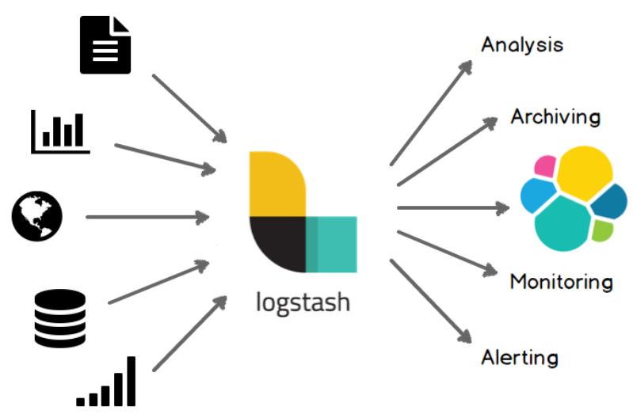

# Logstash

logstash 是一个管道！可以类比成 Linux 中的管道 `|`。

## Logstash Introduction

Logstash is an open source data collection engine with real-time pipelining capabilities. Logstash can dynamically unify data from disparate sources and normalize the data into destinations of your choice. Cleanse and democratize all your data for diverse advanced downstream analytics and visualization use cases.

While Logstash originally drove innovation in log collection, its capabilities extend well beyond that use case. Any type of event can be enriched and transformed with a broad array of input, filter, and output plugins, with many native codecs further simplifying the ingestion process. Logstash accelerates your insights by harnessing a greater volume and variety of data.

## Logstash vs Prometheus

Logstash 更倾向于日志采集，Prometheus 更倾向于指标监控。

Kibana 和 Grafana 也是如此，Kibana 倾向于日志采集和分析，Grafana 倾向于监控。
