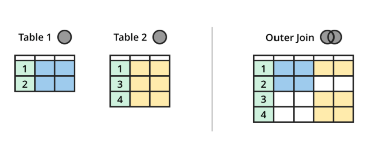

# Mysql 入门

[TOC]

## 经验总结

* 多表连接查询是一个特别耗时的操作，涉及到笛卡尔积
* varchar varchar 用来存储变长的字符串。varchar 可以节省空间，存入多少个字符（ASCII）字符，就占用多少字节的空间。MySQL4.1 之前，varchar所支持的最大长度为 255 个字符，MySQL5.0 以上的版本能够存储 65535个字节，utf8编码下，最多存储21843个字符
* 使用 Mysql 进行项目优化 对于一个负载很大的线上系统，是很怕慢查询的，一个原则：**把更多的计算放在本地，而不是放在数据库。**，例如，宁愿进行两次单表数据库，然后在本地处理数据，也不要进行联合查询。

## 数据库名词解释

* DBA: Database Administrator
* 数据库与文件的本质区别 db 实现了整体数据的结构化，体现了数据之间的相关性。
* 域 Domain 属性的取值范围
* 候选码 和 主键 能够唯一标识一个元组的属性组（如果属性组只有一个属性，那么该属性就是 主键）
* E-R 图 Entity-Relationship
* 关系数据模型 1. 实体和实体间的联系都用 表 来表示（学生是一张表、课程也是一张表，学生与课程的选课关系也是一张表） 2. 关系数据模型最大的缺点是利用 SQL 语句隐藏了数据存取的细节，所以查询效率需要优化，所以才会有 高效 SQL 这门学问 3. 在关系模型中，现实世界中的实体和实体之间的联系都可以用 关系 来描述 4. 关系实质上就是一张二维表，表的每行为一个元组，每列为一个属性。一个元组就是该关系所设计的属性集的笛卡尔积的一个元素。其实也就是学生表与课程表做笛卡尔积得到的一个子集，称为表。一张关系表就是两个实体的笛卡尔积的子集。
* 关系的三种类型 1. 基本表：数据库中实际存在的表 2. 查询表：SQL 查询结果 3. 视图表：由基本表或其他视图导出的表，是虚表
* 关系的完整性约束条件 1. 实体完整性（Entity Integrity）若某属性 A 是关系 R 的主属性，那么 A 非空。（主键 非空） 2. 参照完整性（Referential Integrity）某一张表中的某个属性的取值参考 另一张表中的主键 （表中的某一属性参照另一张表中的主键） 3. 用户定义完整性
* 关系运算 1. 选择：从关系 R （表）中选择满足给定条件的元组 2. 投影：选择若干属性列组成新的关系 3. 连接：对两张表进行笛卡尔积，选择满足条件的元组构成新表 4. 除：待学习
* 参照完整性规则 如果表 A 中的属性 S 是外键，参考了 表B 中的 S 属性，属性 S 的取值要么为空，要么来源应该来源于 表 B中的 S 属性的所有值。

## MySQL 配置文件

通过 `apt-get install mysql-server` 命令安装的 MySQL，其配置文件默认为 `/etc/mysql/my.cnf`。

`/etc/mysql/my.cnf` 是一个全局配置文件，如果我们想要面向不同的用户进行不同的配置，需要把全局配置文件拷贝到 `~/.my.cnf`并进行配置。

注意

1. 所有的配置文件，都需要以 `.cnf` 结尾
2. 全局配置文件中，还包含了两个文件夹，在该两个文件夹内的所有 .cnf 文件都是配置文件，其中 `/etc/mysql/mysql.conf.d/mysqld.cnf`中存储了大量的 MySQL 配置

```text
#
# The MySQL database server configuration file.
#
# You can copy this to one of:
# - "/etc/mysql/my.cnf" to set global options,
# - "~/.my.cnf" to set user-specific options.
# 
# One can use all long options that the program supports.
# Run program with --help to get a list of available options and with
# --print-defaults to see which it would actually understand and use.
#
# For explanations see
# http://dev.mysql.com/doc/mysql/en/server-system-variables.html

#
# * IMPORTANT: Additional settings that can override those from this file!
#   The files must end with '.cnf', otherwise they'll be ignored.
#
# 
!includedir /etc/mysql/conf.d/
!includedir /etc/mysql/mysql.conf.d/
```

## MySQL 小知识

1. 默认端口号：3306
2. SQL 语句最后要加 ;
3. 注释：

    单行注释：--

    多行注释：/ __/

## 数据库增删改查

* 创建数据库 create database senti\_weibo DEFAULT CHARACTER SET utf8 COLLATE utf8\_general\_ci;
* 更改数据库字符集 ALTER DATABASE `senti_weibo` CHARACTER SET utf8 COLLATE utf8\_general\_ci;
* 查看所有数据库 show databases;
* 查看某个数据库建库语句 show create database db\_name; 或者 `desc table`
* 查看某张表的建表语句 show create table table\_name;
* 删除数据库 drop database db\_name;
* 进入某个数据库 use db\_name;
* 查看某个数据库中的表的情况 select table\_name from information\_schema.tables where table\_schema='csdb' and table\_type='base table';
* 查看某个数据库的表的信息 show tables;

## 数据库表级别操作

### 查看表

```text
show tables;
```

### 表重命名

```text
RENAME TABLE old_table TO new_table;
```

### 删除表

```text
drop table table_name;
```

### 复制表

**参考**

[https://www.cnblogs.com/zhangjpn/p/6231662.html](https://www.cnblogs.com/zhangjpn/p/6231662.html)

[https://www.jb51.net/article/47562.htm](https://www.jb51.net/article/47562.htm)

**Demo**

```mysql
# 把旧表的所有数据复制到新表
insert into table1 select * from table2
# 复制旧表的部分数据到新表
insert into table1 select  *   from   table2 where ……

# 复制表结构到新表
CREATE TABLE 新表 LIKE 旧表 ;
# 复制表结构和所有数据到新表
CREATE TABLE 新表 SELECT * FROM 旧表
# 复制旧表的数据到新表(假设两个表结构不一样)
INSERT INTO 新表(字段1,字段2,.......) SELECT 字段1,字段2,...... FROM 旧表
```

### 导出 MySQL 查询到的数据

```shell
mysql -uroot -pxxxxxx -e "select weibo_content from spider_db.spider_realtime_weibo" > /home/admin/test/weibo_content.txt
```

### 表添加/删除/修改字段

```mysql
-- 增加字段
alter table senti_weibo_realtime_weibo add seged_words varchar(4096) COLLATE utf8mb4_unicode_ci DEFAULT "";
alter table senti_weibo_keyword add sentiment varchar(32) DEFAULT "";

-- 修改字段
alter table senti_weibo_realtime_weibo modify last_modify_time timestamp not null default current_timestamp on update current_timestamp;

-- 删除字段
ALTER TABLE mytable DROP 字段名;
```

### 修改表的编码

```mysql
alter table spider_realtime_weibo character set utf8 COLLATE utf8_general_ci;
```

## 数据库-表数据-增删改查

### 查询数据

```Mysql
* distinct
distinct 只能放在开头
通常的用法是 distinct(name)，加 括号
如果 distinct 没有加括号，则默认对（所有的字段放在一起）进行去重
sql = """select distinct product_line, deploy_plat,
         source, module, 1 as callednum
         from %s
         where source != "sample"
         and idc != "sample"
         and idc != "se-offline"
         and idc != "ipad_page"
         and idc != "debug"
         and deploy_plat != "dfp"
         """ % (table)

* distinct，count 组合
select count(DISTINCT(username)) as count1 from managerConfig_online ; # count1 为 重新命名

* 模糊匹配
url like '%.baidu.com'
% 类似于 正则表达式中的 .*
Demo:
select problem_occur_time, problem_solve_time from feedbackorigindata where problem_occur_time > problem_solve_time and problem_solve_time like "%2018-%";

* or 关键字
select * from managerConfig where username = 'v_liulonggang' or username = 'v_zhangyafei';

* in 关键字
in 关键字可以替换 or 关键字的作用，而且更加简洁。
select 
 count(DISTINCT(module)) 
from 
 run_case_deploycoveragedetail 
where 
 is_coverage in ("Y", "N", "W") and 
 query_start_time >= "2018-07-01 00:00:00" and 
 query_end_time <= "2018-07-31 00:00:00" and 
 deploy_plat = '863';

* select 子句 嵌套查询
select mailbox_id from co_user where mailbox_id not in (select mailbox_id from core_mailbox);

* 按字段进行排序
select icafe_id from feedbackorigindata where product_id = 1 and subproduct_id = 'all' and space = 'http://cp01-sys-rpm66.cp01.baidu.com:8235/getFeedback.php' order by icafe_id desc ;
默认 对 结果 升序排序，加了 **desc** 后，则改成降序排序。

* rand() 函数随机选择条数
需求：从数据库中读取 1000 条数据，要求这 1000 条数据是随机选择的，
SELECT * FROM tablename ORDER BY RAND() LIMIT num；

* limit offset 关键字
Limit子句可以被用于强制 SELECT 语句返回指定的记录数。Limit接受一个或两个数字参数。参数必须是一个整数常量。如果给定两个参数，第一个参数指定第一个返回记录行的偏移量，第二个参数指定返回记录行的最大数目。

SELECT * FROM table LIMIT 5; //检索前 5 个记录行
SELECT * FROM table LIMIT 5,10; //检索记录行6-15 从第六行开始检索
SELECT * FROM table LIMIT 10 offset 5; //检索记录行6-15 从第六行开始检索，跳过前5 行

* group by， having
group by 将结果按照指定的列进行分组，该属性列值相等的元组为一个组。通常会在每组中运行聚集函数进行计算。
group by 的 select 中字段的选择，应该选择 group by x1,x2,x3 中的 x1, x2, x3 中的子集。例如 group by product_line, deploy_plat, source, module ，那么 只能 select 其中的子集。
selet 后面还可以加入聚集函数，例如 count(*), min(*) 等。例如 select group by product_line, deploy_plat, source, module, count(*)。
having 是 group by 的子句，表示只有满足指定条件的组才予以输出
注意 groupby 并没有删除数据，只是将查询到的数据进行分组。

* 嵌套查询
将第一次查询的结果当作一张表进行二次查询。可多层嵌套。
select 
 run_id, module, source, idc, status, reason, times 
from 
 (
  select 
   *, count(DISTINCT run_id, task_type, task_id, execute_id)
  from 
   run_case_detail
  where 
   run_id >= "20180717000000000000" and run_id <= "20180725000000000000"
  group by 
   run_id, task_type, task_id, execute_id
 ) 
 as 
 distinct_data
where 
 product_line = "search" and 
 product_form = "wise" and 
 source != "sample" and 
 (idc != "se-offline" and idc != "template" and idc != "ipad_page") and
  module != "debug"
;
```

### 插入数据

```Mysql
全插入
insert into userInfo values(1,'aaa','1212');
指定列插入（推荐这种方式）
insert into userInfo(name,password) values('ddf','8979');

* 自增长主键插入数据
当数据表中有自增长主键时，当用SQL插入语句中插入语句带有ID列值记录的时候，有两种做法：
1. 指定了该列的值，则新插入的值不能和已有的值重复，而且必须大于其中最大的一个值；
2. 不指定该列的值，只将其他列的值插入，让ID还是按照MySQL自增自己填，有两种做法：
    1. 把id的值设置为null或者0，这样子mysql都会自己做处理 
    2. 手动指定需要插入的列，不插入这一个字段的数据

手动制定需要插入的列，这种方式比较好，如果后来表发生了变化，这个 insert 语句还是可以用的！
insert into userInfo(name,password) values('wanshuo','8979');

# 不重复插入：主键存在则不插入
insert ignore into res_entity_item values("55", "111", "2021-01-01 00:00:00", "desc", "expression", "8", "2021-01-01 00:00:00", "test_name");
```

### 删除数据

```sql
-- 标准代码
delete from run_case_deploycoveragedetail where query_start_time like '2018-07-15%';
```

### 更新数据

```sql
-- set 是一个固定的关键字
update run_case_statistics set cycle = 'month', module = 'module1' where id >= 5927 and id <= 6265;

-- 多表关联更新
update test1,test2 set test1.name=test2.name,test1.age=test2.age where test1.id=test2.id;

```

### 建表

```sql
# 测试代码
create table test_table(
    id int(11) primary key,
    name varchar(8) unique
);

* 标准代码
create table if not exists run_case_functions(
     id int(11) not null auto_increment,
     card_id int(11) not null comment '卡片号',
     module varchar(64) not null comment '所属业务',
     function varchar(128) not null comment '功能点<对应卡片标题>',
     function_type varchar(64) not null comment '功能类型',
     level varchar(16) not null default 'P0' comment '优先级',
     team varchar(32) not null comment '所属团队',
     pm varchar(32) not null comment 'PM负责人',
     rd varchar(32) not null comment 'RD负责人',
     qa varchar(32) not null comment 'QA负责人',
     pv varchar(32) default '' not null comment 'pv',
     cid varchar(32) default '' not null comment 'cid',
     jiaotu_need enum('Y', 'N', '') default '' not null comment '是否需接入 Y or N',
     jiaotu_coverage enum('Y', 'N', '') default '' not null comment '是否已接入 Y or N', -- 三选一，枚举
     description varchar(256) default '' not null comment '备注描述',
     created_time timestamp not null comment '卡片创建时间', -- 时间戳格式可以存储 python 的 datetime 格式
     last_modify_time timestamp not null default current_timestamp on update current_timestamp comment '最后更新时间', -- 时间默认更新

     PRIMARY KEY (id),
     KEY card_id (card_id), -- 加快查询速度
     KEY module (module),
     KEY function (function),
     KEY function_type (function_type),
     KEY level (level),
     KEY team (team),
     KEY pm (pm),
     KEY rd (rd),
     KEY qa (qa),
     KEY pv (pv),
     KEY cid (cid),
     KEY jiaotu_need (jiaotu_need),
     KEY jiaotu_coverage (jiaotu_coverage),
     KEY description (description),
     KEY created_time (created_time),
     KEY last_modify_time (last_modify_time)

)ENGINE=InnoDB DEFAULT CHARSET=utf8 AUTO_INCREMENT=1;

* 重点    
if not exists
可以先判断表是否存在

varchar(n)
设置变长字符，最大长度为 n，有多长，就动态的占用多大的空间
n 在 MySQL 4.1 版本下，最长可以达到 255。
varchar 写越大越好，否则会报 Data truncated for column 'module_detail' at row 1 错，后期各种心累。

varchar 长度计算：https://www.cnblogs.com/jewave/p/6214540.html

KEY
Key是索引约束,主要是用来加快查询速度的

COMMENT
字段注释

AUTO_INCREMENT
只适用于 int 字段，MySQL 会自动生成

default
default 'wanshuo'
使用 DEFAULT 修饰符为字段设定一个默认值，如果没有设置default，那么 MySQL 会根据该字段是 NULL 还是 NOT NULL 自动设置默认值

* desc 命令
查看表中各个字段的描述
desc 表名
```

mysql 建表数据类型

包括严格数值数据类型(INTEGER、SMALLINT、DECIMAL和NUMERIC)，以及近似数值数据类型(FLOAT、REAL和DOUBLE PRECISION),还有枚举类型enum 和集合类型set 以及布尔值、[json](https://www.yiibai.com/mysql/boolean.html)

#### 数值数据

| 型           | 大小                                     | 范围（有符号）                                               | 范围（无符号）                                               |      用途       |
| :----------- | :--------------------------------------- | :----------------------------------------------------------- | :----------------------------------------------------------- | :-------------: |
| TINYINT      | 1 byte                                   | (-128，127)                                                  | (0，255)                                                     |    小整数值     |
| SMALLINT     | 2 bytes                                  | (-32 768，32 767)                                            | (0，65 535)                                                  |    大整数值     |
| MEDIUMINT    | 3 bytes                                  | (-8 388 608，8 388 607)                                      | (0，16 777 215)                                              |    大整数值     |
| INT或INTEGER | 4 bytes                                  | (-2 147 483 648，2 147 483 647)                              | (0，4 294 967 295)                                           |    大整数值     |
| BIGINT       | 8 bytes                                  | (-9,223,372,036,854,775,808，9 223 372 036 854 775 807)      | (0，18 446 744 073 709 551 615)                              |   极大整数值    |
| FLOAT        | 4 bytes                                  | (-3.402 823 466 E+38，-1.175 494 351 E-38)，0，(1.175 494 351 E-38，3.402 823 466 351 E+38) | 0，(1.175 494 351 E-38，3.402 823 466 E+38)                  | 单精度 浮点数值 |
| DOUBLE       | 8 bytes                                  | (-1.797 693 134 862 315 7 E+308，-2.225 073 858 507 201 4 E-308)，0，(2.225 073 858 507 201 4 E-308，1.797 693 134 862 315 7 E+308) | 0，(2.225 073 858 507 201 4 E-308，1.797 693 134 862 315 7 E+308) | 双精度 浮点数值 |
| DECIMAL      | 对DECIMAL(M,D) ，如果M>D，为M+2否则为D+2 | 依赖于M和D的值                                               | 依赖于M和D的值                                               |     小数值      |

#### 时间和日期类型

| 类型         | 大小 ( bytes) | 范围                                                         | 格式                | 用途                     |
| :----------- | :------------ | :----------------------------------------------------------- | :------------------ | :----------------------- |
| DATE         | 3             | 1000-01-01/9999-12-31                                        | YYYY-MM-DD          | 日期值                   |
| TIME         | 3             | '-838:59:59'/'838:59:59'                                     | HH:MM:SS            | 时间值或持续时间         |
| YEAR         | 1             | 1901/2155                                                    | YYYY                | 年份值                   |
| **DATETIME** | 8             | 1000-01-01 00:00:00/9999-12-31 23:59:59                      | YYYY-MM-DD HH:MM:SS | 混合日期和时间值         |
| TIMESTAMP    | 4             | 1970-01-01 00:00:00/2038结束时间是第 **2147483647** 秒，北京时间 **2038-1-19 11:14:07**，格林尼治时间 2038年1月19日 凌晨 03:14:07 | YYYYMMDD HHMMSS     | 混合日期和时间值，时间戳 |

#### 字符串类型

| 类型       | 大小                  | 用途                            |
| :--------- | :-------------------- | :------------------------------ |
| CHAR       | 0-255 bytes           | 定长字符串                      |
| VARCHAR    | 0-65535 bytes         | 变长字符串                      |
| TINYBLOB   | 0-255 bytes           | 不超过 255 个字符的二进制字符串 |
| TINYTEXT   | 0-255 bytes           | 短文本字符串                    |
| BLOB       | 0-65 535 bytes        | 二进制形式的长文本数据          |
| TEXT       | 0-65 535 bytes        | 长文本数据                      |
| MEDIUMBLOB | 0-16 777 215 bytes    | 二进制形式的中等长度文本数据    |
| MEDIUMTEXT | 0-16 777 215 bytes    | 中等长度文本数据                |
| LONGBLOB   | 0-4 294 967 295 bytes | 二进制形式的极大文本数据        |
| LONGTEXT   | 0-4 294 967 295 bytes | 极大文本数据                    |

### SQL 查询 demos

```sql
-- 查询学生的姓名和出生年份
select name, 2018 - age from student_table;

-- 改变列名, 改为小写 lower()
select lower(name) studentname from student_table;

-- between and 
select name from student_table where age between 18 and 23;

-- 匹配任意 长度 字符 和 任意 单个 字符
select name from student_table where name like "王%";
select name from student_table where name like "万__"； -- 查询三个字的万同学

-- 需要转义的字符
%, _
select name from student_table where name = "王\_"; -- 查是否有人叫 王_

-- is null
select name from student_table where grade is null;

-- 对查询结果两个字段进行排序，前者升序，后者降序
select * from student_table order by dept, age desc; -- 按系名升序，age 降序

-- 聚集函数
count 统计元组个数
sum(列名) 计算列值总和
avg(列名) 计算平均值
max/min(列名) 找到最值

-- 求各个课程号及对应的选课人数 group by
select Cno, count(Sno) from SC group by Cno;

-- group by having demo: 查询选修了三门以上课程的学生学号
select Sno from SC group by Sno having count(*) > 3; -- having 仅作用于group by 生成的组

-- group by 查询举例
    select 
     product_line, 
     deploy_plat,
     source, 
     module, 
     count(*)
    from 
     run_case_deploy
    where 
     source != "sample"
     and idc != "sample"
     and idc != "se-offline"
     and idc != "ipad_page"
     and idc != "debug"
     and start_time >= '2018-08-13 00:00:00'
     and end_time <= '2018-08-14 00:00:00'
     and deploy_plat != "dfp"
    group BY
     product_line, 
     deploy_plat,
     source, 
     module
    ;

-- 自身连接查询
select first.Cno, second.Cpno from Course first, Course second where first.Cpno = second.Cno;

-- 左外连接
select student, sno, sname, sex from student_table left out join sc_table on (student_table.sno = sc_table.sno);

-- 不相关子查询（不相关嵌套查询）
查询与 万朔 同系的学生
select id from student_table where department in (select department from student_table where name ='万朔');

-- 相关嵌套查询
找出每个学生超过他选修课程平均成绩的课程号
select student_id, course_id from score_table table1 where grade >= (select avg(grade) from score_table table2 where table1.student_id = table2.student_id);

-- any, all
查询其他系中，比计算机科学系所有学生年龄都小的学生姓名和年龄。
select name, age from student_table where age < all (select age from student_table where department = 'cs') and department != 'cs';

-- exists 存在量词
查询所有选修了 1 号 课程的学生姓名。
select name from student_table where exists (select * from xuanxiu_table where name = student_table.name and xuanxiu_course = '1')
存在量词的嵌套查询中 一定是 select *，如果内层查询结果非空，那么外层的 where 子句返回真值。
exists 一定是相关子查询。

    select 
     DISTINCT deploy_plat, module 
    from 
     run_case_deploycoveragedetail detail_1 
    where 
     exists (
      select 
       * 
      from 
       run_case_deploycoveragedetail detail_2 
      where 
       detail_1.module = detail_2.module and 
       is_coverage = "Y" and
       idc = ""
     ) and 
     idc = "fj" and 
     is_coverage = "N";

-- 多个查询结果的并集和差集 union， Intersect
select name from student_table where sex = '男' and age > 18
union / intersect
select name from student_table where sex = '女' and age > 18;
# 适用于将多表查询的结果整合
```

## show 命令

```mysql
-- 显示 MySQL 的当前状态
show status;

-- 显示某张表的所有字段
show columns from table;

-- 显示授予某个用户的权限
show grants user_name;
show grants; -- 所有用户

-- 查看错误和警报
show errors;
show warnings;
```

## 连接 join

连接 涉及到了 多表操作，也可以是 pandas 的多个 DataFrame 的操作。 连接 是从两个关系的 **笛卡尔积** 中选取 **属性间满足一定条件** 的元组。

其中 A 和 B 分别 为 R 和 S 上度数相等并且可比的属性组。连接运算从 R 和 S 的笛卡尔积中选择 R关系 在 A属性组 上的值 与 S关系 在 B属性组 上满足比较关系 theta 的元组。

* 笛卡尔积
* 各种连接 等值连接 和 自然连接
* 外连接不同于等值连接，等值连接去除产生 NAN 的元组，外连接会保留
* 外连接一共有两种：
  1. 外连接
  2. 左右外连接

语法：

```sql
where table_A left join table_B on table_A.column = table_B.column 
```

[join 的图释](https://dataschool.com/how-to-teach-people-sql/sql-join-types-explained-visually/)

### 内连接 (inner join)

**内连接就是求交集。**


### 外连接 outer / left / right join

Outer join: **外连接是求并集。**



left / right join 通常会产生 NULL 值


```sql
select 
    P.FirstName, P.LastName, A.City, A.State
from 
    Person as P left join 
    Address as A
on
    P.PersonID = A.PersonID
;
```

### 外键

#### 定义

A foreign key relationship involves a parent table that holds the initial column values, and a child table with column values that reference the parent column values. A foreign key constraint is defined on the child table.

The essential syntax for a defining a foreign key constraint in a [`CREATE TABLE`](https://dev.mysql.com/doc/refman/5.6/en/create-table.html) or [`ALTER TABLE`](https://dev.mysql.com/doc/refman/5.6/en/alter-table.html) statement includes the following:

```sql
[CONSTRAINT [symbol]] FOREIGN KEY
    [index_name] (col_name, ...)
    REFERENCES tbl_name (col_name,...)
    [ON DELETE reference_option]
    [ON UPDATE reference_option]

reference_option:
    RESTRICT | CASCADE | SET NULL | NO ACTION | SET DEFAULT
```

Demo: 

```sql
create table test_table(
    id int(11) primary key,
    name varchar(8) unique,
    fid int(11),
    foreign key (fid) references test_table(id) on update cascade on delete restrict 
    -- 持有一个 fid 外键，该外键指向本表的 id，父更新后，能够级联更新子，但是不能删除父
);
```

#### Referential Actions

When an [`UPDATE`](https://dev.mysql.com/doc/refman/5.6/en/update.html) or [`DELETE`](https://dev.mysql.com/doc/refman/5.6/en/delete.html) operation affects a key value in the parent table that has matching rows in the child table, the result depends on the *referential action* specified by `ON UPDATE` and `ON DELETE` subclauses of the `FOREIGN KEY` clause. Referential actions include:

- `CASCADE`: Delete or update the row from the parent table and automatically delete or update the matching rows in the child table. Both `ON DELETE CASCADE` and `ON UPDATE CASCADE` are supported. Between two tables, do not define several `ON UPDATE CASCADE` clauses that act on the same column in the parent table or in the child table.

  Note：Cascaded foreign key actions do not activate triggers.

- `SET NULL`: Delete or update the row from the parent table and set the foreign key column or columns in the child table to `NULL`. Both `ON DELETE SET NULL` and `ON UPDATE SET NULL` clauses are supported.

  If you specify a `SET NULL` action, *make sure that you have not declared the columns in the child table as `NOT NULL`*.

- `RESTRICT`: Rejects the delete or update operation for the parent table. Specifying `RESTRICT` (or `NO ACTION`) is the same as omitting the `ON DELETE` or `ON UPDATE` clause.

- `NO ACTION`: A keyword from standard SQL. In MySQL, equivalent to `RESTRICT`. The MySQL Server rejects the delete or update operation for the parent table if there is a related foreign key value in the referenced table. Some database systems have deferred checks, and `NO ACTION` is a deferred check. In MySQL, foreign key constraints are checked immediately, so `NO ACTION` is the same as `RESTRICT`.

- `SET DEFAULT`: This action is recognized by the MySQL parser, but both [`InnoDB`](https://dev.mysql.com/doc/refman/5.6/en/innodb-storage-engine.html) and [`NDB`](https://dev.mysql.com/doc/refman/5.6/en/mysql-cluster.html) reject table definitions containing `ON DELETE SET DEFAULT` or `ON UPDATE SET DEFAULT` clauses.

For storage engines that support foreign keys, MySQL rejects any [`INSERT`](https://dev.mysql.com/doc/refman/5.6/en/insert.html) or [`UPDATE`](https://dev.mysql.com/doc/refman/5.6/en/update.html) operation that attempts to create a foreign key value in a child table if there is no matching candidate key value in the parent table.

For an `ON DELETE` or `ON UPDATE` that is not specified, the default action is always `RESTRICT`.

## 视图 View

### Introduction

视图 View 对于用户来说，**和正常的表没有区别**，视图的数据本质上是对数据库中表数据的 select。

新建一个视图，对于用户来说，其等价于新建了一张表，用户可以对这张表进行增删改查，其增删改查的操作最后都会映射到其关联的表中。这张视图表的生命周期和其他正常的表一样，即使重启数据库，视图仍然存在。

如果我们修改了某些表，那么依赖这些表的视图也会相应的进行更新。

视图由于依赖其他表，其性能上可能不如直接查询其他表速度来的快。

### 视图的作用

* 整合多表数据：对多个表的数据进行组合，新建成一张视图，方便进行二次查询
* 截取单表数据：只对某张表的某些字段进行操作
* 数据保护：可以针对想要公开的数据，生成一张视图，并提供给用户进行操作

### 视图增删改查

```mysql
create view view_test as
select * from -- 标准的 sql 查询语言

show create view view_name; -- 查看建立视图的 命令

drop view view_name; -- 删除视图

-- 更新视图，先 drop，再 create
```

## 报错

* Data truncated for column 'date' at row 1

  有时候设置了 键 的约束，但是插入的数据越过了这个约束，就会报错，例如设置了 varchar\(16\)，但是插入的字符串长度为 20 ，那么就会报错。

## 数据库 sql 差异性

* Oracle sql 语句结尾不能加 `;`

* 单引号和双引号的区别

  在 sql 标准中，单引号表示字符串，双引号表示 identifiers，例如表名或者列名

  ```sql
  delete from 
    table_a 
  where 
    id in (
      select 
        id 
      from 
        (select * from table_a) as table_a_copy 
        left join 
  	  (select *, 'flag' as "flag" from table_b) as table_b_copy 
  	  on 
  	  table_a_copy.id = table_b_copy.cc 
      where 
        table_b_copy.flag is NULL
    );
  ```

   

* Oracle 对 as 的兼容性不太好，不要用 as 了，as 类似于语法糖，不用也 ok 的

  ```sql
  select *, 'flag' flag from table_b
  ```

  