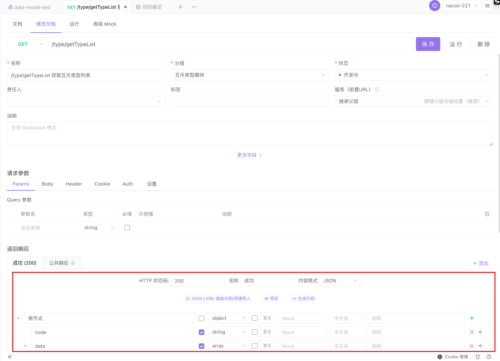
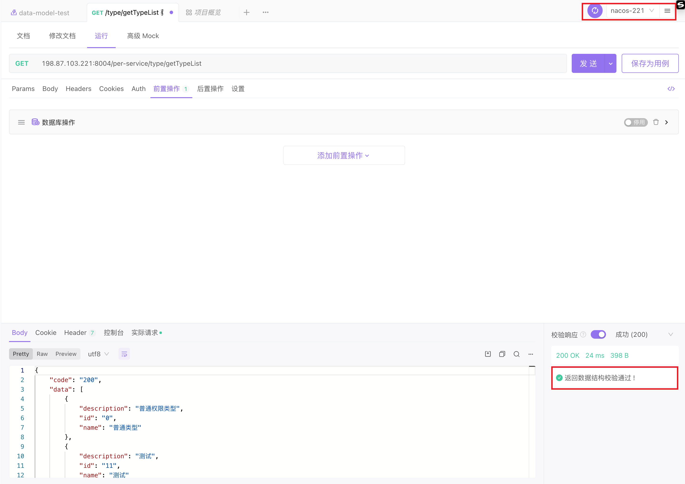
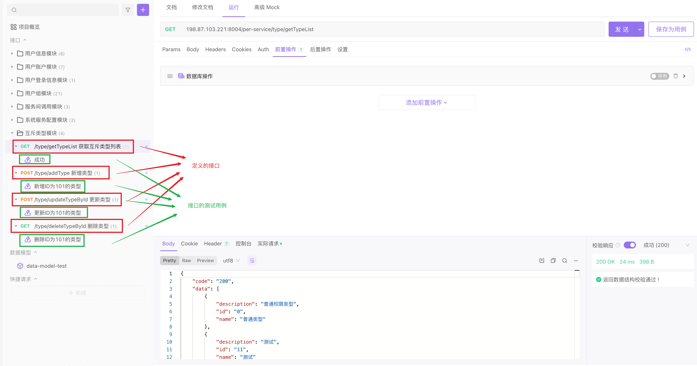

# apifox

最近才接触到 apifox，相见恨晚。

apifox 不是一个传统的测试工具，甚至 postman 都不是一个传统的测试工具。

我一直以来都误解了 postman，把它当做一个单纯的测试工具来用。

apifox 更像是一个团队协作工具，围绕着接口开发文档，为我们规范了开发的整个流程。


## 接口设计

整个 apifox 是围绕开发文档展开的。

接口设计阶段，直接在 apifox 上定义接口。定义接口名称，请求参数。

在响应体中定义响应内容，定义完保存后，本地 mock 就已经开启了，前端就可以调用这个刚定义的接口进行开发了！





## 前端 mock

接口定义完保存后，这个接口在 apifox 端就被动态地创建了。返回的数据就是我们定义的响应体。

前端调用 mock 的接口进行开发即可：

```
http://127.0.0.1:4523/m1/1239146-0-default/type/getTypeList
```


## 后端开发

后端开发完后，可以切到运行进行测试。

如果后端响应的数据不符合开发文档约定的格式，还会告警！




## 测试

注意，接口，和接口的测试用例，是两个概念。

我之前曾简单把 postman 上定义的一条测试理解为测试用例，其实我只是定义了一个测试接口，加上一个默认的测试数据。如果一个接口测试多种情况的话，我通常只会改一下接口。

接触到 apifox 后，我才清晰地认识到，接口和测试用例，是解耦的。一个接口对应多个测试用例，每个测试用例中的测试数据都有所不同。




apifox 还支持自动化测试。

当我们需要进行自动化测试时，是把这些测试用例加在一个集合中去跑，而不是拿接口去跑。


## 团队协作

当然，还有一个重磅特性，团队协作。我创建的接口和测试用例，可以同步分享给团队内的其他人，大家共同维护。这样就不需要用 postman 导入导出了，而且团队功能是完全免费的！


