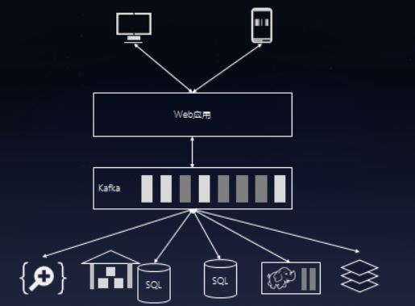

# Kafka

## 同步 / 异步通信

同步通信：打电话

异步通信：语音信箱 / 发邮件

## Kafka

[[数据工会 - 云上的Kafka]](http://dataguild.org/?p=7290)

异步通信 / 消息发布，订阅 / 分布式 / 顺序存储-高速 / 

| Kafka 在系统中的作用                                         | Kafka 的发布订阅机制和微信公众号的发布订阅是一个原理         |
| ------------------------------------------------------------ | ------------------------------------------------------------ |
|  |  |

