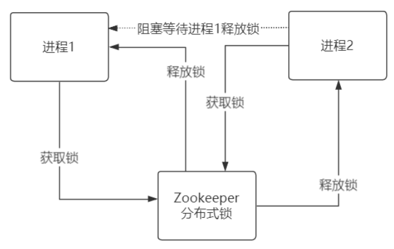

# zookeeper

[TOC]

## 产品超卖问题

单线程扣减库存逻辑：

并发环境扣减库存会出现问题：

解决方案：

1. 传统的synchronized是无效的，它只针对一个JVM进程内多个线程起到同步作用，对跨
   进程无效。
2. 利用数据库select ... for update 语句对库存进行锁定，依赖数据库自身特性，遇到跨库
   （分库分表）处理起来比较麻烦。
3. 利用Zookeeper、Redis实现分布式锁特性，通过分布式锁调度进程处理，数据程序级别
   控制，处理更为灵活。  

锁带来的问题：

无论是数据库排它锁，还是ZK、Redis的分布式锁都属于“悲观锁”的范畴，虽然以阻塞的方式保证数据的一致性，但并发量也会直线下降，这是要付出的代价。适用分布式锁有以下几个场景：

1. 数据价值大，必须要保证一致性的。例如：金融业务系统间的转账汇款等。
2. 并发量低但重要的业务系统。比如：各种大宗商品的分布式交易

总结下：重要的但对并发要求不高的系统可以使用分布式锁，对于并发量高、数据价值小、对一致性要求没那么高的系统可以进行最终一致性(BASE)处理，保证并发的前提下通过重试、程序矫正、人工补录的方式进行处理。  

## 什么是Zookeeper？  

Zookeeper（业界简称zk）是一种提供配置管理、分布式协同以及命名的中心化服务，这些提供的功能都是分布式系统中非常底层且必不可少的基本功能，但是如果自己实现这些功能而且要达到高吞吐、低延迟同时还要保持一致性和可用性，实际上非常困难。因此zookeeper提供了这些功能，开发者在zookeeper之上构建自己的各种分布式系统。  

## Apache Curator

Zookeeper 的一个高级封装。在实际的 Java 代码中，引入该依赖进行分布式锁的开发。

