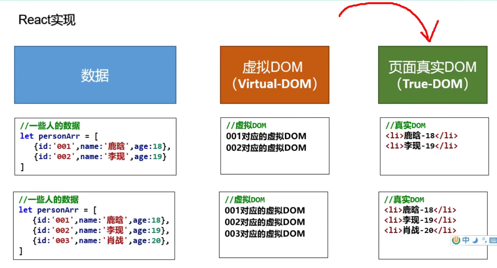
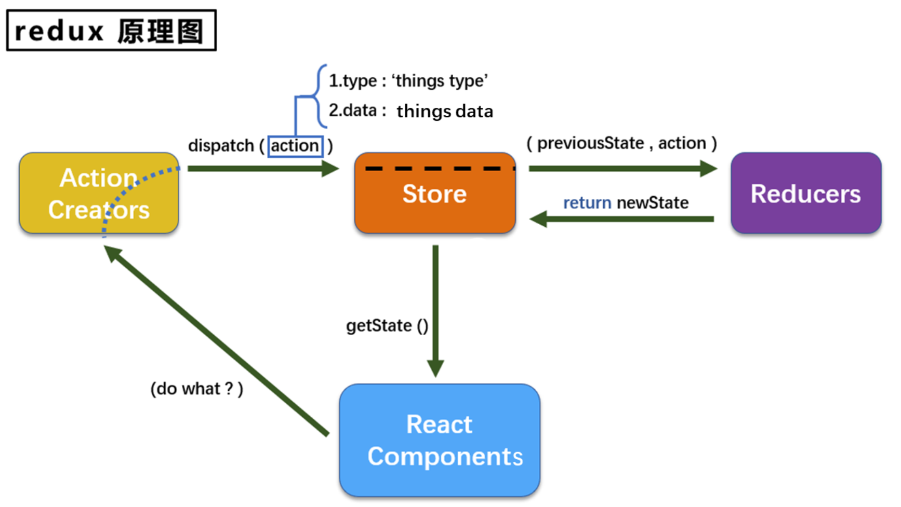
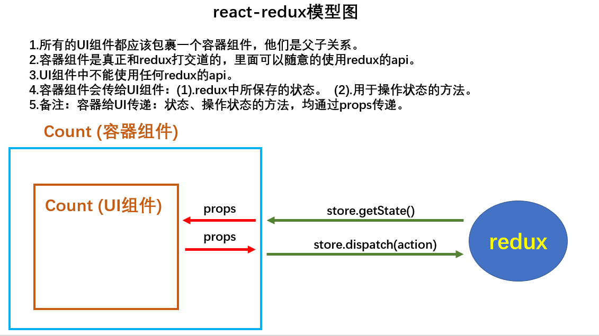

# React

[TOC]

**React** is a JavaScript library for building user interfaces. Learn what React is all about on [our homepage](https://reactjs.org/) or [in the tutorial](https://reactjs.org/tutorial/tutorial.html).


## react 特点

* 组件化
* 用 jsx 写虚拟 DOM
* diff 算法，增量渲染
* React Native 移动端开发


## cheatsheet 备忘

* jsx 是创建虚拟 DOM 的语法糖
* 虚拟 DOM 实际上是一个对象


## vscode snippet

| 缩写     | 功能                       | 备注                     |
| -------- | -------------------------- | ------------------------ |
| rcc      | 生成类组件代码             | react class component    |
| !        | 生成 html 代码             |                          |
| rfc      | 生成函数组件代码           | react function component |
| dev#root | 生成一个 id 为 root 的 div |                          |


## react 基本库

1. react.js：React 核心库，引入后，全局就有了一个 React 变量。
2. react-dom.js：提供操作 DOM 的 react 扩展库，引入后，全局就有了一个 ReactDOM 变量。
3. babel.min.js：将 JSX 语法代码转为 JS 代码（另外一个功能 ES6 -> ES5）。


## react 项目代码结构

```
public/
	index.html
src/
	components/
		Footer/
			index.css
			index.jsx
		Header/
			index.css
			index.jsx
	containers/ // 容器组件
		Header/  // Header 的容器组件
			index.jsx
	redux/
		actions/
			header.js // 为 Header 封装的 action
			count.js
		reducers/
			header.js // 为 Header 服务的 reducer
		constant.js // 配置常量
		store.js // redux 管理员
	App.css 
	App.jsx // 所有组件的外壳组件 
	index.js	// 入口文件
```


## react 打包发布

注意，要在 package.json 中配置 `"homepage": "."`，这样才能以相对路径进行打包。


## react + antd 开发流程

用脚手架创建 app

```
create-react-app hello-react
```

启动 app

```
npm start
```

安装 antd


## react 基础


### hello react

```react
<!DOCTYPE html>
<html>
    <head>
        <meta charset="utf-8"/>
        <title>hello-react</title>
    </head>
    <body>
        <!--  引入 react 核心库，核心库一定要先引入，全局有了一个 React 变量 -->
        <script type="text/javascript" src="../js/react.development.js"></script>
        <!--    引入 react-dom，用于支持 react 操作 dom，全局有了一个 ReactDOM 变量 -->
        <script type="text/javascript" src="../js/react-dom.development.js"></script>
        <!--        引入 babel，用于将 jsx 转为 js -->
        <script type="text/javascript" src="../js/babel.min.js"></script>
        <!-- 准备一个容器-->
        <div id="test"></div>
        <script type="text/babel"> /* 此处一定要写 babel */
            // 1. 用 jsx 语法创建虚拟 dom，然后将 DOM 赋值给一个变量 （虚拟 DOM 实际上是一个变量！）
            const VDOM = <h1>hello, react</h1> /* 此处一定不要加单引号，因为不是字符串 */
            // 2. 渲染虚拟 dom 到容器种
            ReactDOM.render(VDOM, document.getElementById('test'))
        </script>
    </body>
</html>
```


### 创建虚拟 DOM 的两种方式

jsx: javascript xml

jsx 用于创建虚拟 DOM，jsx 是为了避免用 js 创建虚拟 DOM 而产生的语法糖。

可以使用 JavaScript 面向对象的方法，创建虚拟 DOM，也可以直接写 jsx 创建虚拟 DOM。

用 JavaScript 创建虚拟 DOM。

```react
<!DOCTYPE html>
<html>
    <head>
        <meta charset="utf-8"/>
        <title>hello-react</title>
    </head>
    <body>
        <script type="text/javascript" src="../js/react.development.js"></script>
        <script type="text/javascript" src="../js/react-dom.development.js"></script>
        <div id="test"></div>
        <script type="text/babel">
			// 用 JavaScript 创建虚拟 DOM
            const VDOM = React.createElement('h1', {id: 'title'}, React.createElement('span', {}, 'hello react'))
            // 2. 渲染虚拟 dom 到页面
            ReactDOM.render(VDOM, document.getElementById('test'))
        </script>

    </body>

</html>
```

用 jsx 语法创建虚拟 DOM

```react
<!DOCTYPE html>
<html>
    <head>
        <meta charset="utf-8"/>
        <title>hello-react</title>
    </head>
    <body>
        <script type="text/javascript" src="../js/react.development.js"></script>
        <script type="text/javascript" src="../js/react-dom.development.js"></script>
        <script type="text/javascript" src="../js/babel.min.js"></script>

        <!-- 准备一个容器-->
        <div id="test"></div>

        <script type="text/babel"> /* 此处一定要写 babel */
            // 1. 用 jsx 语法创建虚拟 dom
            const VDOM = (
            <h1 id="title">
                <span>hello, react</span>
            </h1>
            ) /* 此处一定不要加单引号，因为不是字符串 */
            // 2. 渲染虚拟 dom 到页面
            ReactDOM.render(VDOM, document.getElementById('test'))

            console.log('虚拟dom: ', VDOM)
            console.log('真实dom: ', document.getElementById('test'))
            console.log(typeof VDOM)
            console.log(typeof document.getElementById('test'))
            /*
            * 1. 虚拟 DOM 本质上是一个 object 对象
            * 2. 虚拟 dom 比较轻，真实 dom 比较重，因为虚拟 dom 是 react 内部用，不需要太多属性
            * 3. 虚拟 dom 最终会被 react 转化为真实 dom，呈现在页面上
            * */
        </script>
    </body>
</html>
```


### jsx 语法

jsx 语法

```
1. 定义虚拟DOM时，不要写引号。
2. 标签中混入JS表达式时要用{}。
3. 样式的类名指定不要用class，要用className。
4. 内联样式，要用style=\{\{key:value\}\}的形式去写，外层{}表示 js 表达式，内层{}表示 json。
5. 只有一个根标签
6. 标签必须闭合
7. 标签首字母
(1).若小写字母开头，则将该标签转为 html 中同名元素，若 html 中无该标签对应的同名元素，则报错。
(2).若大写字母开头，react就去渲染对应的组件，若组件没有定义，则报错。
8. 其他重写规则：
	onclick -> onClick
```

js 语句和 js 表达式，{ } 中只能写 js 表达式

```
一定注意区分：【js语句(代码)】与【js表达式】
1.表达式：一个表达式会产生返回值，可以放在任何一个需要值的地方
    下面这些都是表达式：
    (1). a
    (2). a+b
    (3). demo(1)
    (4). arr.map() 
    (5). function test () {}
2.语句(代码)：
    下面这些都是语句(代码)：
    (1).if(){}
    (2).for(){}
    (3).switch(){case:xxxx}
```

demo:

```react
<script type="text/babel">
    class Person extends React.Component{
        // 限定类型
        static propTypes = {
            name: PropTypes.string.isRequired,
            age: PropTypes.number,
            sex: PropTypes.string
        }
        // 设置默认值
        static defaultProps = {
            age: 18,
            sex: "男"
        }
        render(){
            const {name, age, sex} = this.props
            return (
                <ul>
                    <li>姓名：{name}</li>
                    <li>年龄：{age + 1}</li>
                    <li>性别：{sex}</li>
                </ul>
            )
        }
    }
    let data = {name: 'wansho'}
    ReactDOM.render(<Person {...data}/>, document.getElementById("test"))
</script>
```

以上的 `{name}` 的用法，类似于前后端一体时候的模板语言。

### react 函数式组件

函数式组件相当于给 VDOM 进行组件化封装

```react
<!DOCTYPE html>
<html>
    <head>
        <meta charset="utf-8"/>
        <title>hello-react</title>
    </head>
    <body>
        <script type="text/javascript" src="../js/react.development.js"></script>
        <script type="text/javascript" src="../js/react-dom.development.js"></script>
        <script type="text/javascript" src="../js/babel.min.js"></script>

        <div id="test"></div>

        <script type="text/babel"> /* 此处一定要写 babel */
            // 1. 创建函数式组件，函数式组件相当于给 VDOM 进行组件化封装
            function MyComponent(){
                return <h2> 这是一个函数式组件！ </h2>
            }
            // 2. 渲染虚拟 dom 到页面
            ReactDOM.render(<MyComponent/>, document.getElementById('test'))
        </script>
    </body>
</html>
```


### react 类式组件

```react
<!DOCTYPE html>
<html lang="en">
<head>
	<meta charset="UTF-8"/>
	<title>2_类式组件</title>
</head>
<body>

	<div id="test"></div>

	<script type="text/javascript" src="../js/react.development.js"></script>
	<script type="text/javascript" src="../js/react-dom.development.js"></script>
	<script type="text/javascript" src="../js/babel.min.js"></script>

	<script type="text/babel">
		//1.创建类式组件
		class MyComponent extends React.Component {
			render(){
				//render是放在哪里的？—— MyComponent的原型对象上，供实例使用。
				//render中的this是谁？—— MyComponent的实例对象 <=> MyComponent组件实例对象。
				console.log('render中的this:',this);
				return <h2>我是用类定义的组件(适用于【复杂组件】的定义)</h2>
			}
		}
		//2.渲染组件到页面
		ReactDOM.render(<MyComponent/>,document.getElementById('test'))
		/* 
			执行了ReactDOM.render(<MyComponent/>.......之后，发生了什么？
            1.React解析组件标签，找到了MyComponent组件。
            2.发现组件是使用类定义的，随后new出来该类的实例，并通过该实例调用到原型上的render方法。
            3.将render返回的虚拟DOM转为真实DOM，随后呈现在页面中。
		*/
	</script>
</body>
</html>
```


### 类组件三大核心属性：state

```react
this.state; // 存储组件的数据（状态）
this.props; // 存储传给组件的数据
this.refs; // 存储组件内定义的标签的 id
```


在构造函数中初始化 state

```react
<script type="text/babel">
    // 1.创建类式组件
    class Weather extends React.Component {
        constructor(props) {
            super(props)
            this.state = { isHot: true, wind: '微风'}
            this.changeWeather = this.changeWeather.bind(this)
        }
        render() {
            // destructure-assignment
            const {isHot, wind} = this.state
            return <h2 onClick={this.changeWeather}>今天天气情况：{isHot ? '炎热' : '凉快'}, {wind}</h2>
        }
        changeWeather() {
            const isHot = this.state.isHot
            // 状态不能直接更改，要借助 React 的 api 进行更改
            this.setState({isHot: !isHot})
            console.log(this.state.isHot)
        }
    }
    // 2.渲染组件到页面
    ReactDOM.render(<Weather/>, document.getElementById('test'))
</script>
```


直接创建类的成员变量 state

```react
<script type="text/babel">
    // 1.创建类式组件
    class Weather extends React.Component {
        // 初始化状态
        // 给 weather 添加一个属性：state
        state = {isHot: true, wind: '微风'}

        render() {
            // destructure-assignment
            const { isHot, wind} = this.state
            return <h2 onClick={this.changeWeather}>今天天气情况：{isHot ? '炎热' : '凉快'}, {wind}</h2>
        }

        // 自定义方法: 要用赋值语句的形式 + 箭头函数
        // 给 weather 添加一个属性 changeWeather
        // 箭头函数内没有 this，找外部的 this 作为内部的 this 使用，也就是类的对象
        changeWeather = () =>{
            console.log(this)
            const isHot = this.state.isHot
            // 状态不能直接更改，要借助 React 的 api 进行更改，改完状态后，会调用 render 重新渲染
            this.setState({isHot: !isHot})
            console.log(this.state.isHot)
        }
    }
    // 2.渲染组件到页面
    ReactDOM.render(<Weather/>, document.getElementById('test'))
</script>
```


### 类组件三大核心属性：props

```react
<script type="text/babel">
    class Person extends React.Component{
        // 限定类型
        static propTypes = {
            name: PropTypes.string.isRequired,
            age: PropTypes.number,
            sex: PropTypes.string
        }
        // 设置默认值
        static defaultProps = {
            age: 18,
            sex: "男"
        }
        render(){
            const {name, age, sex} = this.props
            return (
                <ul>
                    <li>姓名：{name}</li>
                    <li>年龄：{age + 1}</li>
                    <li>性别：{sex}</li>
                </ul>
            )
        }
    }
    let data = {name: 'wansho'}
    ReactDOM.render(<Person {...data}/>, document.getElementById("test"))
</script>
```


### 类组件三大核心属性：refs

组件内的标签可以定义 ref 属性来标识自己。

1. 字符串形式的 ref

```react
<script type="text/babel">

    class Demo extends React.Component{
        showData1 = () => {
            console.log(this.refs)
            // 从 ref 中获取标签
            const {input1} = this.refs
            alert(input1.value)
        }
        showData2 = () => {
            const {input2} = this.refs
            alert(input2.value)
        }
        render(){
            return (
                <div>
                    { /* ref 传入一个字符串 */ }
                    <input ref="input1" placeholder="输入内容，点击按钮弹窗显示"/>
                    <button onClick={this.showData1}> 点我提示左侧的数据</button>
                    <input ref="input2" onBlur={this.showData2}/>
                </div>
            )
        }
    }

    ReactDOM.render(<Demo/>, document.getElementById("test"))

</script>
```


2. 回调形式的 ref

```react
<script type="text/babel">
    class Demo extends React.Component{
        showData1 = () => {
            alert(this.input1.value)
        }
        showData2 = () => {
            alert(this.input2.value)
        }
        render(){
            return (
                <div>
                    { /* ref 内传入一个回调函数，函数的输入是 currentNode，将其与实例进行绑定，这里在 Demo 实例上，加了 input1 成员变量和 input2 成员变量*/ }
                    <input ref={(currentNode) => this.input1 = currentNode} placeholder="输入内容，点击按钮弹窗显示"/>
                    <button onClick={this.showData1}> 点我提示左侧的数据 </button>
                    <input ref={(currentNode) => this.input2 = currentNode} onBlur={this.showData2}/>
                </div>
            )
        }
    }
    ReactDOM.render(<Demo/>, document.getElementById("test"))
</script>
```


3. createRef 创建 ref 容器

```react
<script type="text/babel">
    class Demo extends React.Component{
        /*
            React.createRef调用后可以返回一个容器，该容器可以存储被ref所标识的节点，该容器是“专人专用”的
        */
        myRef1 = React.createRef();
        myRef2 = React.createRef();
        showData1 = () => {
            alert(this.myRef1.current.value)
        }
        showData2 = () => {
            alert(this.myRef2.current.value)
        }
        render(){
            return (
                <div>
                    <input ref={this.myRef1} placeholder="输入内容，点击按钮弹窗显示"/>
                    <button onClick={this.showData1}> 点我提示左侧的数据</button>
                    <input ref={this.myRef2} onBlur={this.showData2}/>
                </div>
            )
        }
    }
    ReactDOM.render(<Demo/>, document.getElementById("test"))
</script>
```


事件处理 event:

```react
<script type="text/babel">
    class Demo extends React.Component{
        myRef1 = React.createRef();
        showData1 = () => {
            alert(this.myRef1.current.value)
        }
        /***
         1. 通过 onXxx 属性指定事件处理函数(注意大小写)
            1) React 使用的是自定义(合成)事件, 而不是使用的原生 DOM 事件  —————— 为了更好的兼容性
            2) React 中的事件是通过事件委托方式处理的(委托给组件最外层的元素)  ————————为了的高效
         2. 通过 event.target 得到发生事件的 DOM 元素对象 ———————不要过度使用ref
        */
        
        // 传入一个事件
        showData2 = (event) => {
            alert(event.target.value)
        }
        render(){
            return (
                <div>
                    <input ref={this.myRef1} placeholder="输入内容，点击按钮弹窗显示"/>
                    <button onClick={this.showData1}> 点我提示左侧的数据</button>
                    { /* 这个 input 不需要设置 ref，可以直接给这个 input 绑定事件处理  */ }
                    <input onBlur={this.showData2} placeholder="输入内容，失去焦点后弹窗显示"/>
                </div>
            )
        }
    }
    ReactDOM.render(<Demo/>, document.getElementById("test"))
</script>
```

 

非受控组件：

非受控组件，页面内所有输入类的 DOM，现用现取，就是非受控组件。

```react
<script type="text/babel">
    class Forum extends React.Component {
        username = React.createRef()
        password = React.createRef()
        submitForum = (event) => {
            event.preventDefault() // 阻止表单提交
            console.log(this.refs)
            console.log(this.username.current.value)
            console.log(this.password.current.value)
            // 发起 ajax 请求
        }
        render(){
            return (
                <form onSubmit={this.submitForum}>
                    username: <input ref={this.username} name="username"/>
                    password: <input ref={this.password} name="password"/>
                    <button>提交</button>
                </form>
            )
        }
    }
    ReactDOM.render(<Forum/>, document.getElementById("test"))
</script>
```


受控组件：

页面内所有输入类的 DOM，随着输入，会把内容维护到状态中。等到需要用的时候，就从状态中取出来。受控组件用得比较多。

```react
<script type="text/babel">
    class Forum extends React.Component {
        //初始化状态
        state = {
            username: '',
            password: ''
        }
        // 保存用户名到 state 中
        saveUsername = (event) => {
            this.setState({username: event.target.value})
        }
        // 保存密码到 state 中
        savePassword = (event) => {
            this.setState({password: event.target.value})
        }
        // 提交表单时，从 state 读出信息提交
        submitForum = () => {
            const {username, password} = this.state
            alert(`username: ${username}, password: ${password}`)
        }
        render(){
            return (
                <form onSubmit={this.submitForum}>
                    { /* onChange 绑定一个回调函数，onXxx 都是传入一个函数进行绑定 */ }
                    username: <input onChange={this.saveUsername} name="username"/>
                    password: <input onChange={this.savePassword} name="password"/>
                    <button>提交</button>
                </form>
            )
        }
    }
    ReactDOM.render(<Forum/>, document.getElementById("test"))
</script>
```


函数的柯里化：

```react
<script type="text/babel">
    class Forum extends React.Component {
        //初始化状态
        state = {
            username: '',
            password: ''
        }
        // 提交表单时，从 state 读出信息提交
        submitForum = () => {
            const {username, password} = this.state
            alert(`username: ${username}, password: ${password}`)
        }
        /*
        高阶函数：如果一个函数符合下面 2 个规范中的任何一个，那该函数就是高阶函数。
            1.若A函数，接收的参数是一个函数，那么A就可以称之为高阶函数。
            2.若A函数，调用的返回值依然是一个函数，那么A就可以称之为高阶函数。
            常见的高阶函数有：Promise、setTimeout、arr.map()等等

        函数的柯里化：通过函数调用继续返回函数的方式，实现多次接收参数最后统一处理的函数编码形式。
            function sum(a){
                return(b)=>{
                    return (c)=>{
                        return a+b+c
                    }
                }
            }
        */
        saveFormData = (data) => {
            // 返回的这个函数，才是 onChange 的回调函数
            // console.log(data)
            return (event) => {
                // console.log(data, event.target.value)
                this.setState({[data]: event.target.value})
            }
        }
        render() {
            return (
                <form onSubmit={this.submitForum}>
                    { /* onChange 必须绑定一个回调函数，这个函数返回一个函数 */}
                    username: <input onChange={this.saveFormData('username')} name="username"/>
                    password: <input onChange={this.saveFormData('password')} name="password"/>
                    <button>提交</button>
                </form>
            )
        }
    }
    ReactDOM.render(<Forum/>, document.getElementById("test"))
</script>
```


不使用柯里化的方式：

```react
<script type="text/babel">
    class Forum extends React.Component {
        //初始化状态
        state = {
            username: '',
            password: ''
        }
        // 提交表单时，从 state 读出信息提交
        submitForum = () => {
            const {username, password} = this.state
            alert(`username: ${username}, password: ${password}`)
        }
        saveFormData = (data, event) => {
            this.setState({[data]: event.target.value})
        }
        render() {
            return (
                <form onSubmit={this.submitForum}>
                    { /* onChange 必须绑定一个回调函数，这里传入一个匿名函数 */}
                    username: <input onChange={(event) => {this.saveFormData('username', event)}} name="username"/>
                    password: <input onChange={(event) => {this.saveFormData('password', event)}} name="password"/>
                    <button>提交</button>
                </form>
            )
        }
    }
    ReactDOM.render(<Forum/>, document.getElementById("test"))
</script>
```


### 组件的生命周期

初始化阶段，由 ReactDOM.render()触发，初次渲染  

* constructor()

  

* getDerivedStateFromProps

  

* render()

  

* componentDidMount()  

  加载完后进行初始化，例如开启定时器发送网络请求，订阅消息

  

更新阶段，由组件内部 this.setSate()或父组件重新 render 触发  

1. getDerivedStateFromProps()

2. shouldComponentUpdate()
3. render()
3. getSnapshotBeforeUpdate()
4. componentDidUpdate()


卸载组件，由 ReactDOM.unmountComponentAtNode() 触发  

* componentWillUnmount()  


重要的钩子：

1. render： 初始化渲染或更新渲染调用
2. componentDidMount： 开启监听, 发送 ajax 请求
3. componentWillUnmount： 做一些收尾工作, 如: 清理定时器  


### diffing 算法

新虚拟 DOM 会和旧虚拟 DOM 进行比较，然后增量渲染。



Diffing 算法对比的最小粒度，是标签，而且是嵌套逐层对比。

```
/*
经典面试题:
1) react/vue中的key有什么作用？（key的内部原理是什么？）
2) 为什么遍历列表时，key最好不要用index?

1. 虚拟DOM中key的作用：
    1) 简单的说: key是虚拟DOM对象的标识, 在更新显示时key起着极其重要的作用。

    2) 详细的说: 当状态中的数据发生变化时，react会根据【新数据】生成【新的虚拟DOM】,
    随后React进行【新虚拟DOM】与【旧虚拟DOM】的diff比较，比较规则如下：

        a. 旧虚拟DOM中找到了与新虚拟DOM相同的key：
        (1) 若虚拟DOM中内容没变, 直接使用之前的真实DOM
        (2) 若虚拟DOM中内容变了, 则生成新的真实DOM，随后替换掉页面中之前的真实DOM

        b. 旧虚拟DOM中未找到与新虚拟DOM相同的key
        根据数据创建新的真实DOM，随后渲染到到页面

2. 用index作为key可能会引发的问题：
    1. 若对数据进行：逆序添加、逆序删除等破坏顺序操作:
    会产生没有必要的真实DOM更新 ==> 界面效果没问题, 但效率低。

    2. 如果结构中还包含输入类的DOM：
    会产生错误DOM更新 ==> 界面有问题。

    3. 注意！如果不存在对数据的逆序添加、逆序删除等破坏顺序操作，
    仅用于渲染列表用于展示，使用index作为key是没有问题的。

3. 开发中如何选择key?:
    1. 最好使用每条数据的唯一标识作为key, 比如id、手机号、身份证号、学号等唯一值。
    2. 如果确定只是简单的展示数据，用index也是可以的。
    
*/
```


```react
<script type="text/babel">
    class Person extends React.Component {
        state = {data: [{id: 1, name: 'wansho', age: 26}, {id: 2, name: 'ceshi', age: 20}]}
        addXiaoWang = ()=>{
            let {data} = this.state
            let xiaowang = {id: 3, name: '小王', age: 29 }
            this.setState({data: [xiaowang, ...data]})
        }
        render(){
            return (
                <div>
                    <h2>展示人员信息</h2>
                    <button onClick={this.addXiaoWang}>添加一个小王</button>
                    {this.state.data.map((person) => {
                        return <li key={person.id}>id: {person.id}, name: {person.name}, age: {person.age} <input text='input'/></li>
                    })}
                </div>
            )
        }
    }
    ReactDOM.render(<Person/>, document.getElementById('test'))
</script>
```


使用 index 索引值作为 key，和使用 id 唯一标志作为 key

```
/* 
	慢动作回放----使用index索引值作为key

			初始数据：
					{id:1,name:'小张',age:18},
					{id:2,name:'小李',age:19},
			初始的虚拟DOM：
					<li key=0>小张---18<input type="text"/></li>
					<li key=1>小李---19<input type="text"/></li>

			更新后的数据：
					{id:3,name:'小王',age:20},
					{id:1,name:'小张',age:18},
					{id:2,name:'小李',age:19},
			更新数据后的虚拟DOM：
					<li key=0>小王---20<input type="text"/></li>
					<li key=1>小张---18<input type="text"/></li>
					<li key=2>小李---19<input type="text"/></li>
			新的虚拟 DOM 和旧的虚拟 DOM，一对比，发现都得更新，根本没有复用
	-----------------------------------------------------------------

	慢动作回放----使用id唯一标识作为key

			初始数据：
					{id:1,name:'小张',age:18},
					{id:2,name:'小李',age:19},
			初始的虚拟DOM：
					<li key=1>小张---18<input type="text"/></li>
					<li key=2>小李---19<input type="text"/></li>

			更新后的数据：
					{id:3,name:'小王',age:20},
					{id:1,name:'小张',age:18},
					{id:2,name:'小李',age:19},
			更新数据后的虚拟DOM：
					<li key=3>小王---20<input type="text"/></li>
					<li key=1>小张---18<input type="text"/></li>
					<li key=2>小李---19<input type="text"/></li>

*/
```


## redux

将多个组件中的共享数据，交给 redux 管理。

redux 是独立第三方库，不是集成到 react 中的，和 Facebook 没关系。





### action

action 是一个对象，封装了动作的类型和动作的数据。

* type: 标识属性, 值为字符串, 唯一, 必要属性  
* data: 数据属性, 值类型任意, 可选属性 

Demo: `{ type: 'ADD_STUDENT',data:{name: 'tom',age:18} }  `


action 分成两类：

* 同步 action：action 值是一个 object 对象
* 异步 action：action 值是一个函数

其实函数也是对象，函数在 JavaScript 中是一等公民。实际创建一个异步 action 函数，就是自定义了一个 reducer，store 不需要手下人去干活了，直接运行这个新建的函数。


### reducer

map / reduce，reducer 是一个打工仔，是一个计算单元

用于对 redux 中存储的状态进行加工处理

1. 用于初始化状态、 加工状态。
2. 加工时，根据旧的 state 和 action，产生新的 state 的纯函数。

  

### store

store 是一个调度者，管理者，将 state、 action、 reducer 联系在一起的对象  

```javascript
// 创建 store 对象
import {createStore} from 'redux'
import reducer from './reducers'
const store = createStore(reducer)

// store 的 api
getState() // 得到 state
dispatch(action) // 分发 action, 触发 reducer 调用, 产生新的 state
subscribe(listener) // 注册监听, 当产生了新的 state 时, 自动调用
```


### redux install

redux 不是默认集成到 react 中的，需要手动安装。

```shell
npm install redux
yarn add redux
```


### redux 精简版

```
	(1) 去除 Count 组件自身的状态
	(2) src下建立:
    	-redux
            -store.js
            -count_reducer.js

	(3) store.js：
        1) 引入 redux 中的 createStore 函数，创建一个 store
        2) createStore 调用时要传入一个为其服务的 reducer
        3) 记得暴露 store 对象

	(4) count_reducer.js：
        1) reducer 的本质是一个函数，接收：preState, action，返回加工后的状态
        2) reducer 有两个作用：初始化状态，加工状态
        3) reducer 被第一次调用时，是 store 自动触发的，
            传递的 preState 是 undefined,
            传递的 action 是:{type:'@@REDUX/INIT_a.2.b.4}

	(5) 在 index.js 中监测 store 中状态的改变，一旦发生改变重新渲染<App/>
    	备注：redux 只负责管理状态，至于状态的改变驱动着页面的展示，要靠我们自己写。
```


### redux 完整版

```
新增文件：
	1. count_action.js 专门用于创建 action 对象
	2. constant.js 放置容易写错的 type 值
```


### redux-thunk

如果想要 redux 的 store 能接收并执行函数，则需要一个中间件 redux-thunk

```shell
npm install redux-thunk
```

```
(1) 明确：延迟的动作不想交给组件自身，想交给 action
(2) 何时需要异步 action：想要对状态进行操作，但是具体的数据靠异步任务返回。
(3) 具体编码：
    1) yarn add redux-thunk，并配置在 store 中
    2) 创建 action 的函数不再返回一般对象，而是一个函数，该函数中写异步任务。
    3) 异步任务有结果后，分发一个同步的 action 去真正操作数据
(4) 备注：异步 action 不是必须要写的，完全可以自己等待异步任务的结果了再去分发同步 action
```


## react-redux

react-redux 是 react 官方出的库，相当于 react + redux。




### install

```shell
npm install redux
npm install react-redux
```


### 基本使用

```
(1) 明确两个概念：
    1) UI组件: 不能使用任何 redux 的 api，只负责页面的呈现、交互等。
    2) 容器组件：负责和 redux 通信，将结果交给 UI 组件。
(2) 如何创建一个容器组件————靠 react-redux 的 connect 函数
    connect(mapStateToProps,mapDispatchToProps)(UI 组件)
        -mapStateToProps: 映射状态，是一个函数，返回值是一个对象
        -mapDispatchToProps: 映射操作状态的方法，是一个函数，返回值是一个对象
    容器组件会自动监测 redux 中状态的概念，不需要 subscribe 进行监测了
(3) 备注1：容器组件中的 store 是靠 props 传进去的，而不是在容器组件中直接引入
(4) 备注2：mapDispatchToProps，也可以是一个对象
```


### 优化

```
(1) 容器组件和 UI组件 整合一个文件
(2) 无需自己给容器组件传递 store，给 <App/> 包裹一个 <Provider store={store}> 即可。
(3) 使用了 react-redux 后也不用再自己检测 redux 中状态的改变了，容器组件可以自动完成这个工作。
(4) mapDispatchToProps 也可以简单的写成一个对象
(5) 一个组件要和 redux “打交道”要经过哪几步？
    (1) 定义好 UI组件 ---不暴露
    (2) 引入 connect 生成一个容器组件，并暴露，写法如下：
        connect(
            state => ({key:value}), // 映射状态
            {key:xxxxxAction} // 映射操作状态的方法
        )(UI组件)
    (3) 在 UI组件 中通过 this.props.xxxxxxx 读取和操作状态
```


## react 相关技术


### webpack

Webpack 是一个开源的前端打包工具。Webpack 提供了前端开发缺乏的模块化开发方式，将各种静态资源视为模块，并从它生成优化过的代码。

Webpack可以从终端、或是更改webpack.config.js 来设置各项功能。 要使用Webpack 前须先安装Node.js。
