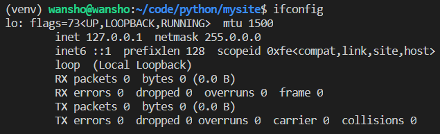

# Linux 使用心得

[TOC]

## Linux 版本

我最常用的 Linux 版本是 Ubuntu16.04，使用了 Ubuntu18 后，我发现 18 有很多兼容性问题，所以我又切换到 14。

Ubuntu16.04 自带了 Python2.7 和 Python3.5，Git 等软件。

## Linux 系统的理解

### 如何判断一个人 Linux 的水平？

问他：查看某一个命令的帮助文档的两种方式，如果太长了想一页一页的看怎么办？

这其实考察了一个人遇到问题后能否通过自学解决问题的能力。

### Linux 最常用的几个目录

* **/etc** 

  系统配置

* **/usr/bin**

  下载安装的软件的位置，例如 Python，Mysql

* **/home**

  用户目录

* **/bin**

  存放用户级别的 Linux 工具，例如 cat, ls, chown

* **/sbin**

  存放 root 用户才能用的 Linux 工具

### 忘记了命令怎么使用怎么办？

如果忘记了某个命令的使用，我们有两个方法：

```bash
cmd --help

man cmd
```

而不是去百度！

### Linux 环境变量到底是什么

Linux 的环境变量指的是系统中的各种重要的变量，环境变量并不是 PATH ！环境变量是一系列 key-value 的键值对。我们可以使用 `printenv` 来查看所有的环境变量：

```bash
SHELL=/bin/bash
TERM=xterm
HISTSIZE=1000
OLDPWD=/home/work/webservice/redis/redis/redis-stable/src
USER=work
VIRTUAL_ENV=/home/work/webservice/venv
MAIL=/var/mail/work
PATH=/home/work/webservice/venv/bin:/home/work/bin:/home/work/.local/bin:/usr/local/bin:/usr/bin:/bin:/usr/local/games:/usr/games:/snap/bin
PWD=/home/work/webservice/redis/redis/redis-stable
LANG=en_US.utf8
PS1=(venv) \[\e]0;\u@\h: \w\a\]${debian_chroot:+($debian_chroot)}\u@\h:\w\$ 
SHLVL=1
HOME=/home/work
LOGNAME=work
LESSOPEN=| /usr/bin/lesspipe %s
PROMPT_COMMAND=history -a; 
DISPLAY=localhost:10.0
LESSCLOSE=/usr/bin/lesspipe %s %s
HISTTIMEFORMAT=%F %T 
_=/usr/bin/printenv
```

### Linux 是如何安装软件的？configure / make /sudo make install

[The magic behind configure, make, make install](https://thoughtbot.com/blog/the-magic-behind-configure-make-make-install)

There are three distinct steps in this process:

```bash
./configure # check env and config
make # 编译源码，生成可执行文件
sudo make install # 将二进制执行文件，库，文档拷贝到系统相关的位置。
```

1. Configure the software

   The `configure` script is responsible for getting ready to build the software on your specific system. It makes sure all of the dependencies for the rest of the build and install process are available, and finds out whatever it needs to know to use those dependencies.

   Unix programs are often written in C, so we’ll usually need a C compiler to build them. In these cases the `configure` script will establish that your system does indeed have a C compiler, and find out what it’s called and where to find it.

2. Build the software

   Once `configure` has done its job, we can invoke `make` to build the software. This runs a series of tasks defined in a `Makefile` to build the finished program from its source code.

   The tarball you download usually doesn’t include a finished `Makefile`. Instead it comes with a template called `Makefile.in` and the `configure` script produces a customised `Makefile` specific to your system.

3. Install the software

   Now that the software is built and ready to run, the files can be copied to their final destinations. The `make install` command will **copy** the built program, and its libraries and documentation, to the correct locations.

   This usually means that the program’s binary will be copied to a directory on your `PATH`, the program’s manual page will be copied to a directory on your `MANPATH`, and any other files it depends on will be safely stored in the appropriate place.

   Since the install step is also defined in the `Makefile`, where the software is installed can change based on options passed to the `configure` script, or things the `configure` script discovered about your system.

   Depending on where the software is being installed, you might need escalated permissions for this step so you can copy files to system directories. Using `sudo` will often do the trick.

### Linux /usr 文件夹到底是啥？

[Linux 官方文档解释](https://www.tldp.org/LDP/Linux-Filesystem-Hierarchy/html/usr.html)

`usr` 文件夹中包含了所有用户的二进制可执行文件、文档、库文件、依赖、头文件等各种用户相关的只读文件。用户的程序，例如 ftp, telnet 都安装在这个目录中。在 Unix 最初的设计中，`/usr` 被设计为用户的 home 目录，也就是说，`/usr/someone` 就是现在的 `/home/someone`。在现在的 Unix 系统中，`/usr` 的作用变窄，从存储任何用户相关的数据和程序，到存储用户安装的程序及其产生的数据。(`from "everything user related" to "user usable programs and data"`) 

> 我的理解：`/usr` 中存放了一切和应用程序相关的**静态只读数据**，类似于 Windows 的 Program files 文件夹。

| 文件夹                        | 解释                                                         | 我的理解                                                     |
| ----------------------------- | ------------------------------------------------------------ | ------------------------------------------------------------ |
| `/usr/bin`                    | This directory contains the vast majority of binaries on your system. Executables in this directory vary widely. For instance vi, gcc, gnome-session and mozilla and are all found here. | 存放二进制可执行文件，有很多软链接                           |
| `/usr/sbin`                   | This directory contains programs for administering a system, meant to be run by 'root'. | 存放 root 用户才有权使用的二进制可执行文件                   |
| `/usr/doc`                    | The central documentation directory. Documentation is actually located in `/usr/share/doc` and linked from here. | 存放应用程序的说明文档，大多是软链接，源文件地址在 `/usr/share/doc` |
| `/usr/include`                | The directory for 'header files', needed for compiling user space source code. | 存放应用程序的头文件                                         |
| `/usr/include/'package-name'` | Application specific header files.                           |                                                              |
| `/usr/lib`                    | This directory contains program libraries. Libraries are collections of frequently used program routines. | 存放程序执行依赖的库文件                                     |
| `/usr/local`                  | keep self-compiled or third-party programs. The /usr/local hierarchy is for use by the system administrator when installing software locally. | 存放 **root** 用户自编译和安装的第三方应用                   |
| `/usr/share`                  | This directory contains 'shareable', architecture-independent files (docs, icons, fonts etc). | 存放应用程序的一些只读的静态文件                             |
| `/usr/share/doc`              | Location of package specific documentation files.            | 存放应用程序的文档                                           |
| `/usr/share/man`              | Manual pages.                                                | 应用程序手册                                                 |
| `/usr/src`                    | The 'linux' sub-directory holds the Linux kernel sources, header-files and documentation. | 存放 Linux 内核相关的文件。                                  |

问题：如何找到系统安装的 Mysql 中存储的数据？

### Linux 中 Mysql 数据库中存储的数据存放在那里？

Mysql 存储的数据属于动态数据，所以不能存放在静态文件夹 `/usr` 中，实际上存放在了**动态文件夹** `/var` (`variable`) 中。如果具体去分析，Mysql 的数据实际存放在了 `/var/lib` 中。

## Ubuntu 初始化

### 切换软件仓库源

Ubuntu 安装软件是统一从一个软件仓库进行安装，但是该仓库源的速度非常慢，所以通常会切换成国内的源：

[中科大 ubuntu 源](http://mirrors.ustc.edu.cn/help/ubuntu.html )

### 新建用户，给用户配置 sudo

Ubuntu 安装软件的命令是 apt-get，普通用户使用的画，需要加 sudo，为了方便普通用户的使用，需要授予用户  sudo 的权限：

```bash
# 新建 work 用户
useradd -m -c "for work" -u 8888 -p passwd? -s /bin/bash work
# 授予 work 用户 sudo 权限
visudo
# 在最后一行添加：work ALL=(ALL:ALL) NOPASSWD:ALL
```

### Python 初始化

ubuntu16.04 自带了两个 Python 版本：Python2.7 和 Python3.5 (从 /usr/bin 中可以看出)，和 apt-get 一样，Python 的包管理器的仓库源速度也非常慢，也需要切换到国内的源：

```bash
mkdir -p ~/.config/pip/ && cd $_
touch pip.conf
echo -e [global]\\nindex-url = https://pypi.tuna.tsinghua.edu.cn/simple > pip.conf
```

Python 要配合 virtualenv 来使用：

```bash
pip install virtualenv
virtualenv -p python3 venv # python3.5
source venv/bin/activate
deactivate
```

## Linux 提高工作效率的工具

Xshell，Xftp，Samba，MobaXterm，VSCode Remote-SSH

### Xshell / Xftp

* 多窗口多任务模式

  

* 利用 Xftp 实现大文件的快速上传(云服务器往往下行带宽很小，上行带宽很大)。

* 利用 Xftp 实现云端文本本地编辑 [设置Notepad++为默认文本编辑器](https://blog.csdn.net/xuezhisdc/article/details/49621231)

### MoboXterm

终端神器

链接：https://pan.baidu.com/s/1UGv8kn3fdsjiuM1NXZ7oBQ 
提取码：yivm

### VSCode Remote-SSH

[Remote-SSH](https://www.cnblogs.com/liyufeia/p/11405779.html) 

远程连接服务器，编写代码的工具，类似于 Samba。

**Secure Shell** (**SSH**) is a [cryptographic](https://en.wikipedia.org/wiki/Cryptography) [network protocol](https://en.wikipedia.org/wiki/Network_protocol) for operating network services securely over an unsecured network.[[1\]](https://en.wikipedia.org/wiki/Secure_Shell#cite_note-rfc4251-1) Typical applications include remote [command-line](https://en.wikipedia.org/wiki/Command-line_interface), [login](https://en.wikipedia.org/wiki/Login), and remote command execution, but any [network service](https://en.wikipedia.org/wiki/Network_service) can be **secured** with SSH.

SSH provides a [secure channel](https://en.wikipedia.org/wiki/Secure_channel) over an unsecured network by using a **[client–server](https://en.wikipedia.org/wiki/Client–server_model)** architecture, connecting an [SSH client](https://en.wikipedia.org/wiki/SSH_client) application with an [SSH server](https://en.wikipedia.org/wiki/SSH_server).

## Linux 开发

* **cmake**, **qmake**, **make** 命令的区别

  cmake 和 qmake 都是用于生成 makefile，make 工具调用 makefile 中的命令，对大型工程进行编译

  

## 在 Windows 系统上进行 Linux 开发

想要实现在 Windows 上进行 Linux 开发，虚拟机太笨重，占用 Windows 系统太多的资源，Windows10 提供了一个 Linux 子系统，WSL：Windows Subsystem for Linux，与 Windows 深度融合，可以通过 VSCode + Remote-WSL 访问 Linux 子系统

[[Win10 使用WSL 配合VSCode 搭建C/C++开发环境]](https://blog.csdn.net/qq_36634690/article/details/108011872)

令我感到惊奇的是，两个系统的互通性极强，体现在：

* 都可以互相 Ping 通，子系统的 IP 地址就是 `127.0.0.1`，也就是在 Windows 上，可以通过 `127.0.0.1` 访问 Linux 子系统

  

* 通过 Remote-WSL + VSCode，我可以直接在 VSCode 上打开 Linux 上的 project 进行开发，Windows 的 VSCode 充当了 Linux 的图形化开发界面

  

* 在测试 Python 的时候，我安装了 Django，由于 Linux 的子系统 IP 就是 `127.0.0.1`，所以我可以直接在 Windows 系统中访问 Django Web 服务

  

* 文件传输：可以直接右击 VSCode 的 project，选择 Reveal in Explorer 来打开 Linux 的文件，进行两个系统的文件传输

* 连接 WSL，不需要打开 WSL App，只需要在用 VSCode 的 Remote-WSL 插件连接就行了，WSL 应该有一个后台服务一直在跑

## 常见问题

### 虚拟机 buff/cache 占用内存太大

<https://www.tecmint.com/clear-ram-memory-cache-buffer-and-swap-space-on-linux/>

buff 是准备写入磁盘的缓存，cache 是从磁盘读出内容的缓存。 buff/cache 占用过高的原因在于，频繁的从磁盘读写文件，例如读取模型文件，读写文本文件。

如果我们释放了缓存，那么会增加磁盘的读写压力，所以还是小心为妙。

释放缓存的命令：

```shell
sync; echo 1 > /proc/sys/vm/drop_caches # 效果最好 Clear PageCache， 只推荐用这一种方式
sync; echo 2 > /proc/sys/vm/drop_caches # Clear dentries and inodes
sync; echo 3 > /proc/sys/vm/drop_caches # Clear PageCache, dentries and inodes
# sync 用于将 buff 写入磁盘
```

如果非要释放缓存不可，我们可以用 crontab 定期在深夜进行缓存的释放，并且在释放前，要先 sync，再释放.