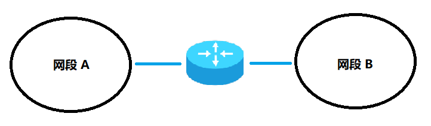

# 计算机网络

## 路由

路由就是实现一个网段到另一个网段之间的通信，路由分为静态路由、动态路由。



[[举例讲解]](https://www.cnblogs.com/ssgeek/p/9220690.html)


```
有四台机器，按照顺序 1，2，3，4 连在一起

Linux1:
	10.0.0.128
	
Linux2:
	10.0.0.129
	192.168.1.129
	
Linux3:
	192.168.1.130
	192.168.2.130

Linux4:
	192.168.2.131

其中 Linux2,3 作为路由器

添加静态路由常用参数：

add 增加路由

del 删除路由

-net 设置到某个网段的路由

-host 设置到某台主机的路由

gw     出口网关 IP地址

dev 出口网关 物理设备名


设置到某个网段的路由:
	route add -net 目标网段 gw 网关(路由器)
	例如：
	从 1 到 3，经过路由 2：route add –net 192.168.1.0/24 gw 10.0.0.129
	从 3 到 1，经过路由 2：route add -net 10.0.0.0/24 gw 10.0.0.129
```

