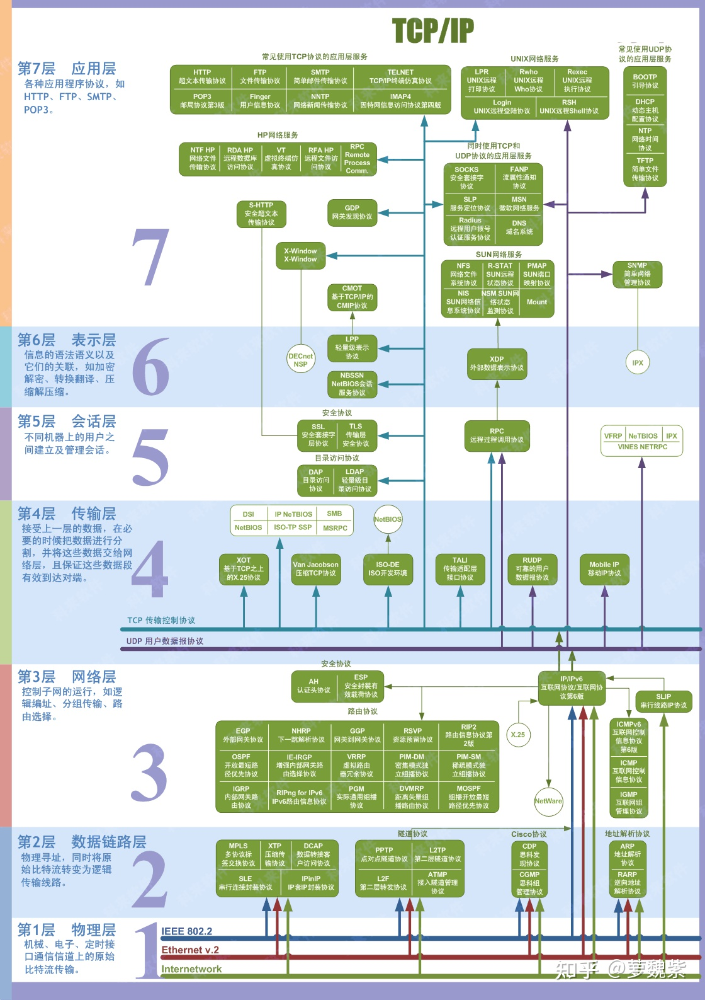

# 计算机网络分层和协议

[TOC]

## 分层传输

计算机网络的分层协议，可以形象的转换成快递不断封装的一个过程。

1. **分批次**
2. **套上第一个信封**，写上寄件单位的部门（源**端口号**），收件单位的部门（目标端口号），批次编号。**传输层**负责该任务，有两个协议：TCP/UDP，UDP 并不能保证对方一定能收到，信封上没写批次编号。有了端口号，就能保证信封到达后，能发送到指定的部门，端口号保证了属于**局域网**内的传输。
3. **套上第二个信封**，写上寄件单位地址（源IP），收件单位地址（目标IP），有了 IP 地址，就能保证快递在广域网上进行流通（由多段快递公司负责传输）。**网络层**负责该任务，该层最重要的协议是 IP 协议。
4. **套上第三个信封**，信封上写的内容，由负责该段运输的快递公司决定，当快递从一个快递公司交接到另一个公司时，拆掉信封，重新换上新的信封。

## 各层协议

DNS()：域名解析协议

DHCP(Dynamic Host Configuration Protocol)：计算机接入网络时的初始化，分配 IP 地址并配置网关

ARP(Address Resolution Protocol)：局域网中的协议，解析目的地的主机 IP 地址得到 MAC 地址

RARP(Reverse Address Resolution Protocol)：MAC 地址解析成 IP 地址，很少用到

ICMP(Internet Control Message Protocol)：检测网络连接状态，ping, traceroute

