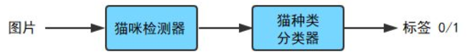

# Machine-Learning

[TOC]

## Books

* [machine-learning-yearning](<https://github.com/deeplearning-ai/machine-learning-yearning-cn>)

## 算法

### latent Dirichlet allocation

[隐含狄利克雷分布](<https://en.wikipedia.org/wiki/Latent_Dirichlet_allocation>)，是一种非监督的文档主题生成模型，其本质上是一个三层的贝叶斯概率图模型。

## Keep Learning

### Pipeline vs End2End (流水线 vs 端到端)

流水线，顾名思义，要经过一条流水线进行处理，数据从输入到输出，要经过多个模块，**工业界**的应用通常是流水线；

端到端，是只有输入输出，没有中间过程。很多神经网络算法，都是端到端的，**学术届**的研究通常是端到端的。

|          | 流水线                                                       | 端到端                               |
| -------- | ------------------------------------------------------------ | ------------------------------------ |
| Demo1    |                           |   |
| 面向群体 | 工业界                                                       | 学术界                               |
| 优缺点   | 需要进行特征工程，适合小数据量的机器学习；将一个复杂的任务拆解成一个个子任务，每一个子任务都相对简单，需要较少的数据量就可以完成。 | 需要大量的标注数据，但是效果往往很好 |