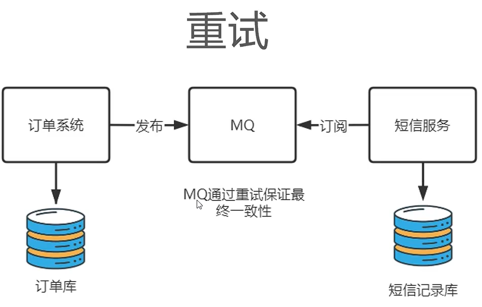
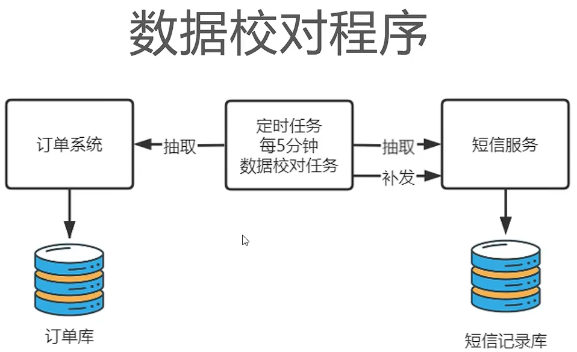
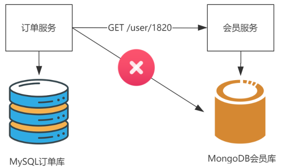
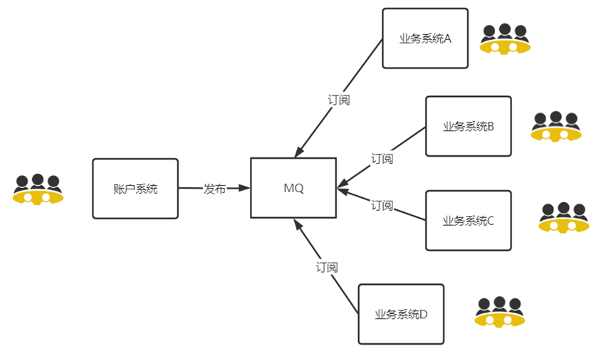

# Architect

[TOC]

## 数据库相关

### 业务相关

* 不要用外键
* 任何表都需要设置 ID 主键
* 所有业务相关的数据，不能直接删除，因为后面不知道啥时候还会用到，可以设置一个删除标志位
* 不要使用 uuid 作为主键，uuid 作为主键的时候，在进行数据插入的时候，对于磁盘 IO 的压力是非常大的

### MySQL 服务器硬件选型

* MySQL 不支持多核同时运算一条 sql
* CPU 选择原则
  * 对于高并发的场景，CPU 的核心数比频率更重要
  * 对于计算密集型场景，CPU 频率比核心数更重要
* 内存选择原则
  * InnoDB 引擎会将索引和数据缓存到内存中，速度很快，理想的选择是服务器内存大于数据总量
* 硬盘选择原则
  * 优先用 SSD 固态硬盘

### 列数据库

应用场景：批量处理、超大规模即时查询（适用于高查询场景，不适合高增删改场景）

列式存储数据库：HBase, Cassandra(卡三桌)

对于传统的行数据库来说，数据是按照行进行**分散存储**的，在读取数据的时候，磁盘要去寻找匹配的行，从而产生多次 IO，而列数据库的数据是**连续存储**的，IO 消耗很小。

| 行数据库存储                                                 | 列数据库存储                                                 |
| ------------------------------------------------------------ | ------------------------------------------------------------ |
|  |  |

Cassandra 官方宣称其速度比 MySQL 快 100 倍。

**列数据库速度快的原因**：

* 不读取无效数据

  

* 数据压缩比大

  数据相关性大，连续存储的数据，类型都是一样的，可以采用一些算法进行压缩

**列式数据库遗留问题**

* 如何高效新增 —> 多个列族，并发写磁盘
* 如何高效更新 —> Cansandra 添加一个新版本号的数据
* 如何高效删除 —> 添加删除标记 keyType=Delete（逻辑删除）

### 模糊查询

MySQL5.7 开始提供 Ngram 全文检索

传统的 like 在进行检索的时候，索引可能会失效，导致全表检索

```sql
create index idx_title on article(title)
# 可能用到索引,看索引选择性
select * from article where title like ‘Java%’
# 一定不会用到索引
select * from article where title like ‘%Java’
select * from article where title like ‘%Java%’
```

替代方法：将数据同步到 Elasticsearch 进行复杂的模糊查询。但是这个方法也会带来更高的成本：

数据一致性如何保证？ElasticSearch高可用架构采用哪种方案？谁来负责维护 ElasticSearch？

MySQL 给出了折中的方法，从 MySQL 5.7.6 开始，MySQL 内置了 ngram 全文解析器，允许对短文本进行全文检索查询，以替代 like 关键字，对于复杂业务场景的全文检索查询，还是要用 ES

在 MySQL 5.7.6 之前，全文索引只支持英文全文索引，不支持中文全文索引，需要利用分词器把中文段落预处理拆分成单词，然后存入数据库。从 **MySQL 5.7.6** 开始，MySQL内置了 ngram 全文解析器，用来**支持中文**、日文、韩文分词。本文使用的MySQL 版本是 **5.7.24**，**InnoDB**数据库引擎。  

### UUID

接口规则：


UUID 接口有五种实现算法，最常用的是基于随机数的 uuid 生成算法：

* 完全随机生成，会存在极小概率重复的情况
* 与外部环境无关，不涉及环境信息
* 生成内容无序无规律
* 目前的主流做法

Java 的支持：


UUID 产生主键的问题：不支持趋势递增，影响索引效率

B+ 数是一颗有序树，如果主键随机，则需要在插入数据的时候，频繁重构索引树，带来严重的效率问题

优化方法，有序的数字主键生成策略：

* 美团 Leaf
* 推特 Snowflake

### 缓存一致性

如何保证缓存中的数据，和数据库中的数据，是一致的？

不要更新缓存，不要更新缓存，不要更新缓存！因为更新了缓存，可能导致和数据库中的数据不一致！

正确的做法：更新数据库，然后删除缓存重新加载！

## 时区问题

* UTC 世界时间

  世界时间比格林威治时间准，使用原子钟。

  UTC+8就是国际时加八小时,是东八区时间,是北京时间。

* GMT 格林威治时间

时间解释：`2018-01-31T14:32:19Z`

T代表后面跟着是时间，Z代表0时区（相差北京时间8小时）

2021-09-27T10:45:15.343Z 表示世界时间，其中 343 是毫秒 1s = 1000ms

## 分布式相关

### raft 选举算法

分布式集群中，通常是有一个主节点的，确定主节点的算法，通常是 raft 算法。

目前流行的组件：Consul，Nacos，Rocket MQ 底层都采用了 Raft 算法来确认集群的主节点。

作用：在分布式集群架构下进行主节点的确认。

### cap 定理

https://www.ruanyifeng.com/blog/2018/07/cap.html

分布式系统的三个指标：CAP 定理。

* C Consistency 一致性

  Every read receives the most recent write or an error. 

  每个分区的数据都是一致的。

* A Availability 可用性

  Every request receives a (non-error) response, without the guarantee that it contains the most recent write. 

  用户可以选择向 G1 或 G2 发起读操作。不管是哪台服务器，只要收到请求，就必须告诉用户，到底是 v0 还是 v1，否则就不满足可用性。

* P Partition tolerance 分区容错性

  The system continues to operate despite an arbitrary number of messages being dropped (or delayed) by the network between nodes. 

  指当网络出现分区的情况（即系统中的一部分节点无法和其他节点进行通信）分离的系统也能够正常运行。

CAP 三个指标不可能同时满足。


Consistency 和 Availability 的矛盾：

如果保证 G2 的一致性，那么 G1 必须在写操作时，锁定 G2 的读操作和写操作。只有数据同步后，才能重新开放读写。锁定期间，G2 不能读写，没有可用性不。如果保证 G2 的可用性，那么势必不能锁定 G2，所以一致性不成立。综上所述，G2 无法同时做到一致性和可用性。系统设计时只能选择一个目标。如果追求一致性，那么无法保证所有节点的可用性；如果追求所有节点的可用性，那就没法做到一致性。

在什么场合，AP 高于 CP？

举例来说，发布一张网页到 CDN，多个服务器有这张网页的副本。后来发现一个错误，需要更新网页，这时只能每个服务器都更新一遍。一般来说，网页的更新不是特别强调一致性。短时期内，一些用户拿到老版本，另一些用户拿到新版本，问题不会特别大。当然，所有人最终都会看到新版本。所以，这个场合就是可用性高于一致性。（很多场合，不求一致性，但求高可用，别宕机）

一个场景，订单创建成功后，发短信告诉用户：


CP 的应用场景：并发小，数据一致性要求高，例如订单，银行转账，表现为订单创建后需要等待短信发送成功，用户体验差

AP 的应用场景：表现为订单创建后，立即返回短信发送成功，无需等待短信是否发送成功，保证用户体验。但是 AP 有很大的问题，例如爆了一件神话装备，但是服务器宕机了，缓存没有写入磁盘，导致装备丢失。

### BASE 最终一致性

AP 缺乏数据一致性的解决方案：BASE，是对 CAP 的补充，让短信尽可能地发送成功

- **Basically available**: reading and writing operations are available as much as possible (using all nodes of a database cluster), but may not be consistent (the write may not persist after conflicts are reconciled, the read may not get the latest write)

  基本可用，就是基本实现用户的基本价值和诉求，创建订单后立即返回，就是基本可用的体现

- **Soft-state**: without consistency guarantees, after some amount of time, we only have some probability of knowing the state, since it may not yet have converged

  软状态，表示业务操作没有最终完成前的中间状态，订单创建后，短信记录未成功发送前就属于软状态，CP 没有软状态。

- **Eventually consistent**: If we execute some writes and then the system functions long enough, we can know the state of the data; any further reads of that data item will return the same value

  最终一致性，表示通过技术手段，**过一段时间后**，让数据保持一致性。最终一致性只是对 AP 打补丁，不能 100% 实现 Consistency。

最终一致性的方案：

* 重试

  

* 数据校对程序

  

* 人工介入

  

## 微服务架构设计经验

https://www.bilibili.com/video/BV1jf4y1c7TZ

软件开发没有银弹！

在著名软件著作《人月神话》中提到，软件世界没有“银弹”，这句话当然适用于架构领域，随这从单体架构过度到微服务架构，因为将原有系统打散，给系统增加了许多不稳定因素。

### 微服务的坑

**服务调用失败问题**

以往单体应用是在单机中进行进程内通信，通信稳定性相当好。但是打散为分布式系统后，变为进程间通信，往往这个过程还伴随着跨设备的网络访问，架构师在设计时必须考虑上下游系统因为网络因素无法通信的情况，要假设网络是不可靠的，并设计微服务在网络异常时也能进行符合预期的异常处理。以支付模块为例，用户支付成功后系统自动调用短信服务向用户手机发送“订单支付成功”的消息，此时架构师就必须假设短信服务在服务或者网络不可用时不会影响到订单业务的正常执行。 

 

**性能问题**

相比传统单体架构进程内通信，跨进程、跨网络的微服务通信在网络传输与消息序列化带来的延迟是不可被忽略的，尤其是在五个以上微服务间消息调用时，因为网络延迟对于实时系统的影响是是很大的。 

**运维成本问题**

运维成本会直线上升，早期单体应用因为结构简单，规模也较小，发版时通常面对几台服务器部署几个Jar/War文件就可以了。同时，应用的交付周期也是以周甚至月为单位，此时硬件设备成本与运维人员技术要求都比较低，采用手动部署即可满足要求。而对于微服务架构而言，每一个服务都是可独立运行、独立部署、独立维护的业务单元，再加上互联网时代用户需求的不断变化以及市场的不稳定因素，运维人员每天面对成百上千台服务器发布几十次已是家常便饭，传统手动部署显然已经无法满足互联网的快速变化。


**组织架构调整问题**

微服务不但是一种架构风格，同样也是一种软件组织模型，以往软件公司会按照职能划分，如：研发、测试、运维部门进行独立管理考核，而在微服务的实施过程中，以业务模块进行划分团队，每一个团队是内聚的，要求可以独立完成从调研到发版的全流程，尽量减少对外界的依赖。如何将传统的职能团队调整为按业务划分组织架构，同样是对管理者的巨大挑战，要知道人的思想比架构更难改变。  


**集成测试问题**

服务间的集成测试变得举步维艰，传统单体架构集成测试是将不同的模块按业务流程进行组合，在进程内验证每一种可能性下其模块间协作是否符合预期即可。但对于微服务而言，系统被拆解为很多独立运行的单元，服务件采用接口进行网络通信。要获取准确的测试结果，必须搭建完整的微服务环境，光这一项工作就有很大的工作量。同时，因为是跨网络通信，网络延迟、超时、带宽、数据量等因素都将影响最终结果，测试结果易产生偏差。  

### 微服务最佳实践

**微服务的划分原则**  

* 单一职责原则

  每一个微服务只做好一件事，体现出“高内聚、低耦合”，尽量减少对外界环境的依赖。比如，在公司创业之初，完全可将订单与仓储服务进行合并。因为订单与仓储在业务与数据紧密相关，如果强行拆分会导致出现跨进程通信带来的数据一致性难题。随着业务的发展，仓储的业务职责扩展，派生出许多与订单无紧密联系的功能，到时再将其剥离形成独立的“仓储服务”也不晚。

* 服务依赖原则

  避免服务间的循环引用，在设计时就要对服务进行分级，例如区分核心服务与非核心服务。例如订单服务与短信服务，显然短信服务是非核心服务，服务间调用要遵循“核心服务”到“非核心服务”，不允许出现反向调用。同时，对于核心服务要做好保护，避免非核心服务出现问题影响核心服务的正常运行。

* Two Pizza原则

  就是说让团队保持在两个比萨能让队员吃饱的小规模的概念。团队要小到让每个成员都能做出显著的贡献，并且相互依赖，有共同目标，以及统一的成功标准。一个微服务团队应涵盖从需求到发布运维的完整生命周期，使团队内部便可以解决大部分任务，从人数上4~6人是比较理想的规模。  

服务的拆与合是伴随着公司业务的演进而变化的，一切以解决问题为准。

**微服务确保独立的数据存储  **

数据是任何系统最重要的资产。以往单体应用通常会选择MySQL这种关系型数据库作为数据的统一存储，这样做的好处是涉及多表操作
时，利用数据库自带的事务机制便可最大程度保证数据完整性。但这样做却存在诸多问题，以下图为例，不同的微服务对数据存储的需求也是不同的，订单服务需要MySQL数据保存订单与订单明细；新闻服务需要Elasticsearch提供全文检索支持；朋友圈需要图数据库表达现实世界人际关系；文件存储服务则需要分布式文件系统。如果将所有数据都揉在MySQL中使用会变得十分蹩脚，好的做法是为每一个微服务提供符合自身业务特性的数据库。  

在微服务架构下，因为数据库绝不允许其他团队访问，关联查询只能变为API调用形式，程序实现层面比单库复杂不少。



**服务间通信优先采用聚合器模式  **

在微服务间通信时存在两种消息传递模式“链式模式”与“聚合器模式”。下图是所示，按业务流程请求在各个服务间流转，最终
处理完成返回客户端。  


因为请求是按业务流程传递，很容易能被开发人员理解，因此链式模式称为了最常用的服务间通信模式。但链式模式采用串联模式，调用整个成功率等于服务调用成功率的乘积，假设每个服务可靠性为90%，一个业务代码在4个服务执行后的最终成功率只有`90%*90%*90%*90%≈66%`，有将近一半的请求会处理失败，这是无法接受的。此外，链式模式因默认采用同步方式传输，在服务处理完成前请求会一直处于阻塞状态，当调用链较长时，系统整体性能会严重下滑。

聚合器模式则是通过服务作为入口，组装其他服务的调用，因为“订单流程服务”是将其他服务进行聚合操作，所以称其为聚合器模式。以“订单流程服务”为例，将“订单”、“支付”、“库存”服务进行聚合，一个服务实现从下单、支付、减库存的完整流程。

### 适合上马微服务的场景

* 新规划的大型业务系统

  这肯定是最适合引入微服务架构的情况了， 微服务强调"高内聚，低耦合"，每一个团队负责一个服务，这就意味着从根上和传统的整体性应用有本质不同。从规划阶段采用微服务架构是再好不过的。

* 敏捷的小团队系统

  在公司在大型项目微服务实践前，往往这类边缘化的小项目会起到"试验田"的作用， 引入快速迭代、持续交付等开发模式，积累适合本公司特点的微服务实践经验，在将这些经验扩大到其他大型项目中。

* 历史的大型留存业务系统

  之前多年我一直在金融软件领域工作，在银行内部许多系统已经使用超过10年时间，长百上千个模块错综复杂维护愈发苦难，无论架构、框架乃至技术人员都需要更新迭代，但都不可能一次大动手术，这是微服务的"微"就体现出来，重构时可以将某一个部分剥离为微服务独立运行，确保无误后再继续剥离出下一个服务，通过抽丝剥茧一般的剥离，逐步将原有大系统剥离为若干子服务，虽然过程十分痛苦，但这是必须做的事情。

  

## 真实案例

### push -> pull -> 数据订阅

| 架构图                                                       | 特点                                                         |
| ------------------------------------------------------------ | ------------------------------------------------------------ |
|  | 子系统共用一个账户系统，并且每个子系统都有一个本地库         |
|  | 账户系统修改用户名后，要根据每个子系统提供的接口，推送给每一个子系统。账户系统和子系统耦合非常严重，每增加一个子系统，账户系统都要修改一次代码 |
|  | 改成子系统从账户系统定时 pull 的模式，降低耦合，但是仍然存在账户系统修改接口的风险 |
|  | 将可变因素同步接口进行解耦，引入消息队列，直接订阅数据，不对接口产生依赖 |

