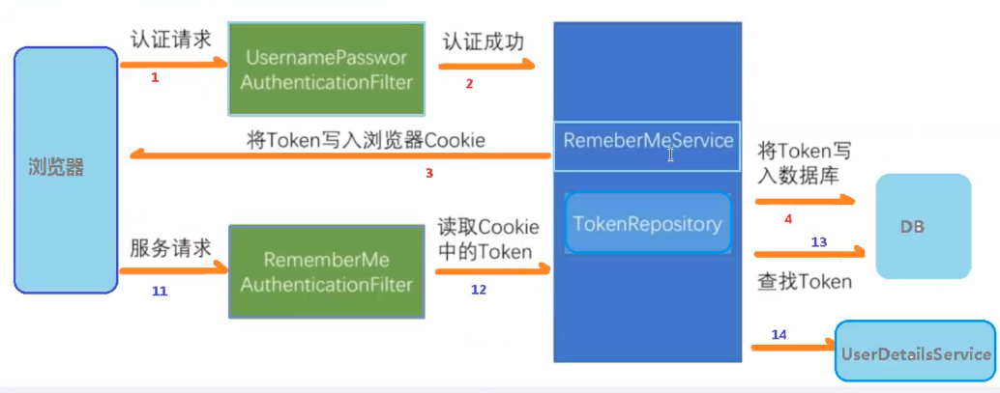

# Authentication and Authorization

认证和授权。

[TOC]

## Authentication

https://zhuanlan.zhihu.com/p/342744060

## Authorization

授权

https://zhuanlan.zhihu.com/p/342746910

## spring security

微服务认证授权过程：

## 网络安全

### 跨域

跨域是浏览器端的限制！

跨域是浏览器的一个特性，就是浏览器从一个 “域” 向另一个 “域” 的服务器发出请求，来访问另一个“域”上的资源。但是，由于请求的文件可能会存在恶意攻击，浏览器并不允许直接访问另一个“域”上的资源，只能访问同一个“域”上的资源(sentiweibo 的前端，Ajax 请求只能访问 sentiweibo 的后端)，这个就是“同源策略”。而所谓的“同源”，指的是“协议、域名、端口号”一致。

**同源请求总是被允许的，跨源请求则取决于服务端。**

### csrf

Cross site request forgery 跨网站请求伪造

简单地说，是攻击者通过一些技术手段欺骗用户的浏览器去访问一个自己曾经认证过的网站并运行一些操作（如发邮件，发消息，甚至财产操作如转账和购买商品）由于浏览器曾经认证过，所以被访问的网站会认为是真正的用户操作而去运行。这利用了web中用户身份验证的一个漏洞：简单的身份验证只能保证请求发自某个用户的浏览器，却不能保证请求本身是用户自愿发出的。

[Cookie 的 SameSite 属性](https://www.ruanyifeng.com/blog/2019/09/cookie-samesite.html)

### cors

Cross-Origin Resource Sharing 跨域资源共享

[跨域资源共享 CORS 详解](http://www.ruanyifeng.com/blog/2016/04/cors.html)

CORS 用于实现跨域的资源请求。CORS是一个W3C标准，全称是"跨域资源共享"（Cross-origin resource sharing）。

跨域条件：需要浏览器和服务器同时支持。目前所有浏览器都支持 cors。对于服务端，以 springboot 举例，需要在接口上开启跨域访问 `@CrossOrigin`

通过 `href` `src` 请求得到的资源，是不存在跨域问题的，只有 ajax 请求会存在跨域问题。 

CORS是跨源资源分享（Cross-Origin Resource Sharing）的缩写。它是W3C标准，是跨源 AJAX 请求的根本解决方法。它允许浏览器向跨源服务器，发出XMLHttpRequest 请求，从而克服了 Ajax 只能同源使用的限制。（Ajax 请求一定会受到跨域限制的，但是XMLHttpRequest 可以发起跨域请求）

整个CORS通信过程，都是浏览器自动完成，不需要用户参与。对于开发者来说，CORS通信与同源的AJAX通信没有差别，代码完全一样。浏览器一旦发现 AJAX 请求跨源，就会自动添加一些附加的头信息，有时还会多出一次附加的请求，但用户不会有感觉。因此，**实现CORS通信的关键是服务器**。只要服务器实现了CORS接口，就可以跨源通信。

### 浏览器同源政策

[浏览器同源政策及其规避方法](https://www.ruanyifeng.com/blog/2016/04/same-origin-policy.html)

A网页设置的 Cookie，B网页不能打开，除非这两个网页"同源"。所谓"同源"指的是"三个相同":

- 协议相同
- 域名相同
- 端口相同

举例来说，`http://www.example.com/dir/page.html`这个网址，协议是`http://`，域名是`www.example.com`，端口是`80`（默认端口可以省略）。它的同源情况如下。

- `http://www.example.com/dir2/other.html`：同源
- `http://example.com/dir/other.html`：不同源（域名不同）
- `http://v2.www.example.com/dir/other.html`：不同源（域名不同）
- `http://www.example.com:81/dir/other.html`：不同源（端口不同）

同源政策的目的，是为了保证用户信息的安全，防止恶意的网站窃取数据。

设想这样一种情况：A网站是一家银行，用户登录以后，又去浏览其他网站。如果其他网站可以读取A网站的 Cookie，会发生什么？

很显然，如果 Cookie 包含隐私（比如存款总额），这些信息就会泄漏。更可怕的是，Cookie 往往用来保存用户的登录状态，如果用户没有退出登录，其他网站就可以冒充用户，为所欲为。因为浏览器同时还规定，提交表单不受同源政策的限制。

由此可见，"同源政策"是必需的，否则 Cookie 可以共享，互联网就毫无安全可言了。

随着互联网的发展，"同源政策"越来越严格。目前，如果非同源，共有三种行为受到限制。

（1） Cookie、LocalStorage 和 IndexDB 无法读取。

（2） DOM 无法获得。

（3） AJAX 请求不能发送。

同源政策规定，AJAX请求只能发给同源的网址（也就是说 ajax 只能访问本地的服务端），否则就报错。

除了架设服务器代理（**浏览器请求同源服务器，再由后者请求外部服务**），有三种方法规避这个限制。

- JSONP 
- WebSocket
- CORS

