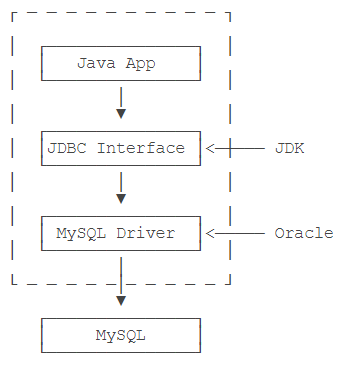

# Java Database

[TOC]


## JDBC

java database connector

JDBC 是 Java jdk 自带的标准库。



### maven 配置

JDBC 驱动就是各种数据库实现的 jar 包，只需要在 maven 中添加一个依赖即可。

```xml
<dependency>
    <groupId>mysql</groupId>
    <artifactId>mysql-connector-java</artifactId>
    <version>5.1.47</version>
    <scope>runtime</scope>
</dependency>
```

注意到这里添加依赖的`scope`是`runtime`，因为编译Java程序并不需要MySQL的这个jar包，只有在运行期才需要使用。如果把`runtime`改成`compile`，虽然也能正常编译，但是在IDE里写程序的时候，会多出来一大堆类似`com.mysql.jdbc.Connection`这样的类，非常容易与Java标准库的JDBC接口混淆，所以坚决不要设置为`compile`。

### jdbc url

| db    | url                                                          | demo                                                         |
| ----- | ------------------------------------------------------------ | ------------------------------------------------------------ |
| mysql | `jdbc:mysql://<hostname>:<port>/<db>?key1=value1&key2=value2` | `jdbc:mysql://localhost:3306/learnjdbc?useSSL=false&characterEncoding=utf8` |
|       |                                                              |                                                              |
|       |                                                              |                                                              |

### Demo

```java
// JDBC连接的URL, 不同数据库有不同的格式:
String JDBC_URL = "jdbc:mysql://localhost:3306/test";
String JDBC_USER = "root";
String JDBC_PASSWORD = "password";
try (Connection conn = DriverManager.getConnection(JDBC_URL, JDBC_USER, JDBC_PASSWORD)) {
    try (Statement stmt = conn.createStatement()) {
        try (ResultSet rs = stmt.executeQuery("SELECT id, grade, name, gender FROM students WHERE gender=1")) {
            while (rs.next()) {
                long id = rs.getLong(1); // 注意：索引从1开始
                long grade = rs.getLong(2);
                String name = rs.getString(3);
                int gender = rs.getInt(4);
            }
        }
    }
}
```

核心代码是`DriverManager`提供的静态方法`getConnection()`。`DriverManager`会自动扫描classpath，找到所有的JDBC驱动，然后根据我们传入的URL自动挑选一个合适的驱动。

`Statment`和`ResultSet`都是需要关闭的资源，因此嵌套使用`try (resource)`确保及时关闭；

为了避免 SQL 注入，用 `PreparedStatement` 替代 `Statement`。`PreparedStatement`  用 `?` 作为占位符。

```java
try (Connection conn = DriverManager.getConnection(JDBC_URL, JDBC_USER, JDBC_PASSWORD)) {
    try (PreparedStatement ps = conn.prepareStatement("SELECT id, grade, name, gender FROM students WHERE gender=? AND grade=?")) {
        ps.setObject(1, "M"); // 注意：索引从1开始 设置 gender 为 M
        ps.setObject(2, 3); // 设置 grade 为 3
        try (ResultSet rs = ps.executeQuery()) {
            while (rs.next()) {
                long id = rs.getLong("id");
                long grade = rs.getLong("grade");
                String name = rs.getString("name");
                String gender = rs.getString("gender");
            }
        }
    }
}
```

### jdbc 增删改

```java
try (Connection conn = DriverManager.getConnection(JDBC_URL, JDBC_USER, JDBC_PASSWORD)) {
    try (PreparedStatement ps = conn.prepareStatement(
            "INSERT INTO students (id, grade, name, gender) VALUES (?,?,?,?)")) {
        ps.setObject(1, 999); // 注意：索引从1开始
        ps.setObject(2, 1); // grade
        ps.setObject(3, "Bob"); // name
        ps.setObject(4, "M"); // gender
        int n = ps.executeUpdate(); // 1 注意是 executeUpdate，不是 executeQuery
    }
}
```

注意，`?` 只适用于 value，不适用于字段和表名，下面这个 sql 构造就是有问题的：

```java
// error case
String sql = "INSERT IGNORE INTO ? (\n" +
                "  ?, ?, ?, ? \n" +
                ") \n" +
                "VALUES \n" +
                "  (?, ?, ?, ?)\n";
```

### jdbc 连接池

#### Hikaricp

HikariCP 是 Spring Boot 默认支持的数据库连接池。

JDBC连接池有一个标准的接口`javax.sql.DataSource`，注意这个类位于Java标准库中，但仅仅是接口。要使用JDBC连接池，我们必须选择一个JDBC连接池的实现。目前使用最广泛的是 HikariCP(黑卡瑞 cp)。我们以 HikariCP 为例，要使用JDBC连接池，先添加HikariCP的依赖如下：

```xml
<dependency>
    <groupId>com.zaxxer</groupId>
    <artifactId>HikariCP</artifactId>
    <version>2.7.1</version>
</dependency>
```

`DataSource` 就是数据库连接池：

```java
HikariConfig config = new HikariConfig();
config.setJdbcUrl("jdbc:mysql://localhost:3306/test");
config.setUsername("root");
config.setPassword("password");
config.addDataSourceProperty("connectionTimeout", "1000"); // 连接超时：1秒
config.addDataSourceProperty("idleTimeout", "60000"); // 空闲超时：60秒
config.addDataSourceProperty("maximumPoolSize", "10"); // 最大连接数：10
DataSource ds = new HikariDataSource(config);
```

注意创建`DataSource`也是一个非常昂贵的操作，所以通常 `DataSource` 实例总是作为一个全局变量存储，并贯穿整个应用程序的生命周期。

```java
try (Connection conn = ds.getConnection()) { // 在此获取连接
    ...
} // 在此“关闭”连接
```

通过连接池获取连接时，并不需要指定JDBC的相关URL、用户名、口令等信息，因为这些信息已经存储在连接池内部了（创建`HikariDataSource`时传入的`HikariConfig`持有这些信息）。一开始，连接池内部并没有连接，所以，第一次调用`ds.getConnection()`，会迫使连接池内部先创建一个`Connection`，再返回给客户端使用。当我们调用`conn.close()`方法时（`在try(resource){...}`结束处），不是真正“关闭”连接，而是释放到连接池中，以便下次获取连接时能直接返回。

因此，连接池内部维护了若干个`Connection`实例，如果调用`ds.getConnection()`，就选择一个空闲连接，并标记它为“正在使用”然后返回，如果对`Connection`调用`close()`，那么就把连接再次标记为“空闲”从而等待下次调用。这样一来，我们就通过连接池维护了少量连接，但可以频繁地执行大量的SQL语句。

在需要读写数据库的方法内部，按如下步骤访问数据库：

- 从全局`DataSource`实例获取`Connection`实例；
- 通过`Connection`实例创建`PreparedStatement`实例；
- 执行SQL语句，如果是查询，则通过`ResultSet`读取结果集，如果是修改，则获得`int`结果。

#### Druid

阿里开源的数据库连接池。

## javax.persistence

Java Persistence is the API for the management for persistence and object/relational mapping.

用于持久化层和 ORM。提供了大量的注解和枚举类。

## JPA

Java Persistence API 是 Sun 官方提出的 Java 持久化规范。

注意，JPA是一套规范，不是一套产品，那么像Hibernate,TopLink,JDO他们是一套产品，如果说这些产品实现了这个JPA规范，那么我们就可以叫他们为JPA的实现产品。

Spring Data JPA 是 Spring 基于 ORM 框架、JPA 规范的基础上封装的一套JPA应用框架，可使开发者用极简的代码即可实现对数据的访问和操作。它提供了包括增删改查等在内的常用功能，且易于扩展！学习并使用 Spring Data JPA 可以极大提高开发效率！

JPA 更像 Django ORM，统一了 Java ORM 的规范。

reference

* https://www.liaoxuefeng.com/wiki/1252599548343744/1282383789686817
* https://docs.spring.io/spring-data/jpa/docs/2.5.0/reference/html/#jpa.repositories
* Spring Boot系列(五)：spring data jpa的使用 - 极乐君的文章 - 知乎 https://zhuanlan.zhihu.com/p/25000309
* https://www.baeldung.com/spring-data-save-saveall

## Hibernate

dialect

MySQL 是一种方言，Oracle 也是一种方言，MSSQL 也是一种方言，他们之间在遵循 SQL 规范的前提下，都有各自的扩展特性。

拿分页来说，MySQL 的分页是用关键字 `limit`， 而 Oracle 用的是 `ROWNUM`，MSSQL 可能又是另一种分页方式。

```sql
# mysql
select * from t_user limit 10;
# oracle
select * from t_user t where ROWNUM <10;
```

这对于 ORM 框架来说，为了在上层的ORM层做了无差别调用，比如分页，对使用者来说，不管你底层用的是MySQL还是Oracle，他们用的都是一样的接口，但是底层需要根据你使用的数据库方言不同而调用不同的DBAPI。用户只需要在初始化的时候指定用哪种方言就好，其它的事情ORM框架帮你完成了。

```yaml
spring:
  jpa:
    database: oracle
    show-sql: true
    hibernate:
      naming:
        # 表名及字段全小写下划线分隔命名策略(默认),表名具备前缀res
        physical-strategy: com.nrec.base.res.config.CustomNamingStrategyConfig
    properties:
      hibernate:
        hbm2ddl:
          # 自动更新维护表结构
          auto: update
        dialect: com.nrec.base.res.config.MyOracle12cDialect
    open-in-view: false
  datasource:
    # ORACLE JDBC 配置
    url: jdbc:oracle:thin:@ip:1521:ora12a
    username: ttest
    password: ttest
    driver-class-name: oracle.jdbc.OracleDriver
```


## JPA / Hibernate / MyBatis 比较

最常见的两种持久化层框架：**JPA**和**MyBatis**

| JDBC       | Hibernate      | JPA                  | **MyBatis**       | 解释         |
| :--------- | :------------- | :------------------- | ----------------- | ------------ |
| DataSource | SessionFactory | EntityManagerFactory | SqlSessionFactory | 数据库连接池 |
| Connection | Session        | EntityManager        | SqlSession        | 一个连接     |

mybatis与spring data jpa的功能区别

1. spring data jpa实现了jpa（java persistence api）功能，即可以实现pojo转换为关系型数据库记录的功能，通俗来讲就是可以不写任何的建表sql语句了。jpa是spring data jpa功能的一个子集。
   而mybatis并没有 jpa 功能，建表语句还是要自己写的。
2. spring data jpa是**全自动框架**，不需要写任何sql。而mybatis是**半自动框架**，需要自己写sql，mybatis-plus为mybatis赋能，使其也可以基本上不需要写任何模板sql。
   以上两点应该是二者功能上的最大的区别
3. debug模式下看生成的sql，mybatis下的sql可读性很好，而spring data jpa下的查询sql可读性并不好
4. ……


## NoSQL

### Redis

Redis 有两个 Java 客户端：Jedis 和 Lettuce

