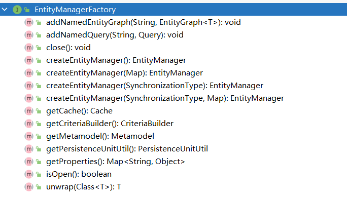

# JPA

[TOC]

## reference

* [Jakarta Persistence 3.0 Specification Document](https://jakarta.ee/specifications/persistence/3.0/jakarta-persistence-spec-3.0.html) 
* [Jakarta Persistence 3.0 Javadoc](https://jakarta.ee/specifications/persistence/3.0/apidocs)
* [Spring Data JPA - Reference Documentation](https://docs.spring.io/spring-data/jpa/docs/2.5.0/reference/html/#preface)
* [Java Persistence API - Oracle Software Downloads](http://download.oracle.com/otn-pub/jcp/persistence-2_1-fr-eval-spec/JavaPersistence.pdf)
* [Advanced Spring Data JPA - Specifications and Querydsl](https://spring.io/blog/2011/04/26/advanced-spring-data-jpa-specifications-and-querydsl)
* [JPA Criteria Queries](https://www.baeldung.com/hibernate-criteria-queries)
* [Using the Criteria API and Metamodel API to Create Basic Typesafe Queries](https://docs.oracle.com/javaee/6/tutorial/doc/gjivm.html)
* [@JoinColumn Annotation Explained](https://www.baeldung.com/jpa-join-column)
* [廖雪峰 jpa 介绍](https://www.liaoxuefeng.com/wiki/1252599548343744/1282383789686817)

## Intro

Java Persistence API 是 Sun 官方提出的 Java 持久化规范。

JPA 和 Hibernate 的关系：JPA 是规范（类似于 JDBC），Hibernate 是 JPA 的实现


## annotations

| Annotation                     | Desc                                     |        |
| ------------------------------ | ---------------------------------------- | ------ |
| `@Entity`                      | 表示该类为实体类，将映射到指定的数据库表 |        |
| `@Table(name="table_name")`    | 指定该类映射表的表名                     |        |
| `@Id`                          | 映射主键                                 |        |
| `@GeneratedValue(strategy="")` | 主键生成策略                             |        |
| `@Basic`                       | 字段的默认注解，如果没有，会自动添加     |        |
| `@Column`                      | 指定字段详细属性                         |        |
| `@Transient`                   | 表示不作映射，可以作用于成员变量和方法   | 暂时的 |
| `@Temporal`                    | 指定时间格式                             | 时间的 |

### @GeneratedValue

几个 strategy：

* IDENTITY：ID 自增长，MySQL，Oracle 不支持
* AUTO：啥也不填，JPA 自动选择合适的策略，默认选项
* SEQUENCE：通过序列产生主键，MySQL 不支持
* TABLE：通过表产生主键

### @Basic

```java
@Basic(fetch = FetchType.EAGER, optional = true)
private String email;
```

如果一个属性没有加任何注解，那么就会默认加上 basic 注解。

两个参数：

* fetch: 属性读取策略，EAGER vs LAZY ，饿汉式和懒汉式，默认是 EAGER
* optional：属性是否允许为 null，默认式 null

### @Column

几个参数：

* name: 指定列名
* length：指定长度
* nullable：是否允许为 null
* unique：是否 unique
* columnDefinition：表示该属性在数据库中的实际类型，JPA 无法判断 Date 要转成数据库的 Date，Time 还是 TIMESTAMP

String 类型默认映射成 varchar，如果要映射成特定数据库的 BLOB 或 TEXT，则需要指定 columnDefinition

### @Temporal

```
@Temporal(value=)
```

接受一个枚举类型，可选值有三个：

* DATE 年月日
* TIME 年月日 时分秒
* TIMESTAMP 兼容前两个

## jpa-api

Java EE 已经归 Jakarta 组织维护，所以 jakarta 完全兼容 JavaEE，Jakarta Persistence API 就是 JPA。

### Persistence


Persistence 的主要作用就是用来创建 EntityManagerFactory 的。

```java
String persistenceUnitName = "default";
Map<String, Object> properties = new HashMap<>();
properties.put("hibernate.format_sql", true);
EntityManagerFactory entityManagerFactory = Persistence.createEntityManagerFactory(persistenceUnitName, properties);
```

### EntityManagerFactory

jpa 连接池，也是一个接口。主要作用还是创建数据库连接。



```java
EntityManager entityManager = entityManagerFactory.createEntityManager();
// 重载的方法：map 用于提供 entityManager 的属性
EntityManager entityManager = entityManagerFactory.createEntityManager(map);
```

`close()` 后，`isOpen()` 方法测试回返回 false，其他方法不能调用，否则回导致 IllegalStateException 异常。

### EntityManager 

接口。

**临时对象**：new 出来的无 id 的对象

**游离对象**：new 出来的有 id 的对象

**懒加载**：多次查询，对于不常用的级联数据不取出，等到要用的时候再取出。懒加载都设置了代理类。

**Eager加载**：一次 join 查询获取所有值

增 persist 删 remove 查 find/getReference 

#### find / getReference / persist / remove / merge


```java
package top.wansho.jpa;

import org.junit.jupiter.api.AfterEach;
import org.junit.jupiter.api.BeforeEach;
import org.junit.jupiter.api.Test;
import top.wansho.jpa.helloworld.Customer;

import javax.persistence.EntityManager;
import javax.persistence.EntityManagerFactory;
import javax.persistence.EntityTransaction;
import javax.persistence.Persistence;

import static org.junit.jupiter.api.Assertions.*;

public class EntityManagerTest {

    private EntityManagerFactory entityManagerFactory;
    private EntityManager entityManager;
    private EntityTransaction entityTransaction;

    @BeforeEach
    public void init(){
        entityManagerFactory = Persistence.createEntityManagerFactory("default");
        entityManager = entityManagerFactory.createEntityManager();
        entityTransaction = entityManager.getTransaction();
        // 开启事务
        entityTransaction.begin();
    }

    @AfterEach
    public void destroy(){
        // 提交事务
        entityTransaction.rollback();
        System.out.println("entityTransaction is active? " + entityTransaction.isActive()); // true
//        entityTransaction.commit();
        System.out.println("entityTransaction is active? " + entityTransaction.isActive()); // false
        entityManager.close();
        entityManagerFactory.close();
    }

    @Test
    public void testFind(){
        // 类似于 Hibernate 中的 get 方法，获取 id 为 1 的记录
        Customer customer = entityManager.find(Customer.class, 1);
        System.out.println("-------------------------");
        System.out.println(customer);
        // 先打印查询语句，再打印 --，饿汉式
    }

    @Test
    public void testGetReference(){
        // 类似于 Hibernate 中的 load 方法
        Customer customer = entityManager.getReference(Customer.class, 1); // 只获取引用
        System.out.println(customer.getClass().getName()); // top.wansho.jpa.helloworld.Customer$HibernateProxy$GLVOzPIc
        System.out.println("-------------------------");
        System.out.println(customer);
        // 先打印 --，再打印查询语句，懒加载，懒汉式，customer 是一个代理对象
    }

    @Test
    public void testPersist(){
        // 类似于 Hibernate 的 save 方法，使对象由临时状态变为持久化状态
        // 和 Hibernate 的 save 方法有些许不同，如果对象有 id，则不能执行 insert 操作，而会抛出异常
        Customer customer = new Customer();
        customer.setAge(13);
        customer.setEmail("wansho@163.com");
        customer.setLastName("www");
        entityManager.persist(customer);
        System.out.println(customer.getId()); // 有 id 了
    }

    @Test
    public void testRemove(){
        // 类似于 Hibernate 的 delete 对象，把对象对应的记录从数据库中移除
        // 注意：该方法只能移除持久化对象，而 hibernate 的 delete 方法实际上还可以移除游离对象
//        Customer customer = new Customer();
//        customer.setId(1); // 还是因为代理类的原因，不能删除游离对象
        Customer customer = entityManager.find(Customer.class, 1);
        entityManager.remove(customer);
    }

    @Test
    public void testMerge1(){
        // 1. 测试临时对象
        // 如果传入一个临时对象（没有 id），会创建一个新的对象，把临时对象的属性复制到新的对象中，然后对新的对象执行持久化操作
        // 所以新的对象会有 id，而临时对象没有 id
        Customer customer = new Customer();
        customer.setEmail("hehe@gmail.com");
        customer.setAge(18);
        customer.setLastName("ww");

        Customer customer2 = entityManager.merge(customer);
        System.out.println(customer.getId()); // null
        System.out.println(customer2.getId()); // 有 id
    }

    @Test
    public void testMerge2(){
        // 2. 测试游离对象
        // 2.1 在 EntityManager 缓存中没有该对象
        // 2.2 在数据库中也没有对应的记录
        // 2.3 JPA 会创建一个新的对象，然后把当前游离对象的属性复制到新创建的对象中
        // 2.4 对新创建的对象执行 insert 操作
        Customer customer = new Customer();
        customer.setEmail("hehe@gmail.com");
        customer.setAge(18);
        customer.setLastName("ww");
        customer.setId(20);

        Customer customer2 = entityManager.merge(customer);
        System.out.println(customer.getId());  // 20
        System.out.println(customer2.getId()); // 6，新对象 的 id 自增，和写入的 id 不一样
    }

    @Test
    public void testMerge3(){
        // 3. 测试游离对象
        // 3.1 在 EntityManager 缓存中没有该对象
        // 3.2 在数据库中有对应的记录
        // 3.3 JPA 会查询对应的记录，然后返回该记录对应的对象，然后再把游离对象的属性复制到查询到的对象中
        // 3.4 对查询到的对象进行 update
        Customer customer = new Customer();
        customer.setEmail("ww@gmail.com");
        customer.setAge(18);
        customer.setLastName("ww");
        customer.setId(6);

        Customer customer2 = entityManager.merge(customer);
        System.out.println(customer2 == customer); // false
        System.out.println(customer.getId());  // 6
        System.out.println(customer2.getId()); // 6，新对象 的 id 自增，和写入的 id 不一样
    }

    @Test
    public void testMerge4(){
        // 4. 测试游离对象
        // 4.1 在 EntityManager 缓存有该对象
        // 4.2 JPA 会把游离对象的属性直接复制给缓存中的对象
        // 4.3 对缓存中的对象执行 update
        Customer customer = new Customer();
        customer.setEmail("ww@gmail.com");
        customer.setAge(18);
        customer.setLastName("ww");
        customer.setId(6);

        Customer customer2 = entityManager.find(Customer.class, 6);
        entityManager.merge(customer);
        System.out.println(customer2 == customer);
    }

    @Test
    public void testFlush(){
        // 同 Hibernate 中 session 的 flush 方法，强制写入数据库
        Customer customer = entityManager.find(Customer.class, 1);
        customer.setLastName("dd");
        entityManager.flush();
    }

    @Test
    public void testRefresh(){
        // 从数据库中读最新的数据，强制刷新
        Customer customer = entityManager.find(Customer.class, 2); // select 1
        customer = entityManager.find(Customer.class, 2); // jpa 有一级缓存，这条语句没有去数据库中查询
        entityManager.refresh(customer); // select 2
        // 一共执行了两条查询语句
    }

}
```

#### flush / setFlushMode / getFlushMode

强制将内存中的数据写入数据库，进行持久化。

#### refresh

强制刷新。将数据库中的持久化对象的值同步到实体对象上，即更新实例的属性值。

#### clear

Clear the persistence context, causing all managed entities to become detached.

清除持久上下文环境，断开所有关联的实体。

#### isOpen / getTransaction / close

#### createQuery 

类似的接口都是用来做 jpql 查询的。

### EntityTransaction

```java
@BeforeEach
    public void init(){
        entityManagerFactory = Persistence.createEntityManagerFactory("default");
        entityManager = entityManagerFactory.createEntityManager();
        entityTransaction = entityManager.getTransaction();
        // 开启事务
        entityTransaction.begin();
    }

    @AfterEach
    public void destroy(){
        
        entityTransaction.rollback();  // 回滚事务
//        entityTransaction.commit(); // 提交事务
        System.out.println("entityTransaction is active? " + entityTransaction.isActive()); // false
        entityManager.close();
        entityManagerFactory.close();
    }
```

事务，要么提交，要么回滚，不能同时存在。提交或回滚后，事务就 isNotActive 了。

## springdata-repositories


The central interface in the Spring Data repository abstraction is `Repository`. It takes the domain class to manage as well as the ID type of the domain class as type arguments. This interface acts primarily as a marker interface to capture the types to work with and to help you to discover interfaces that extend this one. The [`CrudRepository`](https://docs.spring.io/spring-data/commons/docs/current/api/org/springframework/data/repository/CrudRepository.html) interface provides sophisticated CRUD functionality for the entity class that is being managed.

### CrudRepository

```java
public interface CrudRepository<T, ID> extends Repository<T, ID> {

  <S extends T> S save(S entity);      // Saves the given entity.

  Optional<T> findById(ID primaryKey); // 

  Iterable<T> findAll();               

  long count();                        

  void delete(T entity);               

  boolean existsById(ID primaryKey);   

  // … more functionality omitted.
}
```

### PagingAndSortingRepository

支持分页。

```java
public interface PagingAndSortingRepository<T, ID> extends CrudRepository<T, ID> {

  Iterable<T> findAll(Sort sort);

  Page<T> findAll(Pageable pageable);
}

PagingAndSortingRepository<User, Long> repository = // … get access to a bean
Page<User> users = repository.findAll(PageRequest.of(1, 20));
```


### JpaRepository

继承自 PagingAndSortingRepository 接口，支持分页。

```java
public interface JpaRepository<T, ID> extends PagingAndSortingRepository<T, ID>, QueryByExampleExecutor<T> {
    List<T> findAll();

    List<T> findAll(Sort var1);

    List<T> findAllById(Iterable<ID> var1);

    <S extends T> List<S> saveAll(Iterable<S> var1);

    void flush();

    <S extends T> S saveAndFlush(S var1);

    void deleteInBatch(Iterable<T> var1);

    void deleteAllInBatch();

    T getOne(ID var1);

    <S extends T> List<S> findAll(Example<S> var1);

    <S extends T> List<S> findAll(Example<S> var1, Sort var2);
}
```

### Query Methods

创建 Query Methods 的四个步骤：

1. Declare an interface extending Repository or one of its subinterfaces and type it to the domain class and ID type that it should handle, as shown in the following example:

   ```java
   interface PersonRepository extends Repository<Person, Long> { … }
   ```

2. Declare query methods on the interface.

   ```java
   interface PersonRepository extends Repository<Person, Long> {
     List<Person> findByLastname(String lastname);
   }
   ```

3. Set up Spring to create proxy instances for those interfaces, either with [JavaConfig](https://docs.spring.io/spring-data/jpa/docs/2.5.0/reference/html/#repositories.create-instances.java-config) or with [XML configuration](https://docs.spring.io/spring-data/jpa/docs/2.5.0/reference/html/#repositories.create-instances).

   ```java
   import org.springframework.data.jpa.repository.config.EnableJpaRepositories;
   
   @EnableJpaRepositories
   class Config { … }
   ```

4. Inject the repository instance and use it, as shown in the following example:

   ```java
   class SomeClient {
   
     private final PersonRepository repository;
   
     SomeClient(PersonRepository repository) {
       this.repository = repository;
     }
   
     void doSomething() {
       List<Person> persons = repository.findByLastname("Matthews");
     }
   }
   ```

### Defining Repository Interfaces

如何定义 repository 接口

To define a repository interface, you first need to define a domain class-specific repository interface. The interface must extend `Repository` and be typed to the domain class and an ID type. If you want to expose CRUD methods for that domain type, extend `CrudRepository` instead of `Repository`.

### Defining Query Methods

有两种定义 Query Methods 的方法

The repository proxy has two ways to derive a store-specific query from the method name:

- By deriving the query from the method name directly. 采用函数名的方式
- By using a manually defined query. 写 JPQL

#### Query 的查找策略

With XML configuration, you can configure the strategy at the namespace through the `query-lookup-strategy` attribute. For Java configuration, you can use the `queryLookupStrategy` attribute of the `Enable${store}Repositories` annotation. Some strategies may not be supported for particular datastores.

#### Query Demos

```java
interface PersonRepository extends Repository<Person, Long> {

    // 注意，此处的参数就是方法名用到的参数
    List<Person> findByEmailAddressAndLastname(EmailAddress emailAddress, String lastname);

    // Enables the distinct flag for the query
    List<Person> findDistinctPeopleByLastnameOrFirstname(String lastname, String firstname);
    List<Person> findPeopleDistinctByLastnameOrFirstname(String lastname, String firstname);

    // Enabling ignoring case for an individual property
    List<Person> findByLastnameIgnoreCase(String lastname);
    // Enabling ignoring case for all suitable properties
    List<Person> findByLastnameAndFirstnameAllIgnoreCase(String lastname, String firstname);

    // Enabling static ORDER BY for a query
    List<Person> findByLastnameOrderByFirstnameAsc(String lastname);
    List<Person> findByLastnameOrderByFirstnameDesc(String lastname);
    
    /***
    * Limiting the result size of a query with Top and First
    */
    User findFirstByOrderByLastnameAsc();

    User findTopByOrderByAgeDesc();

    Page<User> queryFirst10ByLastname(String lastname, Pageable pageable);

    Slice<User> findTop3ByLastname(String lastname, Pageable pageable);

    List<User> findFirst10ByLastname(String lastname, Sort sort);

    List<User> findTop10ByLastname(String lastname, Pageable pageable);
}
```

Parsing query method names is divided into subject and predicate. The first part (`find…By`, `exists…By`) defines the subject of the query, the second part forms the predicate. 

The first `By` acts as a delimiter to indicate the start of the actual criteria predicate. At a very basic level, you can define conditions on entity properties and concatenate them with `And` and `Or`.

**根据属性的属性进行查找**

x.address.zipCode

```java
List<Person> findByAddress_ZipCode(ZipCode zipCode);
```

#### Pageable / Page

**Demo**:

```java
Page<User> findByLastname(String lastname, Pageable pageable);

Slice<User> findByLastname(String lastname, Pageable pageable);

List<User> findByLastname(String lastname, Sort sort);

List<User> findByLastname(String lastname, Pageable pageable);
```

**Page**:

Page 中封装了当前页的内容，和总页数。

```java
public interface Page<T> extends Slice<T> {
    static <T> Page<T> empty() {
        return empty(Pageable.unpaged());
    }

    static <T> Page<T> empty(Pageable pageable) {
        return new PageImpl(Collections.emptyList(), pageable, 0L);
    }

    int getTotalPages();

    long getTotalElements();

    <U> Page<U> map(Function<? super T, ? extends U> var1);
}
```

**Pageable**:

Pageable 中封装了分页的规则，Pageable 的构建 `PageRequest.of`

```java
private Pageable getPageable(PageBean pageBean){
    // 默认根据 name 进行 desc 排序
    Sort sort = Sort.by(Sort.Direction.DESC, DEFAULT_SORT_FIELD);
    if(StringUtils.isNotBlank(pageBean.getSortField())) {
        if (StringUtils.isNotBlank(pageBean.getSortOrder()) && pageBean.getSortOrder().equalsIgnoreCase("desc")) {
            sort = Sort.by(Sort.Direction.DESC, pageBean.getSortField());
        } else {
            sort = Sort.by(Sort.Direction.ASC, pageBean.getSortField());
        }
    }
    // 索引页从 0 开始，故需要 - 1
    int page = (int)pageBean.getCurrentPage() - 1;
    int size = (int)pageBean.getPageSize();
    return PageRequest.of(page, size, sort);
}
```

#### Sort

Defining sort expressions:

```java
Sort sort = Sort.by("firstname").ascending()
  .and(Sort.by("lastname").descending());
```

Defining sort expressions by using the type-safe API:

```java
TypedSort<Person> person = Sort.sort(Person.class);

Sort sort = person.by(Person::getFirstname).ascending()
    .and(person.by(Person::getLastname).descending());
```

#### null 处理

As of Spring Data 2.0, repository CRUD methods that return an individual aggregate instance use Java 8’s `Optional` to indicate the potential absence of a value. 

Repository methods returning collections, collection alternatives, wrappers, and streams are guaranteed never to return `null` but rather the corresponding empty representation. See “[Repository query return types](https://docs.spring.io/spring-data/jpa/docs/2.5.0/reference/html/#repository-query-return-types)” for details.

三个常见的 null 注解：

- [`@NonNullApi`](https://docs.spring.io/spring/docs/5.3.6/javadoc-api/org/springframework/lang/NonNullApi.html): Used on the package level to declare that the default behavior for parameters and return values is, respectively, neither to accept nor to produce `null` values.
- [`@NonNull`](https://docs.spring.io/spring/docs/5.3.6/javadoc-api/org/springframework/lang/NonNull.html): Used on a parameter or return value that must not be `null` (not needed on a parameter and return value where `@NonNullApi` applies).
- [`@Nullable`](https://docs.spring.io/spring/docs/5.3.6/javadoc-api/org/springframework/lang/Nullable.html): Used on a parameter or return value that can be `null`.

**Using different nullability constraints** Demo：

```java
package com.acme;                            // 1                           

import org.springframework.lang.Nullable;

interface UserRepository extends Repository<User, Long> {

  User getByEmailAddress(EmailAddress emailAddress);    // 2                 

  @Nullable
  User findByEmailAddress(@Nullable EmailAddress emailAdress); // 3         

  Optional<User> findOptionalByEmailAddress(EmailAddress emailAddress); // 4
}
```

1. The repository resides in a package (or sub-package) for which we have defined non-null behavior
2. Throws an `EmptyResultDataAccessException` when the query does not produce a result. Throws an `IllegalArgumentException` when the `emailAddress` handed to the method is `null`.
3. Returns `null` when the query does not produce a result. Also accepts `null` as the value for `emailAddress`.
4. Returns `Optional.empty()` when the query does not produce a result. Throws an `IllegalArgumentException` when the `emailAddress` handed to the method is `null`.

#### Streaming Query Results

```java
@Query("select u from User u")
Stream<User> findAllByCustomQueryAndStream();

Stream<User> readAllByFirstnameNotNull();

@Query("select u from User u")
Stream<User> streamAllPaged(Pageable pageable);
```

### Creating Repository Instances

创建 Repository 对象

1. 直接在 config 中批量注入

   ```java
   @Configuration
   @EnableJpaRepositories("com.acme.repositories") // 指定 repostory 类的位置
   class ApplicationConfiguration {
   
     @Bean
     EntityManagerFactory entityManagerFactory() {
       // …
     }
   }
   ```

2. 单独创建

   ```java
   RepositoryFactorySupport factory = … // Instantiate factory here
   UserRepository repository = factory.getRepository(UserRepository.class);


## JPA Repositories

This chapter points out the specialties for repository support for JPA.

### 配置

```java
@Configuration
@EnableJpaRepositories
@EnableTransactionManagement
class ApplicationConfig {

  @Bean
  public DataSource dataSource() {

    EmbeddedDatabaseBuilder builder = new EmbeddedDatabaseBuilder();
    return builder.setType(EmbeddedDatabaseType.HSQL).build();
  }

  @Bean
  public LocalContainerEntityManagerFactoryBean entityManagerFactory() {

    HibernateJpaVendorAdapter vendorAdapter = new HibernateJpaVendorAdapter();
    vendorAdapter.setGenerateDdl(true);

    LocalContainerEntityManagerFactoryBean factory = new LocalContainerEntityManagerFactoryBean();
    factory.setJpaVendorAdapter(vendorAdapter);
    factory.setPackagesToScan("com.acme.domain");
    factory.setDataSource(dataSource());
    return factory;
  }

  @Bean
  public PlatformTransactionManager transactionManager(EntityManagerFactory entityManagerFactory) {

    JpaTransactionManager txManager = new JpaTransactionManager();
    txManager.setEntityManagerFactory(entityManagerFactory);
    return txManager;
  }
}
```

### persist

Saving an entity can be performed with the `CrudRepository.save(…)` method. It **persists** or **merges** the given entity by using the underlying JPA `EntityManager`. If the entity has not yet been persisted, Spring Data JPA saves the entity with a call to the `entityManager.persist(…)` method. Otherwise, it calls the `entityManager.merge(…)` method.

### Query creation

#### create query

1. Query creation from method names

   ```java
   public interface UserRepository extends Repository<User, Long> {
   
     List<User> findByEmailAddressAndLastname(String emailAddress, String lastname);
   }
   ```

2. @Query

   ```java
   public interface UserRepository extends JpaRepository<User, Long> {
   
     @Query("select u from User u where u.firstname like %?1")
     List<User> findByFirstnameEndsWith(String firstname);
   }
   ```

   2.1 native query

   ```java
   public interface UserRepository extends JpaRepository<User, Long> {
   
     @Query(value = "SELECT * FROM USERS WHERE EMAIL_ADDRESS = ?1", nativeQuery = true)
     User findByEmailAddress(String emailAddress);
   }
   ```

Demo: declare native count queries for pagination at the query method by using `@Query`

```java
public interface UserRepository extends JpaRepository<User, Long> {

  @Query(value = "SELECT * FROM USERS WHERE LASTNAME = ?1",
    countQuery = "SELECT count(*) FROM USERS WHERE LASTNAME = ?1",
    nativeQuery = true)
  Page<User> findByLastname(String lastname, Pageable pageable);
}
```

#### sort

```java
public interface UserRepository extends JpaRepository<User, Long> {

  @Query("select u from User u where u.lastname like ?1%")
  List<User> findByAndSort(String lastname, Sort sort);

  @Query("select u.id, LENGTH(u.firstname) as fn_len from User u where u.lastname like ?1%")
  List<Object[]> findByAsArrayAndSort(String lastname, Sort sort);
}

repo.findByAndSort("lannister", Sort.by("firstname"));           //1     
repo.findByAndSort("stark", Sort.by("LENGTH(firstname)"));          //2  
repo.findByAndSort("targaryen", JpaSort.unsafe("LENGTH(firstname)")); //3
repo.findByAsArrayAndSort("bolton", Sort.by("fn_len"));      //4
```

1. Valid `Sort` expression pointing to property in domain model.
2. Invalid `Sort` containing function call. Throws Exception.
3. Valid `Sort` containing explicitly *unsafe* `Order`.
4. Valid `Sort` expression pointing to aliased function.

#### Using Named Parameters

```java
public interface UserRepository extends JpaRepository<User, Long> {

  @Query("select u from User u where u.firstname = :firstname or u.lastname = :lastname")
  User findByLastnameOrFirstname(@Param("lastname") String lastname,
                                 @Param("firstname") String firstname);
}
```

#### Specifications

JPA 2 introduces a criteria API that you can use to build queries programmatically. By writing a `criteria`, you define the where clause of a query for a domain class. Taking another step back, these criteria can be regarded as a predicate over the entity that is described by the JPA criteria API constraints.

Spring Data JPA takes the concept of a specification from Eric Evans' book, “Domain Driven Design”, following the same semantics and providing an API to define such specifications with the JPA criteria API. To support specifications, you can extend your repository interface with the `JpaSpecificationExecutor` interface, as follows:

```java
public interface CustomerRepository extends CrudRepository<Customer, Long>, JpaSpecificationExecutor<Customer> {
 …
}
```

The additional interface has methods that let you run specifications in a variety of ways. For example, the `findAll` method returns all entities that match the specification, as shown in the following example:

```java
List<T> findAll(Specification<T> spec);
```

The `Specification` interface is defined as follows:

```java
public interface Specification<T> {
  Predicate toPredicate(Root<T> root, CriteriaQuery<?> query,
            CriteriaBuilder builder);
}
```


## foreign key

代码：https://github.com/wansho/jpa

### OneToOne


### 单向 ManyToOne


### 单向 OneToMany


### 双向 OneToMany

注意

* 双向 OneToMany 和 双向 ManyToOne 是一样的
* 双向的列名外键的 name 要保持一致
* 如果在 1 的一端 `@OneToMany` 中使用了 `mapperBy` 属性，则 `@OneToMany` 端就不能再使用 `@JoinColumn` 属性


### 双向 ManyToMany

必须指定一个关系维护端（Owner Side 中间表），可以通过 `@ManyToMany` 注释中指定 `mappedBy` 属性来标识其为关系维护端。


## Java Persistence Query Language

### Query Interface

Interface used to control query execution.

Query 接口封装了执行数据库查询的相关方法。

获取 Query 对象的方法，是调用 EntityManager 的 createQuery，createNamedQuery，createNativeQuery 方法获取查询对象。

详细的 Query Language 语法和例子，参考 [Jakarta Persistence] 的第四章，Query Language。

```
A select statement is a string which consists of the following clauses:
• a SELECT clause, which determines the type of the objects or values to be selected.
• a FROM clause, which provides declarations that designate the domain to which the expressions
specified in the other clauses of the query apply.
• an optional WHERE clause, which may be used to restrict the results that are returned by the
query.
• an optional GROUP BY clause, which allows query results to be aggregated in terms of groups.
• an optional HAVING clause, which allows filtering over aggregated groups.
• an optional ORDER BY clause, which may be used to order the results that are returned by the
query.
```


## criteria-api

The basic semantics of a Criteria query consists of a `SELECT` clause, a `FROM` clause, and an optional `WHERE` clause, similar to a JPQL query. Criteria queries set these clauses by using Java programming language objects, so the query can be created in a typesafe manner.

The Jakarta Persistence Criteria API is used to define queries through the construction of object-based query definition objects, rather than use of the string-based approach of the Jakarta Persistence query language. 动态查询机制。

### maven

```xml
<dependency>
    <groupId>org.hibernate</groupId>
    <artifactId>hibernate-core</artifactId>   
    <version>5.3.2.Final</version>
</dependency>
```

### Creating a Criteria Query

The `javax.persistence.criteria.CriteriaBuilder` interface is used to construct

- Criteria queries
- Selections
- Expressions
- Predicates
- Ordering

init CriteriaBuilder: 

```java
EntityManager em = ...;
CriteriaBuilder cb = em.getCriteriaBuilder();
```

get CriteriaQuery:

```java
CriteriaQuery<Pet> cq = cb.createQuery(Pet.class);
```

### Query Roots

For a particular `CriteriaQuery` object, the root entity of the query, from which all navigation originates, is called the **query root**. It is similar to the `FROM` clause in a JPQL query.

Create the query root by calling the `from` method on the `CriteriaQuery` instance. The argument to the `from` method is either the entity class or an `EntityType<T>` instance for the entity.

The following code sets the query root to the `Pet` entity:

```java
CriteriaQuery<Pet> cq = cb.createQuery(Pet.class);
Root<Pet> pet = cq.from(Pet.class);
```

The following code sets the query root to the `Pet` class by using an `EntityType<T>` instance:

```java
EntityManager em = ...;
Metamodel m = em.getMetamodel();
EntityType<Pet> Pet_ = m.entity(Pet.class);
Root<Pet> pet = cq.from(Pet_);
```


### example using criteria

```java

public class Item implements Serializable {

    private Integer itemId;
    private String itemName;
    private String itemDescription;
    private Integer itemPrice;

   // standard setters and getters
}


Session session = HibernateUtil.getHibernateSession();
CriteriaBuilder cb = session.getCriteriaBuilder();
CriteriaQuery<Item> cr = cb.createQuery(Item.class);
Root<Item> root = cr.from(Item.class);
cr.select(root);

Query<Item> query = session.createQuery(cr);
List<Item> results = query.getResultList();
```

#### Using Expressions

To get items having a price of more than 1000:

```java
cr.select(root).where(cb.gt(root.get("itemPrice"), 1000));
```

Next, getting items having *itemPrice* less than 1000:

```java
cr.select(root).where(cb.lt(root.get("itemPrice"), 1000));
```

Items having *itemName* contain *Chair*:

```java
cr.select(root).where(cb.like(root.get("itemName"), "%chair%"));
```

Records having *itemPrice* in between 100 and 200:

```java
cr.select(root).where(cb.between(root.get("itemPrice"), 100, 200));
```

Items having *itemName* in *Skate Board, Paint* and *Glue*:

```java
cr.select(root).where(root.get("itemName").in("Skate Board", "Paint", "Glue"));
```

To check if the given property is null:

```java
cr.select(root).where(cb.isNull(root.get("itemDescription")));
```

To check if the given property is not null:

```java
cr.select(root).where(cb.isNotNull(root.get("itemDescription")));
```

 **chain expressions**:

```java
Predicate[] predicates = new Predicate[2];
predicates[0] = cb.isNull(root.get("itemDescription"));
predicates[1] = cb.like(root.get("itemName"), "chair%");
cr.select(root).where(predicates);
```

To add two expressions with logical operations:

```java
Predicate greaterThanPrice = cb.gt(root.get("itemPrice"), 1000);
Predicate chairItems = cb.like(root.get("itemName"), "Chair%");
```

Items with the above-defined conditions joined with *Logical OR*:

```java
cr.select(root).where(cb.or(greaterThanPrice, chairItems));
```

To get items matching with the above-defined conditions joined with *Logical AND*:

```java
cr.select(root).where(cb.and(greaterThanPrice, chairItems));
```

#### sorting

```java
cr.orderBy(
  cb.asc(root.get("itemName")), 
  cb.desc(root.get("itemPrice")));
```

#### projections, aggregates, and grouping functions

**count**

```java
CriteriaQuery<Long> cr = cb.createQuery(Long.class);
Root<Item> root = cr.from(Item.class);
cr.select(cb.count(root));
Query<Long> query = session.createQuery(cr);
List<Long> itemProjected = query.getResultList();
```

***Aggregate* function for Average**

```java
CriteriaQuery<Double> cr = cb.createQuery(Double.class);
Root<Item> root = cr.from(Item.class);
cr.select(cb.avg(root.get("itemPrice")));
Query<Double> query = session.createQuery(cr);
List avgItemPriceList = query.getResultList();
```

Other useful aggregate methods that are available are *sum()*, *max()*, *min()* **,** *count()* etc.

## Specifications

Specification 是 Spring 框架的一部分，是 Spring 对 Criteria API （root，criteria）的封装

JPA 2 introduces a criteria API that you can use to build queries programmatically. By writing a `criteria`, you define the **where clause** of a query for a domain class. Taking another step back, these criteria can be regarded as a **predicate** over the entity that is described by the JPA criteria API constraints.

The **power of specifications** really shines when you combine them to create new `Specification` objects.

`Specification` offers some “glue-code” default methods to chain and combine `Specification` instances. These methods let you extend your data access layer by creating new `Specification` implementations and combining them with already existing implementations.

Although this approach（直接按照规则写接口，不实现的方式） is really convenient (you don’t even have to write a single line of implementation code to get the queries executed) it has two drawbacks: first, the number of query methods might grow for larger applications because of - and that’s the second point - the queries define a fixed set of criterias. To avoid these two drawbacks, wouldn’t it be cool if you could come up with a set of atomic predicates that you could combine dynamically to build your query?

想要引入 Specifications 特性，必须继承 `JpaSpecificationExecutor` 接口。

**Specification** 是一个函数式接口

```java
public interface Specification<T> {
  Predicate toPredicate(Root<T> root, CriteriaQuery<?> query,
            CriteriaBuilder builder);
}
```

Demo: Specifications for a Customer

```java
public class CustomerSpecs {

  public static Specification<Customer> isLongTermCustomer() {
    return (root, query, builder) -> {
      LocalDate date = LocalDate.now().minusYears(2);
      return builder.lessThan(root.get(Customer_.createdAt), date);
    };
  }

  public static Specification<Customer> hasSalesOfMoreThan(MonetaryAmount value) {
    return (root, query, builder) -> {
      // build query here
    };
  }
}
```

```java
// Using a simple Specification
List<Customer> customers = customerRepository.findAll(isLongTermCustomer());

// Combined Specifications
MonetaryAmount amount = new MonetaryAmount(200.0, Currencies.DOLLAR);
List<Customer> customers = customerRepository.findAll(
  isLongTermCustomer().or(hasSalesOfMoreThan(amount)));
```

Another Demo：

```java
private Specification<EntityGraph> getSpecification(PageBean pageBean) {
        return (root, query, criteriaBuilder) -> {
            List<Predicate> predicateList = new ArrayList<>();
            if(StringUtils.isNotEmpty(pageBean.getFilterValue())){
                predicateList.add(criteriaBuilder.equal(root.get(DEFAULT_FILTER_FIELD), pageBean.getFilterValue()));
            }
            return criteriaBuilder.and(predicateList.toArray(new Predicate[0]));
        };
    }
```

root 负责取成员变量，query 是 CriteriaQuery 类型，负责生成 root，criteriaBuilder 是 CriteriaBuilder 类型

## jpa 实现

### Hibernate

常见配置：

```yml
jpa:
    database: mysql
    show-sql: true
    properties:
      hibernate:
        hbm2ddl:
          # 自动更新维护表结构
          auto: update
        dialect: org.hibernate.dialect.MySQL55Dialect
        format_sql: true # 对 sql 进行格式化
    open-in-view: false
```

## join in jpa


