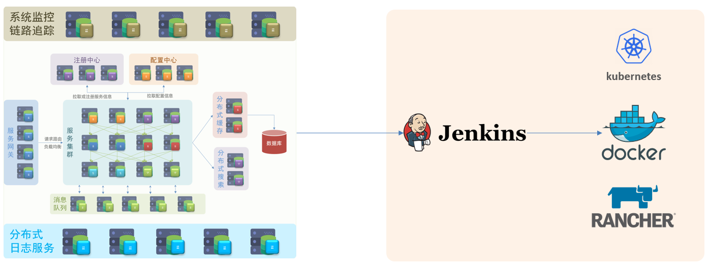
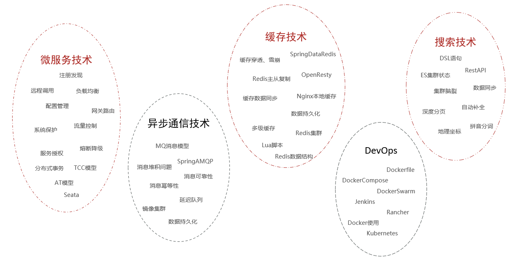
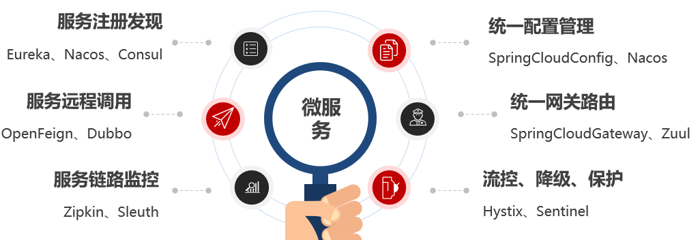
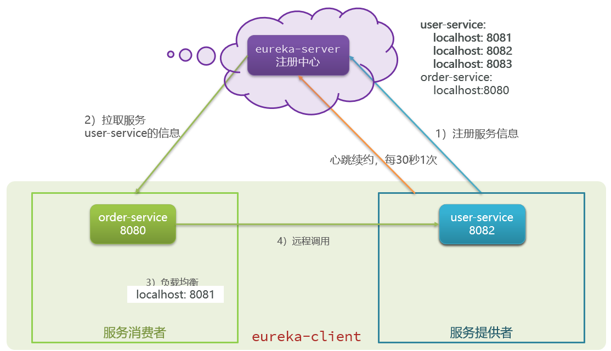
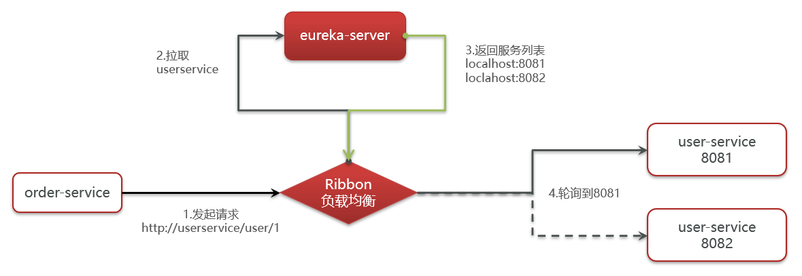

#  微服务

[TOC]

## 甚么是微服务

微服务是一种经过良好架构设计的分布式架构方案。





微服务的架构特征：

- 单一职责：微服务拆分粒度更小，每一个服务都对应唯一的业务能力，做到单一职责
- 自治：团队独立、技术独立、数据独立，独立部署和交付
- 面向服务：服务提供统一标准的接口，与语言和技术无关
- 隔离性强：服务调用做好隔离、容错、降级，避免出现级联问题




## 服务拆分

微服务拆分的几个原则：

- 业务解耦：不同微服务，不要重复开发相同业务
- 数据库解耦：微服务数据独立，不要访问其它微服务的数据库
- 微服务可以将自己的业务暴露为接口，供其它微服务调用

## 微服务远程调用

使用 RestTemplate 向其他服务发起 HTTP 请求。

远程调用的问题：

* 服务消费者该如何获取服务提供者的地址信息？
* 如果有多个服务提供者，消费者该如何选择？
* 消费者如何得知服务提供者的健康状态？

## Eureka 注册中心

1.搭建EurekaServer

* 引入eureka-server依赖

* 添加 @EnableEurekaServer 注解

* 在 application.yml 中配置 eureka 地址

2.服务注册

* 引入 eureka-client 依赖

* 在 application.yml 中配置 eureka 地址

3.服务发现

* 给RestTemplate添加@LoadBalanced注解

* 用服务提供者的服务名称远程调用

### 作用

Eureka 的作用：



### 搭建 Eureka Server

Eureka Server 不是一个独立的软件，依赖于一个独立的微服务，以服务的形式呈现。

1. 引入 eureka-server 依赖
2. 添加 @EnableEurekaServer 注解
3. 在 application.yml 中配置 eureka 地址

引入 SpringCloud 为 eureka 提供的 starter 依赖：

```xml
<dependency>
    <groupId>org.springframework.cloud</groupId>
    <artifactId>spring-cloud-starter-netflix-eureka-server</artifactId>
</dependency>
```

给 eureka-server 服务编写一个启动类，一定要添加一个 @EnableEurekaServer 注解，开启 eureka 的注册中心功能：

```java
package cn.itcast.eureka;

import org.springframework.boot.SpringApplication;
import org.springframework.boot.autoconfigure.SpringBootApplication;
import org.springframework.cloud.netflix.eureka.server.EnableEurekaServer;

@SpringBootApplication
@EnableEurekaServer
public class EurekaApplication {
    public static void main(String[] args) {
        SpringApplication.run(EurekaApplication.class, args);
    }
}
```

编写一个 application.yml 文件，内容如下：

```yaml
server:
  port: 10086
spring:
  application:
    name: eureka-server
eureka:
  client:
    service-url: 
      defaultZone: http://127.0.0.1:10086/eureka # 将自己也注册到 Eureka Server
```


### 注册到 Eureka

下面，我们将 user-service 注册到 eureka-server 中去。

在 user-service 的 pom 文件中，引入下面的 eureka-client 依赖：

```xml
<dependency>
    <groupId>org.springframework.cloud</groupId>
    <artifactId>spring-cloud-starter-netflix-eureka-client</artifactId>
</dependency>
```

在 user-service 中，修改 application.yml 文件，添加服务名称、eureka 地址：

```yaml
spring:
  application:
    name: userservice
eureka:
  client:
    service-url:
      defaultZone: http://127.0.0.1:10086/eureka
```

### 服务拉取

服务拉取是基于服务名称获取服务列表，然后在对服务列表做负载均衡。

1. 修改 OrderService 的代码，修改访问的 url 路径，用服务名代替ip、端口

   ```java
   String url = "http://userservice/user/" + order.getUserId();
   ```

2. 在 order-service 项目的启动类 OrderApplication 中的 RestTemplate 添加**负载均衡**注解

   ```java
   @Bean
   @LoadBalanced
   public RestTemplate restTemplate() {
       return new RestTemplate();
   }
   ```

   

### Ribbon 负载均衡

Ribbon 负载均衡是 SpringCloud 的一个组件， ，spring-cloud-starter-netflix-eureka-client 会自动引入 ribbon。

负载均衡的流程：



通过定义IRule实现可以修改负载均衡规则，有两种方式：

1. 代码方式：在 order-service 中的 OrderApplication 类中，定义一个新的 IRule：

   ```java
   @Bean
   public IRule randomRule(){
       return new RandomRule();
   }
   ```

2. 配置文件方式：在 order-service 的 application.yml 文件中，添加新的配置也可以修改规则：

   ```java
   userservice: # 给某个微服务配置负载均衡规则，这里是userservice服务
     ribbon:
       NFLoadBalancerRuleClassName: com.netflix.loadbalancer.RandomRule # 负载均衡规则 
   ```


Ribbon 默认是采用懒加载，即第一次访问时才会去创建 LoadBalanceClient，请求时间会很长。

而饥饿加载则会在项目启动时创建，降低第一次访问的耗时，通过下面配置开启饥饿加载：

```yaml
ribbon:
  eager-load:
    enabled: true # 开启饥饿加载 
    clients: 
      - userservice # 指定对userservice这个服务饥饿加载
```


## Nacos 注册中心

nacos 有别于 eureka，nacos 有一个客户端（其实也是一个 jar 包）。Nacos 也使用 ribbon 做服务拉取和负载均衡。

Nacos 比 Eureka 多了一个配置管理，可以远程管理各个微服务的 yml 文件。

### 服务注册

在 cloud-demo 父工程的pom文件中的`<dependencyManagement>`中引入 SpringCloudAlibaba 的依赖：

```xml
<dependency>
    <groupId>com.alibaba.cloud</groupId>
    <artifactId>spring-cloud-alibaba-dependencies</artifactId>
    <version>2.2.6.RELEASE</version>
    <type>pom</type>
    <scope>import</scope>
</dependency>
```

然后在user-service和order-service中的pom文件中引入 nacos-discovery 依赖：

```xml
<dependency>
    <groupId>com.alibaba.cloud</groupId>
    <artifactId>spring-cloud-starter-alibaba-nacos-discovery</artifactId>
</dependency>
```

在 user-service 和 order-service 的 application.yml 中添加 nacos 地址：

```yaml
spring:
  cloud:
    nacos:
      server-addr: localhost:8848
```

### 服务分级存储模型

将一个服务的多个实例，部署到多个机房。Nacos 引入了这个机房（地域）的概念。


服务调用尽可能选择本地集群的服务，跨集群调用延迟较高。本地集群不可访问时，再去访问其它集群。

配置集群(cluster)，修改 user-service 的 application.yml 文件，添加集群配置：

```yaml
spring:
  cloud:
    nacos:
      server-addr: localhost:8848
      discovery:
        cluster-name: HZ # 集群名称
```

还需要配置以下 Ribbon 的负载均衡规则。修改 order-service 的application.yml文件，修改负载均衡规则：

```yaml
orderservice:
  ribbon:
    NFLoadBalancerRuleClassName: com.alibaba.cloud.nacos.ribbon.NacosRule # 负载均衡规则 
```

NacosRule 负载均衡策略：

* 优先选择同集群服务实例列表

* 本地集群找不到提供者，才去其它集群寻找，并且会报警告

* 确定了可用实例列表后，再采用随机负载均衡挑选实例

**注意**：Ribbon 默认的负载均衡 Rule 是轮询，而 NacosRule 是随机的负载均衡方式。

### 权重配置

实际部署中会出现这样的场景：

服务器设备性能有差异，部分实例所在机器性能较好，另一些较差，我们希望性能好的机器承担更多的用户请求。但默认情况 NacosRule是同集群内随机挑选，不会考虑机器的性能问题。因此，Nacos提供了权重配置来控制访问频率，权重越大则访问频率越高。在nacos控制台，找到user-service的实例列表，点击编辑，即可修改权重。

Nacos 控制台可以设置实例的权重值，0~1之间。同集群内的多个实例，权重越高被访问的频率越高，权重设置为0则完全不会被访问。

**注意**：如果权重修改为0，则该实例永远不会被访问。

权重配置，可以用于服务的平滑(用户无感知)升级，先把一个服务的权重设置为 0，然后设置升级服务，再把权重设置为 0.1，进行小流量测试。

### 环境隔离 namespace

Nacos 提供了 namespace 来实现环境隔离功能。

- nacos 中可以有多个 namespace
- namespace 下可以有 group、service等
- 不同 namespace 之间相互隔离，例如不同 namespace 的服务互相不可见


默认情况下，所有service、data、group 都在同一个 namespace，名为 public。我们可以增加 dev, pro, test 等命名空间。

给微服务配置 namespace：

例如，修改 order-service 的 application.yml 文件：

```yaml
spring:
  cloud:
    nacos:
      server-addr: localhost:8848
      discovery:
        cluster-name: HZ
        namespace: 492a7d5d-237b-46a1-a99a-fa8e98e4b0f9 # 命名空间，填ID
```

### nacos 与 eureka 区别

Nacos 和 Eureka 整体结构类似，服务注册、服务拉取、心跳等待，但是也存在一些差异：


- Nacos 与 eureka 的共同点
  - 都支持服务注册和服务拉取
  - 都支持服务提供者心跳方式做健康检测

- Nacos 与 Eureka 的区别
  - Nacos 支持服务端主动检测提供者状态：临时实例采用心跳模式（默认情况下所有的实例都是临时实例），非临时实例采用主动检测模式
  - 临时实例心跳不正常会被剔除，非临时实例则不会被剔除
  - Nacos 支持服务列表变更的消息推送模式，服务列表更新更及时
  - Nacos 集群默认采用 AP 方式，当集群中存在非临时实例时，采用 CP 模式；Eureka 采用 AP 方式

配置一个服务实例为永久实例：

```yaml
spring:
  cloud:
    nacos:
      discovery:
        ephemeral: false # 设置为非临时实例
```

## Nacos 配置管理

### 统一配置管理


1. 引入 nacos-config 依赖

   首先，在user-service服务中，引入nacos-config的客户端依赖：

   ```xml
   <!--nacos配置管理依赖-->
   <dependency>
       <groupId>com.alibaba.cloud</groupId>
       <artifactId>spring-cloud-starter-alibaba-nacos-config</artifactId>
   </dependency>
   ```

2. 添加 bootstrap.yaml

   然后，在user-service中添加一个bootstrap.yaml 文件，内容如下：

   ```yaml
   spring:
     application:
       name: userservice # 服务名称
     profiles:
       active: dev #开发环境，这里是dev 
     cloud:
       nacos:
         server-addr: localhost:8848 # Nacos地址
         config:
           file-extension: yaml # 文件后缀名
   ```

   这里会根据spring.cloud.nacos.server-addr获取nacos地址，再根据`${spring.application.name}-${spring.profiles.active}.${spring.cloud.nacos.config.file-extension}`作为文件id，来读取配置。

   本例中，就是去读取`userservice-dev.yaml`：

   

3. 读取nacos配置

   在user-service中的UserController中添加业务逻辑，读取pattern.dateformat配置：

   

### 配置热更新

Spring 不会自动进行热更新，有两种方式可以配置热更新：

1. `@RefreshScope`

   在 @Value 注入的变量所在类上添加注解 

   

2. `@ConfigurationProperties`

   使用 @ConfigurationProperties 注解代替 @Value 注解。

   在 user-service 服务中，添加一个类，读取 patterrn.dateformat 属性：

   ```java
   package cn.itcast.user.config;
   
   import lombok.Data;
   import org.springframework.boot.context.properties.ConfigurationProperties;
   import org.springframework.stereotype.Component;
   
   @Component
   @Data
   @ConfigurationProperties(prefix = "pattern")
   public class PatternProperties {
       private String dateformat;
   }
   ```

   在 UserController 中使用这个类代替 @Value：

   


### 配置共享

其实微服务启动时，会去nacos读取多个配置文件，例如：

- `[spring.application.name]-[spring.profiles.active].yaml`，例如：userservice-dev.yaml

- `[spring.application.name].yaml`，例如：userservice.yaml

而`[spring.application.name].yaml`不包含环境，因此可以被多个环境共享。

当 nacos、服务本地同时出现相同属性时，优先级有高低之分：


## HTTP 客户端 Feign

### Feign 替代 RestTemplate

RestTemplate 的缺点：

* 代码可读性差，编程体验不统一

* 参数复杂URL难以维护

Feign 是一个**声明式**的 http 客户端，官方地址：https://github.com/OpenFeign/feign

其作用就是帮助我们优雅的实现http请求的发送，解决上面提到的问题。Feign 还继承了 Ribbon，自带负载均衡。

Fegin的使用步骤如下：

1. 引入依赖

   我们在order-service服务的pom文件中引入feign的依赖：

   ```xml
   <dependency>
       <groupId>org.springframework.cloud</groupId>
       <artifactId>spring-cloud-starter-openfeign</artifactId>
   </dependency>
   ```

2. 添加注解

   在 order-service 的启动类添加注解开启Feign的功能：

   

3. 编写Feign的客户端

   在 order-service（消费者，访问生产者 userservice） 的 client 文件夹下，新建一个接口，内容如下：

   ```java
   package cn.itcast.order.client;
   
   import cn.itcast.order.pojo.User;
   import org.springframework.cloud.openfeign.FeignClient;
   import org.springframework.web.bind.annotation.GetMapping;
   import org.springframework.web.bind.annotation.PathVariable;
   
   @FeignClient("userservice")
   public interface UserClient {
       @GetMapping("/user/{id}")
       User findById(@PathVariable("id") Long id);
   }
   ```

   这个客户端主要是基于 SpringMVC 的注解来声明远程调用的信息，比如：

   * 服务名称：userservice
   * 请求方式：GET
   * 请求路径：/user/{id}
   * 请求参数：Long id
   * 返回值类型：User

   这样，Feign 就可以帮助我们发送 http 请求，无需自己使用 RestTemplate 来发送了。


### 自定义配置

Feign运行自定义配置来覆盖默认配置，可以修改的配置如下：

| 类型                   | 作用             | 说明                                                   |
| ---------------------- | ---------------- | ------------------------------------------------------ |
| **feign.Logger.Level** | 修改日志级别     | 包含四种不同的级别：NONE、BASIC、HEADERS、FULL         |
| feign.codec.Decoder    | 响应结果的解析器 | http远程调用的结果做解析，例如解析json字符串为java对象 |
| feign.codec.Encoder    | 请求参数编码     | 将请求参数编码，便于通过http请求发送                   |
| feign. Contract        | 支持的注解格式   | 默认是SpringMVC的注解                                  |
| feign. Retryer         | 失败重试机制     | 请求失败的重试机制，默认是没有，不过会使用Ribbon的重试 |

一般我们需要配置的就是日志级别。

### Feign性能优化

Feign的优化：

1. 日志级别尽量用 basic

2. 使用 HttpClient 或 OKHttp 代替 URLConnection

   2.1 引入 feign-httpClient 依赖

   2.2 配置文件开启 httpClient 功能，设置连接池参数

### Feign 实战

将 Feign 的 Client 抽取为独立模块，并且把接口有关的 POJO、默认的 Feign 配置都放到这个模块中，提供给所有消费者使用。

也就是将所有消费者端写的 feign client，抽取到一个模块中，防止每个消费者模块都写一遍，增加维护成本。

例如，将 UserClient、User、Feign 的默认配置都抽取到一个 feign-api 包中，所有微服务引用该依赖包，即可直接使用。


## 统一网关 Gateway

### 网关的作用


* 身份认证和权限校验
* 服务路由、负载均衡
* 请求限流

### gateway 快速入门

gateway 网关以一个独立的服务而存在。

网关搭建步骤：

1. 创建项目，引入nacos服务发现和gateway依赖

2. 配置application.yml，包括服务基本信息、nacos地址、路由

路由配置包括：

1. 路由id：路由的唯一标示

2. 路由目标（uri）：路由的目标地址，http代表固定地址，lb代表根据服务名负载均衡

3. 路由断言（predicates）：判断路由的规则，

4. 路由过滤器（filters）：对请求或响应做处理


步骤：

1. 创建 gateway 服务，引入依赖

   

   引入依赖：

   ```xml
   <!--网关-->
   <dependency>
       <groupId>org.springframework.cloud</groupId>
       <artifactId>spring-cloud-starter-gateway</artifactId>
   </dependency>
   <!--nacos服务发现依赖-->
   <dependency>
       <groupId>com.alibaba.cloud</groupId>
       <artifactId>spring-cloud-starter-alibaba-nacos-discovery</artifactId>
   </dependency>
   ```

2. 编写启动类

   ```java
   package cn.itcast.gateway;
   
   import org.springframework.boot.SpringApplication;
   import org.springframework.boot.autoconfigure.SpringBootApplication;
   
   @SpringBootApplication
   public class GatewayApplication {
   
   	public static void main(String[] args) {
   		SpringApplication.run(GatewayApplication.class, args);
   	}
   }
   ```

3. 编写基础配置和路由规则

   创建application.yml文件，内容如下：

   ```yaml
   server:
     port: 10010 # 网关端口
   spring:
     application:
       name: gateway # 服务名称
     cloud:
       nacos:
         server-addr: localhost:8848 # nacos地址
       gateway:
         routes: # 网关路由配置
           - id: user-service # 路由id，自定义，只要唯一即可
             # uri: http://127.0.0.1:8081 # 路由的目标地址 http就是固定地址
             uri: lb://userservice # 路由的目标地址 lb就是负载均衡，后面跟服务名称
             predicates: # 路由断言，也就是判断请求是否符合路由规则的条件
               - Path=/user/** # 这个是按照路径匹配，只要以/user/开头就符合要求
   ```

   我们将符合`Path` 规则的一切请求，都代理到 `uri`参数指定的地址。

   本例中，我们将 `/user/**`开头的请求，代理到`lb://userservice`，lb是负载均衡，根据服务名拉取服务列表，实现负载均衡。

### 断言工厂

predicates：

| **名称**   | **说明**                       | **示例**                                                     |
| ---------- | ------------------------------ | ------------------------------------------------------------ |
| After      | 是某个时间点后的请求           | -  After=2037-01-20T17:42:47.789-07:00[America/Denver]       |
| Before     | 是某个时间点之前的请求         | -  Before=2031-04-13T15:14:47.433+08:00[Asia/Shanghai]       |
| Between    | 是某两个时间点之前的请求       | -  Between=2037-01-20T17:42:47.789-07:00[America/Denver],  2037-01-21T17:42:47.789-07:00[America/Denver] |
| Cookie     | 请求必须包含某些cookie         | - Cookie=chocolate, ch.p                                     |
| Header     | 请求必须包含某些header         | - Header=X-Request-Id, \d+                                   |
| Host       | 请求必须是访问某个host（域名） | -  Host=**.somehost.org,**.anotherhost.org                   |
| Method     | 请求方式必须是指定方式         | - Method=GET,POST                                            |
| Path       | 请求路径必须符合指定规则       | - Path=/red/{segment},/blue/**                               |
| Query      | 请求参数必须包含指定参数       | - Query=name, Jack或者-  Query=name                          |
| RemoteAddr | 请求者的ip必须是指定范围       | - RemoteAddr=192.168.1.1/24                                  |
| Weight     | 权重处理                       |                                                              |

### 过滤器工厂

GatewayFilter 是网关中提供的一种过滤器，可以对进入网关的**请求**和微服务返回的**响应**做处理。


Spring提供了31种不同的路由过滤器工厂。例如：

| **名称**             | **说明**                     |
| -------------------- | ---------------------------- |
| AddRequestHeader     | 给当前请求添加一个请求头     |
| RemoveRequestHeader  | 移除请求中的一个请求头       |
| AddResponseHeader    | 给响应结果中添加一个响应头   |
| RemoveResponseHeader | 从响应结果中移除有一个响应头 |
| RequestRateLimiter   | 限制请求的流量               |
| ...                  |                              |

1. 请求头过滤器

   **需求**：给所有进入userservice的请求添加一个请求头：Truth=itcast is freaking awesome!

   只需要修改gateway服务的application.yml文件，添加路由过滤即可：

   ```yaml
   spring:
     cloud:
       gateway:
         routes:
         - id: user-service 
           uri: lb://userservice 
           predicates: 
           - Path=/user/** 
           filters: # 过滤器
           - AddRequestHeader=Truth, Itcast is freaking awesome! # 添加请求头
   ```

   当前过滤器写在userservice路由下，因此仅仅对访问 userservice 的请求有效。

2. 默认过滤器

   如果要对所有的路由都生效，则可以将过滤器工厂写到 default 下。格式如下：

   ```yaml
   spring:
     cloud:
       gateway:
         routes:
         - id: user-service 
           uri: lb://userservice 
           predicates: 
           - Path=/user/**
         default-filters: # 默认过滤项
         - AddRequestHeader=Truth, Itcast is freaking awesome! 
   ```

   总结

   过滤器的作用是什么？

   ① 对路由的请求或响应做加工处理，比如添加请求头

   ② 配置在路由下的过滤器只对当前路由的请求生效

   defaultFilters 的作用是什么？

   ① 对所有路由都生效的过滤器

### 全局过滤器

全局过滤器的作用也是处理一切进入网关的请求和微服务响应，与GatewayFilter的作用一样。区别在于GatewayFilter通过配置定义，处理逻辑是固定的；而 GlobalFilter 的逻辑需要自己写代码实现。

定义方式是实现 GlobalFilter 接口。

```java
public interface GlobalFilter {
    /**
     *  处理当前请求，有必要的话通过{@link GatewayFilterChain}将请求交给下一个过滤器处理
     *
     * @param exchange 请求上下文，里面可以获取Request、Response等信息
     * @param chain 用来把请求委托给下一个过滤器 
     * @return {@code Mono<Void>} 返回标示当前过滤器业务结束
     */
    Mono<Void> filter(ServerWebExchange exchange, GatewayFilterChain chain);
}
```

在 filter 中编写自定义逻辑，可以实现下列功能：

- 登录状态判断
- 权限校验
- 请求限流等

自定义全局过滤器，需求：定义全局过滤器，拦截请求，判断请求的参数是否满足下面条件：

- 参数中是否有authorization，

- authorization参数值是否为admin

如果同时满足则放行，否则拦截。

实现：

在gateway中定义一个过滤器：

```java
package cn.itcast.gateway.filters;

import org.springframework.cloud.gateway.filter.GatewayFilterChain;
import org.springframework.cloud.gateway.filter.GlobalFilter;
import org.springframework.core.annotation.Order;
import org.springframework.http.HttpStatus;
import org.springframework.stereotype.Component;
import org.springframework.web.server.ServerWebExchange;
import reactor.core.publisher.Mono;

@Order(-1) // 过滤器的执行顺序
@Component
public class AuthorizeFilter implements GlobalFilter {
    @Override
    public Mono<Void> filter(ServerWebExchange exchange, GatewayFilterChain chain) {
        // 1.获取请求参数
        MultiValueMap<String, String> params = exchange.getRequest().getQueryParams();
        // 2.获取authorization参数
        String auth = params.getFirst("authorization");
        // 3.校验
        if ("admin".equals(auth)) {
            // 放行
            return chain.filter(exchange);
        }
        // 4.拦截
        // 4.1.禁止访问，设置状态码
        exchange.getResponse().setStatusCode(HttpStatus.FORBIDDEN);
        // 4.2.结束处理
        return exchange.getResponse().setComplete();
    }
}
```

自定义过滤器，一定要有顺序。

### 过滤器执行顺序

请求进入网关会碰到三类过滤器：当前路由的过滤器、DefaultFilter、GlobalFilter

请求路由后，会将当前路由过滤器和 DefaultFilter、GlobalFilter，合并到一个过滤器链（集合）中，排序后依次执行每个过滤器：


排序的规则是什么呢？

- 每一个过滤器都必须指定一个int类型的 order 值，**order值越小，优先级越高，执行顺序越靠前**。
- GlobalFilter 通过实现 Ordered 接口，或者添加 @Order 注解来指定 order 值，由我们自己指定
- 路由过滤器和 defaultFilter 的 order 由 Spring 指定，默认是按照声明顺序从1递增。
- 当过滤器的 order 值一样时，会按照 defaultFilter > 路由过滤器 > GlobalFilter的顺序执行。


### 网关跨域问题

跨域只需要在网关处处理就 ok 了。

在 gateway 服务的 application.yml 文件中，添加下面的配置：

```yaml
spring:
  cloud:
    gateway:
      # 。。。
      globalcors: # 全局的跨域处理
        add-to-simple-url-handler-mapping: true # 解决options请求被拦截问题
        corsConfigurations:
          '[/**]':
            allowedOrigins: # 允许哪些网站的跨域请求 
              - "http://localhost:8090"
            allowedMethods: # 允许的跨域ajax的请求方式
              - "GET"
              - "POST"
              - "DELETE"
              - "PUT"
              - "OPTIONS"
            allowedHeaders: "*" # 允许在请求中携带的头信息
            allowCredentials: true # 是否允许携带cookie
            maxAge: 360000 # 这次跨域检测的有效期
```


