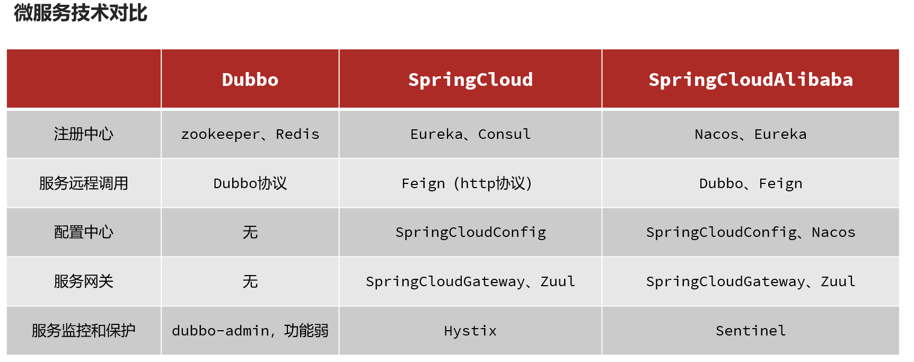
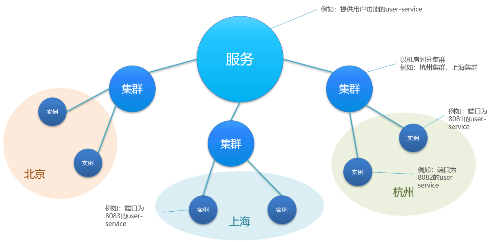

#  微服务

[TOC]

## 甚么是微服务

微服务是一种经过良好架构设计的分布式架构方案。


微服务的架构特征：

- 单一职责：微服务拆分粒度更小，每一个服务都对应唯一的业务能力，做到单一职责
- 自治：团队独立、技术独立、数据独立，独立部署和交付
- 面向服务：服务提供统一标准的接口，与语言和技术无关
- 隔离性强：服务调用做好隔离、容错、降级，避免出现级联问题




## 服务拆分

微服务拆分的几个原则：

- 业务解耦：不同微服务，不要重复开发相同业务
- 数据库解耦：微服务数据独立，不要访问其它微服务的数据库
- 微服务可以将自己的业务暴露为接口，供其它微服务调用

## 微服务远程调用

使用 RestTemplate 向其他服务发起 HTTP 请求。

远程调用的问题：

* 服务消费者该如何获取服务提供者的地址信息？
* 如果有多个服务提供者，消费者该如何选择？
* 消费者如何得知服务提供者的健康状态？

## Eureka 注册中心

1.搭建EurekaServer

* 引入eureka-server依赖

* 添加@EnableEurekaServer注解

* 在application.yml中配置eureka地址

2.服务注册

* 引入eureka-client依赖

* 在application.yml中配置eureka地址

3.服务发现

* 给RestTemplate添加@LoadBalanced注解

* 用服务提供者的服务名称远程调用

### 作用

Eureka 的作用：


### 搭建 Eureka Server

Eureka Server 不是一个独立的软件，依赖于一个独立的微服务，以服务的形式呈现。

1. 引入 eureka-server 依赖
2. 添加 @EnableEurekaServer 注解
3. 在 application.yml 中配置 eureka 地址

引入SpringCloud为eureka提供的starter依赖：

```xml
<dependency>
    <groupId>org.springframework.cloud</groupId>
    <artifactId>spring-cloud-starter-netflix-eureka-server</artifactId>
</dependency>
```

给eureka-server服务编写一个启动类，一定要添加一个@EnableEurekaServer注解，开启eureka的注册中心功能：

```java
package cn.itcast.eureka;

import org.springframework.boot.SpringApplication;
import org.springframework.boot.autoconfigure.SpringBootApplication;
import org.springframework.cloud.netflix.eureka.server.EnableEurekaServer;

@SpringBootApplication
@EnableEurekaServer
public class EurekaApplication {
    public static void main(String[] args) {
        SpringApplication.run(EurekaApplication.class, args);
    }
}
```

编写一个application.yml文件，内容如下：

```yaml
server:
  port: 10086
spring:
  application:
    name: eureka-server
eureka:
  client:
    service-url: 
      defaultZone: http://127.0.0.1:10086/eureka # 将自己也注册到 Eureka Server
```


### 注册到 Eureka

下面，我们将user-service注册到eureka-server中去。

在user-service 的pom文件中，引入下面的eureka-client依赖：

```xml
<dependency>
    <groupId>org.springframework.cloud</groupId>
    <artifactId>spring-cloud-starter-netflix-eureka-client</artifactId>
</dependency>
```

在user-service中，修改application.yml文件，添加服务名称、eureka地址：

```yaml
spring:
  application:
    name: userservice
eureka:
  client:
    service-url:
      defaultZone: http://127.0.0.1:10086/eureka
```

### 服务拉取

服务拉取是基于服务名称获取服务列表，然后在对服务列表做负载均衡。

1. 修改OrderService的代码，修改访问的url路径，用服务名代替ip、端口

   ```java
   String url = "http://userservice/user/" + order.getUserId();
   ```

2. 在order-service项目的启动类OrderApplication中的RestTemplate添加**负载均衡**注解

   ```java
   @Bean
   @LoadBalanced
   public RestTemplate restTemplate() {
       return new RestTemplate();
   }
   ```

   

### Ribbon 负载均衡

Ribbon 负载均衡是 SpringCloud 的一个组件，由 Netflix 打造，spring-cloud-starter-netflix-eureka-client 会自动引入 ribbon。

负载均衡的流程：


通过定义IRule实现可以修改负载均衡规则，有两种方式：

1. 代码方式：在order-service中的OrderApplication类中，定义一个新的IRule：

   ```java
   @Bean
   public IRule randomRule(){
       return new RandomRule();
   }
   ```

2. 配置文件方式：在order-service的application.yml文件中，添加新的配置也可以修改规则：

   ```java
   userservice: # 给某个微服务配置负载均衡规则，这里是userservice服务
     ribbon:
       NFLoadBalancerRuleClassName: com.netflix.loadbalancer.RandomRule # 负载均衡规则 
   ```


Ribbon 默认是采用懒加载，即第一次访问时才会去创建 LoadBalanceClient，请求时间会很长。

而饥饿加载则会在项目启动时创建，降低第一次访问的耗时，通过下面配置开启饥饿加载：

```yaml
ribbon:
  eager-load:
    enabled: true # 开启饥饿加载 
    clients: 
      - userservice # 指定对userservice这个服务饥饿加载
```


## Nacos 注册中心

nacos 有别于 eureka，nacos 有一个客户端（其实也是一个 jar 包）。Nacos 也使用 ribbon 做服务拉取和负载均衡。

Nacos 比 Eureka 多了一个配置管理，可以远程管理各个微服务的 yml 文件。

### 服务注册

在 cloud-demo 父工程的pom文件中的`<dependencyManagement>`中引入 SpringCloudAlibaba 的依赖：

```xml
<dependency>
    <groupId>com.alibaba.cloud</groupId>
    <artifactId>spring-cloud-alibaba-dependencies</artifactId>
    <version>2.2.6.RELEASE</version>
    <type>pom</type>
    <scope>import</scope>
</dependency>
```

然后在user-service和order-service中的pom文件中引入 nacos-discovery 依赖：

```xml
<dependency>
    <groupId>com.alibaba.cloud</groupId>
    <artifactId>spring-cloud-starter-alibaba-nacos-discovery</artifactId>
</dependency>
```

在 user-service 和 order-service 的 application.yml 中添加 nacos 地址：

```yaml
spring:
  cloud:
    nacos:
      server-addr: localhost:8848
```

### 服务分级存储模型

将一个服务的多个实例，部署到多个机房。Nacos 引入了这个机房（地域）的概念。



服务调用尽可能选择本地集群的服务，跨集群调用延迟较高。本地集群不可访问时，再去访问其它集群。

配置集群(cluster)，修改user-service的application.yml文件，添加集群配置：

```yaml
spring:
  cloud:
    nacos:
      server-addr: localhost:8848
      discovery:
        cluster-name: HZ # 集群名称
```

还需要配置以下 Ribbon 的负载均衡规则。修改 order-service 的application.yml文件，修改负载均衡规则：

```yaml
orderservice:
  ribbon:
    NFLoadBalancerRuleClassName: com.alibaba.cloud.nacos.ribbon.NacosRule # 负载均衡规则 
```

NacosRule 负载均衡策略：

* 优先选择同集群服务实例列表

* 本地集群找不到提供者，才去其它集群寻找，并且会报警告

* 确定了可用实例列表后，再采用随机负载均衡挑选实例

**注意**：Ribbon 默认的负载均衡 Rule 是轮询，而 NacosRule 是随机的负载均衡方式。

### 权重配置

实际部署中会出现这样的场景：

服务器设备性能有差异，部分实例所在机器性能较好，另一些较差，我们希望性能好的机器承担更多的用户请求。但默认情况 NacosRule是同集群内随机挑选，不会考虑机器的性能问题。因此，Nacos提供了权重配置来控制访问频率，权重越大则访问频率越高。在nacos控制台，找到user-service的实例列表，点击编辑，即可修改权重。

Nacos 控制台可以设置实例的权重值，0~1之间。同集群内的多个实例，权重越高被访问的频率越高，权重设置为0则完全不会被访问。

**注意**：如果权重修改为0，则该实例永远不会被访问。

权重配置，可以用于服务的平滑(用户无感知)升级，先把一个服务的权重设置为 0，然后设置升级服务，再把权重设置为 0.1，进行小流量测试。

### 环境隔离 namespace

Nacos 提供了 namespace 来实现环境隔离功能。

- nacos 中可以有多个 namespace
- namespace 下可以有 group、service等
- 不同 namespace 之间相互隔离，例如不同 namespace 的服务互相不可见


默认情况下，所有service、data、group都在同一个namespace，名为 public。我们可以增加 dev, pro, test 等命名空间。

给微服务配置 namespace：

例如，修改order-service的application.yml文件：

```yaml
spring:
  cloud:
    nacos:
      server-addr: localhost:8848
      discovery:
        cluster-name: HZ
        namespace: 492a7d5d-237b-46a1-a99a-fa8e98e4b0f9 # 命名空间，填ID
```


### 配置管理

远程配置微服务的 yml，并且实现热更新。

### nacos 与 eureka 区别

Nacos 和 Eureka整体结构类似，服务注册、服务拉取、心跳等待，但是也存在一些差异：


- Nacos 与 eureka的共同点
  - 都支持服务注册和服务拉取
  - 都支持服务提供者心跳方式做健康检测

- Nacos 与 Eureka 的区别
  - Nacos 支持服务端主动检测提供者状态：临时实例采用心跳模式（默认情况下所有的实例都是临时实例），非临时实例采用主动检测模式
  - 临时实例心跳不正常会被剔除，非临时实例则不会被剔除
  - Nacos 支持服务列表变更的消息推送模式，服务列表更新更及时
  - Nacos 集群默认采用 AP 方式，当集群中存在非临时实例时，采用 CP 模式；Eureka 采用 AP 方式

配置一个服务实例为永久实例：

```yaml
spring:
  cloud:
    nacos:
      discovery:
        ephemeral: false # 设置为非临时实例
```

