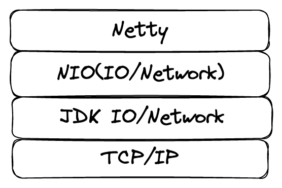
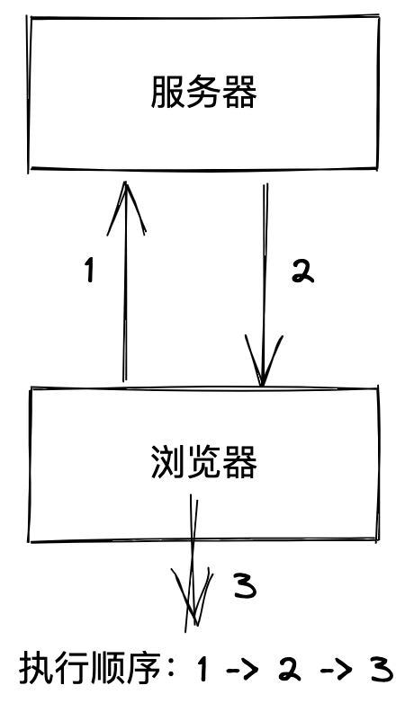
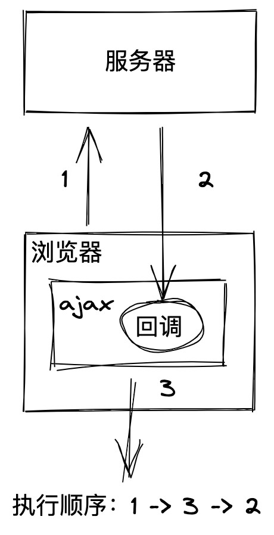
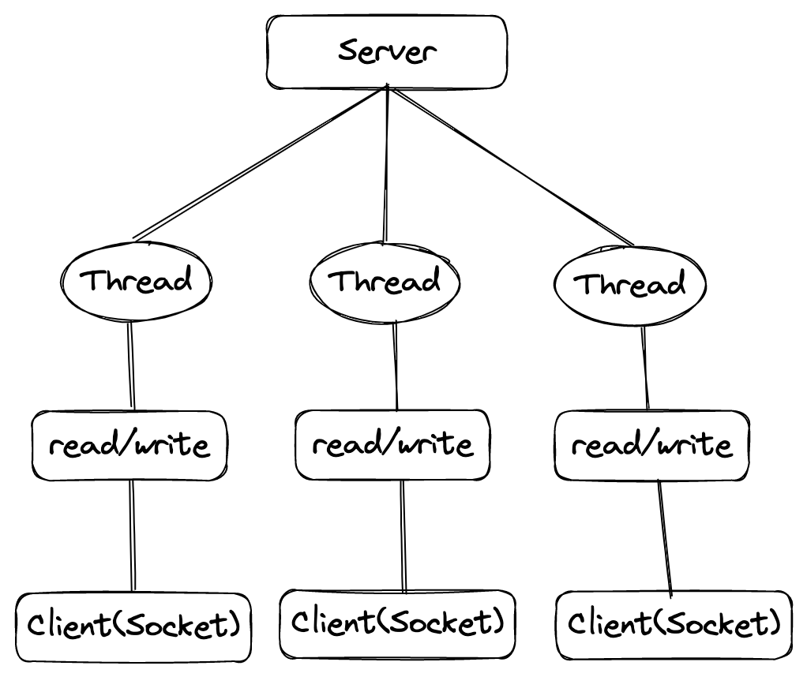
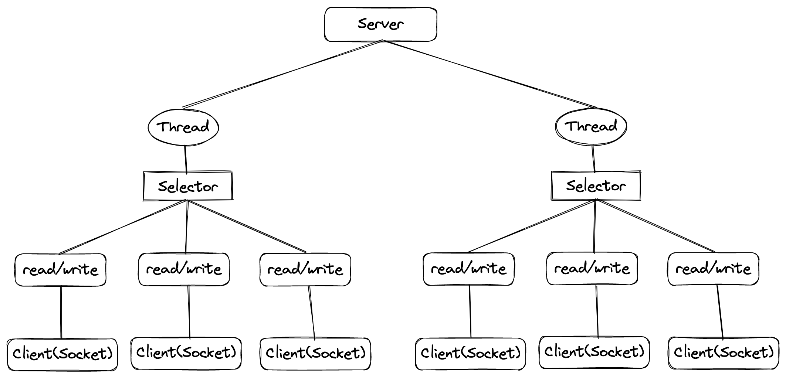

# Netty

[TOC]

## 简介

Netty 是一个网络通信库！

Netty提供异步的、[事件驱动](https://baike.baidu.com/item/事件驱动/9597519)的网络应用程序框架和工具，用以快速开发高性能、高可靠性的[网络服务器](https://baike.baidu.com/item/网络服务器/99096)和客户端程序。

Netty 主要针对在 TCP 协议下，面向 Client 端的高并发应用，或者 Peer-to-Peer 场景下的大量数据持续传输的应用。

Netty 本质上是一个 NIO（New IO）框架，适用于服务器通信相关的多种应用场景。

要彻底理解 Netty，要先学习 NIO。

Netty 的核心贡献者，是一位韩国人。

### 异步

| 同步(向服务器发起请求后，等待响应)                           | 异步(向服务器发起请求后，就干其他事情，响应后就执行回调)     |
| ------------------------------------------------------------ | ------------------------------------------------------------ |
|  |  |

### 事件驱动

类似于浏览器的点击事件。

服务端也是基于事件进行响应的，例如客户端的连接事件，断开事件。

### 应用场景

* 分布式系统中，各个节点之间的需要远程服务调用，高性能的 RPC 框架必不可少。Netty 作为异步高性能的通信框架，往往作为基础通信组件被这些 RPC 框架使用。
  例如：阿里的 RPC 框架 Dubbo 默认使用 Netty 作为基础通信组件，用于实现各进程节点之间的内部通信。
* 游戏行业，Netty 作为高性能的基础通信组件，提供了 TCP/UDP 和 HTTP 协议栈，方便定制和开发私有协议栈。

### Dubbo 和 Netty 的关系

Dubbo 是一款 RPC 框架，其底层默认使用 Netty 作为基础通信组件。

### 学习资料

* Netty in Action
* Netty 权威指南

## Java 网络 IO 模型

### BIO

Blocking IO 同步且阻塞（传统阻塞型）

服务器实现模式为一个连接一个线程，即客户端有连接时服务器端就需要启动一个线程进行处理，如果这个连接不做任何事情就会造成不必要的线程开销（可以通过线程池机制改善）。

使用场景：连接请求较少，架构固定，多服务器资源要求很高 ，JDK1.4 以前的唯一选择，但是程序简单容易理解。

相关类和接口在 java.io 中。

### NIO

No Blocking IO 同步非阻塞（多路复用）。

服务器实现模式为一个线程处理多个请求（连接）。即客户端发送的请求都会注册到多路复用器上，多路复用器轮询到连接有 IO 请求就进行处理。

理论依据：客户端连接到服务端后，并不是一直都在读写数据，这样就没有充分利用线程这个资源，造成浪费。

使用场景：连接请求多并且连接比较短的架构，例如聊天服务器，弹幕系统，服务器间通讯。编程较复杂，JDK1.4 开始支持。

NIO 三大核心部分：Channel(通道)，Buffer(缓冲区)，Selector(选择器)

NIO 的非阻塞模式，使一个线程从某通道发送请求或者读取数据，但是它仅能得到目前可用的数据，如果注册到这个线程的所有请求都没有推数据过来，那么这个线程就去干其他事情，反正不会阻塞。非阻塞写也是如此，一个线程请求写入一些数据到某个通道，不需要等到数据完全写入，这个线程就可以去干其他事情了。

通俗地理解，NIO 是可以做到用一个线程来处理多个请求的。假设有 10000 个请求过来，可以分配 50 到 100 个线程来处理。不像之前的阻塞 IO 那样，非得分配 10000 个线程。

Selector, Channel 和 Buffer 的关系图（简单版）：

1. 每个 Channel 都对应一个 Buffer
2. Selector 只对应一个线程，一个线程对应多个 Channel（连接）
3. 程序切换到哪个 channel 是由事件决定的，Event 就是一个重要的概念
4. Selector 会根据不同的 event 在各个通道上切换
5. Buffer 就是一个内存块，底层是有一个数组
6. 数据的读取写入是通过 Buffer，BIO 要么是输入流，要么是输出流，不能双向，但是 NIO 的 Buffer 是可以读也可以写，需要 flip 方法切换
7. Channel 是双向的，Linux 底层的通道也是双向的

### AIO(NIO2)

异步非阻塞。

使用场景：连接数目多且长链接比较多。比如文件服务器，充分调用 OS 参与并发操作，编程比较复杂，JDK7 开始支持。

