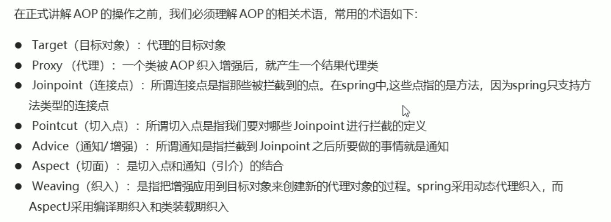

# Spring Aop

[TOC]

## 动态代理

aop 的核心机制是动态代理，有两种动态代理机制：

* JDK：基于接口（兄弟关系）
* cglib：基于父类（父子关系）

### jdk

### cglib

第三方的一个库，用于动态生成代理对象。

## spring aop 核心概念

## AspectJ

aop 的一种实现框架，Spring 采用 aspectj 进行 aop 的开发配置。

### aspectj 基本配置

### 切点表达式语法

## 基于注解的 aop 开发

