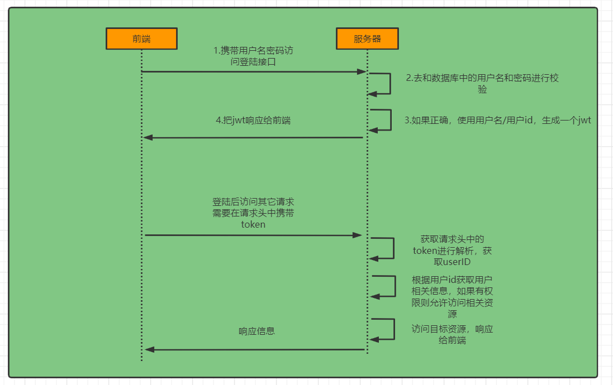
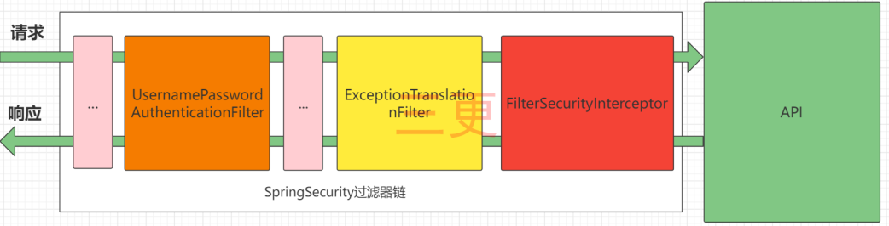
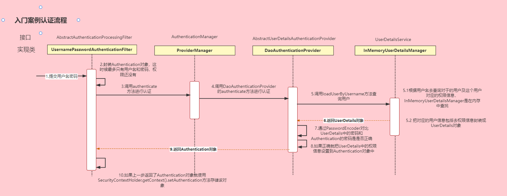
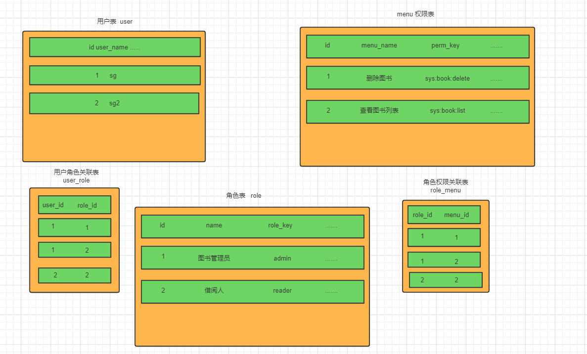

# spring-security

https://www.bilibili.com/video/BV1mm4y1X7Hc

本质上是一个过滤器链。

## 认证授权整个流程

**UsernamePasswordAuthenticationFilter**: 负责处理我们在登陆页面填写了用户名密码后的登陆请求。入门案例的认证工作主要有它负责。

**ExceptionTranslationFilter：**处理过滤器链中抛出的任何AccessDeniedException和AuthenticationException 。

**FilterSecurityInterceptor：**负责权限校验的过滤器。

## 认证

登录

​	①自定义登录接口  

​				调用ProviderManager的方法进行认证 如果认证通过生成jwt

​				把用户信息存入redis中

​	②自定义UserDetailsService 

​				在这个实现类中去查询数据库

校验：

​	①定义Jwt认证过滤器

​				获取token

​				解析token获取其中的userid

​				从redis中获取用户信息

​				存入SecurityContextHolder（后面的过滤器会获取 SecurityContextHolder 中认证的用户信息，如果能获取到，并且是认证的状态，则放行）

## 授权

在 SpringSecurity 中，会使用默认的 FilterSecurityInterceptor 来进行权限校验。在 FilterSecurityInterceptor 中会从 SecurityContextHolder 获取其中的Authentication，然后获取其中的权限信息。当前用户是否拥有访问当前资源所需的权限。

所以我们在项目中只需要把当前登录用户的权限信息也存入 Authentication。

然后设置我们的资源所需要的权限即可。

## 异常处理

我们还希望在认证失败或者是授权失败的情况下也能和我们的接口一样返回相同结构的json，这样可以让前端能对响应进行统一的处理。要实现这个功能我们需要知道SpringSecurity的异常处理机制。

在SpringSecurity中，如果我们在认证或者授权的过程中出现了异常会被ExceptionTranslationFilter捕获到。在ExceptionTranslationFilter中会去判断是认证失败还是授权失败出现的异常。

如果是认证过程中出现的异常会被封装成AuthenticationException然后调用**AuthenticationEntryPoint**对象的方法去进行异常处理。

如果是授权过程中出现的异常会被封装成AccessDeniedException然后调用**AccessDeniedHandler**对象的方法去进行异常处理。

所以如果我们需要自定义异常处理，我们只需要自定义AuthenticationEntryPoint和AccessDeniedHandler然后配置给SpringSecurity即可。

## 跨域

由于我们的资源都会收到SpringSecurity的保护，所以想要跨域访问还要让SpringSecurity运行跨域访问。