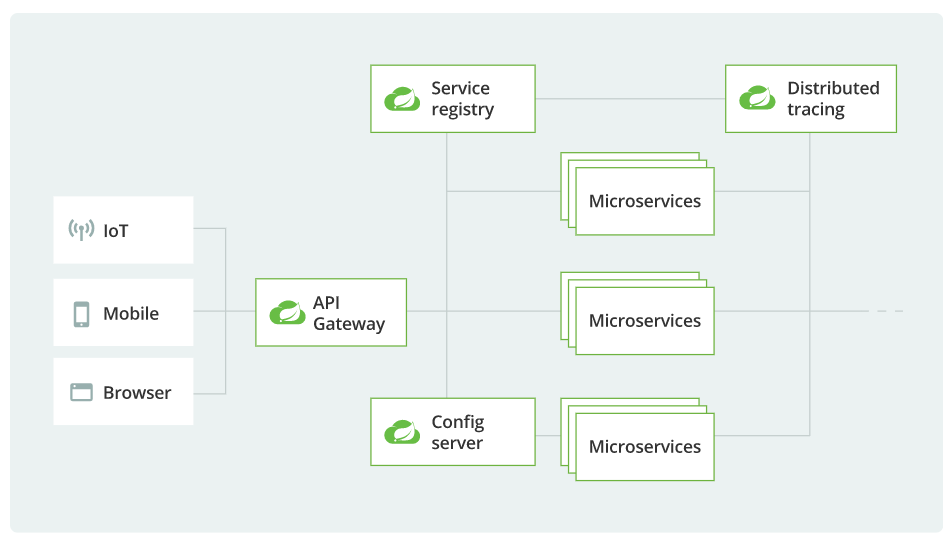

# SpringCloud

[TOC]

## 微服务架构

关键词：分布式、单一职责

## SpringCloud

### 简介

SpringCloud 为微服务提供了一揽子的解决方案。



包括：

* 服务开发
  * Spring Boot
* 服务网关(做路由，类似 nginx)
  * Zuul
  * spring api-gateway
* 服务注册与发现
  * Eureka
  * Nacos
* 服务负载和调用
  * NETFLIX OSS RIBBON
  * NETFLIX FEIGN
* 服务熔断降级
  * HYSTRIX
* 服务分布式配置
  * SpringCloud Config
* 负载均衡
* 服务消息队列
* 配置中心管理
* 全链路追踪
* 自动化构建部署
* 服务定时任务-调度操作

### 版本

* SpringCloud - H 版 + SpringBoot2.X 版
* SpringCloud Alibaba

#### 版本命名规则

Demo：

```xml
<dependency>
    <groupId>org.springframework.cloud</groupId>
    <artifactId>spring-cloud-dependencies</artifactId>
    <version>Dalston.SR1</version>
</dependency>
```

SpringCloud 的版本号是字符串（用伦敦地铁站来命名版本），Spring Boot 的版本号是数字。

SpringCloud 的历代版本：

```
Hoxton
Greenwich
Finchley
Edgware
Dalston
```

#### 与 Spring Boot 版本约束关系

| Release Train                                                | Boot Version                          |
| :----------------------------------------------------------- | :------------------------------------ |
| [2020.0.x](https://github.com/spring-cloud/spring-cloud-release/wiki/Spring-Cloud-2020.0-Release-Notes) aka Ilford | 2.4.x, 2.5.x (Starting with 2020.0.3) |
| [Hoxton](https://github.com/spring-cloud/spring-cloud-release/wiki/Spring-Cloud-Hoxton-Release-Notes) | 2.2.x, 2.3.x (Starting with SR5)      |
| [Greenwich](https://github.com/spring-projects/spring-cloud/wiki/Spring-Cloud-Greenwich-Release-Notes) | 2.1.x                                 |
| [Finchley](https://github.com/spring-projects/spring-cloud/wiki/Spring-Cloud-Finchley-Release-Notes) | 2.0.x                                 |
| [Edgware](https://github.com/spring-projects/spring-cloud/wiki/Spring-Cloud-Edgware-Release-Notes) | 1.5.x                                 |
| [Dalston](https://github.com/spring-projects/spring-cloud/wiki/Spring-Cloud-Dalston-Release-Notes) | 1.5.x                                 |

版本依赖关系查询：https://start.spring.io/actuator/info

教程的一个版本：

```
cloud: hoxton.sr1
boot: 2.2.2.release
cloud: alibaba 2.1.0.release
java: java8
maven: 3.5+
mysql: 5.7+
```

SpringCloud 依赖于 SpringBoot，SpringBoot 开发速度比 Boot 快，所以 SpringBoot 的版本要降低兼容 SpringCloud。