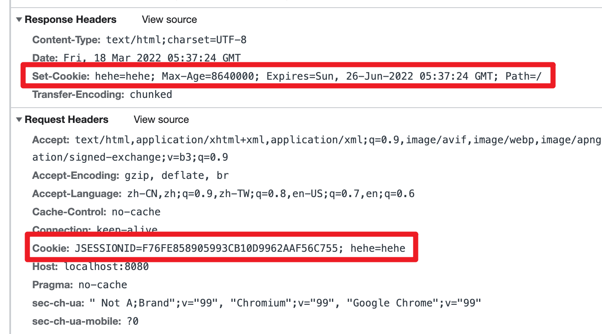

# tomcat servlet

[TOC]


## servlet


### servlet 是什么

servlet 对 http 请求和响应进行封装，得到 HttpServletRequest 和 HttpServletResponse 两个对象。

Servlet 就是一个能处理 HTTP 请求，发送 HTTP 响应的小程序。

下面的这个 servlet 就是对请求路径为 `/` 的 get 请求进行响应，然后返回 hello world。

```java
// WebServlet注解表示这是一个Servlet，并映射到地址/:
@WebServlet(urlPatterns = "/")
public class HelloServlet extends HttpServlet {
    protected void doGet(HttpServletRequest req, HttpServletResponse resp)
            throws ServletException, IOException {
        // 设置响应类型:
        resp.setContentType("text/html");
        // 获取输出流:
        PrintWriter pw = resp.getWriter();
        // 写入响应:
        pw.write("<h1>Hello, world!</h1>");
        // 最后不要忘记flush强制输出:
        pw.flush();
    }
}
```


一个Web App就是由一个或多个Servlet组成的，每个Servlet通过注解说明自己能处理的路径。

```java
@WebServlet(urlPatterns = "/hello")
public class HelloServlet extends HttpServlet {
    ...
}

@WebServlet(urlPatterns = "/signin")
public class SignInServlet extends HttpServlet {
    ...
}

@WebServlet(urlPatterns = "/")
public class IndexServlet extends HttpServlet {
    ...
}
```

如果 client 发送的是 GET 请求，则在 servlet 中覆写 `doGet` 请求，如果 client 发送的是 POST 请求，则在 servlet 中覆写 `doPost` 请求。一个Servlet如果映射到`/hello`，那么所有请求方法都会由这个Servlet处理，至于能不能返回200成功响应，要看有没有覆写对应的请求方法。


### Dispatcher

dispatcher 根据路径分发

浏览器发出的 HTTP 请求总是由 Web Server 先接收，然后，根据 Servlet 配置的映射，不同的路径转发到不同的Servlet：

```ascii
               ┌ ─ ─ ─ ─ ─ ─ ─ ─ ─ ─ ─ ─ ─ ─ ─ ─ ─ ─ ─ ┐

               │            /hello    ┌───────────────┐│
                          ┌──────────>│ HelloServlet  │
               │          │           └───────────────┘│
┌───────┐    ┌──────────┐ │ /signin   ┌───────────────┐
│Browser│───>│Dispatcher│─┼──────────>│ SignInServlet ││
└───────┘    └──────────┘ │           └───────────────┘
               │          │ /         ┌───────────────┐│
                          └──────────>│ IndexServlet  │
               │                      └───────────────┘│
                              Web Server
               └ ─ ─ ─ ─ ─ ─ ─ ─ ─ ─ ─ ─ ─ ─ ─ ─ ─ ─ ─ ┘
```


### HttpServletRequest

`HttpServletRequest` 封装了一个HTTP请求，它实际上是从 `ServletRequest` 继承而来。

我们通过 `HttpServletRequest` 提供的接口方法可以拿到HTTP请求的几乎全部信息，常用的方法有：

- getMethod()：返回请求方法，例如，`"GET"`，`"POST"`；
- getRequestURI()：返回请求路径，但不包括请求参数，例如，`"/hello"`；
- getQueryString()：返回请求参数，例如，`"name=Bob&a=1&b=2"`；
- getParameter(name)：返回请求参数，GET 请求从 URL 读取参数，POST 请求从 Body 中读取参数；
- getContentType()：获取请求 Body 的类型，例如，`"application/x-www-form-urlencoded"`；
- getContextPath()：获取当前Webapp挂载的路径，对于 ROOT 来说，总是返回空字符串`""`；
- getCookies()：返回请求携带的所有 Cookie；
- getHeader(name)：获取指定的 Header，对 Header 名称不区分大小写；
- getHeaderNames()：返回所有 Header 名称；
- getInputStream()：如果该请求带有 HTTP Body，该方法将打开一个输入流用于读取Body；
- getReader()：和 getInputStream() 类似，但打开的是 Reader；
- getRemoteAddr()：返回客户端的IP地址；
- getScheme()：返回协议类型，例如，`"http"`，`"https"`；

此外，`HttpServletRequest` 还有两个方法：`setAttribute()` 和 `getAttribute()`，可以给当前 `HttpServletRequest` 对象附加多个Key-Value，相当于把 `HttpServletRequest` 当作一个 `Map<String, Object>` 使用。


### HttpServletResponse

`HttpServletResponse` 封装了一个HTTP响应。由于HTTP响应必须先发送Header，再发送Body，所以，操作 `HttpServletResponse`对象时，必须先调用设置 Header 的方法，最后调用发送 Body 的方法。

常用的设置Header的方法有：

- setStatus(sc)：设置响应代码，默认是 `200`；
- setContentType(type)：设置Body的类型，例如，`"text/html"`；
- setCharacterEncoding(charset)：设置字符编码，例如，`"UTF-8"`；
- setHeader(name, value)：设置一个Header的值；
- addCookie(cookie)：给响应添加一个Cookie；
- addHeader(name, value)：给响应添加一个Header，因为HTTP协议允许有多个相同的Header；

写入响应时，需要通过 `getOutputStream()` 获取写入流，或者通过 `getWriter()`  获取字符流，二者只能获取其中一个。

写入响应前，无需设置`setContentLength()`，因为底层服务器会根据写入的字节数自动设置，如果写入的数据量很小，实际上会先写入缓冲区，如果写入的数据量很大，服务器会自动采用 Chunked 编码让浏览器能识别数据结束符而不需要设置 Content-Length 头。

但是，写入完毕后调用 `flush()` 却是必须的，因为大部分Web服务器都基于 HTTP/1.1 协议，会复用 TCP 连接。如果没有调用 `flush()`，将导致缓冲区的内容无法及时发送到客户端。此外，写入完毕后千万不要调用 `close()`，原因同样是因为会复用TCP连接，如果关闭写入流，将关闭 TCP 连接，使得 Web 服务器无法复用此 TCP 连接。


### 重定向

我们已经编写了一个能处理`/hello`的`HelloServlet`，如果收到的路径为`/hi`，希望能重定向到`/hello`，可以再编写一个`RedirectServlet`：

```
@WebServlet(urlPatterns = "/hi")
public class RedirectServlet extends HttpServlet {
    protected void doGet(HttpServletRequest req, HttpServletResponse resp) throws ServletException, IOException {
        // 构造重定向的路径:
        String name = req.getParameter("name");
        String redirectToUrl = "/hello" + (name == null ? "" : "?name=" + name);
        // 发送重定向响应:
        resp.sendRedirect(redirectToUrl);
    }
}
```

如果浏览器发送`GET /hi`请求，`RedirectServlet`将处理此请求。由于`RedirectServlet`在内部又发送了重定向响应，因此，浏览器会收到如下响应：

```
HTTP/1.1 302 Found
Location: /hello
```

当浏览器收到302响应后，它会立刻根据`Location`的指示发送一个新的`GET /hello`请求，这个过程就是重定向：

```ascii
┌───────┐   GET /hi     ┌───────────────┐
│Browser│ ────────────> │RedirectServlet│
│       │ <──────────── │               │
└───────┘   302         └───────────────┘


┌───────┐  GET /hello   ┌───────────────┐
│Browser│ ────────────> │ HelloServlet  │
│       │ <──────────── │               │
└───────┘   200 <html>  └───────────────┘
```

重定向有两种：一种是 302 响应，称为临时重定向，一种是 301 响应，称为永久重定向。两者的区别是，如果服务器发送 301 永久重定向响应，浏览器会缓存`/hi`到 `/hello` 这个重定向的关联，下次请求 `/hi` 的时候，浏览器就直接发送 `/hello` 请求了。

重定向有什么作用？重定向的目的是当 Web 应用升级后，如果请求路径发生了变化，可以将原来的路径重定向到新路径，从而避免浏览器请求原路径找不到资源。


### 多线程模型

一个Servlet类在服务器中只有一个实例，但对于每个HTTP请求，Web服务器会使用多线程执行请求。因此，一个 Servlet 的`doGet()`、`doPost()`等处理请求的方法是多线程并发执行的。如果Servlet中定义了字段，要注意多线程并发访问的问题：

```java
public class HelloServlet extends HttpServlet {
    private Map<String, String> map = new ConcurrentHashMap<>();

    protected void doGet(HttpServletRequest req, HttpServletResponse resp) throws ServletException, IOException {
        // 注意读写map字段是多线程并发的:
        this.map.put(key, value);
    }
}
```

对于每个请求，Web服务器会创建唯一的 `HttpServletRequest`  和 `HttpServletResponse` 实例，因此，`HttpServletRequest` 和`HttpServletResponse` 实例只有在当前处理线程中有效，它们总是局部变量，不存在多线程共享的问题。


## cookie session

在 Web 应用程序中，我们经常要跟踪用户身份。当一个用户登录成功后，如果他继续访问其他页面，Web 程序如何才能识别出该用户身份？

因为HTTP协议是一个无状态协议，即Web应用程序无法区分收到的两个HTTP请求是否是同一个浏览器发出的。为了跟踪用户状态，服务器可以向浏览器分配一个唯一 ID，并以 Cookie 的形式发送到浏览器，浏览器在后续访问时总是附带此 Cookie，这样，服务器就可以识别用户身份。

我们把这种基于唯一 ID 识别用户身份的机制称为 Session。每个用户第一次访问服务器后，会自动获得一个 Session ID。如果用户在一段时间内没有访问服务器，那么 Session 会自动失效，下次即使带着上次分配的 Session ID 访问，服务器也认为这是一个新用户，会分配新的 Session ID。

JavaEE 的 Servlet 机制内建了对 Session 的支持。我们以登录为例，当一个用户登录成功后，我们就可以把这个用户的名字放入一个 `HttpSession` 对象，以便后续访问其他页面的时候，能直接从 `HttpSession` 取出用户名。

Servlet 提供的 `HttpSession` 本质上就是通过一个名为 `JSESSIONID` 的 Cookie 来跟踪用户会话的。

Cookie 本质上是用来记录客户端的信息，可以记录用户的 id，也可以记录用于的语言和地区。Cookie 是由服务端创建好，返回给客户端存储的，用来标记客户的信息。



https://www.liaoxuefeng.com/wiki/1252599548343744/1328768897515553


## jsp

java servlet page

jsp 是一个模板。jsp 方便了动态 html 页面的生成，不再需要频繁地 PrintWriter 了。

```jsp
<html>
<head>
    <title>Hello World - JSP</title>
</head>
<body>
    <%-- JSP Comment --%>
    <h1>Hello World!</h1>
    <p>
    <%
         out.println("Your IP address is ");
    %>
    <span style="color:red">
        <%= request.getRemoteAddr() %>
    </span>
    </p>
</body>
</html>
```

整个 JSP 的内容实际上是一个 HTML，但是稍有不同：

- 包含在 `<%-- `和 `--%>` 之间的是 JSP 的注释，它们会被完全忽略；
- 包含在 `<%` 和 `%>` 之间的是 Java 代码，可以编写任意Java代码；
- 如果使用 `<%= xxx %>` 则可以快捷输出一个变量的值。

JSP页面内置了几个变量：

- out：表示HttpServletResponse的PrintWriter；
- session：表示当前HttpSession对象；
- request：表示HttpServletRequest对象。

这几个变量可以直接使用。

访问 JSP 页面时，直接指定完整路径。例如，`http://localhost:8080/hello.jsp`，浏览器显示如下


## MVC 开发

从上面两节，我们可以看到：

- Servlet 适合编写 Java 代码，实现各种复杂的业务逻辑，但不适合输出复杂的 HTML；
- JSP 适合编写 HTML，并在其中插入动态内容，但不适合编写复杂的 Java 代码。

能否将两者结合起来，发挥各自的优点，避免各自的缺点？

答案是肯定的。我们来看一个具体的例子。

假设我们已经编写了几个 JavaBean：

```java
public class User {
    public long id;
    public String name;
    public School school;
}

public class School {
    public String name;
    public String address;
}
```

在 `UserServlet` 中，我们可以从数据库读取 `User` 、 `School` 等信息，然后，把读取到的 JavaBean 先放到 HttpServletRequest 中，再通过 `forward()` 传给 `user.jsp` 处理：

```java
@WebServlet(urlPatterns = "/user")
public class UserServlet extends HttpServlet {
    protected void doGet(HttpServletRequest req, HttpServletResponse resp) throws ServletException, IOException {
        // 假装从数据库读取:
        School school = new School("No.1 Middle School", "101 South Street");
        User user = new User(123, "Bob", school);
        // 放入Request中:
        req.setAttribute("user", user);
        // forward给user.jsp:
        req.getRequestDispatcher("/WEB-INF/user.jsp").forward(req, resp);
    }
}
```

在 `user.jsp` 中，我们只负责展示相关 JavaBean 的信息，不需要编写访问数据库等复杂逻辑：

```jsp
<%@ page import="com.itranswarp.learnjava.bean.*"%>
<%
    User user = (User) request.getAttribute("user");
%>
<html>
<head>
    <title>Hello World - JSP</title>
</head>
<body>
    <h1>Hello <%= user.name %>!</h1>
    <p>School Name:
    <span style="color:red">
        <%= user.school.name %>
    </span>
    </p>
    <p>School Address:
    <span style="color:red">
        <%= user.school.address %>
    </span>
    </p>
</body>
</html>
```

请注意几点：

- 需要展示的 `User` 被放入 `HttpServletRequest` 中以便传递给JSP，因为一个请求对应一个 `HttpServletRequest` ，我们也无需清理它，处理完该请求后 `HttpServletRequest` 实例将被丢弃；
- 把 `user.jsp` 放到 `/WEB-INF/` 目录下，是因为 `WEB-INF` 是一个特殊目录，Web Server 会阻止浏览器对 `WEB-INF` 目录下任何资源的访问，这样就防止用户通过 `/user.jsp` 路径直接访问到 JSP 页面；
- JSP 页面首先从 `request `变量获取 `User` 实例，然后在页面中直接输出，此处未考虑 HTML 的转义问题，有潜在安全风险。

我们在浏览器访问 `http://localhost:8080/user`，请求首先由 `UserServlet` 处理，然后交给 `user.jsp` 渲染：


我们把 `UserServlet` 看作业务逻辑处理，把 `User` 看作模型，把 `user.jsp` 看作渲染，这种设计模式通常被称为 MVC：Model-View-Controller，即 `UserServlet` 作为控制器（Controller），`User` 作为模型（Model），`user.jsp`作为视图（View），整个MVC架构如下：

```ascii
                   ┌───────────────────────┐
             ┌────>│Controller: UserServlet│
             │     └───────────────────────┘
             │                 │
┌───────┐    │           ┌─────┴─────┐
│Browser│────┘           │Model: User│
│       │<───┐           └─────┬─────┘
└───────┘    │                 │
             │                 ▼
             │     ┌───────────────────────┐
             └─────│    View: user.jsp     │
                   └───────────────────────┘
```

使用MVC模式的好处是，Controller专注于业务处理，它的处理结果就是Model。Model可以是一个JavaBean，也可以是一个包含多个对象的Map，Controller只负责把Model传递给View，View只负责把Model给“渲染”出来，这样，三者职责明确，且开发更简单，因为开发Controller时无需关注页面，开发View时无需关心如何创建Model。


## Filter 过滤器

在 HTTP 请求到达 Servlet 之前，可以被多个 Filter 预处理，类似打印日志、登录检查等逻辑，完全可以放到 Filter 中。

下面这个 filter 就是设置输入和输出的编码格式，其对 `/users/*` 请求起作用：

```java
@WebFilter("/user/*")
public class AuthFilter implements Filter {
    public void doFilter(ServletRequest request, ServletResponse response, FilterChain chain)
            throws IOException, ServletException {
        System.out.println("AuthFilter: check authentication");
        HttpServletRequest req = (HttpServletRequest) request;
        HttpServletResponse resp = (HttpServletResponse) response;
        if (req.getSession().getAttribute("user") == null) {
            // 未登录，自动跳转到登录页:
            System.out.println("AuthFilter: not signin!");
            resp.sendRedirect("/signin");
        } else {
            // 已登录，继续处理:
            chain.doFilter(request, response);
        }
    }
}
```

Filter 可以有针对性地拦截或者放行 HTTP 请求。

Filter是一种对HTTP请求进行预处理的组件，它可以构成一个处理链，使得公共处理代码能集中到一起；

Filter适用于日志、登录检查、全局设置等。