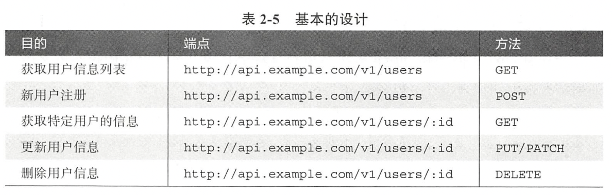
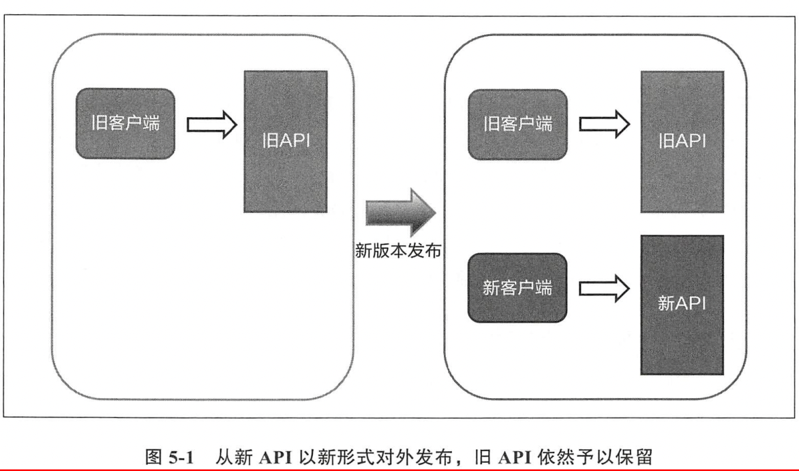

# WebAPI 的设计与实现


[TOC]

## 读书感悟

书写的很好，api 设计查漏补缺了，后面就是在实战中多。

日本人写书，有一个特点，就是啰啰嗦嗦，事无巨细。但是有的地方总给我一种，抓不住重点，无法把握全局和精髓的感觉。例如在 2.6 节讲 OAuth 的时候，用在线服务 A 和 B 举例，我的睁大眼睛，屏住呼吸才能理解作者想要表达的意思。同样的知识点，阮一峰就讲得很简洁明了 [OAuth 2.0 的一个简单解释](https://www.ruanyifeng.com/blog/2019/04/oauth_design.html)，我感觉日本人虽然严谨，但是有点严谨过头了。

聊到日本人，突然想起来王德峰老师评价日本文化。日本人缺乏幽默感，是因为其地理位置险恶，像一条虫蜷缩于太平洋地震带上，没办法退一步海阔天空，所以做事小心谨慎，没办法豁达。


## 第一章 什么是 web api

* web api 与服务器返回的 html 的区别

  api 不是通过输入或点击链接来访问的，而是由程序进行调用的。HTML 是让人读的，api 是让机器读的。

* Web API 是计算机领域的 UGC（User Generated Content）

* 公开什么 api

  所有的在线服务，都可以公开 api，api 可以作为一个程序员的名片

* 公开 api 是否有风险

  即使不公开 api，真想要获取数据的话，用爬虫爬取 html 也可以获取

* api 设计的重要性

  * api 一经设计，就很少再更改，所以首次设计很重要
  * api 是程序员的名片
  * 设计良好的 api 可读性好，易于使用，易于传播

* api 的一种分类

  * LSUD：Large Set of Unknown Developers 面向大量的开发者，例如 Twitter 的 api
  * SSKD：Small Set of Known Developers 面向少量已知开发者，例如公司内部的 api。设计 SSDK API 时，一个屏幕的内容使用一次 API 调用，一次保存使用一次 API 调用

* api 的设计不必严格遵循 rest，尽信书不如无书


## 第二章 url 设计与请求的形式

* 通过封装 sql 来设计 api 的思路是不可取的，这样不仅没法描述抽象的功能，还可能暴露服务端存储的数据结构

* Good URI

  * 短小便于输入

  * 可读性好

  * 没有大小写混用

    HTTP 协议规定，模式和主机名必须小写，后面的地址是区分大小写的

  * 修改方便

    ```
    ✔️ http://api.example.com/v1/items/12345
    ✔️ http://api.example.com/v1/items/12346
    ```

  * 不会暴露服务端架构

  * 规则统一

    ```
    // 获取 id 为 100 的好友的信息
    http://api.example.com/friends/100
    
    // 给 100 的朋友发送消息
    http://api.example.com/friends/100/message
    ```

* HTTP methods

  * GET

    get 方法有时候也会修改资源，例如在 get 数据的时候，将已读修改成未读，修改最后访问时间等信息

  * POST

    POST 用于新建资源

  * PUT

    PUT 通常只用于更新数据

  * DELETE

  * PATCH

  * HEAD

​		

* **将资源描述成 url，并用 HTTP 方法表示对其进行的操作**，URL 中只包含名词，不包含动词和形容词！

* 当需要使用多个单词描述一个资源的时候，使用连接符

  ```
  http://api.example.com/v1/users/12345/profile-image
  ```

* 使用请求参数 ？还是路径

  看这个参数是否指代资源，例如下面的 access-token，并不指代资源，所以应该放在请求参数中

  ```
  ✔️ http://api.example.com/v1/users?access-token=xxx
  ❌ http://api.example.com/v1/users/access-token/xxx
  ```

* 获取当前用户自身的数据

  ```
  http://api.example.com/v1/users/me
  ```

* API 设计级别

  * REST LEVEL0 使用 HTTP
  * REST LEVEL1 引入资源的概念
  * REST LEVEL2 引入 HTTP 动词
  * REST LEVEL3 引入 HATEOAS 概念

  

## 第三章 响应数据的设计

* 指定响应数据的格式

  * 使用请求参数指定

    ```
    http://api.example.com/v1/users?format=json
    ```

  * 使用 url 扩展名指定

    ```
    http://api.example.com/v1/users.json
    ```

  * 在请求的首部中指定

    ```
    GET /v1/users
    Host: api.example.com
    Accept: application/json
    ```

* 响应数据的设计原则
  * 允许适当的冗余，进而减少 API 的请求次数
  * 响应数据的状态码语义，应该与响应数据契合
  * 响应数据应该尽可能的扁平化，不要封装太多的层次结构

* 响应数据中的时间，通常用 unix 时间戳来表示，单位是秒
* 出错信息的表示
  * 响应码要与出错信息契合！
  * 具体的出错信息，要在响应体中给出，包括更详细的错误码和错误描述


## 第四章 最大程度地利用 HTTP 协议规范

* 5 开头的响应码表示服务端出错，4 开头的响应码表示客户端请求出错

* 3 打头的响应码表示资源的地址变了，服务端返回一个新的地址

* 重要的响应码

  * 401：Unauthorized 认证错误
  * 403：Forbidden 无权访问
  * 404：not found 资源未找到
  * 405：Method not Allowd 资源存在，但是请求的方法不对
  * 406：Not Acceptable 服务端不支持客户端请求的数据格式
  * 503：服务器在维护

* HTTP 缓存

  为了降低访问服务端的次数，客户端将数据缓存起来，再次需要时，就从缓存中读取

  适合缓存的数据：生成后就不会变动的数据，例如历史的天气数据

  HTTP 缓存模型

  * 过期模型

    预先决定响应数据的保存期限，到达期限后就再次访问服务器

    在头信息中，加入

    ```
    // 3600 秒后过期
    Cache-Control: max-age=3600
    ```

    或者加入：

    ```
    Expire: Fri, 01 Jan 2015 00:00:00 GMT
    ```

    Cache-Control 的优先级更高

  * 验证模型

    采用询问服务器的方式，来判断缓存是否有效

  如果不想使用缓存，则配置如下：

  ```
  Cache-Control: no-cache
  ```

* 指定媒体类型

  格式：顶层类型名称 / 子类型名称

  指定响应体的类型：

  ```
  Content-Type: application/json
  ```

  优先使用 `application/xml`，而不是 `text/xml`

  请求的类型：

  表示请求体的内容是 `application/json`，Accept 表示客户端能够接收的数据类型。

  ```
  Content-Type: application/json
  Accept: application/json
  ```

  Accept 可以枚举多种类型，还可以配置优先级：

  ```
  Accept: application/json, application/xml;q=0.9
  ```

* 跨域访问相关

  客户端发起跨域请求时，会在头信息中携带一个 Origin

  当客户端通过跨域在头信息中加入 Cookie 或者 Authentication 认证信息时，服务器端认证通过后，需要在头信息中携带有：

  ```
  Access-Control-Allow-Credentials: true
  ```

  如果不携带的话，浏览器会直接拒绝来自服务器的响应请求。


常见的 MIME 媒体类型

| 媒体类型                 | 数据格式                    |
| ------------------------ | --------------------------- |
| text/plain               | 纯文本                      |
| text/html                | html 文件                   |
| application/xml          | xml 文件                    |
| text/css                 | css 文件                    |
| application/javascript   | javascript                  |
| application/json         | json 文件                   |
| application/rss+xml      | RSS 域                      |
| application/octet-stream | 二进制数据                  |
| application/zip          | zip 文件                    |
| image/jpeg               | jpeg 图像                   |
| image/png                | png 图像                    |
| image/svg+xml            | svg 图像                    |
| multipart/form-data      | 多个数据组成的 web 表单数据 |
| video/mp4                | mp4 动画文件                |
| application/vnd.ms-excel | excel 文件                  |


## 第五章 开发方便更改设计的 web api

* 在 url 中嵌入版本号

  ```
  http://api.example.com/v1/items/12345
  ```

* 新的 api 发布后，旧的仍然使用

  


## 第六章 开发牢固的 web api

后面统一学习安全相关的知识。


## web api 确认清单

* URL 是否短小且容易输入
* URL 是否能让人一眼看懂
* URL 是否只有小写字母
* URL 中是否只有名次，是否存在形容词和动词
* URL 是否指代某资源
* URL 是否容易修改
* URL 是否会泄露服务端架构
* URL 规则是否统一
* 有没有使用合适的 HTTP 方法
* URL 中的单词使用是否统一
* URL 中不要加空格和需要编码的字符
* URL 中多个单词之间要用 `-` 连接
* 响应数据的格式是否指定
* 响应数据是不是过度封装
* 响应数据的结构有没有做到扁平化
* 有没有返回合适的响应码
* 出错时是否返回详细的错误信息
* 服务器在维护时是否返回 503
* 需不需要缓存
* 需不需要进行版本控制


