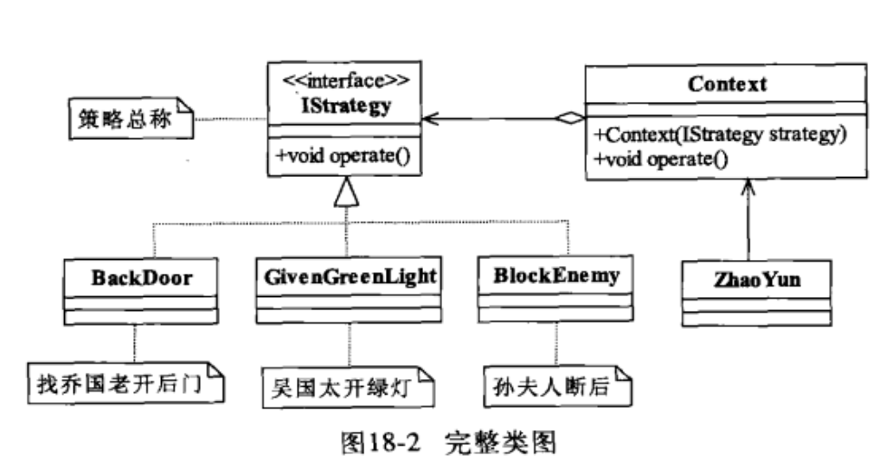
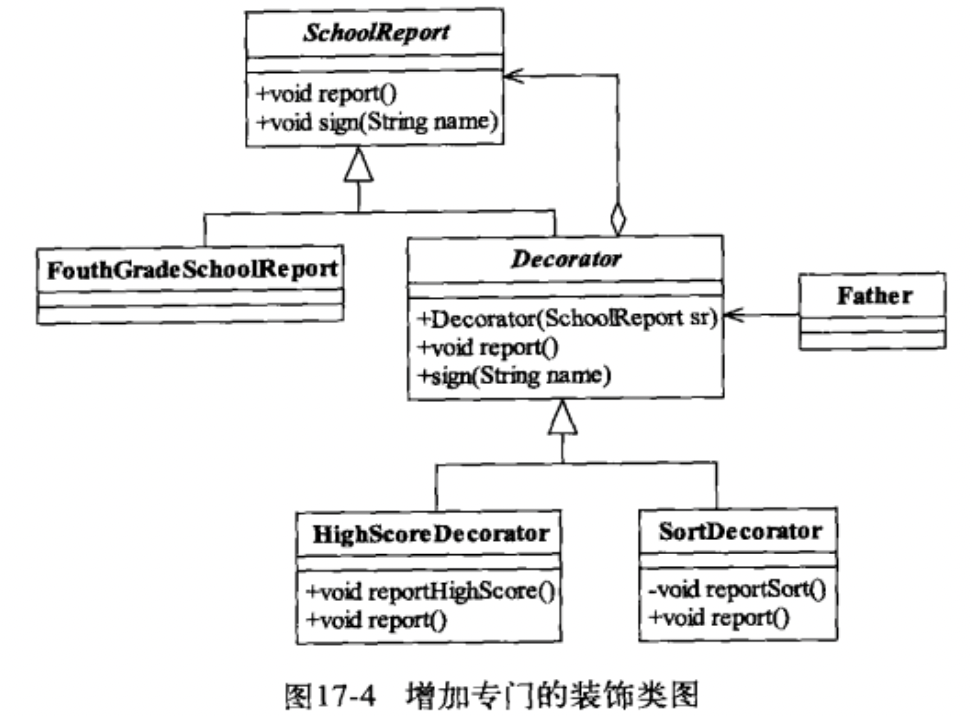

# 设计模式

[TOC]

## 设计模式

设计模式就是讲如何应对变化的。

SOLID

```
Single Responsibility Principle
Open Closed Principle
Liskov Substitution Principle
Law of Demeter
Interface Segregation Principle
Dependence Inversion Principle
```


## 里式替换原则

里式替换原则教我们如何实现子类。

[]() 麻省理工学院教授，04 年获得冯诺依曼奖，08 年获得图灵奖。


### 核心概念

Liskov Substitution Principle LSP 原则

把父类替换成子类，结果不变！

面向接口或父类编程：在类中调用其他类时，务必要使用其他类的父类或者接口，如果不能使用父类或接口，则说明类的设计已经违反了 LSP 原则。

玩具枪案例：如果子类不能完整地实现父类的方法，或者父类的某些方法在子类中已经发生畸变，则建议断开父子继承关系，采用依赖、聚合、组合等关系代替继承。

LSP 可以正着用，但不能反着用。

对于覆盖（重写）来说，父类和子类的同名方法的输入参数是相同的，子类的方法的返回值范围应该小于父类；（肯定要小于父类的，因为客户端是用父类的引用指向子类的对象，如果子类返回的类型父类接不住，那不肯定出错！）

对于重载来说，则要求方法的输入参数类型或数量不相同，在里式替换原则要求下，子类的输入参数要宽于父类的输入参数，这样子类的这个重载方法才不会被调用。（入参范围变大，会产生危险，在调用的时候，就会寻找父类更小入参的方法，进而保证了父类的方法在每一个子类都能被优先执行）。

在采用里式替换原则时，要尽量避免子类的个性。


### Demo

A great example illustrating LSP (given by Uncle Bob in a podcast I heard recently) was how sometimes something that sounds right in natural language doesn't quite work in code.

In mathematics, a `Square` is a `Rectangle`. Indeed it is a specialization of a rectangle. The "is a" makes you want to model this with inheritance. However if in code you made `Square` derive from `Rectangle`, then a `Square` should be usable anywhere you expect a `Rectangle`. This makes for some strange behavior.

Imagine you had `SetWidth` and `SetHeight` methods on your `Rectangle` base class; this seems perfectly logical. However if your `Rectangle` reference pointed to a `Square`, then `SetWidth` and `SetHeight` doesn't make sense because setting one would change the other to match it. In this case `Square` fails the Liskov Substitution Test with `Rectangle` and the abstraction of having `Square` inherit from `Rectangle` is a bad one.

[](https://i.stack.imgur.com/ilxzO.jpg)


## 依赖倒置原则

Dependence Inversion Principle DIP


### 核心概念

模块间的依赖通过抽象发生，实现类之间不发生直接的依赖关系，其依赖关系是通过接口或者抽象类产生的。

六个字：面向接口编程！

接口就是契约，先定好契约，再实现具体的细节。

依赖正置：类间的依赖是实实在在的实现类之间的依赖，也就是面向实现编程，我要开奔驰车就依赖奔驰车，要使用笔记本电脑就直接依赖笔记本电脑。

依赖倒置：类间的依赖是接口之间的依赖，也就是面向接口编程。


## 接口隔离原则

Interface-Segregation Principle


### 核心概念

接口尽量细化，接口中的方法尽量少。

与单一职责不同。单一职责要求的是类与接口职责单一，注重的是职责，是业务逻辑上的划分。而接口隔离原则要求接口的方法尽量少。例如一个接口的职责可能包含 10 个方法，这 10 个方法都放到一个接口中，并且提供给多个模块访问，各个模块按照规定的权限来访问，在系统外通过文档约束「不使用的方法不要访问」，按照单一职责原则是允许的，按照接口隔离原则是不允许的，因为其要求「尽量使用多个专门的接口」。


## 迪米特法则

Law of Demeter


### 核心概念

最少知识原则。一个类对自己需要耦合或调用的类知道得越少越好。

怎么做：解耦！


## 开闭原则

Open Close Principe


### 核心概念

对扩展开放，对修改关闭。

一个软件实体应该通过扩展来实现变化，而不是通过修改已有的代码来实现变化。


## 创建型模式

创建型模式关注点是如何创建对象，其核心思想是要把对象的创建和使用相分离，这样使得两者能相对独立地变换。

### 工厂方法

工厂模式用于定制对象。

定义一个用于创建对象的接口，让子类决定实例化哪一个类。Factory Method使一个类的实例化延迟到其子类。

工厂方法可以隐藏创建产品的细节，且不一定每次都会真正创建产品，完全可以返回缓存的产品，从而提升速度并减少内存消耗。

传入不同的配置，获取不同的初始化对象。就跟工厂加工产品一样。

静态工厂方法（Static Factory Method）：

```java
List<String> list = List.of("A", "B", "C"); // 创建一个 collection

Arrays.asList("a1", "a2", "a3") // 创建一个数组

Integer n = Integer.valueOf(100);

Stream.of("a1", "a2", "a3") // 创建一个 stream
```

工厂方法：

```java
public interface NumberFactory {
    
    static NumberFactory impl = new NumberFactoryImpl(); // 接口中也可以 new 对象
    
    // 创建方法:
    Number parse(String s);

    // 获取工厂实例:
    static NumberFactory getFactory() {
        return impl;
    }
    
}

public class NumberFactoryImpl implements NumberFactory {
    public Number parse(String s) {
        return new BigDecimal(s);
    }
}

NumberFactory factory = NumberFactory.getFactory();
Number result = factory.parse("123.456");
```

总是引用接口而非实现类，能允许变换子类而不影响调用方，即尽可能面向抽象编程。

工厂方法是指定义工厂接口和产品接口，但如何创建实际工厂和实际产品被推迟到子类实现，从而使调用方只和抽象工厂与抽象产品打交道。

实际更常用的是更简单的静态工厂方法，它允许工厂内部对创建产品进行优化。

调用方尽量持有接口或抽象类，避免持有具体类型的子类，以便工厂方法能随时切换不同的子类返回，却不影响调用方代码。

### 生成器


## 装饰设计模式

装饰设计模式：对一组对象的功能进行增强时，就可以使用该模式进行问题的解决。
装饰和继承都能实现一样的特点：进行功能的扩展增强，但是装饰比继承灵活，装饰的特点：装饰类和被装饰类都必须所属同一个接口或者父类。  

Demo:

```java
public class PersonDemo {
    public static void main(String[] args) {
        Person p = new Person();
        // p.chifan();
        NewPerson p1 = new NewPerson(p);
        p1.chifan();
        NewPerson2 p2 = new NewPerson2();
        p2.chifan();
    }
}

class Person{
    void chifan(){
        System.out.println("吃饭");
    }
}

//这个类的出现是为了增强Person而出现的。
class NewPerson{
    private Person p ;
    NewPerson(Person p){
        this.p = p;
    }
    public void chifan(){
        System.out.println("开胃酒");
        p.chifan();
        System.out.println("甜点");
    }
}

class NewPerson2 extends Person{
    public void chifan(){
        System.out.println("开胃酒");
        super.chifan();
        System.out.println("甜点");
    }
}
```


## 模板方法

https://www.liaoxuefeng.com/wiki/1252599548343744/1281319636041762

可见，模板方法的核心思想是：父类定义骨架，子类实现某些细节。

为了防止子类重写父类的骨架方法，可以在父类中对骨架方法使用`final`。对于需要子类实现的抽象方法，一般声明为`protected`，使得这些方法对外部客户端不可见。


## 适配器模式

将一个类的接口转换成客户希望的另外一个接口，使得原本由于接口不兼容而不能一起工作的那些类可以一起工作。

Adapter 模式可以将一个 A 接口转换为 B 接口，使得新的对象符合 B 接口规范。

编写 Adapter 实际上就是编写一个实现了 B 接口，并且内部持有A接口的类：

```java
public BAdapter implements B {
    private A a;
    public BAdapter(A a) {
        this.a = a;
    }
    public void b() {
        a.a();
    }
}
```

在 Adapter 内部将 B 接口的调用“转换”为对A接口的调用。


## 代理模式

https://www.bilibili.com/video/BV1M54y1X78p

在不修改原来对象代码的基础上，对原对象的功能进行修改或者增强。

代理就是跑腿，替身。

目标类：原来的对象

代理类：替身

既然是代理，那么行为必须是一样的！


### 静态代理

代理类需要有和目标类一样的行为，怎么实现呢？

* 基于接口：定义一个接口，代理类和目标类都实现自这个接口，这样两个类就有了同样的行为
* 基于继承：代理类继承自目标类

静态代理的缺点：

一旦接口或者父类发生变动，则代理类的代码就得随之修改，代理类多的时候维护比较麻烦。所以在实际开发中，多使用动态代理。

### 动态代理

动态代理，是在内存中生成代理对象的一种技术。也就是整个代理过程在内存中进行，不需要我们手写代理类的代码，也不会存在代理类编译的过程，而是直接在运行期，在 JVM 中凭空造出一个代理类对象供我们使用。

### 动态代理-基于 jdk

基于接口

JDK 自带的动态代理技术，需要使用一个静态方法来创建代理对象。它要求被代理对象，也就是目标类，必须实现接口。生成的代理对象和原对象都实现相同的接口，是兄弟关系。

基于接口的动态代理，实际上是在内存中生成了一个对象，该对象实现了指定的目标类对象拥有的接口。所有代理类对象和目标类对象是兄弟关系。

兄弟关系：并列的关系，不能互相转换，包容性比较差。在后续会学习 spring 框架，如果配置 jdk 的动态代理方式，一定要用接口类型接收代理类。

### 动态代理-基于 cglib

基于父类

第三方 cglib 动态代理技术，也是可以使用一个静态方法来创建一个代理对象。它不要求目标类实现接口，但是要求目标类不能是最终类，也就是不能被 final 修饰，否则无法继承。因为 cglib 是基于目标类生成该类的一个子类作为代理类，所以目标类必须可以被继承。

基于父类的动态代理，是在内存中生成了一个对象，该对象继承了原对象，所以代理对象实际上是目标类对象的儿子。

父子关系：父子关系，代理类对象是可以用父类的引用接收的。

### 比较

* 静态代理和动态代理，实际使用时，还是动态代理使用得比较多，原因就是静态代理需要自行手写代码，维护、修改非常频繁，会额外引入很多工作量。也不能很好地使用配置完成逻辑地指定，所以使用较少。
* 基于 jdk 和 基于 cglib 的动态代理：
  * 在 Spring 中，默认情况下支持两种动态代理，如果目标类实现了接口，则自动选择 jdk 动态代理，如果目标类没有实现接口，则使用 cglib
  * 我们在开发时，由于基于  jdk 的动态代理要求比较多，更不容易实现，所以很多人习惯于统一配置为使用 cglib 进行代理，也就是 cglib 更通用
  * 如果使用 dubbo + zookeeper，底层进行代理时，最好配置定死使用 cglib 的方式进行代理，因为 dubbo 会使用基于包名的扫描方式进行类的处理，而 jdk 代理生成的包名类似于 `com.sun.proxy` 格式。我们实际需要代理类和目标类保持同样的包名，只有 cglib 能保持原包名不变生成代理类


## 工厂模式

https://www.liaoxuefeng.com/wiki/1252599548343744/1281319170474017


## 策略设计模式

Strategy Pattern


### 类图




### 核心概念

* Context 封装角色

  起承上启下封装作用，屏蔽高层模块对策略的直接访问，封装可能存在的变化。注意，Context 中要提供一个和函数式接口中一样的方法，例如 `void operate()`

* IStrategy

  抽象的策略，实际上是一个函数式接口

* ConcreteStrategy

  具体的策略，函数式接口的具体实现，可以是一个具体的类，也可以是匿名内部类，也可以直接就是一个 lambda 表达式


### SpringBoot 实战

代码结构：

```
├── strategy
│   ├── IQuantStrategy.java
│   ├── QuantContext.java
│   └── quant
│       ├── CriticalStrategy.java
│       └── RiseFallStrategy.java
```

在 SpringBoot 项目中，一个策略就是一个 Bean：

```java
@Component
public class CriticalStrategy implements IQuantStrategy {

    @Resource
    private MailService mailService;

    @Override
    public boolean quant(IG507StockInfoWithMetaInfo ig507StockInfoWithMetaInfo) {
        return true;
    }
}
```


### 优化

`IStrategy` 实际上是一个函数式接口，可以使用 lambda 表达式来简化各个策略。

```java
package strategy;

/**
 * @author wanshuo
 * @date 2022-01-25 16:14:34
 * 折扣策略
 */
public interface IDiscountStrategy {
    /***
     * 施加折扣
     * @param total 总价
     * @return 打折后的价格
     */
    float applyDiscount(float total);

    /***
     * java8 中接口内可以定义静态方法及其实现！
     * 5 折策略
     * @return 策略函数对象
     */
    static IDiscountStrategy halfDiscountStrategy(){
        return total -> total * 0.5f;
    }

    /***
     * 打 8 折的策略
     * @return 策略函数对象
     */
    static IDiscountStrategy eightyDiscountStrategy(){
        return total -> total * 0.8f;
    }
}

class IDiscountStrategyTest {
    @Test
    void strategy(){
        IDiscountStrategy halfDiscountStrategy = IDiscountStrategy.halfDiscountStrategy();
        System.out.println(halfDiscountStrategy.applyDiscount(50));
    }
}
```


### 注意

策略设计模式的重点就是封装角色 Context，它不是代理类，虽然有着和函数式接口一样的方法，但是并没有实现函数式接口，如果实现了函数式接口，就是代理设计模式了。


### 应用案例

* 商场打折促销策略
* 告警策略


## 装饰设计模式

Decorator pattern


### 类图




### 核心概念

装饰模式的核心，是装饰器（装饰类）。

装饰类继承自要装饰的接口，和要装饰的实体类，是兄弟关系。

Decorator 抽象类的目的很简单，就是让其子类来封装 SchoolReport 对象，重写 report 方法。

用继承也可以实现方法的装饰，但是继承太多会变得复杂，而且不容易维护。装饰模式相比生成子类更为灵活。

装饰设计模式是继承的一个替代方法，装饰类不管装饰多少层，返回的仍然是要装饰的对象，还是 is-a 的关系。


### Demo

```java
public abstract class SchoolReport{
  // 成绩报告
  public abstract void report();
  // 签字
  public abstract void sign();
}
// 四年级的成绩报告
public class FouthGradeSchoolReport extends SchoolReport{
  public void report(){
    sout("语文：80 分");
  }
  public void sign(){
    sout("张三");
  }
}

// 下面开始装饰
public abstract class Decorator extends SchoolReport{

    private SchoolReport schoolReport;

    public Decorator(SchoolReport schoolReport){
        this.schoolReport = schoolReport;
    }

    @Override
    public void report() {
        this.schoolReport.report();
    }

    @Override
    public void sign() {
        this.schoolReport.sign();
    }
}

public class HighestScoreDecorator extends Decorator{

    public HighestScoreDecorator(SchoolReport schoolReport) {
        super(schoolReport);
    }

    private void myReport(){
        System.out.println("语文最高分：81");
    }

    /***
     * 想要装饰哪个方法，就重写那个方法
     */
    public void report(){
        this.myReport();
        super.report();
    }
}

public class SortOrderDecorator extends Decorator{

    public SortOrderDecorator(SchoolReport schoolReport) {
        super(schoolReport);
    }

    private void myReport(){
        System.out.println("我排名第 10 名");
    }

    /***
     * 想要装饰哪个方法，就重写那个方法
     */
    public void report(){
        this.myReport();
        super.report();
    }
}

public class Father {
    public static void main(String[] args) {
        SchoolReport schoolReport = new FouthGradeSchoolReport();
        schoolReport = new HighestScoreDecorator(schoolReport);
      	// 不管怎么装饰，返回的都是被装饰的对象
        schoolReport = new SortOrderDecorator(schoolReport);
        schoolReport.report();
    }
}

/**
我排名第 10 名
语文最高分：81
语文：80 分
*/
```


## 参考文献

* [Liskov Substitution Principle in Java](https://www.baeldung.com/java-liskov-substitution-principle) 
* [What is an example of the Liskov Substitution Principle?](https://stackoverflow.com/questions/56860/what-is-an-example-of-the-liskov-substitution-principle)
* [Strategy Design Pattern in Java 8](https://www.baeldung.com/java-strategy-pattern)
* [Strategy Design Pattern with in Spring Boot application](https://ravthiru.medium.com/strategy-design-pattern-with-in-spring-boot-application-2ff5a7486cd8)
* [设计模式之禅](https://book.douban.com/subject/25843319/)
