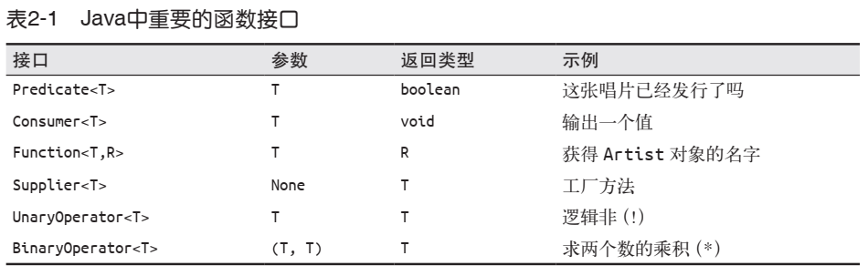
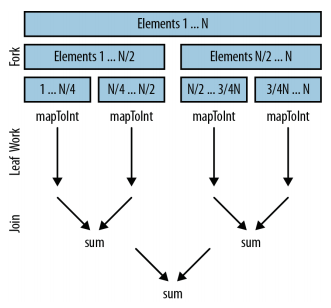

# 函数式编程

[TOC]

## 函数式编程

面向对象编程是对数据进行抽象， 而函数式编程是对行为进行抽象。

## on java 函数式编程

```java
interface Strategy {
    String approach(String msg); // 函数签名，是传入一个 String，返回一个 String
}

Strategy[] strategies = {
    // 分别是函数式接口(匿名类)，lambda表达式，函数引用，三者等价
    new Strategy() { // [2]
        public String approach(String msg) {
            return msg.toUpperCase() + "!";
        }
    },
    msg -> msg.substring(0, 5), // [3] 确实是传入一个 String，返回一个 String，没毛病
    Unrelated::twice // [4]
};
```

**函数签名：参数类型和返回值类型。签名才是一个函数的特征，叫甚么不重要！lambda 表达式甚至不起函数名了，只有输入和输出。**

```java
class Go {
    static void go() {
        System.out.println("Go::go()");
    }
}
public class RunnableMethodReference {
    public static void main(String[] args) {
        // 三者等价
        new Thread(new Runnable() {
            public void run() { // 函数签名：没有传参，没有返回值
                System.out.println("Anonymous");
            }
        }).start();
        new Thread(
            () -> System.out.println("lambda")
        ).start();
        new Thread(Go::go).start();
    }
}
```

java8 允许我们将函数赋值给函数式接口

```java
@FunctionalInterface
interface Functional {
    String goodbye(String arg);
}

public class FunctionalAnnotation {
    public String hehe(String arg) {
        return "Goodbye, " + arg;
    }
    public static void main(String[] args) {
        FunctionalAnnotation fa =
            new FunctionalAnnotation();
        Functional f = fa::hehe; // 将函数赋值给函数式接口
        Functional fl = a -> "Goodbye, " + a; // 将函数赋值给函数式接口
    }
}
```


### lambda 表达式

lambda 表达式就是一个函数，Java8 引入了函数式编程，意在将函数提升为第一公民，函数也可以当作变量进行赋值。

### 方法引用

类名或对象名::方法名

### 函数式接口

`java.util.function` 包旨在创建一组完整的函数式接口，使得我们一般情况下不需再定义自己的接口。  

函数式接口其实都大同小异，接口的名字才是关键，要做到看到接口的名字，就了解这个接口的作用。

函数式接口的命名规则：

1. 如果只处理对象而非基本类型，名称则为 Function， Consumer， Predicate 等。参数类型通过泛型添加。
2. 如果接收的参数是基本类型，则由名称的第一部分表示，如 LongConsumer，DoubleFunction， IntPredicate 等，但返回基本类型的 Supplier 接口例外。
3. 如果返回值为基本类型，则用 To 表示，如 ToLongFunction <T> 和 IntToLongFunction。
4. 如果返回值类型与参数类型一致，则是一个运算符：单个参数使用 UnaryOperator，两个参数使用 BinaryOperator。
5. 如果接收两个参数且返回值为布尔值，则是一个谓词（Predicate）。
6. 如果接收的两个参数类型不同，则名称中有一个 Bi。

| 函数式接口        | 方法        | 返回值类型 | 备注           |
| ----------------- | ----------- | ---------- | -------------- |
| Predicate<T>      | test(T)     | boolean    | 断言           |
| Consumer<T>       | accept(T)   | void       | 只吃不吐       |
| Function<T, R>    | apply(T)    | R          | 输入 T，输出 R |
| BinaryOperator<T> | apply(T, T) | T          | 双飞           |
| Supplier<T>       | get()       | T          | 只吐不吃       |

```java
import java.util.function.*;

class In1 {}
class In2 {}

public class MethodConversion {
    static void accept(In1 i1, In2 i2) {
        System.out.println("accept()");
    }
    static void someOtherName(In1 i1, In2 i2) {
        System.out.println("someOtherName()");
    }
    public static void main(String[] args) {
        BiConsumer<In1,In2> bic;
        bic = MethodConversion::accept;
        bic.accept(new In1(), new In2());
        bic = MethodConversion::someOtherName; // 只要函数签名一致，就可以将函数赋值给函数式接口！
        // bic.someOtherName(new In1(), new In2()); // Nope
        bic.accept(new In1(), new In2());
    }
}
```

```java
import java.util.*;
import java.util.function.*;

class AA {}
class BB {}
class CC {}

public class ClassFunctionals {
    static AA f1() { return new AA(); }
    static int f2(AA aa1, AA aa2) { return 1; }
    static void f3(AA aa) {}
    static void f4(AA aa, BB bb) {}
    static CC f5(AA aa) { return new CC(); }
    static CC f6(AA aa, BB bb) { return new CC(); }
    static boolean f7(AA aa) { return true; }
    static boolean f8(AA aa, BB bb) { return true; }
    static AA f9(AA aa) { return new AA(); }
    static AA f10(AA aa1, AA aa2) { return new AA(); }
    public static void main(String[] args) {
        Supplier<AA> s = ClassFunctionals::f1;
        s.get();
        Comparator<AA> c = ClassFunctionals::f2;
        c.compare(new AA(), new AA());
        Consumer<AA> cons = ClassFunctionals::f3;
        cons.accept(new AA());
        BiConsumer<AA,BB> bicons = ClassFunctionals::f4;
        bicons.accept(new AA(), new BB());
        Function<AA,CC> f = ClassFunctionals::f5;
        CC cc = f.apply(new AA());
        BiFunction<AA,BB,CC> bif = ClassFunctionals::f6;
        cc = bif.apply(new AA(), new BB());
        Predicate<AA> p = ClassFunctionals::f7;
        boolean result = p.test(new AA());
        BiPredicate<AA,BB> bip = ClassFunctionals::f8;
        result = bip.test(new AA(), new BB());
        UnaryOperator<AA> uo = ClassFunctionals::f9;
        AA aa = uo.apply(new AA());
        BinaryOperator<AA> bo = ClassFunctionals::f10;
        aa = bo.apply(new AA(), new AA());
    }
}
```

### 高阶函数

```java
default <V> Function<T, V> andThen(Function<? super R, ? extends V> after) {
    Objects.requireNonNull(after);
    return (T t) -> after.apply(apply(t)); // 注意，这里是，after.apply(this.apply(t))
}
```

### 函数组合

函数组合（Function Composition）意为 “多个函数组合成新函数”。它通常是函数式编程的基本组成部分。  

| 默认方法                     | 作用                                               |      |
| ---------------------------- | -------------------------------------------------- | ---- |
| function1.andThen(function2) | 生成一个新函数，执行完 function1 再执行  function2 |      |
| function1.compose(function2) | 生成一个新函数，先执行 f2，再执行 f1               |      |
| function1.and(function2)     | 生成一个新函数，`function1(x) && function2(x)`     |      |
| function1.or(function2)      | 生成一个新函数，`function1(x) || function2(x)`     |      |
| function.negate()            | 生成一个新函数，`!function(x)`                     |      |

```java
import java.util.function.*;
public class FunctionComposition {
    static Function<String, String>
        f1 = s -> {
        System.out.println(s);
        return s.replace('A', '_');
    },
    f2 = s -> s.substring(3),
    f3 = s -> s.toLowerCase(),
    f4 = f1.compose(f2).andThen(f3);
    public static void main(String[] args) {
        System.out.println(
            f4.apply("GO AFTER ALL AMBULANCES"));
    }
}

//AFTER ALL AMBULANCES
//_fter _ll _mbul_nces
```

```java
import java.util.function.*;
import java.util.stream.*;

public class PredicateComposition {
    static Predicate<String>
        p1 = s -> s.contains("bar"),
    p2 = s -> s.length() < 5,
    p3 = s -> s.contains("foo"),
    p4 = p1.negate().and(p2).or(p3);
    
    public static void main(String[] args) {
        Stream.of("bar", "foobar", "foobaz", "fongopuckey")
            .filter(p4)
            .forEach(System.out::println);
    }
}
```


## Lambda 表达式

Lambda expressions are not unknown to many of us who have worked on other popular programming languages like Scala. **In Java programming language, a Lambda expression (or function) is just an *anonymous function***, i.e., a function with no name and without being bounded to an identifier. They are written exactly in the place where it’s needed, typically *as a parameter to some other function*.

Lambda 表达式是一个函数，是对行为的抽象，是函数是一等公民的体现。

## 函数式接口

**只要碰到只有一个方法的接口，也就是功能单一的接口，就可以直接用 Lambda Expression 来代替。**

**所有的 lambda 表达式，其实际上都是函数式接口的实现**。



| 函数式接口        | 方法        | 返回值类型 | 备注           |
| ----------------- | ----------- | ---------- | -------------- |
| Predicate<T>      | test(T)     | boolean    | 断言           |
| Consumer<T>       | accept(T)   | void       | 只吃不吐       |
| Function<T, R>    | apply(T)    | R          | 输入 T，输出 R |
| BinaryOperator<T> | apply(T, T) | T          | 双飞           |
| Supplier<T>       | get()       | T          | 只吐不吃       |

**所有的 lambda 表达式，其实际上都是以上函数式接口的实现**：

```java
Predicate<Integer> atLeast5 = x -> x >= 5;
// 两者等价
Predicate<Integer> atLeast6 = new Predicate<Integer>() {
    @Override
    public boolean test(Integer integer) {
        return integer >= 6;
    }
};
System.out.println(atLeast6.test(6));
System.out.println(atLeast5.test(5));
```


## Java8 接口新特性

### 默认方法

Collection 接口中增加了新的 stream 方法， 如何能让 MyCustomList 类在不知道该方法的情况下通过编译？ Java 8 通过如下方法解决该问题： Collection 接口告诉它所有的子类：“ 如果你没有实现 stream 方法， 就使用我的吧。” 接口中这样的方法叫作默认方法， 在任何接口中， 无论函数接口还是非函数接口， 都可以使用该方法。

Iterable 接口中也新增了一个默认方法： forEach， 该方法功能和 for 循环类似， 但是允许用户使用一个 Lambda 表达式作为循环体。   

默认方法示例： forEach 实现方式：

```java
default void forEach(Consumer<? super T> action) {
    for (T t : this) {
        action.accept(t);
    }
}
```

重点就在于代码段前面的新关键字 default。 这个关键字告诉 javac 用户真正需要的是为接口添加一个新方法。 除了添加了一个新的关键
字， 默认方法在继承规则上和普通方法也略有区别。

Java 8 允许在接口中加入默认方法（已实现）。

```java
// Demo
public interface Sized {
    // 普通抽象方法，默认是public abstract修饰的，没有方法体
    int size();

    /*
     * 默认方法，有方法体
     * 任何一个实现了Sized接口的类都会向动继承isEmpty的实现
     */
    default boolean isEmpty() {
        return this.size() == 0;
    }
}
```


如果对默认方法的工作原理， 特别是在多重继承下的行为还没有把握， 如下三条简单的定
律可以帮助大家。

1. 类胜于接口。 如果在继承链中有方法体或抽象的方法声明， 那么就可以忽略接口中定义
   的方法。
2. 子类胜于父类。 如果一个接口继承了另一个接口， 且两个接口都定义了一个默认方法，
   那么子类中定义的方法胜出。
3. 没有规则三。 如果上面两条规则不适用， 子类要么需要实现该方法， 要么将该方法声明
   为抽象方法。
   其中第一条规则是为了让代码向后兼容。  

### return statement in lambda

Demo:

```java
public class LambdaReturnTest1 {
   interface Addition {
      int add(int a, int b);
   }
   public static Addition getAddition() {
      return (a, b) -> a + b; // lambda expression return statement 返回一个函数式接口实现
   }
   public static void main(String args[]) {
      System.out.println("The addition of a and b is: " + getAddition().add(20, 50));
      // The addition of a and b is: 70
   }
}
```

Demo:

```java
public class LambdaReturnTest2 {
   public static void main(String args[]) {
      Thread th = new Thread(getRunnable());
      th.run();
   }
   public static Runnable getRunnable() {
      return() -> {    // lambda expression return statement
         System.out.println("Lambda Expression Return Statement");
      };
   }
}
```

### 静态方法

Java 8 允许在接口内定义静态的方法并实现。

Stream 是个接口，Stream.of 是接口的静态方法，of 方法是静态工厂方法，用于生成一个 Stream 对象 。

#### Optional  

A container object which may or may not contain a non-null value. If a value is present, isPresent() will return true and get() will return the value.

使用工厂方法 of， 可以从某个值创建出一个 Optional 对象。 Optional 对象相当于值的容器， 而该值可以通过 get 方法提取。  

Optional 是为核心类库新设计的一个数据类型， 用来替换 null 值。  

reduce 方法的一个重点尚未提及： reduce 方法有两种形式， 一种如前面出现的需要有一个初始值， 另一种变式则不需要有初始值。 没有初始值的情况下， reduce 的第一步使用Stream 中的前两个元素。 有时， reduce 操作不存在有意义的初始值， 这样做就是有意义
的， 此时， reduce 方法返回一个 Optional 对象。  

```
Optional
Optional
Optional
empty
equals
filter
flatMap
get
hashCode
ifPresent
isPresent
map
of
ofNullable
orElse
orElseGet
orElseThrow
toString
EMPTY 返回一个 Optional 容器，容器中没有值
value
```

使用 Optional 对象的方式之一是在调用 get() 方法前， 先使用 isPresent 检查 Optional对象是否有值。 使用 orElse 方法则更简洁， 当 Optional 对象为空时， 该方法提供了一个备选值。 如果计算备选值在计算上太过繁琐， 即可使用 orElseGet 方法。 该方法接受一个 Supplier 对象， 只有在 Optional 对象真正为空时才会调用。
使用 orElse 和 orElseGet 方法：

```java
assertEquals("b", emptyOptional.orElse("b"));
assertEquals("c", emptyOptional.orElseGet(() -> "c"));
```


Optional 对象不仅可以用于新的 Java 8 API， 也可用于具体领域类中， 和普通的类别无二致。 当试图避免空值相关的缺陷， 如未捕获的异常时， 可以考虑一下是否可使用 Optional 对象。  

## 高级集合类和收集器

### 方法引用 替代 lambda

方法引用的使用场景：在 lambda 表达式中调用方法的时候，可以使用方法引用替代 lambda 表达式

标准语法为: `Classname::methodName  `

lambda 表达式就是一个函数，是对行为的封装。

```java
artist -> artist.getName()
// 用方法引用重写上面的 Lambda 表达式
Artist::getName
```

构造函数语法：

```java
(name, nationality) -> new Artist(name, nationality)
// 方法引用形式    
Artist::new
```

创建数组：

```java
String[]::new
```

### 收集器 Collector Collectors

Collector, 一种通用的、 从流生成复杂值的结构  

## 并行计算

只要将 `Stream()` 改成 `parallelStream()`，就可以启动并行计算。

并行计算常和 flatMap 结合。

不建议对 Set 进行并行计算，因为太难分解。

并行的控制需要消耗额外的计算资源，只有在数据量很大的时候，才适合做并行计算

### flatMap

flatMap 用于处理类似这样的数据结构：`[[], [], []]`，所以常用于并行计算。

```java
public int parallelArraySum() {
    return albums.parallelStream()
        .flatMap(Album::getTracks)
        .mapToInt(Track::getLength)
        .sum();
}
```

### 并行计算的原理

```java
private int addIntegers(List<Integer> values) {
    return values.parallelStream()
        .mapToInt(i -> i)
        .sum();
}
```




```java
/**
    * 并行打印，看看结果
    * @param
    * @return
    */
public void parallelPrint(){
    IntStream.range(0, 10).parallel().forEach(i -> {
        System.out.println(i);
    });
}
```

```
6
5
1
0
2
3
9
7
8
4
```


## Reference

https://github.com/RichardWarburton/java-8-Lambdas-exercises  