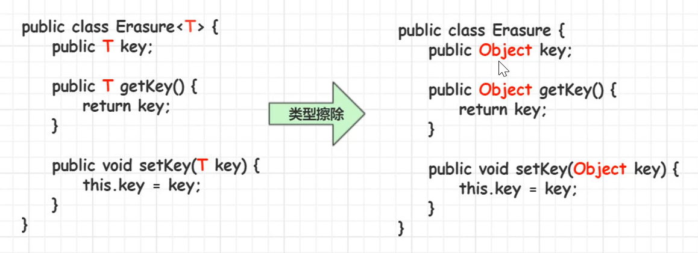
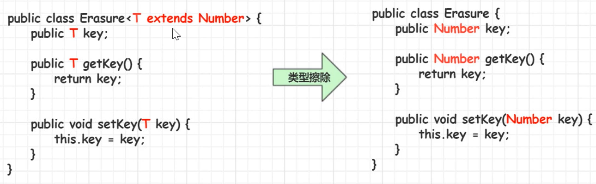
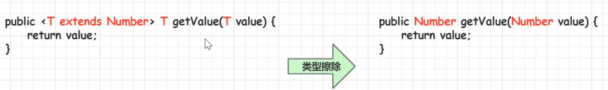
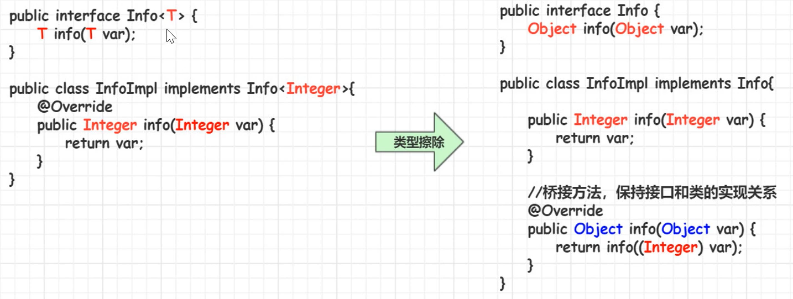

# 泛型详解

[TOC]

## 泛型视频教程

泛型可以用来修饰类、接口、方法、参数、返回值

[JavaSE强化教程泛型，由点到面的讲解了整个泛型体系](https://www.bilibili.com/video/BV1xJ411n77R)

### 泛型类

泛型类在创建对象的时候，如果没有制定类型，则按照 Object 类型来操作。

泛型类不支持基本数据类型。

**同一泛型类，根据不同的数据类型创建的对象，本质上是同一类型。**

泛型类的一个例子：抽奖。

从泛型类派生的子类：

* 子类也是泛型类，则子类和父类的泛型类型一致

  ```java
  class ChindGeneric<T> extends Generic<T>
      
  class ChindGeneric<T,K,E> extends Generic<T>    
  ```

* 子类不是泛型类，则父类要明确泛型的数据类型

  ```java
  class ChindGeneric extends Generic<String>
  ```

### 泛型接口

* 实现类不是泛型类，接口要明确数据类型
* 实现类也是泛型类，实现类和接口的泛型类型要一致，要保证实现接口的泛型类泛型标志包含泛型接口的泛型标志

### 泛型方法

* 泛型类，是在实例化类的时候，指定泛型的具体类型
* 泛型方法，是在调用方法的时候指明泛型的具体类型

泛型方法使方法独立于类而产生变化。

只有声明了 <T> 的方法，才是泛型方法，泛型类中使用了泛型的成员方法并不是泛型方法。<T> 表示该方法将使用泛型类型 T，与泛型类的定义一样，T 可以随便写成任意标志，常见的如：T、E、K、V

```java
// 这是泛型类中定义的成员方法，并不是泛型方法 
public T getProduct(){
     product = list.get(random.nextInt(list.size()));
     return product;
 }

// 定义一个泛型方法
public <E> E getProduct(ArrayList<E> list){
    product = list.get(random.nextInt(list.size()));
    return product;
}
// 调用泛型方法
ArrayList<String> strList = new ArrayList<>();
strList.add("笔记本电脑");
strList.add("苹果手机");
ProductGetter<Integer> productGetter = new ProductGetter<>();
String product = productGetter.getProduct(strList);
```

泛型方法可以定义成静态，泛型类的成员方法不能定义为静态方法。

#### 静态泛型方法

```java
public static <T,E,K> void printType(T t, E e, K k){
    sout(t + "\t" + t.getClass().getSimpleName);
    sout(e + "\t" + e.getClass().getSimpleName);
    sout(k + "\t" + k.getClass().getSimpleName);
}

ProductGetter.printType(100, "java", true);

```


#### 泛型方法可变参数

```java
public static <E> void print(E... e){
    for(E e1 : e){
        sout(e1); 
    }
}

ProductGetter.print(1, 2, 3, 4, 5);
ProductGetter.print("a", "b", "c", "d", "e");
```

### 类型通配符 ?

类型通配符一般是使用 "?" 代替具体的类型**实参**。

```java
Box<Number> box1 = new Box<>();
box1.setFirst(100);
showBow(box1);

Box<Integer> box2 = new Box<>();
box2.setFirst(200);
showBox(box2);

public static void showBox(Box<?> box){
    Object first = box.getFirst();
    sout(first);
}
```

#### 上限 extends

类 / 接口 <? extends 实参类型>

```java
ArrayList<Animal> animals = new ArrayList<>();
ArrayList<Cat> cats = new ArrayList<>();
ArrayList<MiniCat> miniCats = new ArrayList<>();
showAnimal(animals); // X
showAnimal(cats); // √
showAnimal(miniCats); // √

public static void showAnimal(ArrayList<? extends Cat> list){
    // list.add(new Cat()); // x
    // list.add(new MiniCat()); // x 因为传过来的是一个实参，我们并不知道 list 里面存储的到底是甚么类型的对象，如果传的是 ArrayList<MiniCat>，那么 list.add(new Cat()) 肯定不行，MiniCat 接不住 Cat，所以 extends 不允许 add
    for(int i=0; i<list.size(); i++){
        Cat cat = list.get(i); // 拿上限 Cat 来接
        sout(cat);
    }
}
```

#### 下限 super

类 / 接口 <? super 实参类型>

要求该泛型的类型，只能是实参类型，或实参类型的父类类型

```java
ArrayList<Animal> animals = new ArrayList<>();
ArrayList<Cat> cats = new ArrayList<>();
ArrayList<MiniCat> miniCats = new ArrayList<>();
showAnimal(animals); // √ 
showAnimal(cats); // √
showAnimal(miniCats); // x

public static void showAnimal(ArrayList<? super Cat> list){
    list.add(new Cat()); // √ 传过来的是 Cat 的父类集合，Cat 和 MiniCat 都能接住！所以 super 可以 add
    list.add(new MiniCat()); // √
    for(Object o : list){ // 拿上限 Object 来接
        sout(o)
    }
}
```

TreeSet 例子：

TreeSet 的 Comparator 构造函数为：

```java
public TreeSet(Comparator<? super E> comparator) {
    this(new TreeMap<>(comparator));
}
```

```java
TreeSet<Cat> treeSet = new TreeSet<>(new Comparator2()); // √ 根据 <? super Cat> 的规则，必须传 Cat 的父类比较器
TreeSet<Cat> treeSet = new TreeSet<>(new Comparator1()); // √ 
TreeSet<Cat> treeSet = new TreeSet<>(new Comparator3()); // × 
treeSet.add(new Cat("jerry", 20));
treeSet.add(new Cat("amy", 19));
treeSet.add(new Cat("frank", 22));


// Animal 类的比较器，继承自泛型接口，需要实现 compare 方法
class Comparator1 implements Comparator<Animal> {
    @Override
    public int compare(Animal o1, Animal o2){
        return o1.name.compare(o2.name);
    }
}
// Cat 类的比较器
class Comparator2 implements Comparator<Cat> {
    @Override
    public int compare(Cat o1, Cat o2){
        return o1.age - o2.age;
    }
}
// MiniCat 类的比较器
class Comparator3 implements Comparator<MiniCat> {
    @Override
    public int compare(MiniCat o1, MiniCat o2){
        return o1.level - o2.level;
    }
}
```

### 类型擦除

泛型是 Java1.5 版本引入的概念，在这之前是没有泛型的，但是泛型代码能够很好地和之前版本的代码兼容。这是因为，泛型信息只存在于代码编译阶段，编译完后，类型就擦除了！在进入 JVM 之前，与泛型相关的信息会被擦除掉，我们称之为类型擦除。(JVM 里面根本没有泛型这玩意)

```java
ArrayList<Integer> intList = new ArrayList<>();
ArrayList<String> strList = new ArrayList<>();

sout(intList.getClass().getSimpleName()); // ArrayList
sout(strList.getClass().getSimpleName()); // ArrayList

sout(intList.getClass() == strList.getClass()); // true
```

#### 无限制类型擦除



```java
Erasure<Integer> erasure = new Erasure<>();
// 利用反射获取 key 的类型
Class<? extends Erasure> clz = erasure.getClass();
Field[] declaredFields = clz.getDeclaredFields();
for(Field declaredField : declaredFields){
    sout(declaredField.getName() + " : " + declaredField.getType().getSimpleName());
}
// key:Object key 是 Object 类型
```

#### 有限制类型擦除

按照上限进行类型擦除



```java
Erasure<Integer> erasure = new Erasure<>();
// 利用反射获取 key 的类型
Class<? extends Erasure> clz = erasure.getClass();
Field[] declaredFields = clz.getDeclaredFields();
for(Field declaredField : declaredFields){
    sout(declaredField.getName() + " : " + declaredField.getType().getSimpleName());
}
// key:Number key 是 Number 类型
```

#### 擦除方法中类型定义的参数



#### 桥接方法



### 泛型数组

可以声明带泛型的数组引用，但是不能直接创建带泛型的数组对象

```java
ArrayList<String>[] listArr = new ArrayList<String>[5]; // x 只能声明引用，不能创建带泛型的数组对象
ArrayList[] arr = new ArrayList[5];
ArrayList<String>[] listArr; // √ 只能声明引用，然后赋值
listArr = arr; // √
ArrayList<String>[] listArr = new ArrayList[5]; // √ 
```

可以通过 `java.lang.reflect.Array 的 newInstance(Class<T>, int)` 创建 `T[]` 数组

```java
public class Fruit<T>{
    private T[] array;
   
    public Fruit(Class<T> clz, int length){
        // 通过 Array.newInstance 创建泛型数组
        array = (T[])Array.newInstance(clz, length);
    }
}
```

### 泛型和反射

下面介绍泛型对反射的支持。

反射常用的泛型类：

* Class<T>
* Constructor<T>

```java
Person{
    private String name;
}

Class<Person> personClass = Person.class;
Constructor<Person> constructor = personClass.getConstructor();
Person person = constructor.newInstance();

// 对比
Class personClass = Person.class;
Constructor constructor = personClass.getConstructor();
Object o = constructor.newInstance();
```


## 教程

* [Oracle Generic Blog](https://www.oracle.com/cn/technical-resources/articles/java/juneau-generics.html)
* [黑马程序员：JavaSE强化教程泛型，由点到面的讲解了整个泛型体系](https://www.bilibili.com/video/BV1xJ411n77R)

