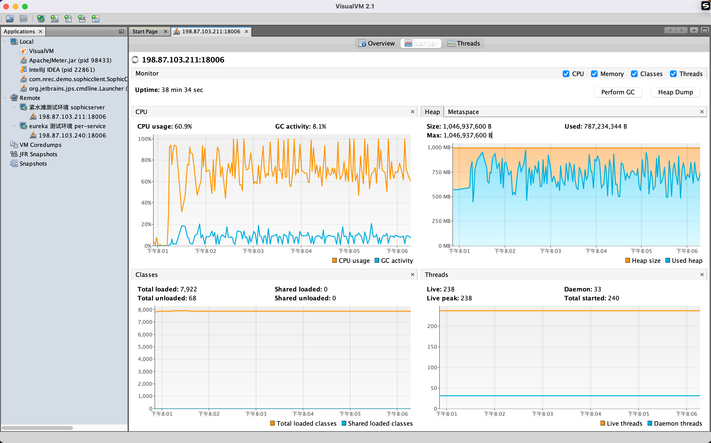

# java 虚拟机


## Java 程序性能监测 visualvm

```shell
# run
cd bin
./visualvm
```


配置 Java 程序性能监控：

```shell
java -Djava.rmi.server.hostname=198.87.103.211 \
-Dcom.sun.management.jmxremote=true \
-Dcom.sun.management.jmxremote.port=18006 \
-Dcom.sun.management.jmxremote.authenticate=false \
-Dcom.sun.management.jmxremote.ssl=false \
-jar -XX:MetaspaceSize=128m -XX:MaxMetaspaceSize=128m -Xms1024m -Xmx1024m -Xmn256m -Xss256k -XX:SurvivorRatio=8 -XX:+UseConcMarkSweepGC xxx.jar
```

hostname 是 ip 地址，port 是 jmx 监控端口。


