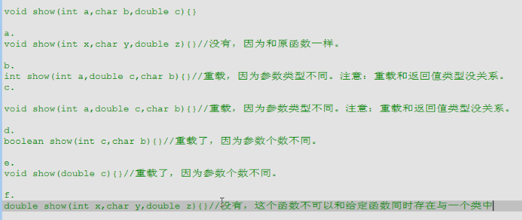

# Java

[TOC]

## 基础

* Java 先编译，再解释执行：
  1. `javac foo.java` 编译 Java 源文件生成字节码文件：`foo.class`
  2. `java foo.class` 用虚拟机解释执行字节码文件

### 命名规范

* 类名：`HelloJava`
* 类的成员变量、局部变量、成员方法：`firstDay`，`getName()`
* 常量：`MAX_VALUE`

## 数组

### 内存

**栈内存**

存储的都是局部变量， 而且变量所属的作用域一旦结束，该变量就自动释放。  

**堆内存**

存储是数组和对象(其实数组就是对象) 凡是new建立在堆中。

特点：

1. 每一个实体都有首地址值
2. 堆内存中的每一个变量都有默认初始化值，根据类型的不同而不同。整数是0，小数0.0或者0.0f，boolean false char '\u0000'
3. 垃圾回收机制

## 函数

### 构造函数

**特点**

* 函数名与类名相同

* 不用定义返回值类型

* 不可以 return

**作用**

* 给对象初始化

**注意**

* 构造函数是可以重载的，也就是可以有多种对象初始化方式

* 默认的构造函数，类可以没有构造函数

  当一个类中没有定义构造函数时，系统会默认给该类加入一个空参数的构造函数，例如 `Person(){}` 当自定义构造函数后，默认的构造函数就没了

* 什么时候需要构造函数？

  分析事物时，该事物一开始就具备某些某些属性或行为，那么将这些 内容定义在构造函数中

### 构造代码块

**作用**

* 定义所有对象的共性，给对象进行初始化，对象一建立就运行，而且先于构造函数执行
* 每 new 一个对象，构造代码块就运行一次

**构造代码块和构造函数的区别**

构造代码块是给所有对象进行统一初始化，而构造函数是给对应的对象初始化（对象也许有重载）

```java
// 构造代码块是定义每一个对象的共性
{
    System.out.println("person code run");
}
```


### void

如果函数没有具体返回值，那么返回值类型可以用 `void` 来表示，函数中 `return` 可以不写，也可以写成 `return;`

### 重载

**重载与返回值类型无关**，只看参数类型是否不一样，参数类型不一样并且函数名一样则重载。

java是严谨性语言，如果函数出现的调用的不确定性，会编译失败。



