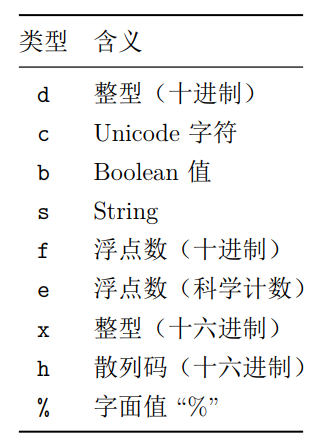
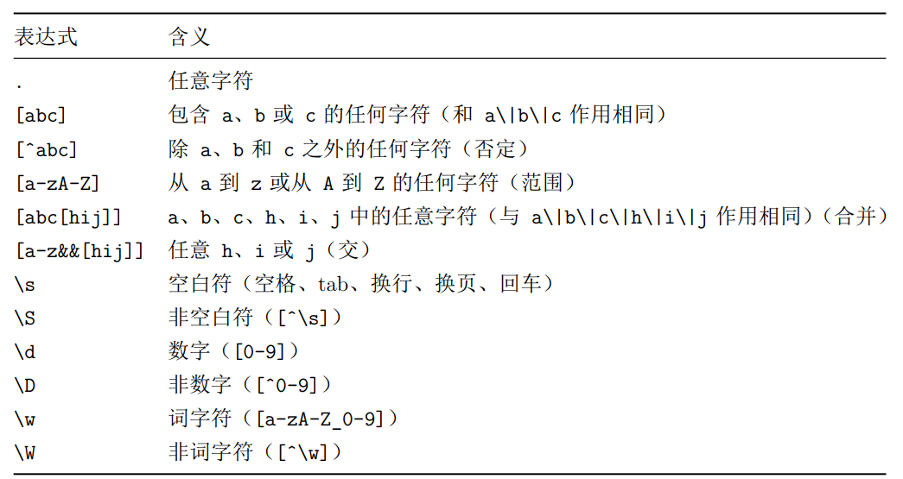
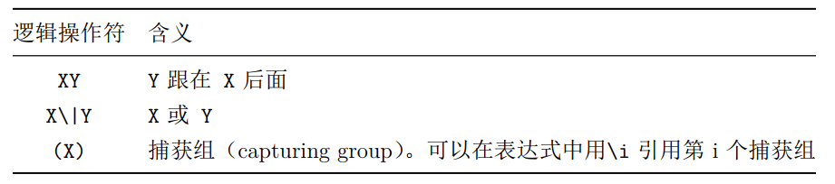
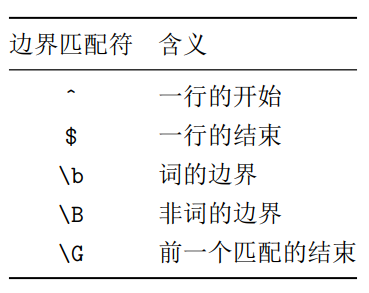

# Java String

[TOC]

## + 的重载与 StringBuilder

Java 唯一重载的两个操作符：+，+=。`+` 在 Java 中不仅用于 + 数值，还用于 + 字符串。

Java 的编译器会对字符串 + 的操作用 StringBuilder 进行优化

```java
public class Concatenation {
    public static void main(String[] args) {
        String mango = "mango";
        String s = "abc" + mango + "def" + 47;
        System.out.println(s);
    }
}
```

上面的代码，被编译器编译优化为：

```
public class Concatenation {
  public Concatenation();
    Code:
       0: aload_0
       1: invokespecial #1                  // Method java/lang/Object."<init>":()V
       4: return

  public static void main(java.lang.String[]);
    Code:
       0: ldc           #2                  // String mango
       2: astore_1
       3: new           #3                  // class java/lang/StringBuilder
       6: dup
       7: invokespecial #4                  // Method java/lang/StringBuilder."<init>":()V
      10: ldc           #5                  // String abc
      12: invokevirtual #6                  // Method java/lang/StringBuilder.append:(Ljava/lang/String;)Ljava/lang/StringBuilder;
      15: aload_1
      16: invokevirtual #6                  // Method java/lang/StringBuilder.append:(Ljava/lang/String;)Ljava/lang/StringBuilder;
      19: ldc           #7                  // String def
      21: invokevirtual #6                  // Method java/lang/StringBuilder.append:(Ljava/lang/String;)Ljava/lang/StringBuilder;
      24: bipush        47
      26: invokevirtual #8                  // Method java/lang/StringBuilder.append:(I)Ljava/lang/StringBuilder;
      29: invokevirtual #9                  // Method java/lang/StringBuilder.toString:()Ljava/lang/String;
      32: astore_2
      33: getstatic     #10                 // Field java/lang/System.out:Ljava/io/PrintStream;
      36: aload_2
      37: invokevirtual #11                 // Method java/io/PrintStream.println:(Ljava/lang/String;)V
      40: return
}
```

编译器自动引入了 java.lang.StringBuilder 类。虽然源代码中并没有使用 StringBuilder 类，但是编译器却自作主张地使用了它，就因为它更高效。但是编译器远远没有那么智能，还是要显式地创建 StringBuilder，并且如果知道最终字符串的大概长度，那预先指定 StringBuilder 的大小可以避免频繁地重新分配缓冲。

举例：

```java
public class WhitherStringBuilder {
    // 编译器会在每一次循环中，都创建一个 StringBuilder
    public String implicit(String[] fields) {
        String result = "";
        for(String field : fields) {
            result += field;
        }
        return result;
    }
    // 编译器只会创建一个 StringBuilder
    public String explicit(String[] fields) {
        StringBuilder result = new StringBuilder();
        for(String field : fields) {
            result.append(field);
        }
        return result.toString();
    }
}
```

因此，当你为一个类编写 toString() 方法时，如果字符串操作比较简单，那就可以信赖编译器，它会为你合理地构造最终的字符串结果。但是，如果你要在 toString() 方法中使用循环，且可能有性能问题，那么最好自己创建一个 StringBuilder 对象，用它来构建最终结果。

bad case:

```java
// 编译器就会掉入陷阱，从而为你另外创建一个 StringBuilder 对象处理括号内的字符串操作
append(a + ": " + c)
```

StringBuilder 的常见方法：

```
insert
replace
substring
reverse
append
toString
delete
```

StringBuilder 是 Java SE5 引入的，在这之前用的是 StringBuffer。后者是线程安全的（参见并发编程），因此开销也会大些。使用 StringBuilder 进行字符串操作更快一点。  


## 字符串方法

列举一些平时会忽略的方法：

| 方法           | 作用                                                         | 备注             |
| -------------- | ------------------------------------------------------------ | ---------------- |
| indexOf        | 如果该 String 并不包含此参数，就返回-1；否则返回此参数在 String 中的起始索引。 |                  |
| lastIndexOf    | lastIndexOf() 是从后往前搜索                                 |                  |
| matches        | 传入一个正则表达式，返回 boolean 结果，以表明该 String 和给出的正则表达式是否匹配 |                  |
| split          | 按照正则表达式拆分String，返回一个结果数组                   |                  |
| join           | 用分隔符拼接字符片段，产生一个新的 String                    | java8 引入       |
| replace()      | 返回替换字符后的新String 对象。如果没有替换发生，则返回原始的String 对象 | 不支持正则表达式 |
| replaceFirst() | 返回替换所有目标字符串后的 String 对象                       | 支持正则表达式   |
| replaceAll()   | 返回替换所有目标字符串后的 String 对象                       | 支持正则表达式   |
| format()       | 返回格式化结果 String                                        |                  |

当需要改变字符串的内容时， String 类的方法都会返回一个新的 String 对象。同时，如果内容不改变， String 方法只是返回原始对象的一个引用而已。这可以节约存储空间以及避免额外的开销。 


## 字符串格式化



 demos:

```java
// %d 表示一个整数, %f 表示一个浮点数
System.out.printf("Row 1: [%d %f]%n", x, y);

// %s 表示一个字符串
String.format("i love %s", "you");
```


## Java 正则表达式

反斜线：

Java 中的转义字符是：`\\`。

在其他语言中， `\\` 表示 “我想要在正则表达式中插入一个普通的（字面上的）反斜线，请不要给它任何特殊的意义。 ” 而在 Java 中， `\\` 的意思是 “我要插入一个正则表达式的反斜线，所以其后的字符具有特殊的意义。 ”  例如，如果你想表示一位数字，那么正则表达式应该是 `\\d`。如果你想插入一个普通的反斜线，应该这样写 `\\\`。不过换行符和制表符之类的东西只需要使用单反斜线： `\n\t`。  







demos:

```java
System.out.println("-1234".matches("-?\\d+"));
System.out.println("5678".matches("-?\\d+"));
System.out.println("+911".matches("-?\\d+")); // false
// 在正则表达式中，用括号将表达式进行分组，用竖线 | 表示或操作。这个正则表达式表示字符串的起始字符可能是一个 - 或 +，或者二者都没有（因为后面跟着 ? 修饰符）。因为字符 + 在正则表达式中有特殊的意义，所以必须使用 \\ 将其转义，使之成为表达式中的一个普通字符。
System.out.println("+911".matches("(-|\\+)?\\d+")); // true

// \\W，它的意思是一个非单词字符（如果 W 小写， \\w，则表示一个单词字符）
split("n\\W+"); // 'n' followed by non-words

s.replaceFirst("f\\w+", "located"));
// 将 shrubbery|tree|herring 替换为 banana
s.replaceAll("shrubbery|tree|herring","banana"));
```


## 正则表达式相关类

Pattern, Matcher

注意：group(0) 表示匹配到的整个，如果正则表达式包含括号，则 group(1) 表示匹配到的第一个括号内的内容。

Capturing groups are indexed from left to right, starting at one. Group zero denotes the entire pattern, so the expression m.group(0) is equivalent to m.group().

```java
/*
* 获取
* 将正则规则进行对象的封装。
* Pattern p = Pattern.compile("a*b");
* //通过正则对象的 matcher 方法字符串相关联。获取要对字符串操作的匹配器对象Matcher .
* Matcher m = p.matcher("aaaaab");
* //通过Matcher匹配器对象的方法对字符串进行操作。
* boolean b = m.matches();
*/
public static void functionDemo_4() {
    String str = "da jia hao,ming tian bu fang jia!";
    String regex = "\\b[a-z]{3}\\b"; // \b boundary 例如 \bthe\b 匹配 the 而不是匹配 other
    //1,将正则封装成对象。
    Pattern p = Pattern.compile(regex);
    //2, 通过正则对象获取匹配器对象。
    Matcher m = p.matcher(str);
    //使用Matcher对象的方法对字符串进行操作。
    //既然要获取三个字母组成的单词
    //查找。 find();
    System.out.println(str);
    while(m.find()){
        System.out.println(m.group());//获取匹配的子序列
        System.out.println(m.start() + ":" + m.end()); // Returns the start index of the previous match.
    }
}
```


## Scanner

```java
public class ThreatAnalyzer {
    static String threatData =
            "58.27.82.161@08/10/2015\n" +
                    "204.45.234.40@08/11/2015\n" +
                    "58.27.82.161@08/11/2015\n" +
                    "58.27.82.161@08/12/2015\n" +
                    "58.27.82.161@08/12/2015\n" +
                    "[Next log section with different data format]";
    public static void main(String[] args) {
        Scanner scanner = new Scanner(threatData);
        String pattern = "(\\d+[.]\\d+[.]\\d+[.]\\d+)@" +
                "(\\d{2}/\\d{2}/\\d{4})";
        while(scanner.hasNext(pattern)) {
            scanner.next(pattern);
            MatchResult match = scanner.match();
            // String wholeMatch = match.group(0); 
            String ip = match.group(1);
            String date = match.group(2);
            System.out.format(
                    "Threat on %s from %s%n", date,ip);
        }
    }
}
```


## isEmpty isBlank

isEmpty: `"", "  "`

isBlank: `"", "  ", null`

isBlank 校验的范围更大
