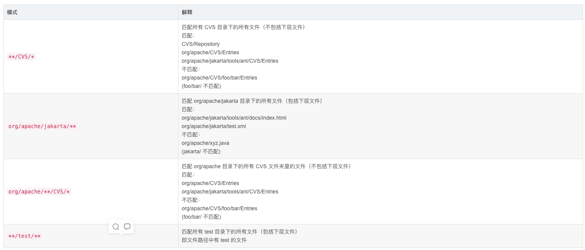

# 正则表达式

[TOC]

## 正则表达式替换

```
'(measure_site)\.(.*?views.*?)(\..*)'
(\1)_(\2)(\3)

用于将 'measure_site.views_showx.config_tasklist_groupby_source' 替换成 measure_site_views_showx.config_tasklist_groupby_source

p
```

## 正则表达式符号的优先级

| <  the ^ $ < * + ? {}  < ()

## 正则表达式工具

http://tool.oschina.net/regex/#

**可以用Notepad++的正则表达式功能去测试**

经过测试，这个在线工具和python的正则表达式是没有冲突的，完美匹配

提供了很多正则表达式的模板

## 重点

1. 转义字符为 `\`, ` \` 在正则表达式中也是特殊字符,需要转义才能用,也就是说,在匹配的时候,要用两个 \\ 来匹配 \
2. findall中千万不要加() ，真的很烦，操，就算加了（），那么写完的正则表达式，也不要再findall中测试，不知道返回的什么玩意。如果findall的pattern中存在捕获组，也就是括号，那么整个表达式匹配的文本不会包含在返回的文本中，而是返回每一个括号匹配文本构成的tuple
   例如`re.findall(r'(\d{4})-(\d{2})-(\d{2})'), '2018-02-10 2018-12-30'` 返回的结果为` [('2018','2','10'),('2018','12','30')]`
3. 正则表达式有可能把字符串末的换行符替换掉，那么字符串就不能换行了！！(regex)代表一个分组，假设我们匹配了五个分组，在后面的遍历item中，item[0]就代表第一个()所指代的内容，item[1]就代表第二个()所指代的内容，以此类推。
4. 正则表达式前面要加** r** ，这样就避免了字符的转义，r 为原生字符
5. **` . `号不能匹配换行符 \n，可以匹配空格**
6. `\s` 能够匹配换行符，而不是只匹配空格，所以如果想匹配空格，最保险的方法是直接输入一个空格 
7. 正则表达式只能匹配一行的内容，如果需要跨行匹配，则需要把文本的所有行拼在一起，也就是把换行符都删掉 `str.replace("\n", " ")`
8. `\d` 只能匹配 0-9，不能匹配负数！！！
9. 匹配 0 个或 1 个：`?`


## 常见的正则表达式

```
匹配url
re_url = '(https?|ftp|file)://[-A-Za-z0-9+&@#/%?=~_|!:,.;]+[-A-Za-z0-9+&@#/%=~_|]'

匹配汉字
re_chinese = '[\u4e00-\u9fa5]'
```

## 正则表达式的规则

### 枚举

```
枚举
[aA]  [万玩晚] [a-z] [A-Z] [0-9] [abcd]

范围表示法的本质：根据字符对应的ASCII码顺序，可以是 [0-3], 但是不可以逆序:[3-0]
```

### ^ 的用法

```
^ 的两种用法
1. 非  ^
[^A-Z] 开头不是大写字母
[^Ss] 开头不是字母 s
[^\.] 开头不是 .
注意，如果开头是取非符号的话，那么 [] 所有枚举的都不匹配

2. 表示以什么为开头
http://www.baidu.com
^http 能匹配到 http
^ttp   不能匹配到 ttp，因为找不到以 t 开头的字符串

注意 ^ 只有在开头才起作用，而且只能用在 [ ]中
[a^b] 只能匹配 a，^ 或者 b
a^b 只能匹配 a^b
```

---

```
可选可不选 ?

原则：就近原则

colou?r 可以匹配 color 或者 colour

```

---

```
0 个或 任意多个  *

wansho* 可以匹配 wansho,wanshoo,wanshooo,wanshoooo
[ab]*可以匹配 aaabbabaabb,aaab,aaa,bbb,ababab

```

---

```
1个或任意多个  +

和上面类似
```

---

```
匹配任意字符

你好.*请问.* 　可以匹配　你好，我是，请问。。。 注意不能匹配换行
```

---

```
匹配词的边界 
\b     boundary
例如 \bthe\b 匹配 the 而不是匹配 other
```

---

```
或者  |

| 的优先级最低，可以用来括住两个正则表达式

dog|cat 能匹配dog,cat
.*请问.*|.*吗.*|.*是不是.*|.*问题.*|.*咋.*|.*什么.*|.*有没有.*  可以匹配一些提问

```

---

```
括号 ()

可以括住任何东西，经常和 | 合作

举例：
NLPLove Deep Learning
re : (NLP)|(\bDeep\b)
result : NLP Deep
```

---

```
正则的贪心性

举例:
[a-z]*  会匹配最长能匹配到的字符串

默认是贪婪模式；在量词后面直接加上一个问号？就是非贪婪模式。例如?

```

### 保留字符 (转义)

```
转义字符

对于正则表达式中的一些符号，如果想用作字符的话，需要进行转义
例如 匹配 ？  ： \?

所有的元字符 ：
. ^ $ * + ? { } [ ] \ | ( )
在使用时都需要转义

```

---

```
特殊字符


\t 匹配一个tab
\n 匹配一个换行
\* 匹配一个 * 号
\w 匹配 [a-z0-9A-Z] 还有下划线
\W 匹配 ^\w
\s 匹配 空格
\d 匹配数字
\D 匹配非数字

```

---

```
出现次数

{n} 出现了n次
{n,m} 出现 n 到 m 次
{n,} 不少于 n 次
```

---

```
替换

举例：
the (.*)er they are, the \1er they will be 

the \1 will be replaced by whatever string matched the first item in parenteses().

the (.*)er they (.*), the \1er we \2

给每个单词加引号

notepad++ 匹配目标： (.+)
替换为： "\1"
 
```

---

```
特殊符号：
^ 定位到字符串的起始位置，也就是从字符串开头进行匹配
$ 定位到字符串末尾
如果一个正则表达式是： ^123$ ,那么该字符串就是匹配整个字符串都是123的字符
```


## Ant 模式匹配

`*` ：匹配 0 个或多个字符（不包含[分隔符](https://so.csdn.net/so/search?q=分隔符&spm=1001.2101.3001.7020) `/`）
`?` ：匹配一个字符
`**` ：匹配 0 个或多个目录（如果模式以 `/` 或 `\` 结尾，则会自动补上 **）

