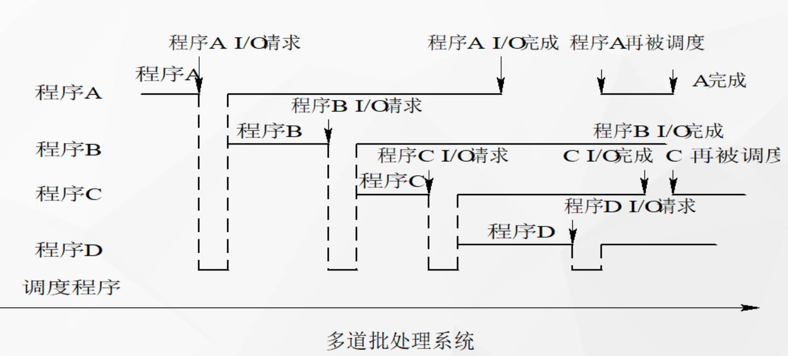
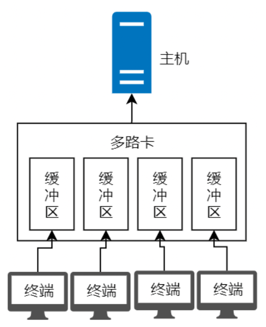
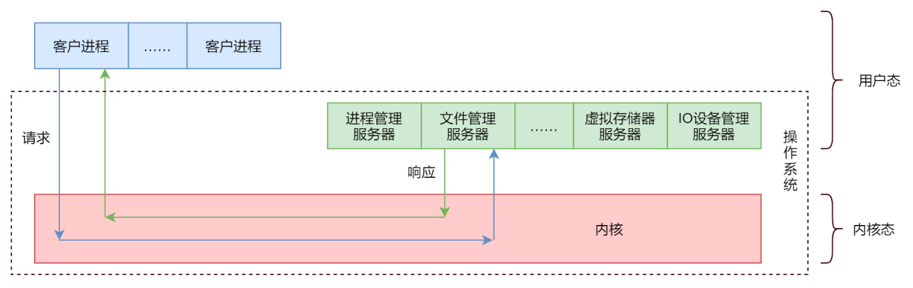
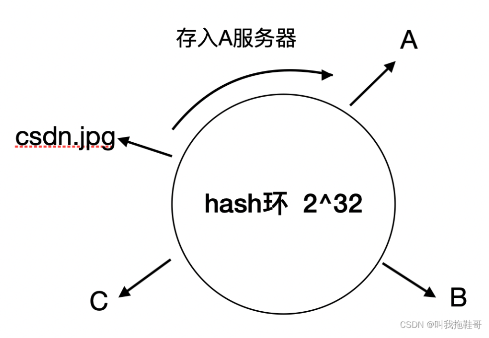
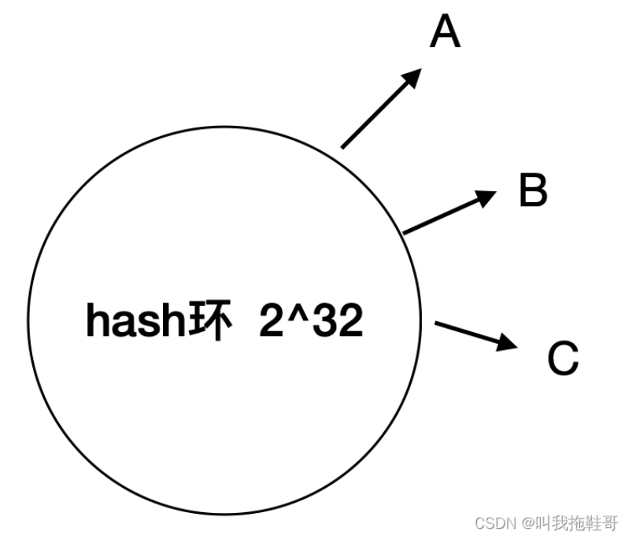
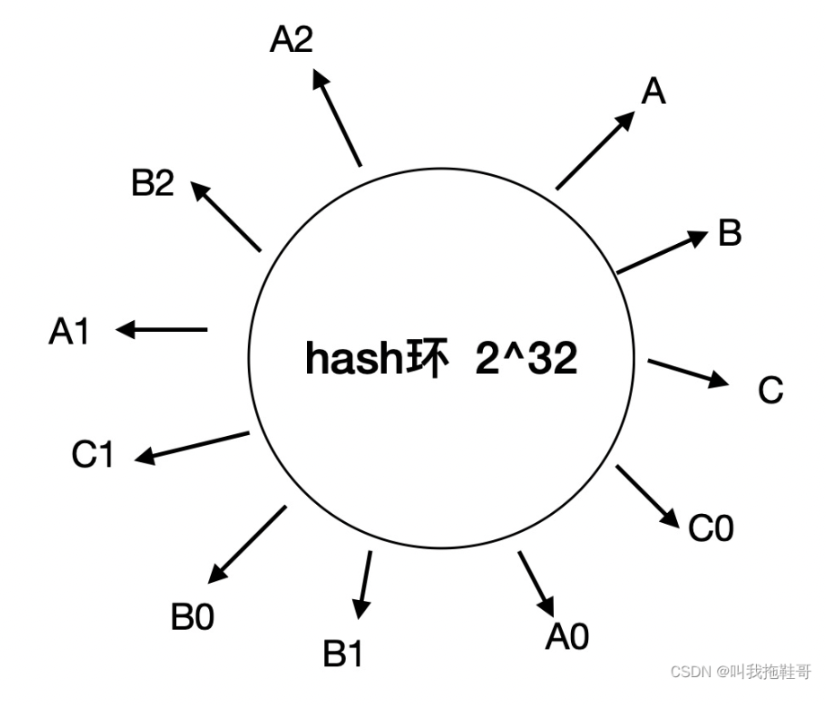
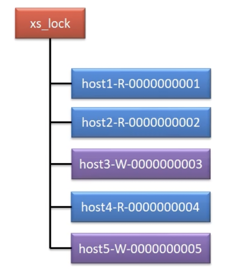

# 操作系统 - 尚硅谷

[TOC]

## 课程地址

https://www.bilibili.com/video/BV1b34y1H7YJ

## 操作系统概述

### 操作系统的演化

演化的目标：提高 CPU 利用率，提高人机交互体验。

1. 单道批处理系统：内存中只有一道作业

2. 多道批处理系统：内存中有多道作业（磁带上有多个作业，一个进程IO时，CPU交给另一个进程）（对于没有 IO 的长作业，则会长期占用 CPU）

3. 分时系统：大家一起用计算机，多用户，多终端，时间片，人机交互，共享主机

其他名词：

* 单工：信息单向传输（例如广播）
* 双工：信息可以双向传输（例如打电话）
* 荧光灯闪烁频率：50次/s

| 多道批处理系统                                               | 分时系统架构                                                 |
| ------------------------------------------------------------ | ------------------------------------------------------------ |
|  |  |

实时系统：

* 硬实时任务 必须满足截止时间要求
* 软实时任务 偶尔错误截止时间也不会有太大影响

### 操作系统基本特性

* 并发：宏观上的并行，微观上的串行（并发能够实现是因为引入了进程的概念）

* 共享

  * 互斥共享：互斥资源（临界资源），例如打印机，磁带机，同一段时间内，只允许一个进程访问。
  * 同步共享：同步资源，例如磁盘，允许一段时间内多个进程同时访问。（宏观上是同时访问，微观上实际上还是交替访问！）

  数据库里面的数据，本身属于同步资源，只是数据库为了实现 ACID，在读数据的时候，增加了读锁（允许其他进程读取，不允许写，同步资源），在写数据的时候，增加了写锁（不允许其他进程读写，临界资源），写锁属于互斥资源，读锁属于同步资源。

* 虚拟

  将一个物理实体，变为若干个逻辑上的对应物。

  实现虚拟化的技术：

  * 时分复用：虚拟处理机，虚拟打印机，虚拟存储器
  * 空分复用（频分复用）

* 异步

  也叫做不可预知性，不确定性。进程以不可预知的速度向前推进的特性，称为异步性。

  只要 OS 中配置有完善的进程同步机制，且运行环境相同，则作业即使经过多次运行，也可以获得完全相同的结果，即 OS 的异步性不会影响到作业的运行结果。

  同步就是确定的，可预知的，可再现的。

### 微内核特征

例如 Linux 内核

* 提供基础核心功能 

* 基于 C/S 模式

  客户进程和微内核外的服务进程之间的通信，IO，需要通过内核提供的系统调用来实现。（解耦）

  

* 机制与策略分离（设计模式）

  机制：实现某一共能的具体执行机构（通常将机制放在微内核中）（有点类似于定义接口和部分实现，抽象类）

  策略：在机制基础上借助某些参数和算法来实现对该功能的优化（通常将策略放在内核外的服务进程中）（类似于抽象类的子类，实现了接口）

  例如进程调度，调度功能属于机制问题，而进程优先级算法就属于策略问题。

  

Dubbo 中的微内核

SPI: Service Provider Interface 服务提供者接口，是一种服务发现机制。Dubbo 的微内核就是基于 SPI 实现的。

Dubbo 作为一款优秀的 RPC 框架，一个 Apache 顶级项目，其最大的亮点之一，就是其优秀的无限开放性设计：微内核 + 插件的架构设计思想，使得其几乎所有组件均可方便地进行扩展、增强、替换。内核只负责组装插件，Dubbo 的功能都是由插件实现的。

ZK、Nacos、Apollo 中的"中断"

中断处理的思想，反映到编程语言开发中，其实就是监听机制。反映到分布式开发中，其实就是发布/订阅模式。

## 分布式算法

### 一致性 hash

别名：hash 环。

使用场景：负载均衡，分布式缓存

介绍：[一致性hash算法](https://blog.csdn.net/mo71105731/article/details/123364539)

核心算法：hash 环，虚拟化

缓存 Demo

| 步骤         | 图示                                                         |
| ------------ | ------------------------------------------------------------ |
| 存储图片     |  |
| hash 倾斜    |  |
| 引入虚拟节点 |  |

数据读写 -> 虚拟节点 -> 真实节点 -> 读写

### Master 选举

MySQL 读写分离集群，master 负责写，slave 负责读。 

Kafka 集群，broker controller 负责各个分区 leader 的选举。

### 分布式锁

zookeeper 分布式锁原理

