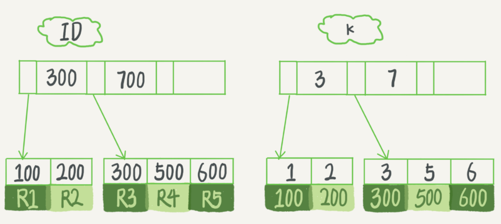

# MySQL 进阶

[TOC]

## 进阶 MySQL 的目的

* DBA
* Mysql 的执行效率非常高，在实际应用中，我们应该尽量将复杂的计算迁移到 MySQL 上，则就需要有将复杂的应用场景编写成 MySQL 语句的能力
* 个人能力的提升

## Fixed problems

**root 用户无法远程访问**

根本原因在于，没有为 `"root"@"%" 配置密码`

root 用户在 MySQL 的 user 表中，有多种，这是 mysql.user 表中的数据：

| Host      | User |
| --------- | ---- |
| localhost | root |
| %         | root |

如果我们想要使用 root 用户远程访问数据库，必须先去数据库里看看到底有几个 root 用户配置：

```mysql
use mysql;
select * from user where user="root";
```

**Access denied for user 没有权限**

```
mysqldump --databases checkRandomDiff dashboard dashboard_debug diff liuli12 rpmp > dump.sql
# 在 dump 的时候提示 access denied for user
解决：为该命令指定用户
mysqldump -uroot -p123456  --databases checkRandomDiff dashboard dashboard_debug diff liuli12 rpmp > dump.sql
```

## DBA 相关

### 打开，关闭，重启，查看运行状态

```shell
sudo /etc/init.d/mysql start # open
sudo /etc/init.d/mysql stop
sudo /etc/init.d/mysql restart
sudo /etc/init.d/mysql status
```

### mysqladmin 命令

```mysql
-- 设置用户, mysqladmin
mysqladmin -u xxx password xxx
```

### 重置密码

```mysql
1. 在配置文件中 [mysqld] 下添加 skip-grant-tables，保存退出
2. 重启 mysql，执行以下命令：
   mysql
   mysql > use mysql;
   mysql > update user set password=password('root') where user='root';   
   mysql > flush privileges;
   mysql > exit;
3. 停止 mysql 服务， 在配置文件中 [mysqld] 下删除 skip-grant-tables，保存退出
```

### 时区

```mysql
SELECT TIMEDIFF(NOW(), UTC_TIMESTAMP);
-- 如果输出 08:00:00，则说明是中国时区
```

### Engine

**查看 mysql 支持的引擎**

```mysql
show engines;
```

**概述**

MySQL 5.7 的存储引擎默认是 InnoDB，值得一提的是，mysql 支持内存数据库。

### 查看 MySQL 版本

```
-- 在 bash 中
mysql --help | findstr Distrib
-- 在 MySQL 中
select version();
```

## 数据库专有名词

### qps

query per second

是指一台服务器每秒能够接受的查询次数。

### 只读实例与主备实例

**详细介绍**：https://www.alibabacloud.com/help/zh/doc-detail/26136.htm

**应用场景**

在对数据库有少量写请求，但有大量读请求的应用场景下，单个实例可能无法承受读取压力，甚至对业务产生影响。为了实现读取能力的弹性扩展，分担数据库压力，您可以创建一个或多个只读实例，利用只读实例满足大量的数据库读取需求，增加应用的吞吐量。

**拓扑图**


## Mysql 内置函数

注意，所有的功能性的内置函数，都可以直接通过 select 进行调用。例如：

```mysql
select CurDate();
select Upper("nihao");
```

### 时间相关

Mysql 的日期格式，必须是 `2019-01-01`

#### time_to_sec, timediff

```mysql
select 
	cid, (1-sum(TIME_TO_SEC(TIMEDIFF(meddle_end,meddle_start)))/2592000) as sec 
from 
	run_case_meddlecase
where 
	meddle_start > "2018-09-01" and meddle_start < "2018-10-01"
	and TIMEDIFF(meddle_end,meddle_start) <= "168:00:00"
group by 
	cid
order by 
	sec
```

#### Date(), Time(), Year()

如果只需要比较一部分日期，例如只针对日期/时间/年份/月份进行查询，则需要用到一些日期的处理函数

| 函数      | 解释                   |
| --------- | ---------------------- |
| Date()    | 返回一个日期的日期部分 |
| Time()    | 返回一个日期的时间部分 |
| Year()    | 返回一个日期的年份     |
| Now()     | 返回当前日期和时间     |
| CurDate() | 返回当前日期           |
| CurDate() | 返回当前时间           |

**Demos**

```mysql
select weibo_content from senti_weibo_realtime_weibo where weibo_content like "%[微笑]%" and Date(post_time ) = "2019-04-22";

select CurDate();
```

### concat() ,round()

**作用**

concat(str1, str2)连接字符串，其输入可以为 整型

round(num, 2) 对 num 四舍五入保留两位

**Demo**

```
select table_name, concat(round((data_length + index_length)/1024/1024, 2), 'M') as size_M from information_schema.tables where table_schema = "se_monitor" and table_name = "run_case_deploycoveragedetail"; 
```

### to_days()

Given a date *date*, returns a day number (the number of days since year 0). 常用于对数据库表按照时间进行分区时的时间函数。

**Demo**

```mysql
 SELECT TO_DAYS("2017-06-20 09:34:00");
```


## 数据备份：dump 与 load

https://dev.mysql.com/doc/refman/5.7/en/mysqlpump.html

**数据库备份工具**

Navicat

### mysqldump

```shell
# 将远程库 bq 中的 svmstate 表存储到 backup.sql
mysqldump -h 10.67.32.24 -uroot -pIQd7VOksI8KtHeZ8Hy0U -P 9306 bq svmstate > backup.sql

# 备份多个数据库，注意，必须要加 --databases 参数，该参数可以指定命令行中所有的 name 都是数据库的名称，如果不加 --databases，则会默认 db1 为数据库的名称，db2，db3 为表名
mysqldump --databases db1 db2 db3 > dump.sql

# 加 --databases 和 不加 --databases 的区别
##########################################
# Use of --databases with the mysqldump command line causes the dump file to include CREATE
# DATABASE and USE statements that create the database if it does exist and make it the    # default database for the reloaded data.
# Alternatively, you can omit --databases from the mysqldump command. Then you will need to # create the database on Server 2 (if necessary) and specify it as the default database    # when you reload the dump file.
##########################################

# mysqldump 会锁住表，加上  --single-transaction 参数可以在不加锁的情况下进行备份

# 常见的两种 备份 和 加载 方式
mysqldump --databases db1 > dump.sql
mysql < dump.sql

mysqldump db1 > dump.sql
mysqladmin create db1

# dump 所有的数据库
mysqldump --all-databases > dump.sql

# 备份指定的数据库，加入 --databases，就会备份备份建表语句
mysqldump --databases db1 db2 db3 > dump.sql

# 备份数据库中除某些表之外的部分表
mysqldump -uroot -p123456 diff --ignore-table=diff.getdiffrate_difftraceinfo --ignore-table =diff.test > /home/work/mysql_backup/dump.sql

# dump 表中的一部分数据，加入 where 条件
mysqldump -uroot -p123456 diff getdiffrate_difftraceinfo --where="id > 1 ORDER BY ID DESC LIMIT 100" > /home/work/mysql_backup/getdiffrate_difftraceinfo_partial_data.sql
# 注意，where 字句中一定要加入一个条件，例如 id > 1，否则不符合语法要求。

# 只 dump 表结构 -d 参数
mysqldump -d 数据库名 -uroot -p > xxx.sql

# 只 dump 数据 -t 参数
mysqldump -h 10.91.162.162 -umonitor -pmonitor123 -P 3306 se_monitor run_case_detail_20180201 -t --single-transaction --where="id > 1000 limit 10"  > /home/work/mysql_dump/sql/run_case_detail_20180201.sql
```

### load

```shell
# 将本地的 sql 文件导入远程的数据库中，这里这是备份了数据库中的一张表，所以需要指定数据库
mysql -h 10.64.26.153 -P 8091 -u dasou_wangye --password=6fb943b0-d74d-4d26-8aa6-217848bd04ea se_monitor < /home/work/mysql_dump/sql/run_case_20180801.sql

# 将本地的包含多个库的备份文件导入数据库中，不需要指定数据库
./mysql -h localhost -P 3306  -uroot -p123456 < /home/work/mysql_backup/dump_except_diff.sql
```

**注意**

对于 id 自增的数据表，不管其增加新的数据，然后删除，还是删除旧的数据，然后更新，在使用 MySQL dump 命令的时候，都不会导致 id 中断。只要 dump 的 sql 文件中，没有冲突的 id，就能 load 成功。

### dump.sql 详解

dump.sql 文件其实是一个纯文本文件，其中包含了数据库表的创建信息，还有要插入的数据。

```mysql
-- MySQL dump 10.13  Distrib 5.5.30, for Linux (x86_64)
--
-- Host: 10.67.32.24    Database: bq
-- ------------------------------------------------------
-- Server version	5.1.49-log

/*!40101 SET @OLD_CHARACTER_SET_CLIENT=@@CHARACTER_SET_CLIENT */;
/*!40101 SET @OLD_CHARACTER_SET_RESULTS=@@CHARACTER_SET_RESULTS */;
/*!40101 SET @OLD_COLLATION_CONNECTION=@@COLLATION_CONNECTION */;
/*!40101 SET NAMES utf8 */;
/*!40103 SET @OLD_TIME_ZONE=@@TIME_ZONE */;
/*!40103 SET TIME_ZONE='+00:00' */;
/*!40014 SET @OLD_UNIQUE_CHECKS=@@UNIQUE_CHECKS, UNIQUE_CHECKS=0 */;
/*!40014 SET @OLD_FOREIGN_KEY_CHECKS=@@FOREIGN_KEY_CHECKS, FOREIGN_KEY_CHECKS=0 */;
/*!40101 SET @OLD_SQL_MODE=@@SQL_MODE, SQL_MODE='NO_AUTO_VALUE_ON_ZERO' */;
/*!40111 SET @OLD_SQL_NOTES=@@SQL_NOTES, SQL_NOTES=0 */;

--
-- Table structure for table `svmstate`
--

DROP TABLE IF EXISTS `svmstate`; # 会覆盖之前存储的同名的表
/*!40101 SET @saved_cs_client     = @@character_set_client */;
/*!40101 SET character_set_client = utf8 */;
CREATE TABLE `svmstate` (
  `id` bigint(20) unsigned NOT NULL AUTO_INCREMENT COMMENT 'ID标识',
  `module` varchar(255) NOT NULL COMMENT '类型',
  `flag` varchar(255) NOT NULL COMMENT '状态',
  `last_modify_time` timestamp NOT NULL DEFAULT CURRENT_TIMESTAMP COMMENT '最后更新时间',
  PRIMARY KEY (`id`)
) ENGINE=InnoDB AUTO_INCREMENT=17 DEFAULT CHARSET=utf8;
/*!40101 SET character_set_client = @saved_cs_client */;

--
-- Dumping data for table `svmstate`
--

LOCK TABLES `svmstate` WRITE; # 在写入的时候，会锁住 写入的数据表
/*!40000 ALTER TABLE `svmstate` DISABLE KEYS */;
INSERT INTO `svmstate` VALUES (1,'feedback','1','2018-02-02 05:32:59'),(3,'onlineproblem','1','2018-03-22 09:06:45'),(4,'bugs','1','2018-03-22 09:32:37');
/*!40000 ALTER TABLE `svmstate` ENABLE KEYS */;
UNLOCK TABLES;
/*!40103 SET TIME_ZONE=@OLD_TIME_ZONE */;

/*!40101 SET SQL_MODE=@OLD_SQL_MODE */;
/*!40014 SET FOREIGN_KEY_CHECKS=@OLD_FOREIGN_KEY_CHECKS */;
/*!40014 SET UNIQUE_CHECKS=@OLD_UNIQUE_CHECKS */;
/*!40101 SET CHARACTER_SET_CLIENT=@OLD_CHARACTER_SET_CLIENT */;
/*!40101 SET CHARACTER_SET_RESULTS=@OLD_CHARACTER_SET_RESULTS */;
/*!40101 SET COLLATION_CONNECTION=@OLD_COLLATION_CONNECTION */;
/*!40111 SET SQL_NOTES=@OLD_SQL_NOTES */;

-- Dump completed on 2018-10-15 20:29:56

```

### innodb_force_recovery 进入安全模式备份数据

**Forcing InnoDB Recovery 模式**

在 my.cnf 中加入  innodb_force_recovery = 1，进入强制恢复模式。

进行该操作只是权宜之计，用来启动 InnoDB 引擎并 dump 数据。

开启 Forcing Recovery 模式后，InnoDB 会禁止对数据库的 增删改 操作，当 innodb_force_recovery > 3 后，数据库会进入只读模式，并且到了 4 就会有永久损坏数据的危险。

1 <= innodb_force_recovery <= 6，数字越高，风险越大。innodb_force_recovery  的默认值为 0。

已经实践确认，进入安全模式后，确实不能进行增删改操作，但是能在 innodb_force_recovery <= 3 时进行新建表，和删除表的操作。如果进行 insert 操作，会报： ERROR 1030 (HY000): Got error -1 from storage engine 的错误。

## 知识点

### Mysql 自带的四个数据库

#### mysql 数据库

存储 mysql 的配置信息，例如 mysql 的用户，访问权限等。

#### performance schema 和 sys 数据库

存储服务器性能参数，暂时不需要了解。

#### information schema 数据库

**abstract**

information_schema 数据库中存储着 MySQL 下的所有数据库的配置信息。包括用户、权限、数据库大小等信息。

information_schema 数据库中每一张表，都存储着一种配置，下面对于常用到的表进行解释。

information schema 数据库中的表实际上都是只读视图。

**TABLES 表**

| 字段         | 含义                  |
| ------------ | --------------------- |
| TABLE_SCHEMA | database name         |
| TABLE_NAME   | table name            |
| DATA_LENGTH  | 数据量大小，单位 byte |
| INDEX_LENGTH | 索引大小，单位 byte   |
| TABLE_ROWS   | 表的行数              |
|              |                       |

**Demo**

```mysql
* 查看各个库的大小
select table_schema, sum(data_length+index_length)/1024/1024 as total_mb, \
sum(data_length)/1024/1024 as data_mb, sum(index_length)/1024/1024 as index_mb, \
count(*) as tables, curdate() as today from information_schema.tables group by table_schema order by 2 desc;

* 查看某张表的大小
select table_name, (data_length + index_length)/1024/1024 as size_M from information_schema.tables where table_schema = "se_monitor" and table_name = "run_case_deploycoveragedetail"; 

# 查看某张表有多少行
select table_rows  from tables where table_schema = "diff" and table_name = "getdiffrate_difftraceinfo";
```

### 正则表达式


### primary key / unique key

**相同点**

* 两者都用来标记一条独一无二的数据

**不同点**

* primary key 是 not null, 而 **unique key 可以是 null**
* primary key 只能有一个，而 unique 可以定义多个


## 权限控制

**官方文档**

https://dev.mysql.com/doc/refman/5.7/en/grant.html

**权限相关查询**

```mysql
-- 查询可以使用 root 用户访问数据库的 host
use mysql;
SELECT host FROM user WHERE user = 'root';
```

### Grant 授权语法

```mysql
-- Demo
GRANT 
	SELECT -- 权限
ON 
	spider_db.* -- 数据库.表 这里表示数据库的所有表
TO 
	'wanshuo'@'%' -- '用户名'@'host', % 表示并没有指定任何 host，用户可以从任何 host 上访问
IDENTIFIED BY 
	"ws6226067"; 
flush privileges;
/*
详解
1. 如果 'wanshuo'@'%' 这个用户配置在 mysql.user 中已经存在，那么 IDENTIFIED BY 就不需要加入，如果加入了，那么配置的密码就会覆盖原始的密码，grant 就是单纯的为 'wanshuo'@'%'赋予权限。
2. 如果 'wanshuo'@'%' 这个用户配置在 mysql.user 中不存在，那么 grant 的作用是创建用户，并赋予权限。IDENTIFIED BY 起到配置密码的作用

identified by 参考：https://stackoverflow.com/questions/31111847/identified-by-password-in-mysql
*/
```

### Grant demo

```mysql
-- 把查询 student 表的权限授权给 u1
grant select on table student to u1; 

-- 把对 student 表和 course 表的所有权限赋给 u1,u2
grant all privileges on table student, course to u1, u2; 

-- 把对 student 表的查询权限赋给所有用户
grant select on table student to public; 

-- 把查询 student 表 和 修改学号的权限赋给 u1
grant select, update(sno) on student to u1;

-- 把对 student 表的插入权限赋给 u1，并允许 u1 再将此权限授予其他用户
grant insert on student to u1 with grant option;
```

### Revoke 收回授权

```
revoke 
	insert 
on
	spider_db.*
from
	user;
```

### 创建用户，授予权限，删除用户的 Demo

```mysql
CREATE USER 'jeffrey'@'localhost' IDENTIFIED BY 'password';
GRANT ALL ON db1.* TO 'jeffrey'@'localhost';
GRANT SELECT ON db2.invoice TO 'jeffrey'@'localhost';
ALTER USER 'jeffrey'@'localhost' WITH MAX_QUERIES_PER_HOUR 90;

DROP USER 'jeffrey'@'localhost';
```

### 远程访问

```mysql
grant all privileges on *.* to 'root'@'%' identified by '密码' with grant option;
flush privileges;  
```

## 索引

[深入浅出数据库索引](<https://time.geekbang.org/column/article/105553#previewimg>)

### 为什么要建立索引

数据库为了提高查询效率，通常会为某些字段加入索引。当我们查询某个字段的时候，如果这个字段没有添加索引，那么查询速度就会非常慢，因为数据库要从第一行开始查找。

数据库会默认为 Primary Key 建立索引，但是这远远不够，如果我们对某张表的某个字段查询比较频繁，我们最好给这个字段加入索引，进而提高查询效率。

### 索引的缺点

* 索引的缺点，就是 B+ 树的缺点，索引方便了查询，但是不利于数据的增删改
* 简历索引和维护索引需要耗费很多计算资源和内存空间

### 索引的类型

| 索引名      | 作用                                                     |
| ----------- | -------------------------------------------------------- |
| index,  key | 普通索引，加快查询速度( key 的功能多于 index，默认用key) |
| unique      | 唯一索引，该值在字段下唯一，可以为 null                  |
| primary key | 主索引，主键                                             |
| foreign key | 外索引，外键                                             |

**Demo**

```mysql
create table test_table(
	id int(11) auto_increment,
	name varchar(8) not null,
	mother varchar(8) not null,
	primary key (id), -- 主键
	key mother (mother), -- 加索引
	foreign key (name) -- 加外键
)ENGINE=InnoDB DEFAULT CHARSET=utf8 AUTO_INCREMENT=1; -- id 从 1 开始增长
```

### 索引的实现

Mysql InnoDB 引擎采用 B+ 树（多叉平衡树）建立索引，所有数据存储到 B+ 树中。之所以采用 B+  树，首先如果采用传统的二叉查找树，那么很容易导致树的高度过高，一层就是一次查询，进而导致查询效率不高。那么为了优化二叉查找树，我们考虑采用 AVL(**二叉平衡树**) 才建立索引，但是问题在于，当数据量很大时，即使是平衡树，树也会达到很深的深度。所以我们采用 B+ 树，B+ 树既是平衡树，又因为一个节点存储多值，所以树的深度会变浅，从而查询次数比较少。

**优化的准则：降低查找树的深度，减少磁盘访问次数。**

**优化的过程**：

```
二叉排序树 ——> AVL 树 ——> B树 ——> B+树
```

Demo:

```mysql
create table T(
    id int primary key, -- 主键建立主索引
    k int not null, 
    name varchar(16),
	index (k) -- k 建立普通索引
)engine=InnoDB;
```

如果我们有五组数据要存储到表中：`（id, k), (100,1)、(200,2)、(300,3)、(500,5) 和 (600,6)` ，那么这两棵树存储结构为：	



主键索引叶子节点存储的是整行的数据，而非主键索引叶子节点存储的是主键，所以如果我们想要查找主键，只需要搜索**一次** B+ 树，而如果我们想要对其他非主键索引的字段进行查找，则需要查找**两次** B+ 树，第一次是查找字段所在 B+ 树，找到主键ID，然后根据主键 ID 去主键索引树中查找。

由此我们也可以看到，普通索引的叶子节点，存储的是主键ID，那么主键的存储空间越小，那么普通索引的叶子节点就越小，普通索引占用的空间也越小。这就是为什么，大多数的数据库表，主键设置为主键自增长，而且用整型来存储，这样即方便比较，存储的体积也小。举个例子，如果我们设置了某一个字段为主键，例如身份证，那么其他非主键索引树的叶子节点，就存储的是身份证号，身份证号比起自增长 ID 来说，占用了更多的空间。而且每一个非主键索引树，都会附带上身份证号，导致索引树的体积变大。

## Mysql 优化

### 查看 Mysql 线程 

Mysql 是多用户多线程的，有时候一个线程任务速度慢，可能会拖慢所有任务。

查看当前线程的命令：

```mysql
show processlist;
```

kill 某个线程的命令:

```mysql
kill id;
```

### delayed 关键字 延迟执行

delayed 常用于延迟执行 insert。有时候 MySQL 事务繁忙，例如某张表正在被读任务占用，我们就可以延迟对这张表的写入。delayed insert 语句实际上进入了一个队列，当读操作结束的时候，delayed 队列中的 insert 语句才会执行。常用于缓解数据库的压力。

Demo:

```mysql
insert delayed into senti_weibo_conf values(7, "hehe", "1", "2019-09-09 00:00:00", "s");
```

### 其他优化技巧

* Mysql Script （存储过程）的执行速度，快于一条一条单独执行的速度。

* 不要用 select *，用到什么字段，select 什么字段
* 使用 delayed 关键字延迟命令的执行，防止数据库压力过大
* 用 union 替代 or
* 避免在线上环境使用 like

## 数据类型

### 浮点型

`alter table spider_realtime_weibo add sentiment_score float(5,2) ;`

给spider_realtime_weibo 加入一个浮点型字段，其可以表示两位小数，包括小数点最长可达 5 位。

上述描述同样适用于 double 类型

注意：float 型必须指定小数点位数，否则存入数据库时还是整数

### 对于 NULL 值的判断

```mysql
is null
select crawl_time, sentiment_score  from spider_realtime_weibo where sentiment_score is null;
```

### datetime 与 timestamp

**timestamp**

timestamp 只占用 4 个字节，可以表示的时间范围有上限和下线，这是一个坑。

两个属性：

1. CURRENT_TIMESTAMP  insert 时插入当前时间
2. ON UPDATE CURRENT_TIMESTAMP update 时更新为当前时间

常用组合：

```MySQL
last_modify_time timestamp not null default current_timestamp on update current_timestamp comment '最后更新时间'  -- 创建新记录和修改现有记录的时候都对这个数据列刷新
```

**datetime**

datetime 的时间没有上线限制，可以在 timestamp 失效时，替代 timestamp

**实际问题**

往数据库中插入时间 >  '2038-01-19 3:14:7' 的时间时，会报错

```mysql
INSERT INTO `run_case_deploycoveragedetail` VALUES ('3380211', 'search', '', 'dict', 'online', '', '', '', 'dictserver@misdata:CompactionKvDictZdictBuild@query_log_dict_31', 'misdata:CompactionKvDictZdictBuild@query_log_dict_31', 'beehive_jobplatform', '', '1', 'lichenggang,chaijunjun', '', '', 'http://10.46.63.64:8888/jobplatform/data?task_id=1539834449_1', 'CompactionKvDictZdictBuild', '1539834449_1', 'Y', 'day', '2018-10-18 11:47:29', '2038-01-19 3:14:8', '2018-10-18 00:00:00', '2018-10-19 00:00:00', '2018-10-19 08:01:35');
[Err] 1292 - invalid time format: '{2038 1 19 3 14 8 0}'
```

**原因**

mysql 的 timestamp 的时间范围为 1970-01-01 00:00:00 到 2038-01-19  3:14:07，timestamp 占 4 个字节。

具体解释：http://blog.itpub.net/7728585/viewspace-2077609/

## Mysql Script 存储过程

实现类似 Linux Script 的功能，包含了 if else while 变量等特性，入门参考 MySQL 必知必会。

## Mysql 触发器

触发器是应对 增删改 的操作触发执行的 mysql 语句或 MySQL script。 

## Mysql Partition 拆表

### Partition 的目的

将大表拆成小表，降低增删改查的成本。

### 查看是否支持 Partition

```mysql
-- 查看结果中是否有 Name 为 partition 的 plugin，并且其状态是否为 active，如果是 active，则支持 partition
SHOW PLUGINS;
```

### [Overview of Partitioning in MySQL](https://dev.mysql.com/doc/refman/5.6/en/partitioning-overview.html)

Partition 可以将我们的一张表切分成多块，分不到各个地方。事实上，被切分出来的不同的表块，是作为不同的表存储在其他位置。至于一条数据要被切分到哪一个小表，是根据 partition function 进行区分的。

**水平切分**

This is known as horizontal partitioning—that is, different rows of a table may be assigned to different physical partitions. **MySQL 5.7** does not support vertical partitioning, in which different columns of a table are assigned to different physical partitions. There are no plans at this time to introduce vertical partitioning into MySQL.

目前 Mysql5.7 只支持水平切分，水平切分的最小单位是 data-row。

**注意**

* 切分出来的没一张表，其 database engine 都应该是一样的
* partition 描述应该放到建表语句的最后
* 被切分的键，应该隶属于 primary key 或者 unique key，参考：[Partitioning Keys, Primary Keys, and Unique Keys](<https://dev.mysql.com/doc/refman/5.7/en/partitioning-limitations-partitioning-keys-unique-keys.html>)

### [Partitioning Types](https://dev.mysql.com/doc/refman/5.6/en/partitioning-types.html) and [Partition Management](https://dev.mysql.com/doc/refman/5.6/en/partitioning-management.html)

#### range partition

```mysql
# 创建带有分区的表
CREATE TABLE tr (id INT, name VARCHAR(50), purchased DATE) PARTITION BY RANGE( YEAR(purchased) ) (
        PARTITION p0 VALUES LESS THAN (1990),
        PARTITION p1 VALUES LESS THAN (1995),
        PARTITION p2 VALUES LESS THAN (2000),
        PARTITION p3 VALUES LESS THAN (2005),
        PARTITION p4 VALUES LESS THAN (2010),
        PARTITION p5 VALUES LESS THAN (2015)
);

# 正常插入数据
INSERT INTO tr VALUES
(1, 'desk organiser', '2003-10-15'),
(2, 'alarm clock', '1997-11-05'),
(3, 'chair', '2009-03-10'),
(4, 'bookcase', '1989-01-10'),
(5, 'exercise bike', '2014-05-09'),
(6, 'sofa', '1987-06-05'),
(7, 'espresso maker', '2011-11-22'),
(8, 'aquarium', '1992-08-04'),
(9, 'study desk', '2006-09-16'),
(10, 'lava lamp', '1998-12-25');

# 从某个分区获取数据
SELECT * FROM tr PARTITION (p2);

# 删除某个分区，注意：在删除某个分区后，该分区的数据也会对应的被删除
ALTER TABLE tr DROP PARTITION p2;

# 对于在创建时，没有设置 partition 的 table，alter 初次设置其 partition 的命令
ALTER TABLE tr
    PARTITION BY HASH(id)
    PARTITIONS 8;
# 同上
ALTER TABLE senti_weibo_realtime_weibo PARTITION BY RANGE( to_days(post_time) ) (

	PARTITION p0 VALUES LESS THAN (to_days("2016-01-01")),
	PARTITION p1 VALUES LESS THAN (to_days("2017-01-01")),
	PARTITION p2 VALUES LESS THAN (to_days("2018-01-01")),
	PARTITION p3 VALUES LESS THAN (to_days("2018-03-01")),
	PARTITION p4 VALUES LESS THAN (to_days("2018-06-01")),
	PARTITION p5 VALUES LESS THAN (to_days("2018-08-01")),
	PARTITION p6 VALUES LESS THAN (to_days("2018-10-01")),
	PARTITION p7 VALUES LESS THAN (to_days("2018-12-01")),
	PARTITION p8 VALUES LESS THAN (to_days("2019-01-01")),
	PARTITION p9 VALUES LESS THAN (to_days("2019-03-01")),
	PARTITION p10 VALUES LESS THAN (to_days("2019-05-01")),
	PARTITION p11 VALUES LESS THAN (to_days("2019-07-01")),
	PARTITION p12 VALUES LESS THAN (to_days("2019-09-01")),
	PARTITION p13 VALUES LESS THAN (to_days("2019-11-01")),
	PARTITION p14 VALUES LESS THAN (to_days("2020-01-01")),
	PARTITION p15 VALUES LESS THAN (to_days("2020-03-01")),
	PARTITION p16 VALUES LESS THAN (to_days("2020-05-01")),
	PARTITION p17 VALUES LESS THAN (to_days("2020-07-01")),
	PARTITION p18 VALUES LESS THAN (to_days("2020-09-01")),
	PARTITION p19 VALUES LESS THAN MAXVALUE
);
```

### Partition Pruning/Selection

#### Partition Pruning

[Partition Pruning](<https://dev.mysql.com/doc/refman/5.7/en/partitioning-pruning.html>) Mysql 语句修剪：对包含分区的表的 sql 查询语句进行修剪优化。Partition Pruning 是 Mysql 自带的一个 Optimizer，其可以对 partitioned table 进行 sql 语句的自动优化，提高 sql 效率

Mysql 中有一个 optimizer，可以对分区表的 sql 查询进行优化，其优化的 case 主要有两种：

- `partition_column = constant`
- `partition_column IN (constant1, constant2, ..., constantN)`

对于 case1, optimizer 会直接根据所给的值，判断该条数据在哪一个分区，然后只扫描这一个分区，除了 `=` 外，optimizer 还可以对  `<`, `>`, `<=`, `>=`, and `<>` ，`between` 进行优化；

对于 case2, optimizer 会根据 list 中所给值匹配到一个 partition_list，然后扫描。

Partition Pruning 可以对 `select update delete` 进行优化，不能对 `insert` 进行优化。

Partition Pruning 还可以对在 partition table 时采用 [`YEAR()`](https://dev.mysql.com/doc/refman/5.7/en/date-and-time-functions.html#function_year)， [`TO_DAYS()`](https://dev.mysql.com/doc/refman/5.7/en/date-and-time-functions.html#function_to-days) ，[`TO_SECONDS()`](https://dev.mysql.com/doc/refman/5.7/en/date-and-time-functions.html#function_to-seconds)作为划分函数的 table 进行优化

#### Partition Selection

[Partition selection](<https://dev.mysql.com/doc/refman/5.7/en/partitioning-selection.html>) 是明确指定分区的 select 语法，其作用类似于 Partition pruning，但区别在于其明确指定了从哪一个分区进行 select。


