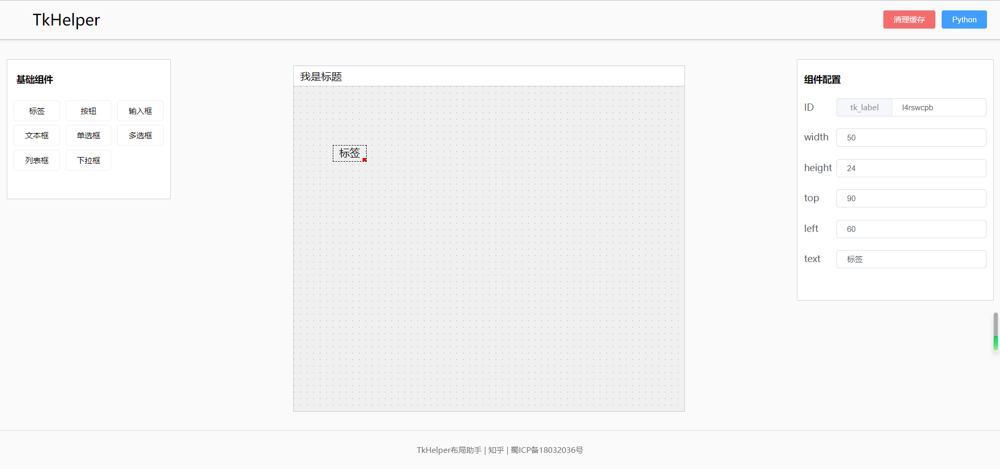

# weekly

[TOC]

## week-25

### 江宁九龙湖


### 一个开源项目 PyScript

[PyScript 官网](https://pyscript.net/)

只需要引入一个样式文件，和一个 js 库，就可以在前端运行 Python 脚本！

给大家看一下，一个简单的 html + python，能实现的效果：

```html
<html>
  <head>
    <title>Matplotlib</title>
    <meta charset="utf-8">
    <link rel="icon" type="image/x-icon" href="./favicon.png">
    <link rel="stylesheet" href="https://pyscript.net/alpha/pyscript.css" />
    <script defer src="https://pyscript.net/alpha/pyscript.js"></script>
    <py-env>
      - matplotlib
    </py-env>
    <script src="index.js"></script>
    </head>
    <body>
      <div id="mpl"></div>
      <py-script output="mpl">
      import matplotlib.pyplot as plt
      import matplotlib.tri as tri
      import numpy as np

      # First create the x and y coordinates of the points.
      n_angles = 36
      n_radii = 8
      min_radius = 0.25
      radii = np.linspace(min_radius, 0.95, n_radii)

      angles = np.linspace(0, 2 * np.pi, n_angles, endpoint=False)
      angles = np.repeat(angles[..., np.newaxis], n_radii, axis=1)
      angles[:, 1::2] += np.pi / n_angles

      x = (radii * np.cos(angles)).flatten()
      y = (radii * np.sin(angles)).flatten()
      z = (np.cos(radii) * np.cos(3 * angles)).flatten()

      # Create the Triangulation; no triangles so Delaunay triangulation created.
      triang = tri.Triangulation(x, y)

      # Mask off unwanted triangles.
      triang.set_mask(np.hypot(x[triang.triangles].mean(axis=1),
                              y[triang.triangles].mean(axis=1))
                      < min_radius)

      fig1, ax1 = plt.subplots()
      ax1.set_aspect('equal')
      tpc = ax1.tripcolor(triang, z, shading='flat')
      fig1.colorbar(tpc)
      ax1.set_title('tripcolor of Delaunay triangulation, flat shading')

      fig1
      </py-script>
    </body>
</html>
```


### wasm

看到上面 pyscript 项目，我很好奇，pyscript 是用的什么技术，实现的在 html 中写 Python 代码。

经过一番调研，发现其使用的就是大名鼎鼎的 web assembly（wasm） 技术。通过 wasm，可以将其他编程语言（例如 C++，Rust，Python）的代码，编译成 wasm，然后由浏览器执行 wasm 文件。

wasm 是 web 端一种偏底层的技术，其执行效率，要高于 JavaScript。

这里是我查到的一些资料：

* [wasm org](https://webassembly.org/getting-started/developers-guide/)
* python -> wasm: [Pyodide](https://pyodide.org/en/stable/), a Python distribution for the browser and Node.js based on WebAssembly.
* python -> wasm: [PyScript](https://pyscript.net/) Run Python in Your HTML 
* C++ -> wasm 的在线工具：https://mbebenita.github.io/WasmExplorer/
* Bilibili 视频介绍：https://www.bilibili.com/video/BV13i4y1n74s


### 新概念英语

逛知乎看到有人评价《新概念英语》英语这本书是学习英语的最好教材。

不明觉厉。


### 中国消费者信心指数

冲浪看到的一个指数，好像是非官方的，在统计局上查不到。


### 致谢 - 黄国平

毕业季，又想起了黄国平博士的毕业发言，泪目


### 蔚来汽车事故

电动汽车圈，最近发生的好多事情，太魔幻了。

```
李x：理想 L9 是 500W 以内最好的 SUV
余x嘴：现在买燃油车，就像智能手机时代买功能手机
```

电动汽车一如既往的不靠谱。现在电动汽车已经剑走偏锋了，开始搞手机圈的那一套了，叠各种黑科技，叠算力，叠智能，叠屏幕，叠百米加速，而汽车的基本属性，安全，去鲜有厂商去强调。

百米加速，蔚来 ES7 的百米加速已经达到 3.9 秒，那么猛的劲，一脚油门下去，司机能控制得住吗？我有一次，骑着自行车好好的，路边的一辆蔚来突然启动斜窜出来，吓我一大跳。

实在搞不清楚，那么高的算力，有什么用，难道不费电吗，智能驾驶难道真能代替司机吗？

程序是不靠谱的，那么复杂的系统，是肯定有 bug 的，现在什么按钮都做到屏幕里面，万一哪天系统死机了呢？难以置信有那么多人买电动智能车。


### 高考

6 月 24 日，江苏高考放榜了。

现在是 3 + 1 + 2 的模式，一共考 6 门。我有一个亲戚，考了 570 分，高不高低不低的。

想起一位老师说过的话，只要每一门科目，细心一点，多努力一点，哪怕多考 5 分，各科加在一起，就是 30 分，570 + 30 = 600 分，就能上一个不错的 211。

我觉得挺可惜的。


## week-26


### 一个画板开源项目

[tldraw](https://github.com/tldraw/tldraw) 一个在线画板工具，开源。


### QQ 安全事故

2022 年 6 月 27 日，一觉醒来，打开 QQ，看到了很多同学给我发了激情小图片，各大 QQ 群也沦陷了。

这次安全事故规模还是很大的，虽然没有什么新闻报道，但是感觉是近几年影响范围最广的一次 QQ 安全事故了。

很奇怪这次事故竟然没有上知乎热搜，应该被企鹅公关了。


### 避孕套指数？


### 蓝猫淘气三千问

午休醒来，脑海里突然回想起一段旋律：星星眨着眼，月亮画问号~

原来是蓝猫淘气三千问！

感慨小时候的儿歌，歌词朴素，旋律优美，不知道现在的孩子们，都是听什么儿歌长大的。


那是一个创作者和广大群众都眼里有光的年代：


### Tkinter Helper

[Tkinter Helper](https://github.com/iamxcd/tkinter-helper) 一个低代码创建 GUI 的平台。

TkinterHelper（Tkinter布局助手）是一款为Tkinter打造，仅需拖拽组件进行布局，所见即所得，非常方便就能做出一个GUI界面，再配合 pyinstall 库将程序打包成exe，简直是开发小工具的利器。




### reborn

种一棵树最好的时间是十年前，其次是现在。


