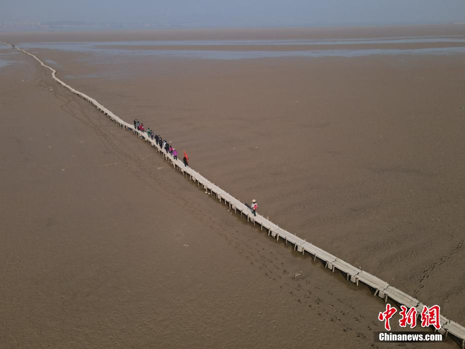
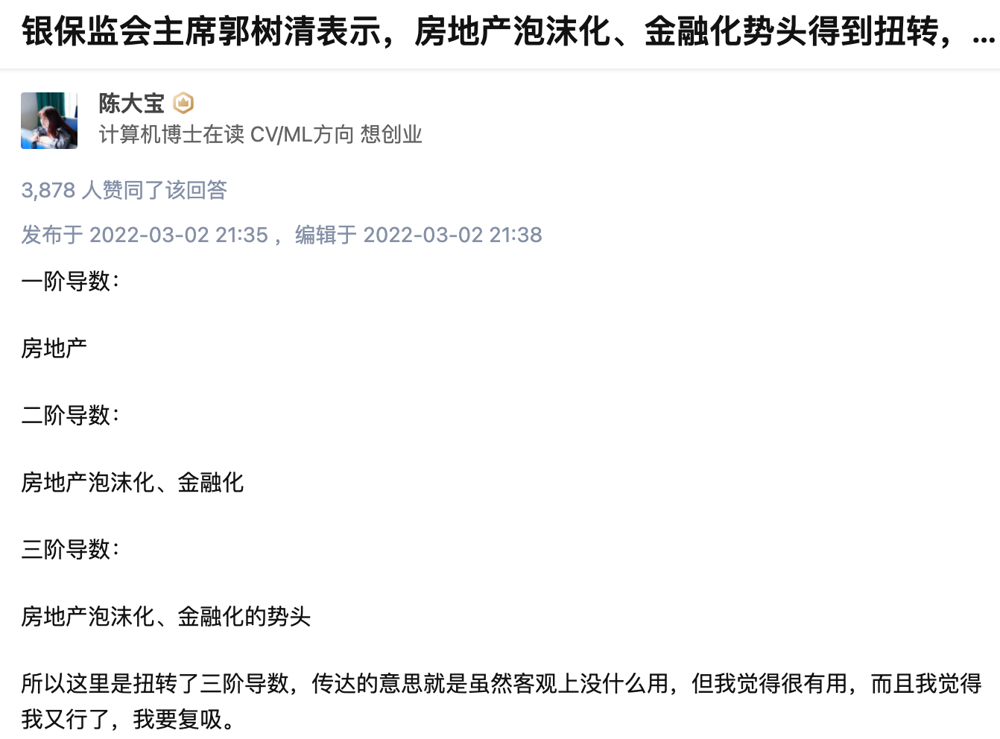
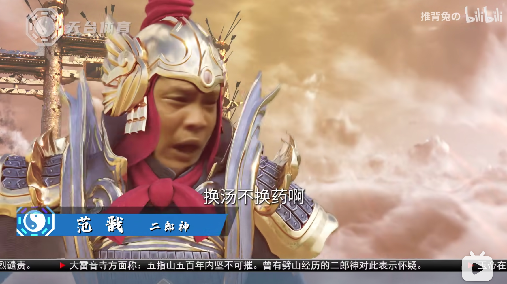
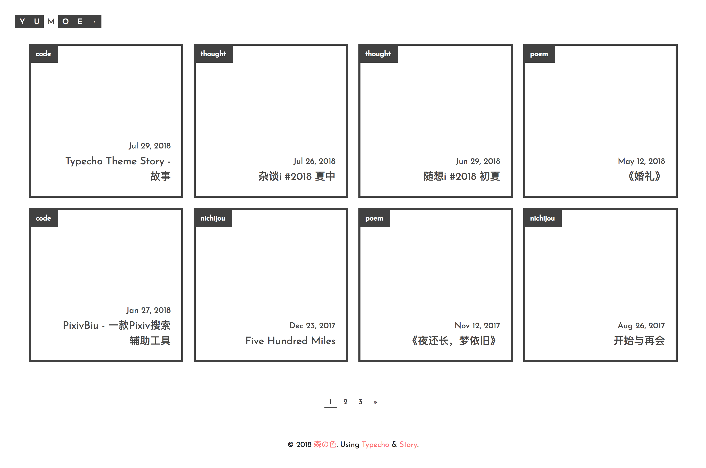
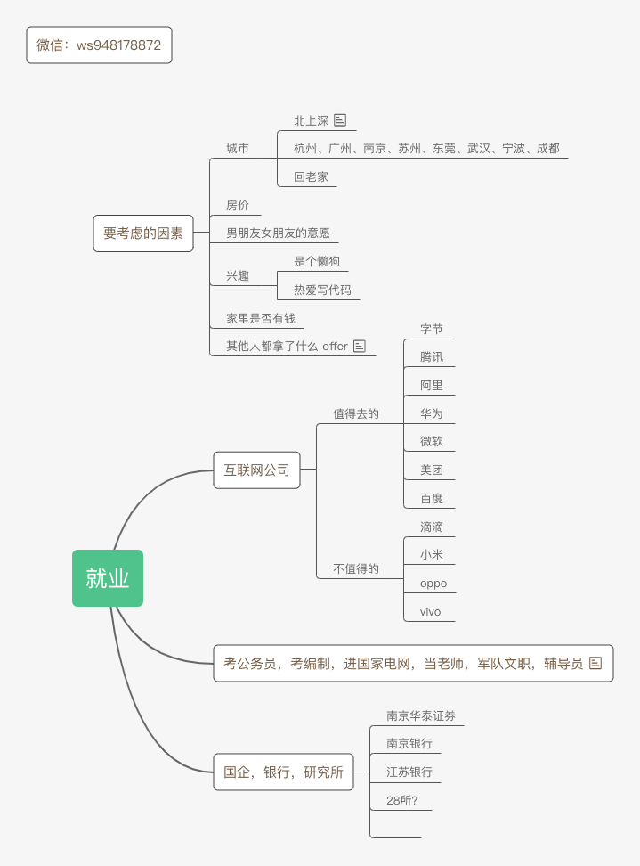
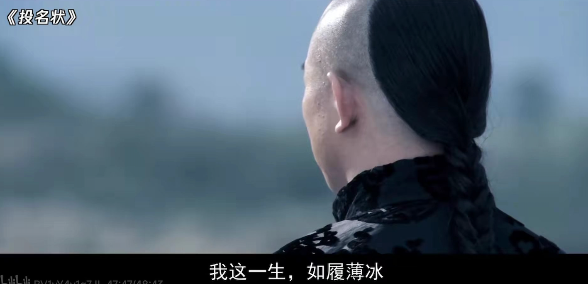
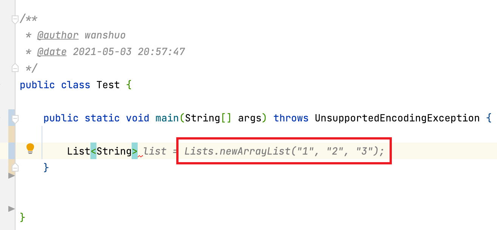

# 周刊

记录每一周的所见所闻。学习阮老师。

每周都对 gitbook 提交记录进行整理，把有趣的，有价值的知识，分享到周报。

[TOC]


## 2021-week-52

* [聊聊我关于 Web 未来发展趋势的看法](https://zhuanlan.zhihu.com/p/446947298?utm_source=wechat_timeline&utm_medium=social&utm_oi=744285080762990592) [modernjs](https://modernjs.dev/)

  计算机领域的发展方向：不断向上抽象，屏蔽更多的底层细节，让计算机的使用者/开发者能够花更多的时间在创造和享受上。

  抽象层级的排序：语言 -> 库 -> 框架 -> 引擎

  操作系统屏蔽了硬件的细节，k8s 屏蔽了物理机的细节，而 Serverless 则更进一步，直接把集群的细节也屏蔽了。

  一切能通过明晰的路径做到的事情，都具备替代性，要想提升自己的不可替代性，最重要的是抓住机会，在关键的产品中，担任关键的位置，取得关键的成果。

  抽象层级的改变，会带来范式的转移，什么是范式？当从原子角度看，桌子，电脑，甚至是芯片都没有意义，因为都是一个一个的原子。

   UGC（User Generate Content）用户生产内容。B 站，油管，抖音都是 UGC 平台，爱优腾如果不变革，早晚要没落的。

  元宇宙游戏，其实就是游戏平台的 UGC 化，游戏提供非常简易，门槛极低的低代码工具，让很多有创造力的用户，可以创造各种各样的小游戏。

  在 2021 年即将结束的这个时间点，它处于，框架逐渐成熟收敛，低代码工具市场开始爆发的前夜。

* [虚幻5引擎：黑客帝国觉醒](https://www.bilibili.com/video/BV1rY411p7Tg)

  当我们打造出的世界和我们自己的世界同等真实时，那现实到底意味着什么？

* [鄱阳湖明代千眼古桥](http://news.66wz.com/system/2021/12/06/105422662.shtml)

  

  明代修的桥现在还能用，质量真的扎实。
  
* [为什么输电损耗2000公里只有6%，还要修运煤铁路，直接输电多好?](https://www.zhihu.com/question/327986995/answer/1711259480)

  不要低估一辆运输着硬盘的卡车的带宽，也不要低估一辆运载煤炭的火车的输电量。把煤慢慢运到目的地再发电产生的电量远高于通过特高压输电线输送的电量。如果要完全要用特高压输电线路替代送煤铁路，要建设的特高压线路要多很多。

  如果我国所有的火力发电厂都在山西，在山西发电以后再通过长距离运输到用电负荷中心。如果一旦山西出了问题，那么就相当于整个中国70%的电力受到影响。所以要异地发电。


## 2022-week-01

* [分化，是楼市未来的趋势](https://mp.weixin.qq.com/s/EYzaqpW_h-ouL5WLGbQk-w)

  南京楼市在过去20年时间里，基本只在05、08、12、16年经历过4次普涨。观察一下就可以发现，基本每3-4年就发生一次普涨。所谓普涨，就是说不管是骡子是马，一平米至少涨个几千。

  但是16年到现在，已经5年多了，普涨没有再发生了。如果不进行强货币刺激，那么往年的普涨很难再现。这时候全市的平均涨幅指标会出现失真。一二线板块持续上升，三四线板块增长乏力。这时候买房的选择会变得极其重要。新房一旦套住，就是5年起步。假如你买的房子价格没动，而好的板块已经翻倍有余了，那你的置换计划就没戏了。买错了比错过行情更加可怕。

* [黄昏与月光 | 唐诗导读 第十二讲](https://www.bilibili.com/video/BV1fr4y1e7VG)

  黄昏意味着生命的流逝，月光蕴含着联系

* [mdbook](https://github.com/rust-lang/mdBook) 

  rust 语言编写的，兼容 gitbook 的电子书生成服务。Create book from markdown files. Like Gitbook but implemented in Rust。

  mdbook 对中文不友好，不支持中文搜索。

  Rust 正在成为 Linux 官方的第二大开发语言。

* [shan-shui-inf](https://github.com/LingDong-/shan-shui-inf)

  用 JavaScript 绘制山水画

* https://eja.tv/ 

  可以看国外的电视频道

  
  
  

## 2022-week-02

* [2021 B 站百大 Up 主公布](https://www.ithome.com/0/597/842.htm)

  记录一下我关注的 B 站百大 Up 主：

  * 电影最 Top（我入站关注的第一位 Up 主，有真情实感，真性情，不搞花里胡哨）
  * 极速拍档（他们是真的热爱汽车）

  啊这，我还以为我能找到很多，结果 2021 百大 up 主中我只关注了两位🤦🏻‍♀️

  2020 年疫情的时候，我还没毕业，在家无聊萌生了做 Up 的想法，到现在已经两年了，积累了 620 个粉丝，啥时候能破 1k 粉丝呀😂

* [PlayCover](https://sspai.com/post/70602)

  在 MacOS 上装 IOS 应用打原神

* [复旦大学教授王德峰解读《坛经》横屏4K精修](https://www.bilibili.com/video/BV1uZ4y1D787)

  考研坚持不下去的时候，遇到困难的时候，可以看一看

* [王德峰坛经十品-录音稿-markdown版本](https://github.com/wansho/altar-sutra-wdf)

  整理的录音稿
  
* [infoQ 解读编程语言的 2021](https://mp.weixin.qq.com/s/6u_QydMIdFaT78RumdMJRA)

  Java 即将支持协程(虚拟线程)。协程可以更有效地利用可用的硬件，并大大降低成本。最主流的编程语言已经全部支持或正在支持协程，包括 C++、Python、C#、Go（原生） 。

  在 InfoQ 2021 编程语言榜单 中，Rust 无论是关注度还是期望值，都紧随 Go 语言之后。Rust 最重要的优势在于以媲美 C/C++ 的性能表现，解决了编程过程中的内存安全问题。Rust 的出现不是为了重写这个世界已经存在的一切，而是为了让未来更加美好。

  C++ 问世四十年，相关方法技巧已经成熟，催生了编程大神无数，但在 2021 年的今天，我们仍然在寻找其替代品。其根本原因在于，人们逐渐明了，性能并非系统级编程语言的全部，随着软件逐渐接管 IoT 设备（尤其是自动驾驶车辆），内存溢出 / 指针悬垂类的内存安全问题，已经不只会造成经济损失，更会威胁人身安全。与其面向结果，出了问题再改 Bug，不如面向过程从一开始就把控好内存安全。

  在移动端开发，Kotlin 独树一帜；在数据科学领域，Python 和 R 语言应用甚广；在 Web 端，有越来越多的人开始尝试使用 TypeScript。

* [北理工 2022 计算机考研试卷比往年多了 4000 份](https://www.zhihu.com/pin/1465267871517904897)

  

* [最大的机会来自新技术](https://www.ruanyifeng.com/blog/2022/01/weekly-issue-192.html) 

  所有的机会都是新技术带来的，你想抓住最大的机会，只能去追踪那些新产品、新技术。

* [本田汽车的 2022 Bug](https://www.theregister.com/2022/01/06/acura_honda_cars_software_bug/)

  一辆老款丰田车，车机在 2022 年 1 月 1 日出现 Bug，这还只是一个很简单的嵌入式系统。很难想象现在的很多搭载复杂的安卓系统的新能源汽车，在几年后，会出现什么离奇的 Bug。

  现在汽车，尤其是新能源汽车，越来越像电子快消品了。汽车电子化，造车门槛越来越低，电子快消品卷不动了，开始卷汽车了，想要再拉动一波消费。

  汽车应该回归其本来的价值和作用，就是驾驶出行。加入那么多花里胡哨的东西，又是自动驾驶，又是操作大屏，其实都是噱头。很难想象这些智能化的东西，在 N 年不更新系统后，会出现什么离奇的 Bug。


## 2022-week-03

* 这一脚，踢出了整个盛夏

  出自‌‌‌‌‌‌‌B站up主“请你喝好果汁”的视频《[因为你我会记住那一分钟](https://www.bilibili.com/video/BV1BM4y1G7S7)》，里面有虎哥与赵三金名场面的画面，搭配王家卫的台词，接着是虎哥鬼步舞搭配bgm夏日漱石，本身是整活视频，但是整个视频颇具文艺气息，使得评论区有很多人讲述他们自己的故事，代入其中仿佛回到了整活年代的那个盛夏。
  狠活儿是杀不死的，但那个盛夏已经回不去了。

* [rust 语言圣经](https://course.rs/)

  rust 学习教程（中文），GitHub 2.6K 星

* [clean-code-javascript-es](https://github.com/andersontr15/clean-code-javascript-es)

  如何编写简洁的 JavaScript

* [《致谢》作者黄国平博士在西南大学本科生毕业典礼上的演讲](https://www.bilibili.com/video/BV1Q44y1B7xw)

  这短短的一生，我们最终都将失去（出世），不妨大胆一些，爱一个人，攀一座山，追一个梦（入世）。

  学弟学妹们，在梦想的道路上，一定会遇到各种困难，到今天，我依然坚持相信，努力终有所成。因为人生不能没有梦想。

  致谢原文

  ```
  我走了很远的路，吃了很多的苦，才将这份博士学位论文送到你的面前。二十二载求学路，一路风雨泥泞，许多不容易。如梦一场，仿佛昨天家人才团聚过。
  
  出生在一个小山坳里，母亲在我十二岁时离家。父亲在家的日子不多，即便在我病得不能自己去医院的时候，也仅是留下勉强够治病的钱后又走了。我十七 岁时，他因交通事故离世后，我哭得稀里糊涂，因为再得重病时没有谁来管我了。同年，和我住在一起的婆婆病故，真的无能为力。她照顾我十七年，下葬时却仅是一副薄薄的棺材。另一个家庭成员是老狗小花，为父亲和婆婆守过坟，后因我进城上高中而命不知何时何处所终。如兄长般的计算机启蒙老师■■没能看到我的大学录取通知书，对我照顾有加的师母也在不惑之前匆匆离开人世。每次回去看他们，这一座座坟茔都提示着生命的每一分钟都弥足珍贵。
  
  人情冷暖，生离死别，固然让人痛苦与无奈，而贫穷则可能让人失去希望。家徒四壁，在煤油灯下写作业或者读书都是晚上最开心的力。如果下雨，保留节目就是用竹笋壳塞瓦缝防漏雨。高中之前的主要经济来源是夜里抓黄鳝、周末钓鱼、养小猪崽和出租水牛。那些年里，方圆十公里的水田和小河都被我用脚测量过无数次。被狗和蛇追，半夜落水，因蓄电瓶进水而摸黑逃回家中：学费没交， 黄鳍却被父亲偷卖了，然后买了肉和酒，都是难以避免的事。
  
  人后的苦尚旦还能克服，人前的尊严却无比脆弱。上课的时候，因拖欠学费而经常被老师叫出教室约谈。雨天湿漉着上课，屁股后面说不定还是泥。夏天光着脚走在滚烫的路上。冬天穿着破旧衣服打着寒颤穿过那条长长的过道领作业本。这些都可能成为压垮骆驼的最后一根稻草。如果不是考试后常能从主席台领奖金，顺便能贴一墙奖状满足最后的虚荣心，我可能早已放弃。
  
  身处命运的旋涡，耗尽心力去争取那些可能本就是稀松平常的东西，每次转折都显得那么的身不由己。幸运的是，命运到底还有一丝怜惜。进入高中后,学校免了全部学杂费，■■■一家帮助解决了生活费。进入大学后，计算机终于成了我一生的事业与希望，胃溃疡和胃出血也终与我作别。
  
  我很庆幸保研时选择了自动化所，感谢研究生部的老师们将我从别的部门调剂到模式识别实验室，感谢导师宗成庆老师选择了我，宗老师将我引入了科学研究的大门，博士这五年无疑是我过去最幸福的时光。惭愧的是，离宗老师的期望显然还有很远的距离，我也知道本可以做得更好。这一段经历已经成为我这一生值得回味的美好瞬间之一。我很喜欢人机交互式机器翻译这个题目，但也仅开 了个头。在未来，希望能有机会弥补这段遗憾。
  
  从家出发坐大巴需要两个半小时才能到县城，一直盼着走出大山。从炬光乡小学、大寅镇中学、仪陇县中学、绵阳市南山中学，到重庆的西南大学，再到中科院自动化所，我也记不清有多少次因为现实的压力而觉得自己快扛不下去了。这一路，信念很简单。把书念下去，然后走出去，不枉活一世。世事难科，未来注定还会面对更为复杂的局面。但因为有了这些点点滴滴，我已经有勇气和耐心面对任何困难和挑战。理想不伟大，只愿年过半百，归来仍是少年，希望还有机会重新认识这个世界，不辜负这一生吃过的苦。最后如果还能做出点让别人生活更美好的事，那这辈子就赚了。
  
  最近这些年，特别感谢■■■■■■■■■■■■■■■■■■■■■■■■■■■■■■■■■■■■■■■■■■■■■
  ■■■■■■■■■■■■■■■■■■■■■■■■■■■■■■■■■■■■■■■■■■■■■■■■■■■■■■■■■■■■■■■■■■■
  ■■■■■■■■■■■■■■■■■重塑了我的人生。
  
  感谢■■■老师和■■■老师为我的研究提出诸多建设性的意见和建议。与他们的交流过程中，我也被他们坦诚为人、踏实做事的处事风格所感染。感谢所有和我一起在课题组工作的老师们和学习的同学们：■■■、■■■、■■■、■■■、■■■、■■■、■■■、■■■、■■■、■■■、■■■、■■■、■■■、■■■、■■■、■■■、■■■、■■■、■■■、■■■、■■■、■■■、■■■、■■■、■■■、■■■、■■■、■■■、■■■、■■■、■■■、■■■、■■■、■■■、■■■、■■■、■■■、■■■、■■■、■■■、■■■、■■■、■■■、■■■、■■■、■■■、■■■、■■■、■■■、■■■、■■■、■■■、■■■、■■■、■■■、■■■、■■■、■■■、■■■、■■■、■■■、■■■、■■■、■■■、■■■、■■■、■■■、■■■、■■■、■■■、■■■、■■■、■■■、■■■、■■■、■■■、■■■、■■■、■■■、■■■、■■■、■■■、■■■、■■■、■■■、■■■、■■■。我们在研究上共同努力，互相学习，如亲兄弟姐妹一般谈笑风生。不认大学将来在休息，我想我们都不会忘记这些年一起度过的时光。感谢课题组■■■女士，感谢模式识别综合办实验室的■■■、■■■和■■■等老师，感谢研究生部的■■■、■■■、■■■和■■■等老师，他们为我的学习和工作给予了极大的帮助。这会成为我日后工作的动力，希望最后能成为课题组值得骄傲的学生。
  
  感谢父母给了我生命，感谢婆婆和叔辈对我的抚养，感谢■■■■■■■■■■■■■■■■■■对我的牵挂，感谢■■■和■■■对我的支持，感谢一路上让我生活变得美好或者不那么美好的人和事。
  
  最后，对参加论文评审、答辩的各位老师表示衷心的感谢！
  ```
  
  


## 2022-week-04

* [SpringBoot3.0 M1版本正式发布](https://spring.io/blog/2022/01/20/spring-boot-3-0-0-m1-is-now-available)

  抛弃 Java8，最低兼容 Java17

* [Liskov Substitution Principle in Java](https://www.baeldung.com/java-liskov-substitution-principle)

  讲里式替换原则，讲得非常好，非常透彻的文章

* 一种在 Markdown 中居左插入图片的新方式：图片超链接

  图片超链接，超链接的内容是图片（不再是文字），链接是点击图片后跳转的

  图片超链接可以天然地实现图片的居左插入，GitHub badge 的原理既如此。下图为 Barbara Liskov。

  [](https://en.wikipedia.org/wiki/Barbara_Liskov)

  图片超链接的源码为：

  ```
  [](https://en.wikipedia.org/wiki/Barbara_Liskov)
  ```


* [高速上车机系统死机或黑屏了要怎么办？](https://www.zhihu.com/question/511927934/answer/2318929238)

  上周提到新能源汽车车机系统的一个 bug，今天逛知乎的时候，又看到一个更离谱的，车企竟然在车机系统上推送广告，而且还是走高端新能源车路线的蔚来车机系统：

  []()[]()

  

  我再列举一下这些带有大屏车机的新能源车的弊端吧：

  * 车机系统越智能，安装的软件越多，越有崩溃的风险，而车机系统的首要功能，就是稳定性，车机的智能化与车的安全稳定性是背道而驰的
  * 大屏车机会分散驾驶员的注意力
  * 车机系统和手机系统一样，过几年就不会更新了，系统一堆漏洞，相像一下现在用 Windows XP 系统是什么感觉，用 Android4.0 系统是什么感觉
  * 自动驾驶短期内是不可能实现的，谁会把自己的性命，交给一个花里胡哨不成熟的东西呢
  * 新能源车刚刚起步没几年，目前的产品仍然是不成熟的，成熟的产品是不会在性命攸关的产品上推送广告的

  综上，把做手机的那一套方法论带到做机车上，是不行的，手机可以崩溃，可以死机，但是汽车不能崩溃（要出故障也只能是机械故障）。汽车应该回归它本来应有的功能，汽车就是一个安全的代步工具，第一要求是稳定性。越智能的东西，不稳定因素越大，增加各种花里胡哨的大多数情况下用不到的功能，只会给自己的驾驶带来安全隐患。


## 2022-week-06 — 08

* [悲观者往往正确，乐观者往往成功](https://book.douban.com/subject/35272352/)

  虽然内卷越来越严重，考研越来越难，但是宏观是我们必须接受的,微观才是我们可以有所作为的，停止抱怨，开始行动。

* [贫嘴张大民的幸福生活](https://movie.douban.com/subject/2210241/)

  最近在追电影最 top 讲解的 [贫嘴张大民的幸福生活](https://www.bilibili.com/video/BV1oS4y1G7rU)，堪称平民史诗。讲的老北京的普通老百姓的生活，很温馨接地气，看完心情久久不能平复，尤其是霍思燕和潘粤明的 cp，太好磕了，呜呜呜( Ĭ ^ Ĭ )

  

* [程序开发原理](https://book.douban.com/subject/1929725/)

  推荐一本好书，也是我最近在看的一本书。现在太多书在讲怎么做，而很少有书讲为什么要这么做，这本书会告诉我们，为什么 Java 要引入异常机制，为什么成员变量要私有并通过 get set 访问，什么是里式替换原则。（里式替换原则的作者编写）

* 如何快速查找电子书

  最近发现一个快速找到电子书的方法，不管什么电子书书，只需要去淘宝，花 3 块钱，就可以买到。专业的事找专业的人，省去了找书的麻烦。上面的《程序开发原理》电子书，就是直接淘宝买到的。

* [科技爱好者周刊](https://www.ruanyifeng.com/blog/2022/02/weekly-issue-195.html) - [黑洞合并](https://www.inverse.com/science/black-hole-merger-2022)

  天文学家观测到距离地球 12亿光年 的黑洞合并，经过阮老师的提醒，我突然意识到，这件事情 12亿 年前就已经发生了，只是经过 12 亿光年后光到达地球，我们才知道……

  

## 2022-week-09

* [在微软工作是怎样一种体验](https://mp.weixin.qq.com/s/VGL9t2TJpTNLVyfrNclhdw)

  真的好羡慕，大家看看微软的福利待遇：

  1、全员持股，共同富裕的典范。另外还有股票内购福利，员工最多可以拿每个月工资的15%九折购买公司股票。

  2、入职就有15天年假，不论工作年限长短。长达6周的男性陪产假。

  3、覆盖配偶和子女的补充医疗保险。

  4、水果、饮料、零食、咖啡近乎无限供应。

  办公装备：

  1、一个小型工作站，32G内存，i9处理器，运行起来相当丝滑。

  2、两个显示器，如果觉得不够可以去IT领取，不需要审批。

  3、两个笔记本电脑。

  4、随时可以申请可升降办公桌。

  5、网速超级快，整套装备使用体验相当好。

* [如果你有以下10种症状，说明你压力过大，这4招帮你走出困境](https://mp.weixin.qq.com/s/WwlWCa5LV-bzWXaKn67TRg)

  命中了好多症状，忙得有点麻木了，很多时候都忽视了自己的压力

* [房价还会涨🐴](https://www.zhihu.com/question/519615042/answer/2371272939) 

  

  太形象了，土地财政绑架了 zf，再吸一口，哈哈哈哈，只是扭转了三阶导数

* 低代码

  最近在调研低代码，和大家分享一些我看过的文章：

  * [百度吴多益：低代码，要怎么低？和低代码有关的 10 个问题](https://zhuanlan.zhihu.com/p/225987562)
  * [知乎：聊聊我对 GraphQL 的一些认知](https://zhuanlan.zhihu.com/p/419475396)
  * [美团：GraphQL及元数据驱动架构在后端BFF中的实践](https://zhuanlan.zhihu.com/p/370436576)
  * [爱奇艺：减少重复开发，GraphQL在低代码平台如何落地？](https://zhuanlan.zhihu.com/p/348950745)
  * [dataway 10 minutes](https://zhuanlan.zhihu.com/p/421426635)
  * [graphql-springboot 10 minutes](https://www.graphql-java.com/tutorials/getting-started-with-spring-boot)


## 2022 - week 10

### 一部电影[《大佛普拉斯》](https://movie.douban.com/subject/27059130/)

「我们已经可以依靠科技进入外太空，却依然无法走进一个人内心的宇宙」

「富人造佛，穷人拜佛」


### 一首诗词

西江月·世事短如春梦

世事短如春梦，人情薄似秋云。不须计较苦劳心。万事原来有命。

幸遇三杯酒好，况逢一朵花新。片时欢笑且相亲。明日阴晴未定。


### 一句话

你喜欢吃草莓，你会毫不犹豫的买下它，如果你不喜欢吃香蕉，但考虑到香蕉助消化，你还是会买它。

所以，喜欢是单纯的，不喜欢，才会权衡利弊，在你犹豫的一瞬间，其实已经做出了选择。

— 杨绛


### 快速入门 HAProxy 和 keepalived

https://www.bilibili.com/video/BV1Fh411Y7hc

HAProxy 用来做负载均衡，keepalived 用来做高可用


### 在线图表绘制工具（手绘风格）excalidraw

https://excalidraw.com/

优点：手绘风格 缺点：云同步功能得付费


### java 中 getter 和 setter 的作用

知其然，也知其所以然，习以为常的编码方式，我们知道为什么要这样吗

[Why use getters and setters/accessors?](https://stackoverflow.com/questions/1568091/why-use-getters-and-setters-accessors)

[Significance of Getters and Setters in Java](https://www.baeldung.com/java-why-getters-setters)


### 计算机领域的重要思想

计科：*abstraction* 

数学：*formalization* 

设计：*design is how it works* 

软工：*indirection - "All problems in computer science can be solved by another level of indirection"*

作者：黄玄 来源：知乎
链接：https://www.zhihu.com/question/32025746/answer/916476904


### SOAP vs Rest

基于 HTTP 的通信有两种常见方式：SOAP 和 Rest，最近因为工作原因接触到 SOAP，发现 SOAP 实际上就是 HTTP + XML

SOAP：HTTP + XML

Rest：HTTP + JSON


## 2022 - week - 11


### 一个视频

【范 大 神 仙 怒 斥 天 兵 天 将-哔哩哔哩】 https://b23.tv/pHHfBGg

迄今为止，我看到的范志毅宇宙，最离谱的一个视频。




### 一个 up 主

马刀刻森 https://space.bilibili.com/14048220

代表作：[张无忌！！！你就是歌姬吧？！！](https://www.bilibili.com/video/BV1GZ4y1d7yP?spm_id_from=333.999.0.0)

百万 up 主预定。


### 一句话

你没有做错什么，甚至大概率比10年前的你做得更好。但最可悲的事实是这个时代结束了，而这个时代中的我们还活着。


### 一首诗

西江月·世事短如春梦

世事短如春梦，人情薄似秋云。不须计较苦劳心。万事原来有命。

幸遇三杯酒好，况逢一朵花新。片时欢笑且相亲。明日阴晴未定。

人生无常，波音 737 坠毁，想起了这首诗。这个月刚飞了两次四川，看到这件事，很压抑。


### 廖雪峰 Web 开发教程

[廖雪峰 Web 开发教程](https://www.liaoxuefeng.com/wiki/1252599548343744/1255945497738400)

推荐廖大神的 web 开发教程，从 servlet 讲起，一直到 mvc 框架的由来，授人以鱼，也授人以渔。

很多人学习 web 开发，是从 Springboot 开始学起，但实际应该从最基础的 HTTP 和 Servlet 开始学起。


## 2022 - week -12


### 一句话

缓慢的、持久的、有纪律的努力，最终会导致令人难以置信的结果。

每当我无法忍受日常生活时，我就提醒自己，没有什么比每天坚持做下去更重要了。虽然我很难看到未来会怎样，但我知道持久性具有强大的威力，就像一句古老格言说的"继续去做"（keep doing）。

-- [《大海教给我的》](https://www.collaborativefund.com/blog/lessons-from-the-sea/)


### 一个观点

房价真的到顶了吗

https://www.zhihu.com/question/340712338/answer/2387456275


### 一个项目

[Story-for-Typecho](https://github.com/txperl/Story-for-Typecho) 一个博客模板，设计感很好



## 2022-week-13


### 9000 个人一起看同一个视频

9000 个人看同一个视频，看到这个数字，我惊呆了。

难怪现在有很多人权值搞自媒体，就想鸟哥说的一样，如果你把在城市的努力程度放到农村，你的生活也可以过的很好。

如果我们把一部分的经历，放在我们热爱的事情身上，去做自媒体，也许也可以做的很好。


### 计算机研究生就业

最近开了一个腾讯会议，和群里的同学，聊了聊计算机研究生的就业。

核心思想就是，趁着读研有时间，去考公务员试试，找工作别跟风都去互联网，多听听自己内心深处的想法。

然后，去互联网公司的话，北京上海深圳至少得开 35W+，不然还不如在南京等新一线，不要只看钱，还要看工作城市的房价。有好的平台，例如阿里，腾讯，字节，美团，华为，百度这种公司，不管在哪个城市，都是值得去的。对于二三流的公司，例如滴滴、OPPO、vivo，就要多掂量掂量了，可能高薪，但是不太稳定。

我老家在连云港，连云港的公务员，一年总包 15w，我感觉真的太香了，比我在南京打工强多了。

这是临时准备的思维导图，仅供参考，不接受批评。




### 一个观点

疫情这几年，中国人已经人困马乏了。或许还有进一步折腾的空间，但过去的平稳肯定是一去不复返了。空难这件事不是孤立的，社会上还有各行各业，国家只是个机器，变不出钱来，大户的钱就那点，越杀越少，杀了也只有一小部分惠及百姓，没有稳定的市场主体就没有百姓的富裕生活。

这是个防控的张力的问题，究竟应该怎么平衡防治和放开？南孟买已经公然在对抗中央了，一副要做哥谭第二的架势。只要把全国都带崩，由不得组织不从。发生这种事，也不是偶然。

但带崩后如何，谁敢断言呢？是真的没有多大风浪，还是掀起一波巨大的浪潮？或者持续高压下去，还持续得住吗？

党和人民面临的这场考验，十分凶险。


作者：黑涩土狗蓝孩
链接：
来源：知乎
著作权归作者所有。商业转载请联系作者获得授权，非商业转载请注明出处。


### 关于裁员

大环境下，各行各业的冷热情暖都是相互影响的，房地产从业人员几百万，教辅从业人员上百万，旅游行业从业人员几百万，餐饮从业人员上千万……他们的收入降低了，必然收缩消费，服装、美容、电子、娱乐……都会受影响，互联网涉及到电商、娱乐等各种消费，必然受影响。

所以互联网裁员是大环境变差的必然结果，各行各业都在不同程度裁员，受影响，只不过互联网话题热度最高容易洽流量，所以你觉得互联网裁员好像最严重而已，互联网依然是大多数年轻人最想去的地方，裁起员来才更有底气。

作者：老杨叔聊志愿填报 - 知乎


### 一部电影

[投名状](https://movie.douban.com/subject/1947089/) 豆瓣 7.5 分（低了）

看过，这周在发条张那里又看了一遍：[【细读经典：被严重低估的华语杰作！现在上映票房至少10亿起-哔哩哔哩】](https://b23.tv/OuOozmU) https://b23.tv/OuOozmU




### 一句台词

那天我们都喝醉了，也都哭了，说了很多肝胆相照的话，真是难忘的一夜。 几天后，我和北雁儿正式举行了婚礼，她父母单独找我谈了一次话，问我是不是隐瞒了年龄？ 我跟老人家说，我从出生就显得比别的孩子老。

1997年过去了，我很怀念它。

——「甲方乙方」


### 一个教程

这一周把廖雪峰的 jdbc 编程又过了一遍，循序渐进。

[廖雪峰 jdbc 编程](https://www.liaoxuefeng.com/wiki/1252599548343744/1255943820274272)

[廖雪峰 spring 开发 访问数据库](https://www.liaoxuefeng.com/wiki/1252599548343744/1282383540125729)


### 一首诗

神童诗

天子重英豪，文章教尔曹；
万般皆下品，惟有读书高。
少小须勤学，文章可立身；
满朝朱紫贵，尽是读书人。
学问勤中得，萤窗万卷书；
三冬今足用，谁笑腹空虚。
自小多才学，平生志气高；
别人怀宝剑，我有笔如刀。
朝为田舍郎，暮登天子堂；
将相本无种，男儿当自强。
学乃身之宝，儒为席上珍；
君看为宰相，必用读书人。
莫道儒冠误，诗书不负人；
达而相天下，穷则善其身。
遗子满赢金，何如教一经；
姓名书锦轴，朱紫佐朝廷。
古有千文义，须知学后通；
圣贤俱间出，以此发蒙童。
神童衫子短，袖大惹春风；
未去朝天子，先来谒相公。
年纪虽然小，文章日渐多；
待看十五六，一举便登科。
大比因时举，乡书以类升；
名题仙桂籍，天府快先登。
喜中青钱选，才高压俊英；
萤窗新脱迹，雁塔早题名。
年小初登第，皇都得意回；
禹门三级浪，平地一声雷。
一举登科目，双亲未老时；
锦衣归故里，端的是男儿。
玉殿传金榜，君恩赐状头；
英雄三百辈，附我步瀛洲。
慷慨丈夫志，生当忠孝门；
为官须作相，及第必争先。
宫殿召绕耸，街衢竞物华；
风云今际会，千古帝王家。
日月光天德，山河壮帝居；
太平无以报，愿上万年书。
久旱逢甘雨，他乡遇故知；
洞房花烛夜，金榜挂名时。
土脉阳和动，韶华满眼新；
一支梅破腊，万象渐回春。
柳色浸衣绿，桃花映酒红；
长安游冶子，日日醉春风。
淑景余三月，莺花已半稀；
浴沂谁氏子，三叹咏而归。
数点雨余雨，一番寒食寒；
杜鹃花发处，血泪染成丹。
春到清明好，晴天锦绣纹；
年年当此节，底事雨纷纷。
风阁黄昏夜，开轩内晚凉；
月华在户白，何处递荷香？
一雨初收霁，金风特送凉；
书窗应自爽，灯火夜偏长。
庭下陈瓜果，云端闻彩车；
争如郝隆子，只晒腹中书。
九日龙山饮，黄花笑逐臣；
醉看风落帽，舞爱月留人。
昨日登高罢，今朝再举觞；
菊荷何太苦，遭此两重阳。
北帝方行令，天晴爱日和；
农工新筑土，天庆纳嘉禾。
檐外三竿日，新添一线长；
登台观气象，云物喜呈祥。
冬天更筹尽，春附斗柄回；
寒暄一夜隔，客鬓两年催。
解落三秋叶，能开二月花；
过江千尺浪，入竹万竿斜。
人在艳阳中，桃花映面红；
年年二三月，底事笑春风。
院落沉沉晓，花开白雪香；
一枝轻带雨，泪湿贵妃妆。
枝缀霜葩白，无言笑晓凤；
清芳谁是侣，色间小桃红。
倾国姿容别，多开富贵家；
临轩一赏后，轻薄万千花。
墙角一枝梅，凌寒独自开；
遥知不是雪，为有暗香来。
柯干如金石，心坚耐岁寒；
平生谁结友，宜共竹松看。
居可无君子，交情耐岁寒；
春风频动处，日日报平安。
春水满泗泽，夏云多奇峰；
秋月扬明辉，冬岭秀孤松。
诗酒琴棋客，风花雪月天；
有名闲富贵，无事散神仙。
道院迎仙客，书道隐相儒；
庭裁栖凤竹，池养化龙鱼。
春游芳草地，夏赏绿荷池；
秋饮黄花酒，冬吟白雪诗。


### 显卡价格暴跌

显卡价格暴跌的原因，是以太坊即将切换区块链的共识机制，共识机制将从工作量证明（PoW）切换到权益证明（PoS）。切换后，新的节点不通过计算哈希产生，这意味着显卡挖矿没用了。


## 2022-week-14


### 一首诗 致橡树

我如果爱你——
绝不像攀援的凌霄花，
借你的高枝炫耀自己；
我如果爱你——
绝不学痴情的鸟儿，
为绿荫重复单调的歌曲；
也不止像泉源，
常年送来清凉的慰藉；
也不止像险峰，
增加你的高度，衬托你的威仪。
甚至日光，
甚至春雨。

不，这些都还不够！
我必须是你近旁的一株木棉，
作为树的形象和你站在一起。
根，紧握在地下；
叶，相触在云里。
每一阵风过，
我们都互相致意，
但没有人，
听懂我们的言语。
你有你的铜枝铁干，
像刀，像剑，也像戟；
我有我红硕的花朵，
像沉重的叹息，
又像英勇的火炬。

我们分担寒潮、风雷、霹雳；
我们共享雾霭、流岚、虹霓。
仿佛永远分离，
却又终身相依。
这才是伟大的爱情，
坚贞就在这里：
爱——
不仅爱你伟岸的身躯，
也爱你坚持的位置，
足下的土地。


### 一个短视频

【【亮剑版毒液】龙 液 （李云龙大战楚云飞！）-哔哩哔哩】 https://b23.tv/H6MSif5


### GitHub Copilot

早就听说过 GitHub 副驾驶的大名，最近试用了一下，确实爽。




### DeepL

比 Google 翻译，百度翻译都好用的翻译。


### 一个 up 主 爱吃粑蛋的人

https://space.bilibili.com/70757306

最近又发现了一个宝藏 up 主：爱吃粑蛋的人

顶尖大学的顶尖演技。

https://www.bilibili.com/video/BV1vr4y1p7KA
