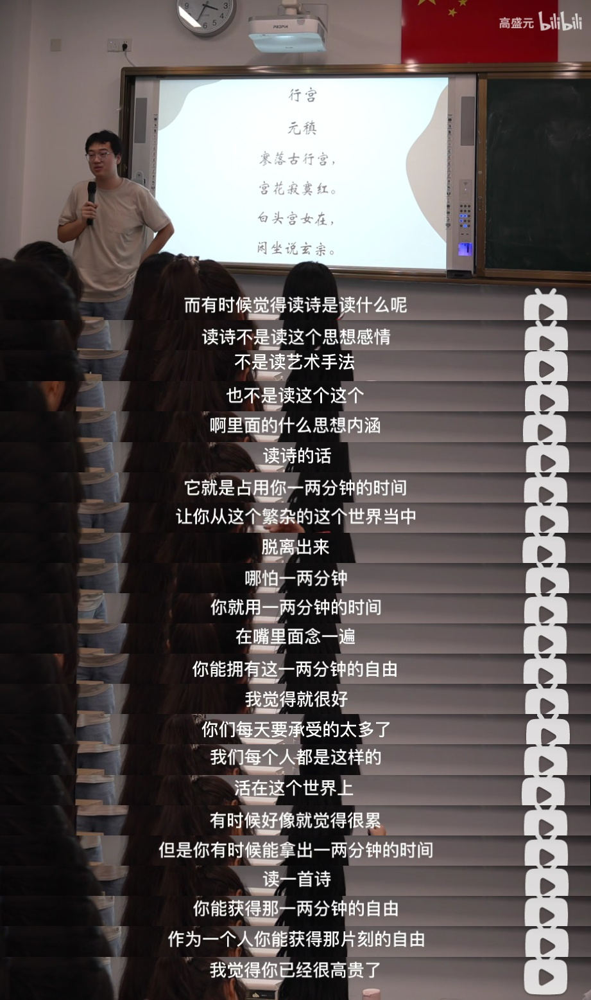

# 古诗词

[TOC]




------


## 先秦


### 君子于役

君子于役，不知其期。曷至哉？*鸡栖于埘*。日之夕矣，羊牛下来。君子于役，如之何勿思！
君子于役，不日不月。曷其有佸？鸡栖于桀。日之夕矣，羊牛下括。君子于役，苟无饥渴？


### 采薇

采薇采薇，薇亦作止。曰归曰归，岁亦莫止。靡室靡家，玁狁之故。不遑启居，玁狁之故。

采薇采薇，薇亦柔止。曰归曰归，心亦忧止。忧心烈烈，载饥载渴。我戍未定，靡使归聘。

采薇采薇，薇亦刚止。曰归曰归，岁亦阳止。王事靡盬，不遑启处。忧心孔疚，我行不来。

彼尔维何？维常之华。彼路斯何？君子之车。戎车既驾，四牡业业。岂敢定居？一月三捷。

驾彼四牡，四牡骙骙。君子所依，小人所腓。四牡翼翼，象弭鱼服。岂不日戒，玁狁孔棘。

*昔我往矣，杨柳依依。今我来思，雨雪霏霏。行道迟迟，载渴载饥。我心伤悲，莫知我哀！*


## 西晋

### 陈寿

#### 二十四史-三国志

一点寒芒先到，随后枪出如龙。

## 南北朝

### 陆凯

#### 赠范晔诗

折花逢驿使，寄与陇头人。

**江南无所有，聊赠一枝春。**

### 郦道元

#### 三峡

巴东三峡巫峡长，猿鸣三声泪沾裳。

### 世说新语

桓公北征经金城，见前为琅琊时种柳，皆已十围，慨然曰：“**木犹如此，人何以堪**！”攀枝折条，泫然流泪。

## 唐诗

### 李白

#### 清平调·其一

**云想衣裳花想容，春风拂槛露华浓。**
若非群玉山头见，会向瑶台月下逢。

#### 将进酒

君不见，黄河之水天上来，奔流到海不复回。

君不见，高堂明镜悲白发，朝如青丝暮成雪。

人生得意须尽欢，莫使金樽空对月。

天生我材必有用，千金散尽还复来。

烹羊宰牛且为乐，会须一饮三百杯。

岑夫子，丹丘生，将进酒，杯莫停。

与君歌一曲，请君为我倾耳听。

钟鼓馔玉不足贵，但愿长醉不愿醒。

古来圣贤皆寂寞，惟有饮者留其名。

陈王昔时宴平乐，斗酒十千恣欢谑。

主人何为言少钱，径须沽取对君酌。

五花马，千金裘，呼儿将出换美酒，与尔同销万古愁。

#### 送友人

**青山横北郭，白水绕东城。**
此地一为别，孤蓬万里征。
**浮云游子意，落日故人情。**
挥手自兹去，萧萧班马鸣。

#### 侠客行

**赵客缦胡缨，吴钩霜雪明。**

**银鞍照白马，飒沓如流星。**

**十步杀一人，千里不留行。**

**事了拂衣去，深藏身与名。**

闲过信陵饮，脱剑膝前横。

将炙啖朱亥，持觞劝侯嬴。

三杯吐然诺，五岳倒为轻。

眼花耳热后，意气素霓生。

救赵挥金槌，邯郸先震惊。

千秋二壮士，烜赫大梁城。

**纵死侠骨香，不惭世上英。**

**谁能书阁下，白首太玄经。**

#### 黄鹤楼送孟浩然之广陵

故人西辞黄鹤楼，烟花三月下扬州。

**孤帆远影碧空尽，唯见长江天际流。**

#### 赠新平少年

韩信在淮阴，少年相欺凌。
屈体若无骨，壮心有所凭。
一遭龙颜君，啸咤从此兴。
**千金答漂母，万古共嗟称。**
而我竟何为，寒苦坐相仍。
**长风入短袂，两手如怀冰。**
故友不相恤，新交宁见矜。
摧残槛中虎，羁绁鞲上鹰。
何时腾风云，搏击申所能。

#### 答王十二寒夜独酌有怀

昨夜吴中雪，子猷佳兴发。万里浮云卷碧山，
青天中道流孤月。**孤月沧浪河汉清，北斗错落长庚明。**
怀余对酒夜霜白，玉床金井冰峥嵘。人生飘忽百年内，
且须酣畅万古情。君不能狸膏金距学斗鸡，
坐令鼻息吹虹霓。君不能学哥舒横行青海夜带刀，
西屠石堡取紫袍。吟诗作赋北窗里，万言不直一杯水。
世人闻此皆掉头，有如东风射马耳。鱼目亦笑我，
请与明月同。骅骝拳跼不能食，蹇驴得志鸣春风。
折杨黄华合流俗，晋君听琴枉清角。巴人谁肯和阳春。
楚地由来贱奇璞。黄金散尽交不成，白首为儒身被轻。
一谈一笑失颜色，苍蝇贝锦喧谤声。曾参岂是杀人者，
谗言三及慈母惊。与君论心握君手，荣辱于余亦何有。
孔圣犹闻伤凤麟，董龙更是何鸡狗。一生傲岸苦不谐，
恩疏媒劳志多乖。严陵高揖汉天子，
何必长剑拄颐事玉阶。达亦不足贵，穷亦不足悲。
韩信羞将绛灌比，祢衡耻逐屠沽儿。君不见李北海，
英风豪气今何在。君不见裴尚书，土坟三尺蒿棘居。
少年早欲五湖去，见此弥将钟鼎疏。

### 杜甫

#### 偶题

***文章千古事，得失寸心知*。**
作者皆殊列，名声岂浪垂。
骚人嗟不见，汉道盛于斯。
前辈飞腾入，馀波绮丽为。
后贤兼旧列，历代各清规。
法自儒家有，心从弱岁疲。
永怀江左逸，多病邺中奇。
騄骥皆良马，骐驎带好儿。
车轮徒已斫，堂构惜仍亏。
漫作潜夫论，虚传幼妇碑。
缘情慰漂荡，抱疾屡迁移。
经济惭长策，飞栖假一枝。
尘沙傍蜂虿，江峡绕蛟螭。
萧瑟唐虞远，联翩楚汉危。
圣朝兼盗贼，异俗更喧卑。
郁郁星辰剑，苍苍云雨池。
两都开幕府，万宇插军麾。
南海残铜柱，东风避月支。
音书恨乌鹊，号怒怪熊罴。
稼穑分诗兴，柴荆学土宜。
故山迷白阁，秋水隐黄陂。
不敢要佳句，愁来赋别离。

#### 水槛遣心二首

去郭轩楹敞，无村眺望赊。
澄江平少岸，幽树晚多花。
***细雨鱼儿出，微风燕子斜***。
城中十万户，此地两三家。
蜀天常夜雨，江槛已朝晴。
叶润林塘密，衣干枕席清。
不堪祗老病，何得尚浮名。
浅把涓涓酒，深凭送此生。

#### 江南逢李龟年

岐王宅里寻常见，崔九堂前几度闻。

**正是江南好风景，落花时节又逢君。**

#### 秋兴八首 其二

夔府孤城落日斜，每依北斗望京华。

**听猿实下三声泪，奉使虚随八月槎。**

画省香炉违伏枕，山楼粉堞隐悲笳。

请看石上藤萝月，已映洲前芦荻花。

#### 九日五首 其一

重阳独酌杯中酒，抱病起登江上台。
**竹叶于人既无分，菊花从此不须开。**
殊方日落玄猿哭，旧国霜前白雁来。
弟妹萧条各何在，干戈衰谢两相催！

### 王勃

初唐四杰

#### 滕王阁序

豫章故郡，洪都新府。星分翼轸，地接衡庐。**襟三江而带五湖，控蛮荆而引瓯越**。物华天宝，龙光射牛斗之墟；人杰地灵，徐孺下陈蕃之榻。雄州雾列，俊采星驰。台隍枕夷夏之交，宾主尽东南之美。都督阎公之雅望，棨戟遥临；宇文新州之懿范，襜帷暂驻。十旬休假，胜友如云；千里逢迎，高朋满座。腾蛟起凤，孟学士之词宗；紫电青霜，王将军之武库。家君作宰，路出名区；童子何知，躬逢胜饯。

时维九月，序属三秋。潦水尽而寒潭清，烟光凝而暮山紫。俨骖騑于上路，访风景于崇阿；临帝子之长洲，得天人之旧馆。层峦耸翠，上出重霄；飞阁流丹，下临无地。鹤汀凫渚，穷岛屿之萦回；桂殿兰宫，即冈峦之体势。

披绣闼，俯雕甍，山原旷其盈视，川泽纡其骇瞩。闾阎扑地，钟鸣鼎食之家；舸舰弥津，青雀黄龙之舳。**云销雨霁，彩彻区明**。**落霞与孤鹜齐飞，秋水共长天一色**。渔舟唱晚，响穷彭蠡之滨；雁阵惊寒，声断衡阳之浦。

遥襟甫畅，逸兴遄飞。爽籁发而清风生，纤歌凝而白云遏。睢园绿竹，气凌彭泽之樽；邺水朱华，光照临川之笔。四美具，二难并。穷睇眄于中天，极娱游于暇日。天高地迥，觉宇宙之无穷；兴尽悲来，识盈虚之有数。望长安于日下，目吴会于云间。地势极而南溟深，天柱高而北辰远。**关山难越，谁悲失路之人？萍水相逢，尽是他乡之客。**怀帝阍而不见，奉宣室以何年？

嗟乎！时运不齐，命途多舛。**冯唐易老，李广难封**。屈贾谊于长沙，非无圣主；窜梁鸿于海曲，岂乏明时？所赖君子见机，达人知命。老当益壮，宁移白首之心？**穷且益坚，不坠青云之志**。酌贪泉而觉爽，处涸辙以犹欢。北海虽赊，扶摇可接；东隅已逝，桑榆非晚。孟尝高洁，空余报国之情；阮籍猖狂，岂效穷途之哭！

勃，三尺微命，一介书生。无路请缨，等终军之弱冠；有怀投笔，慕宗悫之长风。舍簪笏于百龄，奉晨昏于万里。非谢家之宝树，接孟氏之芳邻。他日趋庭，叨陪鲤对；今兹捧袂，喜托龙门。杨意不逢，抚凌云而自惜；钟期既遇，奏流水以何惭？

呜乎！胜地不常，盛筵难再；兰亭已矣，梓泽丘墟。临别赠言，幸承恩于伟饯；登高作赋，是所望于群公。敢竭鄙怀，恭疏短引；一言均赋，四韵俱成。请洒潘江，各倾陆海云尔：

滕王高阁临江渚，佩玉鸣鸾罢歌舞。

画栋朝飞南浦云，珠帘暮卷西山雨。

闲云潭影日悠悠，物换星移几度秋。

阁中帝子今何在？槛外长江空自流。

### 张若虚

#### 春江花夜月夜

春江潮水连海平，海上明月共潮生。
滟滟随波千万里，何处春江无月明！
江流宛转绕芳甸，月照花林皆似霰；
空里流霜不觉飞，汀上白沙看不见。
江天一色无纤尘，皎皎空中孤月轮。
江畔何人初见月？江月何年初照人？
人生代代无穷已，江月年年望相似。
不知江月待何人，但见长江送流水。
**白云一片去悠悠，青枫浦上不胜愁**。
谁家今夜扁舟子？何处相思明月楼？
可怜楼上月徘徊，应照离人妆镜台。
玉户帘中卷不去，捣衣砧上拂还来。
**此时相望不相闻，愿逐月华流照君。**
鸿雁长飞光不度，鱼龙潜跃水成文。
昨夜闲潭梦落花，可怜春半不还家。
江水流春去欲尽，江潭落月复西斜。
斜月沉沉藏海雾，碣石潇湘无限路。
不知乘月几人归，落月摇情满江树。

### 孟郊

游子吟

#### 登科后

昔日龌龊不足夸，今朝放荡思无涯。
**春风得意马蹄疾，一日看尽长安花。**

### 贾岛

#### 题诗后

两句三年得，一吟双泪流。

知音如不赏，归卧故山秋。

### 元稹

#### 离思五首·其四

**曾经沧海难为水，除却巫山不是云。**

**取次花丛懒回顾，半缘修道半缘君。**

#### 遣悲怀 其一

谢公最小偏怜女，自嫁黔娄百事乖。
**顾我无衣搜荩箧，泥他沽酒拔金钗。**
野蔬充膳甘长藿，落叶添薪仰古槐。
**今日俸钱过十万，与君营奠复营斋。**

#### 遣悲怀三首·其三

**闲坐悲君亦自悲，百年多是几多时。**
邓攸无子寻知命，潘岳悼亡犹费词。
**同穴窅冥何所望，他生缘会更难期。**
**惟将终夜常开眼，报答平生未展眉。**

### 崔颢

#### 长干曲

君家何处住，妾住在横塘。
停船暂借问，或恐是同乡。

横塘：莫愁湖

### 李商隐

#### 无题

**昨夜星辰昨夜风，画楼西畔桂堂东。**

**身无彩凤双飞翼，心有灵犀一点通。**

隔座送钩春酒暖，分曹射覆蜡灯红。

嗟余听鼓应官去，走马兰台类转蓬。


#### 乐游原

向晚意不适，驱车登古原。

夕阳无限好，只是近黄昏。


#### 月

过水穿楼触处明，藏人带树远含清。
初生欲缺虚惆怅，*未必圆时即有情*。


#### 北青萝

*残阳西入崦，茅屋访孤僧*。
落叶人何在，寒云路几层。
独敲初夜磬，闲倚一枝藤。
世界微尘里，吾宁爱与憎。


### 杜牧

#### 赠别

**多情却似总无情**，唯觉樽前笑不成。

蜡烛有心还惜别，替人垂泪到天明。

#### 遣怀

落魄江湖载酒行，楚腰纤细掌中轻。
**十年一觉扬州梦，赢得青楼薄幸名。**


#### 九日齐山登高

江涵秋影雁初飞，与客携壶上翠微。
**尘世难逢开口笑，菊花须插满头归。**
但将酩酊酬佳节，不用登临恨落晖。
古往今来只如此，牛山何必独沾衣。


### 白居易


#### 琵琶行

浔阳江头夜送客，枫叶荻花秋瑟瑟。主人下马客在船，举酒欲饮无管弦。**醉不成欢惨将别，别时茫茫江浸月。**

忽闻水上琵琶声，主人忘归客不发。寻声暗问弹者谁，琵琶声停欲语迟。移船相近邀相见，添酒回灯重开宴。千呼万唤始出来，犹抱琵琶半遮面。转轴拨弦三两声，未成曲调先有情。弦弦掩抑声声思，似诉平生不得志。低眉信手续续弹，说尽心中无限事。轻拢慢捻抹复挑，初为《霓裳》后《六幺》。大弦嘈嘈如急雨，小弦切切如私语。嘈嘈切切错杂弹，大珠小珠落玉盘。间关莺语花底滑，幽咽泉流冰下难。冰泉冷涩弦凝绝，凝绝不通声暂歇。别有幽愁暗恨生，此时无声胜有声。银瓶乍破水浆迸，铁骑突出刀枪鸣。曲终收拨当心画，四弦一声如裂帛。东船西舫悄无言，唯见江心秋月白。

沉吟放拨插弦中，整顿衣裳起敛容。自言本是京城女，家在虾蟆陵下住。十三学得琵琶成，名属教坊第一部。曲罢曾教善才服，妆成每被秋娘妒。五陵年少争缠头，一曲红绡不知数。钿头银篦击节碎，血色罗裙翻酒污。今年欢笑复明年，秋月春风等闲度。弟走从军阿姨死，暮去朝来颜色故。门前冷落鞍马稀，老大嫁作商人妇。商人重利轻别离，前月浮梁买茶去。去来江口守空船，绕船月明江水寒。夜深忽梦少年事，梦啼妆泪红阑干。

我闻琵琶已叹息，又闻此语重唧唧。同是天涯沦落人，相逢何必曾相识！我从去年辞帝京，谪居卧病浔阳城。浔阳地僻无音乐，终岁不闻丝竹声。住近湓江地低湿，黄芦苦竹绕宅生。其间旦暮闻何物？杜鹃啼血猿哀鸣。春江花朝秋月夜，往往取酒还独倾。岂无山歌与村笛？呕哑嘲哳难为听。今夜闻君琵琶语，如听仙乐耳暂明。莫辞更坐弹一曲，为君翻作《琵琶行》。感我此言良久立，却坐促弦弦转急。凄凄不似向前声，满座重闻皆掩泣。座中泣下谁最多？江州司马青衫湿。


#### 池鹤二首

高竹笼前无伴侣，乱鸡群里有风标。
低头乍恐丹砂落，晒翅常疑白雪消。
转觉鸬鹚毛色下，苦嫌鹦鹉语声娇。
*临风一唳思何事，怅望青田云水遥*。
池中此鹤鹤中稀，恐是辽东老令威。
带雪松枝翘膝胫，放花菱片缀毛衣。
低回且向林间宿，奋迅终须天外飞。
若问故巢知处在，主人相恋未能归。


### 其他

#### 咸阳城东楼

[许浑 ](https://hanyu.baidu.com/s?wd=许浑)

一上高城万里愁，蒹葭杨柳似汀洲。

**溪云初起日沉阁，山雨欲来风满楼。**

鸟下绿芜秦苑夕，蝉鸣黄叶汉宫秋。

行人莫问当年事，故国东来渭水流。

#### 咏柳二首

顾云

带露含烟处处垂，绽黄摇绿嫩参差。
长堤未见风飘絮，广陌初怜日映丝。
斜傍画筵偷舞态，低临妆阁学愁眉。
离亭不放到春暮，折尽拂檐千万枝。
闲花野草总争新，眉皱丝干独不匀。
**乞取东风残气力，莫教虚度一年春。**

#### 逢雪宿芙蓉山主人

刘长卿 

日暮苍山远，天寒白屋贫。
**柴门闻犬吠，风雪夜归人。**

#### 菩萨蛮

作者：[韦庄](https://www.baidu.com/s?wd=韦庄&rsv_idx=2&tn=baiduhome_pg&ie=utf-8&rsv_cq=菩萨蛮·人人尽说江南好&rsv_dl=0_left_exactqa_detail_28239&rsv_pq=dc5ee7040009ef61&oq=菩萨蛮·人人尽说江南好&rsv_t=f04bKIuhdiZueQphVwNwniYpBQNlZHrKzKacbgCVhb7JVvLlyttD3XDL%2BJ8RzXaBY%2FHE)

人人尽说江南好，游人只合江南老。**春水碧于天，画船听雨眠。**
垆边人似月，皓腕凝霜雪。**未老莫还乡，还乡须断肠。**

#### 淮上与友人别

郑谷

扬子江头杨柳春，杨花愁杀渡江人。

**数声风笛离亭晚，君向潇湘我向秦。**


#### 河湟旧卒

张乔

少年随将讨河湟，头白时清返故乡。
*十万汉军零落尽，独吹边曲向残阳*。


#### 上堂开示颂

[黄櫱禅师 ](https://hanyu.baidu.com/s?wd=黄櫱禅师)

尘劳迥脱事非常，紧把绳头做一场。
*不经一番寒彻骨，怎得梅花扑鼻香*。


#### 题都城南庄

去年今日此门中，人面桃花相映红。

人面不知何处去，桃花依旧笑春风。


## 五代十国


### 李煜

#### 渡中江望石城泣下

**江南江北旧家乡，三十年来梦一场。**
吴苑宫闱今冷落，广陵台殿已荒凉。
云笼远岫愁千片，雨打归舟泪万行。
兄弟四人三百口，不堪闲坐细思量。


## 宋朝


### 苏轼


#### 定风波

莫听穿林打叶声，**何妨吟啸且徐行**。
竹杖芒鞋轻胜马，谁怕？**一蓑烟雨任平生**。
料峭春风吹酒醒，微冷，山头斜照却相迎。
回首向来萧瑟处，归去，**也无风雨也无晴**。

#### 行香子·过七里濑

一叶舟轻，双桨鸿惊。水天清、影湛波平。鱼翻藻鉴，鹭点烟汀。过沙溪急，霜溪冷，月溪明。
重重似画，曲曲如屏。算当年、虚老严陵。**君臣一梦，今古空名。但远山长，云山乱，晓山青。**

#### 望江南·超然台作

春未老，风细柳斜斜。试上超然台上望，半壕春水一城花。烟雨暗千家。
寒食后，酒醒却咨嗟。**休对故人思故国，且将新火试新茶。诗酒趁年华。**

#### 洞仙歌·咏柳

**江南腊尽，早梅花开后，分付新春与垂柳。**

细腰肢自有入格风流，仍更是、骨体清英雅秀。

永丰坊那畔，尽日无人，谁见金丝弄晴昼？

断肠是飞絮时，绿叶成阴，无个事、一成消瘦。

又莫是东风逐君来，便吹散眉间一点春皱。

#### 定风波·南海归赠王定国侍人寓娘

常羡人间琢玉郎。天应乞与点酥娘。尽道清歌传皓齿。风起。雪飞炎海变清凉。
**万里归来颜愈少**。微笑。**笑时犹带岭梅香**。试问岭南应不好。却道。**此心安处是吾乡**。

#### 江城子·乙卯正月二十日夜记梦

十年生死两茫茫，不思量，自难忘。千里孤坟，无处话凄凉。***纵使相逢应不识**，*尘满面，鬓如霜。

夜来幽梦忽还乡，小轩窗，正梳妆。相顾无言，惟有泪千行。料得年年肠断处，明月夜，短松冈。


#### 次前韵寄子由

我少即多难，邅回一生中。**百年不易满，寸寸弯强弓。**老矣复何言，荣辱今两空。泥丸尚一路，？古语云，十方薄伽梵，一路涅槃门。？所向余皆穷。似闻崆峒西，仇池迎此翁。胡为适南海，复驾垂天雄。下视九万里，浩浩皆积风。回望古合州，属此琉璃钟。离别何足道，我生岂有终。渡海十年归，方镜照两童。还乡亦何有，暂假壶公龙。峨眉向我笑，锦水为君容。天人巧相胜，不独数子工。指点昔游处，蒿莱生故宫。


#### 自题金山画像

心似已灰之木，身如不系之舟。
问汝平生功业，黄州惠州儋州。


#### 临江仙·夜饮东坡醒复醉

夜饮东坡醒复醉，归来仿佛三更。家童鼻息已雷鸣。敲门都不应，倚杖听江声。

长恨此身非我有，何时忘却营营。夜阑风静縠纹平。*小舟从此逝，江海寄余生。*


### 欧阳修

北宋

#### 浪淘沙·把酒祝东风

把酒祝东风，且共从容。垂杨紫陌洛城东。总是当时携手处，游遍芳丛。
聚散苦匆匆，此恨无穷。今年花胜去年红。**可惜明年花更好，知与谁同？**

#### 蝶恋花·海燕双来归画栋

海燕双来归画栋。帘影无风，花影频移动。半醉腾腾春睡重。绿鬟堆枕香云拥。

翠被双盘金缕凤。**忆得前春，有个人人共。**花里黄莺时一弄。日斜惊起相思梦。


### 范仲淹

#### 岳阳楼记

庆历四年春，滕子京谪守巴陵郡。越明年，政通人和，百废具兴。乃重修岳阳楼，增其旧制，刻唐贤今人诗赋于其上。属予作文以记之。

予观夫巴陵胜状，在洞庭一湖。衔远山，吞长江，浩浩汤汤，横无际涯；朝晖夕阴，气象万千。此则岳阳楼之大观也，前人之述备矣。然则北通巫峡，南极潇湘，迁客骚人，多会于此，览物之情，得无异乎？

若夫淫雨霏霏，连月不开，阴风怒号，浊浪排空；日星隐曜，山岳潜形；商旅不行，樯倾楫摧；薄暮冥冥，虎啸猿啼。登斯楼也，则有去国怀乡，忧谗畏讥，满目萧然，感极而悲者矣。

至若**春和景明，波澜不惊**，上下天光，一碧万顷；沙鸥翔集，锦鳞游泳；岸芷汀兰，郁郁青青。而或长烟一空，皓月千里，浮光跃金，静影沉璧，渔歌互答，此乐何极！登斯楼也，则有**心旷神怡，宠辱偕忘**，把酒临风，其喜洋洋者矣。

嗟夫！予尝求古仁人之心，或异二者之为，何哉？**不以物喜，不以己悲**；**居庙堂之高则忧其民；处江湖之远则忧其君**。是进亦忧，退亦忧。然则何时而乐耶？其必曰“**先天下之忧而忧，后天下之乐而乐**”乎。噫！微斯人，吾谁与归？

时六年九月十五日。

### 黄庭坚

#### 雨中登岳阳楼望君山

投荒万死鬓毛斑，生出瞿塘滟滪关。
**未到江南先一笑，岳阳楼上对君山。**
满川风雨独凭栏，绾结湘娥十二鬟。
可惜不当湖水面，银山堆里看青山。

### 李清照

#### 清平乐·年年雪里

年年雪里。常插梅花醉。**挼尽梅花无好意。赢得满衣清泪。**

今年海角天涯。萧萧两鬓生华。看取晚来风势，故应难看梅花。

#### 一剪梅·红藕香残玉簟秋

红藕香残玉簟秋。轻解罗裳，独上兰舟。云中谁寄锦书来，雁字回时，月满西楼。

花自飘零水自流。一种相思，两处闲愁。**此情无计可消除，才下眉头，却上心头。**

### 秦观

北宋

#### 踏莎行

雾失楼台，月迷津渡。桃源望断无寻处。可堪孤馆闭春寒，杜鹃声里斜阳暮。

**驿寄梅花，鱼传尺素。砌成此恨无重数**。郴江幸自绕郴山，为谁流下潇湘去。

#### 鹊桥仙·纤云弄巧

纤云弄巧，飞星传恨，银汉迢迢暗度。**金风玉露一相逢，便胜却、人间无数**。
柔情似水，佳期如梦，忍顾鹊桥归路。**两情若是久长时，又岂在、朝朝暮暮**！

### 姜夔

#### 扬州慢

淳熙丙申至日，予过维扬。夜雪初霁，荠麦弥望。入其城，则四顾萧条，寒水自碧，暮色渐起，戍角悲吟。予怀怆然，感慨今昔，因自度此曲。千岩老人以为有“黍离”之悲也。

**淮左名都，竹西佳处，解鞍少驻初程**。过春风十里。尽荠麦青青。自胡马窥江去后，废池乔木，犹厌言兵。渐黄昏，清角吹寒。都在空城。

杜郎俊赏，算而今、重到须惊。纵豆蔻词工，青楼梦好，难赋深情。二十四桥仍在，波心荡、冷月无声。念桥边红药，年年知为谁生。

### 晏几道

#### 南乡子·花落未须悲

花落未须悲。红蕊明年又满枝。惟有花间人别后，无期。水阔山长雁字迟。

今日最相思。记得攀条话别离。**共说春来春去事，多时。**一点愁心入翠眉。

### 柳永

#### 望海潮·东南形胜

东南形胜，三吴都会，钱塘自古繁华。

烟柳画桥，风帘翠幕，参差十万人家。

云树绕堤沙，怒涛卷霜雪，天堑无涯。

市列珠玑，户盈罗绮，竞豪奢。

重湖叠巘清嘉，**有三秋桂子，十里荷花**。

羌管弄晴，菱歌泛夜，嬉嬉钓叟莲娃。

千骑拥高牙，乘醉听箫鼓，吟赏烟霞。

异日图将好景，归去凤池夸。

#### 八声甘州·对潇潇暮雨洒江天

对潇潇暮雨洒江天，一番洗清秋。渐霜风凄紧，关河冷落，残照当楼。是处红衰翠减，苒苒物华休。**惟有长江水，无语东流。**

不忍登高临远，望故乡渺邈，归思难收。叹年来踪迹，何事苦淹留？想佳人、妆楼颙望，误几回、天际识归舟。争知我，倚栏杆处，正恁凝愁！

### 其他

#### 满江红

怒发冲冠，凭栏处、潇潇雨歇。抬望眼、仰天长啸，壮怀激烈。**三十功名尘与土，八千里路云和月**。莫等闲、白了少年头，空悲切。

靖康耻，犹未雪。臣子恨，何时灭。驾长车，踏破贺兰山缺。壮志饥餐胡虏肉，笑谈渴饮匈奴血。待从头、收拾旧山河，朝天阙。

#### 卜算子·我住长江头

李之仪 

我住长江头，君住长江尾。**日日思君不见君，共饮长江水**。

此水几时休，此恨何时已。**只愿君心似我心，定不负相思意**。

#### 柳枝词

郑文宝

亭亭画舸系春潭，直到行人酒半酣。

**不管烟波与风雨，载将离恨过江南**。

#### 神童诗·四喜

汪洙

久旱逢甘露，他乡遇故知。

**洞房花烛夜，金榜题名时**。

#### 玉楼春·春景

[宋祁 ](https://hanyu.baidu.com/s?wd=宋祁)

东城渐觉风光好。縠皱波纹迎客棹。*绿杨烟外晓寒轻，*红杏枝头春意闹。

浮生长恨欢娱少。肯爱千金轻一笑。为君持酒劝斜阳，且向花间留晚照。

#### 八声甘州·灵岩陪庾幕诸公游

吴文英

渺空烟、四远是何年，青天坠长星？幻苍崖云树，名娃金屋，残霸宫城。**箭径酸风射眼，腻水染花腥。**时靸双鸳响，廊叶秋声。

宫里吴王沉醉，倩五湖倦客，独钓醒醒。问苍波无语，华发奈山青。水涵空、阑干高处，送乱鸦斜日落渔汀。连呼酒、上琴台去，秋与云平。

#### 唐多令·芦叶满汀洲

刘过

安远楼小集，侑觞歌板之姬黄其姓者，乞词于龙洲道人，为赋此《唐多令》。同柳阜之、刘去非、石民瞻、周嘉仲、陈孟参、孟容。时八月五日也。

芦叶满汀洲，寒沙带浅流。二十年重过南楼。柳下系船犹未稳，能几日，又中秋。
黄鹤断矶头，故人今在否？旧江山浑是新愁。***欲买桂花同载酒，终不似，少年游***。

#### 蚕妇

[【作者】张俞 ](https://hanyu.baidu.com/s?wd=张俞)【朝代】宋

昨日入城市，归来泪满巾。

遍身罗绮者，不是养蚕人。


#### 沁园春·丁酉岁感事

谁使神州，百年陆沉，青毡未还？怅晨星残月，北州豪杰；西风斜日，东帝江山。刘表坐谈，深源轻进，机会失之弹指间。**伤心事，是年年冰合，在在风寒。**说和说战都难，算未必江沱堪宴安。叹封侯心在，鳣鲸失水；平戎策就，虎豹当关。渠自无谋，事犹可做，更剔残灯抽剑看。麒麟阁，岂中兴人物，不画儒冠？


#### 汉宫春·梅

晁冲之

潇洒江梅，向竹梢疏处，横两三枝。东君也不爱惜，雪压霜欺。无情燕子，怕春寒、轻失花期。却是有，年年塞雁，归来曾见开时。
清浅小溪如练，问玉堂何似，茅舍疏篱。**伤心故人去后，冷落新诗**。微云淡月，对江天、分付他谁。空自忆，清香未减，风流不在人知。


### 辛弃疾

南宋豪放派诗人

#### 贺新郎

邑中园亭，仆皆为赋此词。一日，独坐停云，水声山色，竞来相娱。意溪山欲援例者，遂作数语，庶几仿佛渊明思亲友之意云。
甚矣吾衰矣。怅平生、交游零落，只今余几！白发空垂三千丈，一笑人间万事。问何物、能令公喜？**我见青山多妩媚，料青山见我应如是**。情与貌，略相似。
一尊搔首东窗里。想渊明、停云诗就，此时风味。江左沉酣求名者，岂识浊醪妙理。回首叫、云飞风起。不恨古人吾不见，恨古人、不见吾狂耳。知我者，二三子。

#### 水龙吟·登建康赏心亭

楚天千里清秋，水随天去秋无际。遥岑远目，献愁供恨，玉簪螺髻。**落日楼头，断鸿声里，江南游子**。把吴钩看了，栏杆拍遍，无人会，登临意。

休说鲈鱼堪脍，尽西风，季鹰归未？求田问舍，怕应羞见，刘郎才气。可惜流年，忧愁风雨，树犹如此！倩何人唤取，红巾翠袖，揾英雄泪？

#### 水调歌头 盟鸥

带湖吾甚爱，千丈翠奁开。先生杖屦无事，一日走千回。凡我同盟鸥鹭，今日既盟之后，来往莫相猜。白鹤在何处，尝试与偕来。
破青萍，排翠藻，立苍苔。窥鱼笑汝痴计，不解举吾杯。废沼荒丘畴昔。**明月清风此夜，人世几欢哀。东岸绿阴少，杨柳更须栽。**


## 明朝

### 唐寅

#### 桃花庵歌

桃花坞里桃花庵，桃花庵里桃花仙；桃花仙人种桃树，*又摘桃花卖酒钱*。
酒醒只在花前坐，酒醉还来花下眠；半醒半醉日复日，花落花开年复年。
但愿老死花酒间，不愿鞠躬车马前；车尘马足富者趣，酒盏花枝贫者缘。
若将富贵比贫贱，一在平地一在天；若将贫贱比车马，他得驱驰我得闲。
别人笑我太疯癫，我笑他人看不穿；不见五陵豪杰墓，无花无酒锄作田。

### 归有光

#### 项脊轩志

**庭有枇杷树，吾妻死之年所手植也，今已亭亭如盖矣。**


## 清朝


### 林则徐

子孙若如我，留钱做什么，贤而有财，则损其志

子孙不如我，留钱做什么，愚而多财，益增其过

——林则徐家训


### 纳兰性德

#### 送荪友

*人生何如不相识，君老江南我燕北*。
何如相逢不相合，更无别恨横胸臆。
留君不住我心苦，横门骊歌泪如雨。
君行四月草萋萋，柳花桃花半委泥。
江流浩淼江月堕，此时君亦应思我。
我今落拓何所止，一事无成已如此。
平生纵有英雄血，无由一溅荆江水。
荆江日落阵云低，横戈跃马今何时。
忽忆去年风月夜，与君展卷论王霸。
君今偃仰九龙间，吾欲从兹事耕稼。
芙蓉湖上芙蓉花，秋风未落如朝霞。
君如载酒需尽醉，醉来不复思天涯。


## 打油诗

```text
百望山上望百度，百度大搜质量部；
上线报警谁拦截，分级发布找崔祜。
```

## 名句

* 我有江南铁笛，要倚一枝香雪，吹彻玉城霞

  清 — 张惠言

* 流水不争先，争的是滔滔不绝

  老子 — 道德经

* 龙盘虎踞帝王州，帝子金陵访故丘

  李白

* 某甲虽在黄梅随众，实未省自己面目。今蒙指受入处，**如人饮水**，**冷暖自知**，行者即是某甲师也

  景德传灯录
  
* 组合句

  两句三年得， 一吟双泪流。文章千古事，得失寸心知。
  
* 与君初相识，犹如旧人归

* 未曾相逢先一笑，初会便已许平生


## 现代诗

### 毛泽东

#### 忆秦娥 娄山关

西风烈，长空雁叫霜晨月。
霜晨月，马蹄声碎，喇叭声咽。
**雄关漫道真如铁，而今迈步从头越**。
从头越，苍山如海，残阳如血。

### 余光中

#### 寻李白

酒入豪肠，七分酿成了月光；
余下的三分，啸成剑气；
绣口一吐，就半个盛唐。

### 顾城

#### 门前

我多么希望，有一个门口

早晨，阳光照在草上

我们站着，扶着自己的门窗

门很低，但太阳是明亮的

草在结它的种子，风在摇它的叶子

我们站着，不说话，就十分美好

## 成语

* **宠辱不惊**

## 文言文

* **东食西宿**

  齐人有女，二人求见。东家子丑而富，西家子好而贫。父母疑不能决，问其女，定所欲适，难指斥言者，偏袒，令我知之。女便两袒。怪问其故。曰：“欲东家食，而西家宿。”此为两袒者也。
  
* 君子之泽，三世而衰，五世而斩

  语出孟子。【君子之泽，五世而斩；小人之泽，五世而斩】
  
* 一曲肝肠断，天涯何处觅知音？

  出自功夫

## 英文

* Follow excellence, success will follow you