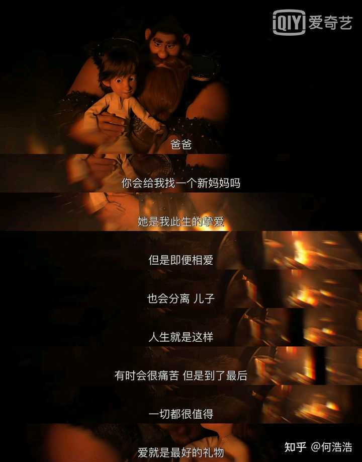

# [一个男生怎么样才算是正在成熟了？](https://www.zhihu.com/question/431134549/answer/1711330681)

**1、在与自己为敌的路上**

他慢慢开始知道人无高低之分，他不再喜欢与他人竞争，因为他知道自己赢了一个对手之后还有更强的对手，一辈子都赢不完。

于是他把所有人都看作自己的朋友，把他们当作帮助自己与自己竞争的伙伴，和那个理想中的自我比较，不断的超越自我。

> 就这一条就值得你点个赞

**2、活在当下**

他慢慢开始知道现在是他唯一拥有的东西，没必要为了未来的自己放弃了当下，他知道当下的自己不是为了实现未来的工具，他知道奖励自己，也知道安慰自己

“世界那么大，你现在就可以去看看。”

> 当你急着奔向未来的时候，说明你已经不喜欢现在了。——《禅与摩托车维修艺术》

**3、活在裆下**

他慢慢开始正视“爱”与“性”你认识到这两个东西是不可分割的存在，又意识到这两个东西是平等的存在，他开始学会用“爱”克制“性”而不是让“性”遮蔽自己的双眼

**4、由内而外的自信**

他不再讨论过去的事情，用过去的辉煌来作为当下的困难的盾牌，他开始正视自己的自卑，开始接受自己做不到一些事情的事实，并尝试去改变。

不再为自己的无能找借口，不再羡慕高学历的人，认为自己有学历一样能成功，不再羡慕有钱的家庭，不在有认为我有这样的家庭也能成功这样的心态

他开始由内而外的去掉自己的自负，正视自己的自卑，开始一步步走向自信

**5、由内而外的自尊**

他开始慢慢懂得，讨好不是爱的方式，爱是平等的尊重而不是低价值的讨好，更不是逾越于他人之上的控制

他知道，**我值得被爱，我值得拥有归属感，我有勇气全心全意的去爱**

**6、懂得谦虚**

他开始慢慢懂得谦虚是让自己利益最大化的品质，他知道除了真正为他的好事高兴的人以外的人都在嫉妒和厌恶

他不喜不悲，平和的去对待一件好事，一件坏事，他知道总有人不喜欢你为你的好事嫉妒，他知道总有人喜欢你为你的好事高兴，他知道总有人被骄傲冲昏头脑，他知道山外大有人在

**7、变成一个慢热的人**

他开始慢慢知道过早袒露出真心会被别有用心的人伤害，暴露自己的伤口会被撒盐，所以他变成一个慢热的人

他知道慢热才能看清楚一个人，才能让交付的心不被伤害，才能让别人缝补你的伤口

**8、拿得起放得下，有一颗「[平常心](https://www.zhihu.com/search?q=平常心&search_source=Entity&hybrid_search_source=Entity&hybrid_search_extra={"sourceType"%3A"answer"%2C"sourceId"%3A1711330681})」**

他开始慢慢知道，世事无常，有些人注定要分离，所以他学会了珍惜当下

> 人生就是这样
> 有时会很痛苦
> 但到了最后
> 一切都很值得
> 爱是最好的礼物

**9、做事有自己的原则和底线**

> 即使再愤怒，也不会动手
> 即使再爱对方，被背叛之后也会立即止损
> 即使利益再大，也不愿意违法

**10、做事不触碰别人的原则和底线**

他知道，不触碰别人的原则和底线是最基本的尊重，相互尊重才是一切关系的基础

逾越别人的底线等于把一个人彻底踩在脚下一般不尊重

**11、懂得感恩**

他知道感恩是很重要的品质，只有感恩才会让别人愿意重复帮助你

他知道感恩要从现在开始，比如看见一篇优质的回答就会点赞，答主才会有动力创作出更好的文章

**12、变得温柔**

> 拿到外卖小哥送来的外卖，会轻轻的关上门，而不是随手一丢
> 在公共场合出门会面向有人的一面关门
> 在饭局上别人抬手夹菜会帮对方扶住袖口

**13、开始培养自己的品味**

他开始打理自己的形象，学习穿搭，培养自己的审美品味，变成一个用心生活的人，用心的对待每一件事，他知道自己的生活态度开始变化的同时，自己也会飞速成长起来

**14、有更多的自我意识**

他慢慢开始知道，自己的情绪不解决，自己永远无法解决问题，遇到问题会先解决自己的情绪，立刻开始行动

他开始拥有更多的自我意识，能够察觉到自己的情绪，不再敏感大条，不会因为外界的因素导致自己的情绪变化，不再因为别人的目光所贬低自己

**15、会调节自己的节奏**

他知道，生活有生活的节奏，爱情有爱情的节奏，友情有友情的节奏，学习有学习的节奏，但他不再跟着别人的节奏，他知道他要主导这些节奏

生活在自己的节奏里，当爱情的节奏快了，他会主动调整自己的节奏，而不是等待对方调整节奏，比如迈入婚姻的，可能对方没准备好，他慢下来，调整节奏

他知道这样的生活才会有幸福感

**16、有共情能力**

他知道，一个人是否受人欢迎，是否能拉近与别人的距离，就在于共情能力的好坏

如果一个人连共情都学不会，那一定是情商低的典范，因为这种人往往以自我为中心

> 你被分手了一个朋友带着你去酒吧喝酒
> 另一个朋友陪着你一起难过

> 你看《泰坦尼克号》看到潸然泪下
> 陪你看的朋友说这个片段好垃圾

他开始懂得，什么是共情

**17、具有决断力**

**他知道及时止损是什么意思**

他知道那些连自己亲密关系中的爱人都可以背叛的人不值得他继续付出，他会一脚踹开不值得原谅的人，会拒绝不值得原谅的人的道歉

他知道赌博的投入不会让他损失的钱重新回到自己的口袋，他不会为赌博时脑子一热的的自己买单，他会当即立断的退出

**18、会独立思考**

他知道公众的舆论是一把刀子，会插进当事人的胸口，在事情反转之后的自己会把刀子拔出来插向自己

他会自己思考事情的来龙去脉而不是人云亦云，在没有更多证据线索之前不会妄下定论，在自己没有能力辨认事实之前不会跟随舆论伤害当事人

他知道，只有自己思考，才能活成他自己

**19、变得自律**

他知道自己的目标是什么，知道自己的理想在哪，知道自己如何得到

他知道今天晚上几点跟手机分开，知道今天晚上几点入睡每天几点起来，知道今天的计划有没有完成，知道今天过得怎样，知道明天要做些什么

他知道自律不是束缚，自律是自由，他做着自己热爱的事情而不是逼迫自己“坚持”

**20、看周星驰的电影不再大笑**

他知道喜剧的本质是悲剧，当他看到喜剧不再笑的时候

他会心的微微一笑

因为他知道他在表达什么

**21、明白大多数信息对自己没有用**

比如乱七八糟的抖音，比如垃圾袋怎么套在垃圾桶上，你要获取的是对自己有帮助的信息，而不是把自己的时间浪费在一些奇奇怪怪的知识之上

他知道这些信息对他毫无帮助，他知道更重要的东西是什么，他知道当他有了耐心和时间之后，就能做到90%的事情

**22、明白世界上本没有对错**

他知道自己的想法全部都是主观的，而且自己根本无法逃出这个主观的影响，永远住在自己的主观世界中。

也许你觉得这杯水是烫的，我觉得是凉的，那么我们都是对的，因为在自己的主观下，所有人都是对的，所以我不会与你争辩这杯水的温度，因为所有东西都不是非黑即白的，而是有灰色地带的

摘下自己的有色眼镜看世界，世界才会变得五彩斑斓，各种不同的观点思想交错在一起才是这个世界本该有的多样的色彩

**23、有责任心**

他知道他不能因为一时兴起就轻易许诺，他知道一诺千金的重要，他懂得为自己的言行负责，并承担后果

------

**下面是成熟的递进关系**

**24、停止幻想**

他知道幻想只会抬高自己的心理预期，他知道做事只能脚踏实地，他开始一点点的进步而不是幻想不切实际的暴富

他深知活在当下的重要性，多想的人永远停留在多想而不是行动

**25、意识到自己只是一个普通人**

他接受自己只是一个普通人的设定，但他不会自暴自弃，不怨天尤人，不自我设限，只是做好分内的事情

**26、不再抱怨**

他知道抱怨这种低级的方式不但解决不了问题还会影响自己的情绪，所以他开始行动起来寻找解决问题的方法

**27、学会了反省**

他坦然接受自己可能错了的事实，并学会了复盘，每天反省自己并思考更好的办法，开始站在别的角度思考并开始慢慢接受自己

**28、开始寻找自己的内心诉求**

他开始思考自己想要什么，什么让自己开心，什么是自己内心最深处的诉求，我的存在感从何而来，明白自己的利益，真正认识到自己是“谁”