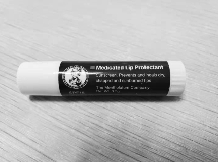
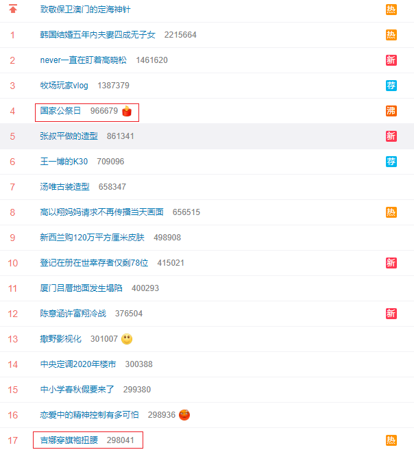

# 生活随想

[TOC]

## 关于 ASMR

2019-12-05

今天在看 [Latte ASMR](https://www.youtube.com/watch?v=7k-bFdcxaaE&list=PLSpOjPQtIdXuo0pWblzefhZw7RhEugd0u&index=3&t=0s) 时候，我终于找回了看 ASMR 的初衷，对，就是助眠。其实我已经偏离初心很久了，看 ASMR 也并不是为了助眠和放松，而每一次看都要找好半天。Latte 的 ASMR 做的那么用心，我完全应该认真的看下去，既得到了放松，还能锻炼自己的英文听力。

## 黑白的世界

2019-12-06

最近开始喜欢黑白的色调，感觉这种色调冷静、真实又克制，直击内心深处。

## 一只润唇膏

2019-12-06

由秋入冬，天气干燥，嘴唇如往年一样都开裂了，我又想起了之前和她要润唇膏的事情。从小到大，我一直不擅长关心照顾自己，嘴唇皴到裂开了才会想起买润唇膏；胃疼到实在受不了了才去看医生；耳垂长了个脂肪瘤，等到其大到影响睡觉了才会去做手术；就算是气胸，我也是在校医院医生的强烈建议下才会去大医院做检查。很多事情，都是当我忍到受不了，或者不得不做的时候，才会去做。当我开口和她要她的一只没用过的唇膏的时候，我多么希望她能给我，这样我就不用忍受吃饭刷牙的时候，嘴唇裂开的痛苦。

分手后，我慢慢开始懂得，照顾好自己的身体，比什么都重要。今年嘴唇刚刚裂开，我就去商店买了一支唇膏，25 块钱，蛮贵的，但是我自己也能挣钱了，我也不心疼了。

## 双休日的疲劳感

2019-12-07

现在周六周日过的总是很累。想了想，有几个原因吧：

* 精神上松懈了，疲劳的阈值降低了，这个可以理解
* 周五晚上玩嗨了，周六一天都很懵，这个应该改正
* 周一到周五的任务没有完成，想着拖到周六再做，这个在百度实习的时候，就非常明显
* 没有计划，漫无目的，这个也应该改正

## 我为什么更喜欢看 Youtube 视频

2019-12-07

最近我分析了网络精神鸦片，拿 Bilibili 和 Youtube 来举例子，今天我在看 [李敖北大演讲](https://www.youtube.com/watch?v=eeAki05r8ZI&lc=z23ze10hqkqohn1dlacdp43bklrtjtrk0wnteloqqx1w03c010c) 的时候，顺手写了两条评论，然后过了两个小时，马上就有人给我点赞。我更深刻的意识到，我之所以更喜欢看 Youtube 的视频，更喜欢在视频下面和大家互动，是因为 Youtube 平台的中文领域的视频质量要远远高于 Bilibili，因为其用户群体就不一样，Bilibili 上面有大量的未成年人，其内容更感性，更迎合未成年人的胃口，而对于我这样的人来说，这些视频大多是快消品，没有营养，看完就忘。而 Youtube 上面的中文用户大多是成年人，所以中文的内容也更加理性，视频质量也普遍较高。

我并不是贬低 Bilibili，这不是技术所决定的，而是其面向的用户群不一样。同样的道理，也可以解释 Google 中文搜索的搜索质量要优于百度中文搜索，因为能用 Google 中文搜索的用户，其用户整体素质肯定是优于百度搜索的，他们产生的点击记录也更有价值。

## 心事重重

2019-12-07

我经常总是心事重重的，患得患失，匆匆忙忙，慌慌张张，吃饭五分钟，走路匆匆忙。希望自己能够活得从容一点，自信一点。走路时候脚步放慢一点，抬头挺胸，收放自如。

## 上海财大女生被教授性骚扰

2019-12-08 [独家 | 曝光！上海财大会计学院已婚知名教授钱F胜在校园里公然将女学生锁进车内性骚扰](https://mp.weixin.qq.com/s?__biz=MzIwMDcwNzI4OQ==&mid=2247484628&idx=1&sn=fdce3a1ee4eb7e7aa609b8f1e4ed40b1&chksm=96f85962a18fd074bc5e83257bb0f046e135970577bc9aa7e8d4ba33cac84482d5ed6ed899ea&mpshare=1&scene=1&srcid=12064z4v7H4EuSInfidQ6M5q&sharer_sharetime=1575633008880&sharer_shareid=1fb51834f36ac5ce3c1cb06304cd2be1&key=4ad845bd38d7da89ffefffeb64eada8fc86d3064c9b5cfe21e61dee58cb1a2ff1630dcfbca28fc1210c3810096b4c94e5f1630d4c2b36d160071b542965051ec7571ddbbb56d4044f97e57b4bb0afa74&ascene=1&uin=Mjk2NzkxMzU2MA%3D%3D&devicetype=Windows+10&version=62070158&lang=zh_CN&exportkey=AbdcXIPPXD5HZrCMoOXIpkE%3D&pass_ticket=hxYgvR2Y6TPd3VK8x35Fxu%2B3VmNEjVmOZ8rjTOsYYw4%2BKszZYwYCwIlaTqe4urFt)

最近被李老师催论文搞得有点烦，今天吃完晚饭，又看到了这一条新闻，想想现在国内的高校环境真的是恶臭。

战战兢兢，如临深渊，如履薄冰！

## 行有不得，反求诸己

2019-12-09

前几天看了李敖在北大的演讲，这句引用一直在我脑子里挥之不去。行有不得，反求诸己。出问题了，多想想是不是自己出了问题，大论文写不出来，难不成还怪老师吗？难道不是因为自己懒吗？对别人有意见，难道不是自己心胸狭隘？

## 关于罗永浩和刘强东

2019-12-10

昨天看了罗永浩的一个传记视频，讲到他中年放弃百万年薪去创业的时候，我突然感觉到罗老师真的不容易。一个白手起家的人，一个有血有肉的人。我们大多数人都没有资格嘲笑罗老师，虽然他失败了，但是大多数人都没有他中年创业的魄力。我喜欢有血有肉的人，就像东哥，白手起家，先是考上人大，然后创立京东，迎娶白富美，虽然国外被仙人跳，但是我反而觉得东哥是一个真实的人，他不像马云一样遥不可及，他就像我身边负重前行的大多数人一样，是一个有血有肉，接地气的人。

## 庆余年

2019-12-13

最近迷上了庆余年，昨天竟然看了八集，虽然看的时候很爽，但是看完后能明显感觉到被洗了脑，代入感太强，小说讲述故事的方式十分讨巧，用户的代入感很强，而且总是给观众挖坑。虽然很喜欢，但是希望自己还是冷静克制一点，先做好当下最重要的事情：毕业论文，先苦后甜，推迟满足感。By the way，最近明显有点飘了，少了点从容。

## 国家公祭日 & 朗朗热搜

2019-12-13

今天是南京大屠杀纪念日，但是微博热搜的前几名全是戏子，太真实了，熙熙攘攘，利来利往。早上让我吃饭的时候不能忍的是，我又看到了朗朗和吉娜的热搜，这个时候买热搜，脑子是让驴踢了吗？

## 行有不得，反求诸己

2019-12-17

最近状态不佳，压力来时总是怨天尤人，这时候又想起李敖在北大演讲时说的这句话，语出**孟子**。行有不得，反求诸己，是的，当问题出现的时候，先反省反省是不是问题出在自己身上，是好久没有锻炼身体了，还是没有注意调整自己的情绪，被别人牵着鼻子走。**君子求诸己，小人求诸人（论语）**，君子往自己身上找原因，小人往他人身上找原因。

## 关注焦虑的根源，遵循自己的本心

2019-12-17

我隐约觉得，人是性本善的，如果我说话做事不遵循我的本心，事后我就会后悔或焦虑，亦或者在违背本心的时候，心里就已经隐约觉得不对。我知道没事玩手机是不对的，是的，但是我没有在拿起手机之前去提醒自己；我知道猜忌他人是不对的，但是却没有提醒自己。斯科特派恩在《少有人走的路》中提醒我们，推迟满足感，三思而后行，在这个物欲横流的时代，希望自己能够保持一个清瘦的灵魂，保持独立的思考。

## 其身正，不令则行；其身不正，虽令不从

2019-12-18

这句话我觉得用来形容某些人再合适不过了。我想起了《庆余年》中庆帝所说：笑话多了，敬畏就没了，没了敬畏，心里的尊严何在，这台是不是就塌了。珍惜自己在别人心中的形象，别自毁长城。

## 数据隐私

2019-12-18

今天发现了 Github 的 [YouTube-Report](https://github.com/A3M4/YouTube-Report) 项目，才知道我们在 Google 所有产品中产生的所有数据，都是可以下载到的。国外的理念较国内还是很先进的，我试着找 Bilibili 的观看记录，却是找不到的，包括小米手环产生的数据，也是无法下载的。天下没有免费的午餐。

## 人并不是非黑即白

2019-12-18

李老师这个人让我认识到，人并不是非黑即白的，每个人的心里都住着一个天使和一个魔鬼。多学习别人的优点别总盯着别人的缺点。行有不得，反求诸己。

## 生活所迫

2019-12-19

好久没和百度的师姐聊天了，今天了解到她竟然在写 Pandas，我很惊讶，安曼说的比较委婉：生活所需，哎，成年人的生活，没有容易二字呀。别和小孩子一样任性了，一点亏都吃不得，动不动就闹情绪。

## 潜藏的惰性

2019-12-20

最近赶大论文，我经常会埋怨李老师在这个时候还给我施压，让我写小论文，但后来想想，别人的错误，并不是我逃避写大论文的借口。即使我不想写小论文，但是写大论文是我逃避不了的。而我，只是在利用对李老师的消极情绪，来逃避写大论文而已，这种潜藏的惰性真的是不容易发现！

## 无处不在的诱惑

2019-12-20

今天是 2020 考研的前一天，我在知乎上看到了一个热帖 [为了 2020 考研，你努力到了什么程度？](https://www.zhihu.com/question/361949055/answer/943728307)，知乎真的为了流量不择手段，耽误考研学子的宝贵时间。

## 种一棵树最好的时机

2019-12-26

种一棵树，最好的时间是十年前，其次是现在。你的下一颗树打算种什么？

## 不要给自己设限

2019-12-27

旺盛的精力是冲破桎梏的基础，开放的思想是打破僵局的关键。希望自己能随时随地都能保持状态，从心所欲，保持真我。

## 磨刀不误砍柴工

2019-12-28

早上花在打理上的时间，可能和一天的状态成正比。其实早上好好洗漱、打理一下自己，花不了多少时间。

