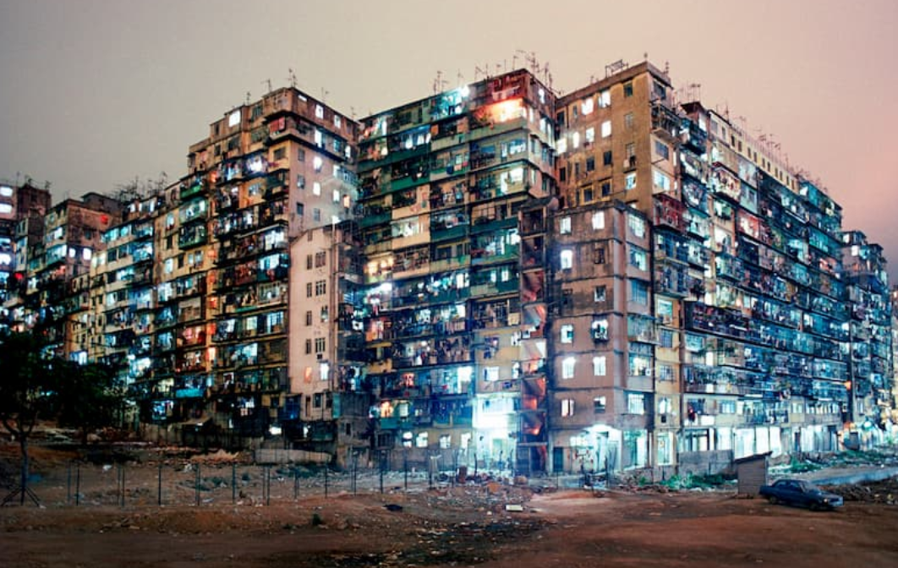

# Knowledge Summary

希望自己每天上网都能有所收获。

[TOC]

## 政治

### 中国国情

*  我国只有3%的人拥有本科学历

* 我国的**有线电视用户**在 2020 年第一季度已经下降到了 **2.06 亿**户

* 航天行业的人才流失已经很严重了，中国孕育航天人才的土壤已经很贫瘠了，高端人才，在校招的时候，就已经流失了

* 2020-06 最新的**超算排行**，**日本**的基于 ARM 架构的 Fugaku **排第一**，第二和第三位是美国的计算机，第四和第五才是中国的

* **中国为什么要搞上山下乡？**

  * **马克思主义发展阶段论**：封建主义 —> 资本主义（过渡）—> 共产主义（苏联也支持先发展资本主义）
  * **一个国家和地区的发展经验，不能完全照搬到另一个国家**：中国特色社会主义
  * 新中国成立：所有剥削者的资产，全部剥夺，归国有，这触动了外国列强的利益
  * 中国是个**海绵型社会**，**城乡二元结构**，农村最大的海绵作用：**劳动力蓄水池**，每当城市发生危机，大量劳动力失业的时候，西方就转变为街头政治、暴动和社会动乱，在中国转变为下乡
  * **60 年代的上山下乡的原因：1960 苏联撤资，城里的大量劳动力失业，必须下乡，而且是下乡到集体户（个人不好接纳）**
  * **集体化的原因**：个体化的农户是不能充当蓄水池的，是送给张三家，还是李四家？

* 中国经济开启内循环，扎根基层，外循环的路开始走不通了

* **深圳人均收入**

  中位数不到 6K

  

* 中国 GDP：11.2 万亿 美元，是印度的 4 倍，江浙沪的 GDP 比印度还高

* 北京市政府在 2019 年迁往了**通州**，也就是杨利银的老家，将北京市政府从首都赶出去，是为了划清北京市政府和中央政府的职权界限，**降格北京市**

* 李总理说，**中国有 6 亿人，平均月收入 1000 元**。我觉得这是中国的最大国情

* 种**一亩麦子**，农民的纯收入也就**三四百元**，靠种地，农民必然赤贫

* **公务员级别**：

  办事员，科员，副科级，**正科级**（**局长**），副处级，**正处级**（**县委书记**），厅级（江苏省教育厅），省级，国家级
  

#### 经济

* 政府收入来源（2019 年）
  * 税收（16 万亿）
  * 卖地（7 万亿）
  * 国企收入（只占 1%）
    * 烟草行业 417 亿
    * 投资服务企业 244 亿
    * 电力企业 200 亿
    * 石油石化 188 亿
    * 电信行业 174 亿

#### 国企

* 国企做的，很多都是亏本的买卖，航空航天，农化，军工，石油。**资本是逐利**的，想要发展**芯片**，还得看国家支持，国企支持

* **军工领域**
  * 军工是**高科技**、**高利润**行业
  * 日本从美国军购 F35 150 架，加上 110 台发动机，**总价 230 亿美元**，**和中兴市值差不多**
  * 中国的军火销售巨头：**中国兵器工业集团**（北方工业公司）99A 坦克，还做油田开采，矿产开发
  * 第二位军火巨头：**中国兵器装备集团**（南方工业公司）子公司：**长安汽车**、**江铃汽车**，中国最大的输变电设备制造商：**天威保变电气**
  * 航空领域：**中航工业公司**，2018 年营收 655 亿美元，子公司：**成飞**、**沈飞**（除欧美国家外，唯一能研究出喷气式舰载机和四代机的制造商），也是中国**商飞**的三大股东之一
  * 海洋领域：**中船重工**、**中国船舶**：**江南造船厂**： 055 国产驱逐舰（2020-01 服役），同时在建国产航母，**大连造船厂**：辽宁舰、山东舰，2019 年 11 月，**南北船合并**为**中国船舶集团**
  * 航天领域：**航天科工**、**航天科技**：航天和导弹
* **中国农业现状 农化领域**
  * 农业化学产品和种子行业在 2015 年之前，由 6 大公司主导：美国孟山都、瑞士先正达（全球第一大农药，第三大种子巨头）、德国拜尔（拜尔后来 660 亿美元收购孟山都）、美国杜邦、美国陶氏化学（前两者后来合并）、德国巴斯夫，第七是以色列安道麦
  * **中国化工集团**，收购**以色列安道麦**和**瑞士先正达**（430 亿美元）
  * 四巨头变成六巨头：**中国化工集团**、德国拜尔、美国陶氏杜邦、德国巴斯夫
  * 中国化工集团在 2015 年以 70 亿欧元收购意大利**倍耐力**轮胎（高端轮胎）
  * 2019年，中国制造业产值几乎等于**美日德之和**，中国制造业规模，如果再增加一倍，将会达到整个发达国家之和
  * 国企虽然利润低，运营效率底，垄断，但是国企承担着更多的国家和社会责任，如果没有国企，那么**军工、农化和种子**领域，都不会有和欧美巨头比肩的中国公司存在
* **国企和华为，石油化工领域**
  * 华为的研发支出在中国企业中排第一
  * **中国公司的科技研发活动，绝大部分都是由国企完成的；中国的制造，相当大的一部分，由国企来完成**，很多不赚钱、保民生的脏活累活都是国企来干的
  * 石油化工领域：**中石油、中石化、中海油**
    * 2019 年上市公司研发投入排行榜，中石油排第二，中石化排第五
    * 石油天然气的开采是高科技行业，一直由欧美垄断，中石油等国企实现了技术的国产化，并向外输出技术（和南瑞继保类似）
    * **科威特**是石油大国，国土面积和北京差不多大，但是供给了全球 10% 的石油，中石化已经打入中东市场，在 2014 年拿到科威特 11.5 亿美元的钻井合同，成为科威特最大的钻井承包商
    * 中海油：海上石油开采难度，远高于陆地石油开采（**贪吃蛇技术**），中海油从 08 年开始研发
    * 欧美的霸权行业：石油天然气、军工、航空、农化产品

#### 内卷

* 定义：资源有限，人口增长
* 最大的内卷：高考（所以有钱人把孩子送出国）
* 怎么做：跳出内卷赛道，找到其他赛道，自己开心就好
* 国情：每年有 80 万的硕士生，10 万的博士

#### 城市地区

* 天津的实体经济，已经停滞；天津的外卖繁荣程度，还不如四川绵阳

* 中国城市高校数量排行榜

  北京-武汉-广州（南京是个小弟，但是其学校质量高，211学校也很多）

* 澳门每年**八成**的财政收入来源于赌博，结构单一

### 美国

* 美联储的一份报告披露，**40%** 的美国成年人，紧急情况下，拿不出 **400** 美元现金

* 美国黑人，占美国总人口的 **13%**，白人占比 65%，白人人口是黑人的 **5** 倍

* 产业空心化

  美国计算机产业外流（产业空心化），目前只有 Intel 的芯片是在美国生产，高通，Navida 和 AMD 的芯片生产全在台积电（市值最大半导体公司），中国有一套完整的供应链

* **特朗普能走多远**（特朗普赢得选举之前的预测）

  * 我们看到的世界，是媒体塑造出来的，独立思考！
  * 特朗普为什么能够胜出？因为人民支持他啊！
  * 思考政治问题的正确方式：从实际出发，实事求是，**经济基础**决定上层建筑，**生产力**决定生产关系，**客观存在**决定主观认识
  * 特朗普（共和党），**人民民主**（战胜） vs **精英民主**（少数人的统治）
  * 希拉里 **邮件门**：在任国务卿期间的 5700 页的邮件已经被公开下载
  * 美国的**政治正确**在华盛顿产生了一种虚伪的氛围，特朗普则戳破了这张窗户纸，在墨西哥边境修墙
  * 美国国民最关注的话题：**经济**、**移民**、**国家安全（911）**、**政府失能**，特朗普触及了这些美国民众最真实的需求
  * 特朗普的兴起源于民众对**政府失能**的厌恶，特朗普是一个政治投机客
  * 特朗普的**人设**是精心设计过的：**有行动力**的传统的美国白种盎克鲁撒克逊上等贵族，给**政府赋能**，无视华盛顿一切繁文缛节
  * 让民众不关注政治，准入门槛高，从而变成少数人的游戏
  * 特兰普发一个 Twitter，一分钱不花，就能做宣传，收割平民选票，搞**民粹主义**
  * **GDP 重要吗**？1980 年，西德和日本的 GDP 超过苏联，30 年的发展赶上了苏联 70 年的发展，说明资本主义比苏联的社会主义优越，苏联开始不自信了，所以戈尔巴乔夫才着急改革开放。中国的 GDP 超过日本后，GDP 这个指标已经不重要了，中国已经有自信了，有了道路和制度自信
  * 政治为经济服务。**美国人民为什么失业**？美国企业，为了追求利润，将产业搬到了中国。而美国却宣传，是中国人抢走了美国人的工作
  * **媒体的作用**，就是让你**离开问题的本质**，就像操作系统将用户与硬件隔离一样
  * 美国国情：2008 年金融危机后，美国出现了**中产阶层**的**塌陷**
  * 你为什么要买手机？虚荣心！
  * 美国过去十几年，将太多的精力放在了**中东**，中国得以**韬光养晦**（希拉里的功劳 - 保护人权，花里胡哨）
  * 沈逸预测：特朗普上台后，美国快速进入孤立时期，全球收缩，**长期来看，美国会熬过最艰难的时期，然后触底反弹**（都预测对了）

* **TikTok事件背后，我们来品品“懂王”的剧本**

  * **懂王**：特朗普
  * 美国已经因为新冠死了 16W 人了，比越南战争死的人都多，新冠砸穿了美国治理体系隐藏起来的所有问题
  * TikTok 会成为特朗普竞选时候炫耀的筹码，这是从中国那里薅下的一块肉，简单粗暴
  * 特朗普擅长极限施压

* 美国禁枪

  美国为什么不🈲枪拿枪捍卫自己的权力和自由，自由从来不是别人恩赐的，要靠自己争取。片面之词，只说了不禁枪的坏处，没说持枪的坏处

* 美国的四大法宝：高科技 / 美军 / 美元 / 好莱坞

* 美国的三大股指：纳斯达克(高科技股)，道琼斯指数，标准普尔指数

* 美国从全世界吸血，美国人民过得越好，第三世界人民越水深火热

### 日本

日本本土市值最高的企业：任天堂（2020-08-28）

东京城市圈好玩的地方：新宿，秋叶原

自我介绍：瓦大喜哇 墨鱼仔 黛丝 （我是墨鱼仔)

### 印度

* **老子世界第一**

  * 反抗，是贱民的事情，不能反抗，不然就出格成为了贱民
  * 婆罗门的任务，就是祭祀和传道，说白了就是负责打嘴炮：印度比中国强，敏于言而不能行
  * 贵族阶级通过各种**迷惑行为**，塑造阶级认同
  * 印度人均是精神上的婆罗门，自欺欺人，和儒家的入世截然相反

* **1962 年对印作战**

  * 战争起因：1959 年西藏叛乱，达赖喇嘛叛逃印度，其实是印度从中作梗（美国支持），支持藏独
  * 印度华裔的伤害最大，4 万华裔 —> 4 千华裔，逮捕 4000 华侨换战俘，并把华侨的财富全部没收
  * 印度大国地位，迅速下跌，开始埋头发展军事
  * 印度国内各宗教和各派，因为有了共同的敌人：中巴，反而变得团结起来

* **印度制造业的野心**

  * 全球**经济第五**大国，2019 年，其经济总量已经超过英法，仅次于美中日德

  * 中国制造业产业链往印度转移的规模比到越南的规模更大，2019 年，印度是仅次于中国的第二大手机生产国

  * 提高各种关税，迫使外企在当地建厂：OPPO，VIVO，小米，三星，苹果；这些举措，受伤最大的是：中国

  * 印度是当前全球第五，未来全球前三的**巨型经济体**

  * United States	21,439.45	
    China	        14,140.16	
    Japan	        5,154.48	
    Germany	        3,863.34	
    India	        2,935.57

    印度的经济体量，是中国的 **1/5**，不容小觑

* 印度也有核武器，1974 年在印巴边境试爆；巴基斯坦于 1998 年成功试爆核武器，成为第七个有核国家，并且也是伊斯兰国家中第一个有核国家；

* 世界上的有核国家：五常 + 印度 + 巴基斯坦 + 朝鲜，八个国家

### 台湾

**现状**

* 台湾省人口：2300万，是中国第一强省，大陆的人均 GDP 是台湾的 40%，人均 GDP 比江苏高 60%，比上海高 10%，医疗器械，电子信息产业发达；50年代，麦克阿瑟称台湾为**永不沉没的航空母舰**
* 中国大陆的人均 GDP 仅为台湾的 40%
* 截至 2020 年，中国大陆，仍然没有任何一个省级行政区，其人均 GDP 超过台湾，**经济基础决定上层建筑**
* 台湾有两种人（两条路政策）：亲日台独分子，中国人（坚持一个中国）
* 收复台湾的方法：先穷台，再统一

**李敖**

台湾无党派人士，代表作：《北京法源寺》

* [Youtube](<https://www.youtube.com/watch?v=OWgX8wo6kDI>)
* 樽前做剧莫相笑，我死诸君思我狂
* 100年前的中国，四千个人里面才有一个中学生，其他都是文盲

**台积电**

* 台积电是目前市值最大的半导体公司（2020-07）
* 台积电已经上马了 3nm 工艺制程

### 韩国

* **政治**

  韩国政治中心：**青瓦台**

  韩国总统任期：**五年**

  * **李承晚**：第一任总统

  * **卢武铉**：第十六任韩国总统，**文在寅挚友**，**理想主义者**，08 年任期结束，2009-05-23 跳崖自杀，以死明志
    * 对美国，收回自主权
    * 对日本，要求正视历史
    * 对财阀，对大企业进行改组
    * 对朝鲜，提出和平繁荣政策
  * **李明博**：第十七任韩国总统，**现代集团总裁**，财阀，清算卢武铉，被查出受贿 4000 万美元
  * **朴槿惠**：第十八任韩国总统，父亲朴正熙，遭卢武铉清算，2016 年闺蜜们爆发，被国会弹劾，2017年称为韩国历史上首个被弹劾下台的总统
  * **文在寅**：第十九任韩国总统，出身寒微，考上庆熙大学，被退学，律师，为平民打官司，卢武铉之影，2017-05-23 朴槿惠出庭受审，2018-05-23 李明博出庭受审，对抗韩国财阀

* **寄生虫**

  奉俊昊-寄生虫-奥斯卡-韩国财阀

  * 《寄生虫》是奥斯卡历史上，第一个获得最佳电影奖的外语片，奥斯卡奖的评委团体是一群老大爷，奥斯卡奖是西方的自嗨
  * 奉俊昊-艺二代-延世大学-《寄生虫》-《杀人回忆》-《汉江怪物》
  * 一个人的成功，**个人努力很重要**，**时运也很重要**
  * 韩国财阀：三星-现代-LG
  * 寄生虫：穷人看了感动不已，富人赚得盆满钵满，通过理解穷人来赚钱，富豪的钱加倍奉还，百姓的钱三七分成

* 三星集团虽然有一半的股份被华尔街持有，但是其**控制权**还是牢牢掌握在李氏家族的手中，目前李氏家族的所有资产，还是掌握在**李在镕**的手里，李健熙的长女是一个边缘人物

* 韩国现任总统文在寅是和三星财团唱反调的，反对李在镕继位，完全不为自己下台后的境地考虑（文在寅的复仇）

### 香港

* 香港九龙城寨在 1993 年已被全部拆除

  

* 李嘉诚

  [link](https://www.zhihu.com/question/268907527/answer/799831066)

  不做实业，靠房地产，金融圈钱，卖地不开发，哄抬房价，使得年轻人买不起房，香港的年轻人恨错了人，他们恨的应该是这些吸人血的资本家。

  李嘉诚的所作所为，已经影响到国计民生了，政府早晚要制裁他，所以他开始将资产转移到英国

### 欧洲

* **五月花号**：1620 年，**第一批英国移民**乘坐五月花号来到北美

### 俄罗斯

* 土耳其和俄罗斯的主要矛盾：俄罗斯的从黑海到地中海的海上贸易通道**土耳其海峡**由土耳其掌控（土耳其首都伊斯坦布尔就在土耳其海峡），土耳其海峡是黑海到地中海的唯一通道，土耳其海峡被卡住，那么俄罗斯的黑海舰队就成了湖军

* **贝加尔湖**：最大的天然淡水湖，最深的湖

### 其他国家地区

* 20世纪下半叶，**犹太人**获得了22％的诺贝尔化学奖，32％的医学奖和32％的物理奖，尽管他们不到世界人口的1％

* **印度尼西**亚有 17508 个岛屿

* [拉美西斯六世陵墓的 3D 模拟](https://my.matterport.com/show/?m=NeiMEZa9d93&mls=1)

* **阿联酋**平均每年只有 **12** 天降雨

* **黎巴嫩**首都贝鲁特港口爆炸的**硝酸铵**，是 **2013** 年被黎巴嫩海关从一艘非洲船只查获

* 西努哈克港，简称西港，柬埔寨第二大城市，**柬埔寨**的深圳

* **摩纳哥**，世界第二小的国家，寄生在法国海岸，法国也不想吞并了，因为这是一种内耗，欧洲应该团结起来，一致对外，两次世界大战，将世界中心送给了美国

* 阿富汗-帝国坟场

* **孟加拉国**

  首都：达卡（**达卡大学**），**印度、孟加拉、巴基斯坦**曾经合起来是一块英国殖民地，中国支持孟加拉和巴基斯坦的发展，支持两国的基建，用来**牵制印度**。

  孟加拉位于**恒河下游**，交通被恒河分割严重，最大的港口：吉大港，孟加拉的目标：让上亿的年轻人有资格进**血汗工厂**

* **巴基斯坦**：

  * 供电极不可靠，最大的经济中心：**卡拉奇**
  * 一半的国土是荒漠和戈壁，缺乏水资源，人口超过 2.1 亿
  * 需要修建水电站，在夏季蓄水，需要 140 亿美元来修建，修建风险也非常高，已和中国达成协议，中国出资金和技术来修建

* 荷兰是美洲和拉丁美洲的毒品进入欧洲的门户，荷兰年轻人有 17.5% 吸食过大麻；

  德国和荷兰卖淫合法化，所以欧洲人口贩卖猖獗；

  美国是世界第一大毒品消费国，每年花 1500 亿美元购买毒品

* 丘吉尔，是一个腐朽的种族主义者，帝国主义者，并不是一个值得称道的英雄；温斯顿家族在英国是一个贵族

* 印度也有核武器，1974 年在印巴边境试爆；巴基斯坦于 1998 年成功试爆核武器，成为第七个有核国家，并且也是伊斯兰国家中第一个有核国家；

* 世界上的有核国家：五常 + 印度 + 巴基斯坦 + 朝鲜，八个国家

### 我的家乡

* **人口**

  赣榆有 120 万人口，其中青口镇 21.6 万，柘汪镇 5.7 万，海头镇 8.7 万

* **教育**

  县中目前最大的矛盾，是学生较先进的意识，和落后师资之间的矛盾

## 经济 / 财经

### 知识点

* **开曼群岛合法避税**

  X 公司在**开曼群岛**，注册了一家 Y 公司。**开曼群岛不对公司收税，只收取注册费**。然后，它把所有的知识产权，比如商标和特许技术都转移到 Y 公司。

  X 公司每年需要向 Y 公司支付很大一笔知识产权许可费用，导致它的利润为零，所以就不用缴税了。而 Y 公司由于注册在开曼群岛，即使有很大一笔利润，也不用缴税

* **数字人民币**

  数字人民币就是人民币的数字形式，主要用户网上支付，只有指定的银行才能提供该公共服务，**数字人民币就是商业银行的网上支付服务**。

* **固定利率和 LPR 利率**

  * 利率 = 基准利率 * (1 + 浮动)

    基准利率由央行来决定，浮动利率由央行、政策、**银行**和个人的情况所决定，浮动的部分，在和银行签订协议后，就不会再变化

    央行投入市场的钱，通过 MLF 借给各大银行，各大银行也需要还给央行一定的利率，也就是说，央行通过 MLF 调控各大银行

  * LPR 贷款基础利率

    LPR = MLF + 加点  

    MLF 由央行决定，加点主要由**商业银行**决定，LPR 的定价给了商业银行更多的自主权

    签订 LPR 的缺点：钱让银行挣去了，媒体宣传什么，反着来就行了

### 资本轶事

* **起底瑞幸咖啡资本大骗局**（18个月上市的神话）
  * **陆正耀**（董事长，也是神州优车和**神州租车**的老大）
    * 钱治亚（CEO，草根出身）
    * 杨飞（CMO，首席营销官，入过狱，收钱写黑稿）
    * 刘剑（COO，首席运营官，中央财大毕业）
  * 两个资本：**黎辉**的大钲资本，**刘二海**的愉悦资本
  * 神州租车和瑞幸是一个老板，一个尿性，不靠谱
  * 瑞幸的第一家测试店铺开在了北京二环的银河soho，当年我和王凯去天安门的时候，从那里路过
  * 瑞幸咖啡走的是神州租车的路子，险中求胜，不上市，就崩盘
  * 截至 2019-12-31，瑞幸咖啡共开设了 4507 家门店，称为国内最大的咖啡连锁店，而星巴克只有 3600 多家
  * 浑水做空瑞幸，实锤了瑞幸
  * 会计事务所安永因为浑水做空瑞幸的压力，拒绝在瑞幸的 Q4 报告上签字，直接导致了瑞幸自爆， COO 刘剑做假账 22 亿美元，替死鬼要进局子了，最多判 25 年
  * 既得利益者：**陆正耀**系通过股权质押套现 25 亿美元，**黎辉**甩卖股票跑路套现 100 亿人民币
  * 损失方：瑞幸 COO 刘剑被当作替死鬼；刘二海被坑了，没有来得及套现，股价雪崩；美国银行损失 7400 万美元；瑞银损失 6000 万美元；瑞信损失 4600 万美元；全球资本研究投资者基金损失 16 亿美元；孤松资本亏损 12 亿美元；
  * 陆正耀就是个骗子！朱啸虎也在朋友圈踩了瑞幸一脚
  * 新冠疫情也是瑞幸垮掉的又一个因素，其神州租车和瑞幸的现金流出现了问题

* **浑水公司**

  核心成员 10 人左右，由美国人创立，专门做空中概股，曾经做空过新东方、好未来、瑞幸咖啡等公司，俞敏洪评价：**苍蝇不叮无缝的蛋**

* **付宁：网红与 Up 主**

  * **商业模式分两种**：To B 和 To C

  * **网红与明星的区别**：**明星 To B**，**网红 To C**，C 的基数更大

  * B 站涨粉是非常难的，一粉顶十粉

  * 敬汉卿的投资人：高樟资本-范卫锋

  * B 站 Up 主，年收入千万的大有人在

    

* **冲浪 Plus：影院经济账（电影院复工）**

  * 影院怎么赚钱？

    一张 100 元的电影票，电影院可以分到一半的钱。利润率最高的，是影院衍生的餐饮服务；

    开一家中型电影院（5—7个场子）的成本：1000 万，大型电影院：3000 万；

    拍电影不赚钱，钱都让影院赚去了；影院也不赚钱，钱都拿去交房租了；商业地产也不赚钱，是为了吸引客流，转别的店的租金；收租金也不赚钱，主要为了形成商业圈，拉动地段升值，赚周边住宅地产的钱。总结来说：**电影院就是为房地产打工的弟弟。**只有房地产商（例如万达）做电影院，才不会亏钱。

    实际上，交了各种钱后，影院的最后收入，只剩票房的 10% 左右，通常**五年才能回本**

    一年不开张，开张吃半年

    一场电影，得至少有 12 人观影，才能回本

  * 2017 年，中国银幕数量，超过北美

  * 电影院盲目扩张，电影票价格上涨导致的上座率下跌，影院租金、运营成本的上涨，加上新冠疫情，导致了电影院的全面崩盘

  * 影院为什么不复工？因为看电影的人少，**影院的开工成本，比停工成本还高**

* **冲浪 Plus：长租公寓**

  * 链家 2017 年发布的报告显示，**中国租赁人口，已经达到 1.9 亿人**
  * 北京有 35% 的人在租房，北京每三个人中，就有一个人在租房
  * 长租公寓的内核：**二房东**

* **付宁：腾讯收购搜狗**

  * 搜狗现状：输入法市场占有率：70%，搜索份额：10%；大股东：腾讯，老东家搜狐；工具性公司
  * 收购完后，搜狗将成为腾讯的全资子公司，并退市
  * 腾讯已收购公司近 800 家
  * 腾讯是垄断吗？互联网发展的终点就是垄断（数据垄断），技术的终点就是垄断，腾讯收购搜狗，更看重的是它积攒的数据，数据就是公司的护城河（小米手环的数据为什么不能导出？电力行业为什么找不到好的技术文档？）
  * 中国在 2020 年会制定个人信息保护法、数据安全法

* **冲浪普拉斯：滴滴与程维**

  * 程维，高考失算，行政管理专业，第一份体面的工作：阿里销售，最年轻的主管，**阿里** B2B 部门最年轻的大区经理，支付宝 B2C 事业部副总经理

    好友：美团 CEO 王兴，王刚（天使投资人）

  * 滴滴：天使投资 - 阿里王刚 70 万，2012 年A 轮投资 - 朱啸虎 300 万，2013 年 3 月B 轮融资 - 腾讯注资 1500 万美金（成为腾讯系），2013 年底 C 轮融资 - 中信产业基金 6000 万美元 

  * 滴滴 vs 快滴（烧钱大战），导火索：微信支付 vs 支付宝，微信提供资金和技术支持（几个月两家公司一共烧了 20 亿），滴滴用户从 2000 万涨到 1 亿

  * Uber 入华，引入私家车参与商业运营，动了出租车市场的蛋糕，百度投资 Uber 6 亿美元，成为 Uber 中国股东

  * 2015 年情人节，滴滴，快滴 6：4 合并，程维管理

  * 滴滴 vs Uber（网约车烧钱大战），Uber 遇到微信封杀，刷单

  * 2016 年，苹果注资滴滴 10 亿美元，烧钱大战没有结果，滴滴出行收购 Uber 中国，Uber 卡兰尼克进入滴滴董事会，程维进入 Uber 董事会，百度成为滴滴股东

  * 好兄弟王兴，做起了打车生意（王兴总是在市场成熟的时候入局，美团打车）

  * 滴滴在不断破坏规则中成长，也注定要付出代价

* **冲浪普拉斯：选秀（平台，马太效应）**

  * 选秀最早起源于**日本**，经**韩国**发扬光大，后传入**中国**
  * 2004 年，湖南卫视，**超级女声**；2016 年**限韩令**；2018 年，偶像练习生-**蔡徐坤**，创造 101-**杨超越**；
  * 成本：培养一个团，至少需要 **4000W**
  * 在综艺平台唱歌，需要**歌曲版权费**，冷门歌曲 **8W** 一首，热门歌曲 **30W** 一首
  * 微博**热搜**，前五名，**4.5W / h**
  * **爱优腾**已经基本上垄断了偶像艺能变现的所有渠道，行业内的**利润大头**，都被这**三大平台**吃了，**马太效应**已经形成
  * 偶像经济，正在被**直播短视频网红**一步一步蚕食

* **冲浪普拉斯：非洲手机之王-传音（农村包围城市，孙正义-时间机器理论）**

  * **波导**是**国产手机鼻祖**，传音手机起源于波导
  * **非洲有三个世**界：**欧洲世界**-南非，**阿拉伯世界**-撒哈拉以北，**黑非洲**-撒哈拉以南
  * 传音在黑非洲，走**农村包围城市**的道路（拼多多，oppo，Vivo 也都是这条道路）
  * 非洲市场分散，**销售**是重点（走的 oppo，vivo 的路子，线下大量开店，线上大量打广告），两个品牌：Tecno，Itel（低端功能机），Infinix（智能机）
  * **文化**：非洲民间的硬通货：家禽 —> 买机送鸡；**三亿美颜算法**；**去中国化**，在埃塞俄比亚创建手机厂，是第一家帮埃塞尔比亚赚取外汇的公司
  * **时间机器**理论：**所有美国兴起的东西，在未来几年后都会在日本兴起，从发达国家到相对不那么发达的国家**
  * **软件护城河**：
    * 非洲版网抑云：BoomPlay（传音和网易云合资）
    * 非洲版抖音：Vskit
    * 即时聊天工具：PalmChat
  * 创始人竺兆江（波导海外市场负责人）预言：2022 年传音就会完蛋
  * 东南亚、印度市场已经成为**红海**了，最后一个**蓝海**，就是非洲！

* **618 马云刘强东对线**

  * 马云和丁磊，因为拆分支付宝时，丁磊踩了一脚，留下过节
  * 朋友有四层交情：一起喝过酒，一起同过窗，一起扛过枪，一起嫖过娼
  * **黄铮**，浙大毕业，国外读研，Google 工作，后调入 Google 中国，受到**丁磊**和**段永平**提拔，和段永平、**巴菲特**吃过饭（巴菲特开过光）

## 文化 / 历史

### 中西文化差异

[复旦哲学王子：上课吸烟谈“觉悟”](https://www.bilibili.com/video/BV1E741117Br)

* 当今社会的两大问题：

  * 没有任何一个阶层，有幸福感，民族没有**精神家园**
  * 社会处于解体边缘：普遍的信任危机，利己主义

* 文化入侵

* **法的理性**不会成为一个民族的价值基础

* 当前政府正在做的事情：重组政府与市场的关系

* 日本的大和民族没有吸收法家思想的原因：无法无为而治，**环境太险恶**，没法退一步海阔天空，所以很**严谨**，**缺乏幽默感**

* 文明区主要靠宗教来划分

* 中华文明**无宗教**，中国人学不成西方的根源在于：**汉语**，**缘分**一词同时包含偶然性和必然性，西文就无法翻译

* **金刚经**，**三句义**：**世界，非世界，是名世界**。世界不是实体的，佛教的共识：缘起性空。**事物不是实体**，因缘而起，不是永恒的，都在走向灭亡，缘起：事物**因缘而起**，性空：事物最终会最走向灭亡。

  **恋爱观**：因缘而起，是夫妻，非夫妻，是为夫妻。而非柏拉图式的恋爱观：每个人带着一个实体，一个期望来衡量对方，是错误的。实体本不存在，谁都不是天生的妻子或丈夫，丈夫是妻子成就的，妻子是丈夫成就的，**因缘而起**。分手：缘已至此。

  应无所住（执着），而生其心。

  元明时期，**儒佛道合流**

* Religion 宗教：重建人与神之间的契约

* 人与自然的关系

  * **苏格拉底**的学生：**柏拉图**，现实世界的缺陷都来自于其和**理念**之间的差距，所以要**改造世界**，**以彼岸的标准来改造此岸**，**柏拉图主义**。
  * 中华民族的思想：**天人合一**，不改造世界

  **吃饭**：外国人吃饭，用刀叉，解剖分析，**主体消灭客体**；中国人吃饭，用**筷子**，是**艺术**，用**筷子的艺术活动完成了一次天人合一**。

  **核能与太阳能**：不能利用**核能**，这是改造世界的产物，蕴含着巨大的危险，而应该使用**太阳能**。

* **佛教**，佛教实际上是**无神论**的，**菩萨是人**，是**觉悟者**，**众生是佛，佛是众生**。**下下人有上上智**。

  **放下屠刀，立地成佛**。中国人都在佛学思想里，都潜移默化地被儒佛道影响。

* **儒家**：大学之道，在明明德，在亲民，在止于至善。从人民中来，到人民中去。

* **智慧从烦恼中来**，世界没有烦恼，还谈什么智慧？**烦恼是用来修行的**。

  一个美女从面前走过，不动心，那是假的，佛也动心，因为佛就是众生，**率性**而为。

* **真理，不是逻辑的真理，是生命情感的境界。**

  **中庸**第一段：**天命之谓性，率性之谓道，修道之谓教。道也者，不可须臾离也，可离非道也。是故君子戒慎乎其所专不睹，恐惧乎其所不闻。莫见乎隐，莫显乎微，故君子慎其独也。喜怒哀乐之未发谓之中，发而皆属中节谓之和。中也者，天下之大本也；和也者，天下之达道也。致中和，天地位焉，万物育焉。** 

  **君子和而不同，小人同而不和**。

  中国无宗教，但是中国有哲学，是升华人生情感的哲学。

  诗经，一言以蔽之，**思无邪**。（无邪：诚，**性情之正**）我们无时无刻都在情感之中。

* **如何判断自己是否读懂了中国经典：心生喜悦，流泪，如人饮水，冷暖自知**。莫听川林打叶声，何妨吟啸且徐行。

* 国外的哲学注重**理性思考和推理**，锻炼头脑，**中国的哲学滋养人们的心灵**。

* **小孩子的教育：背经典**。**小和尚念经，有口无心**。

* **道家**：**反者道之动 弱者道之用。天下万物生于有 有生于无**。（我的理解：光明孕育自黑暗，正反不是对立的，是相互融合，相互作用的。太极图。）

  **反向思考。**

  **任何事物都必将走向其反面**。（熵论）

  资本主义如果想要长久，就必须包含其对立面：社会主义；

  学业要成功，必须包含对立面：困难；

  要打倒敌人的最好方法：捧杀，欲擒故纵，美人计。（君主论简直小儿科）

  困难是我们的恩人，敌人是我们的老师。**祸兮福之所倚，福兮祸之所伏**。

  爱情一定走向自己的反面：婚姻（**亲情，恩爱**）。

* 儒家和道家的区别：儒家教我们善恶观，道家教我们如何过得自由一点

* **五伦的最高价值，人生价值的完美**

  * 君臣：君臣有义（忠于国家）
  * 父子：父子有亲（双向）
  * 夫妇：夫妇有别（共命运，各司其职，男女平等太抽象，女权是伪概念。西方只懂得 I love you，是主体面对客体，象征着一种权利，中国人表达爱情：你这个**冤家**，你这个杀千刀的。**爱情的真相**：**舍不得离开你，又恨你，两者相互成就**。 西方的柏拉图式爱情，不接地气。表白，不能说，I love you，应该适当表达好感，然后征求对方同意，提现交互性）
  * 兄弟：长幼有序
  * 朋友：朋友有信

* 西方人生价值的完美：**马斯洛金字塔**

  从低到高：生理需求，安全需求，爱与归属的需求，尊重的需求，自我实现的需求。

  **实现了自我价值后，离开五伦，会有幸福感吗？**富贵不还乡，如衣锦夜行？

* 中国古文化有别于古代帝王专制的意识形态，取其精华，去其糟粕。

* 儒佛道现代化

### 1970s

* 反右斗争中，**5%** 的人被归为**右派**，最终 **50+万**人被打成右派，李云龙老丈人**田墨轩**就是被打成右派的一个人

* 文革（1966—1976）

  * 刘少奇被开除出党，称为党的历史上最大的冤案，1969 年，刘少奇被流放到河南**开封**并**惨死在地下室**中

  * 读书人上山下乡，接受贫下中农再教育，读书人被称为**臭老九**，比妓女地位低，仅高于乞丐，迫害读书人

  * 差点用拼音代替汉字，反中华文化

  * 林彪奉承毛泽东：伟大的领袖，伟大的导师，伟大的统帅，伟大的舵手

  * 毛泽东继承人：刘少奇 —> 林彪 —> 姚文元 —> 邓小平(江西修拖拉机)

  * 1976 年：周恩来，毛泽东相继逝世，毛选定华国锋为候选人，因为邓小平会翻文革的案

  * 毛泽东认为其一生干过两件大事：**建国**，**文革**

  * 大陆几乎所有的**文化古迹**，除了地名是真的，其他的全毁了，重建的

  * 人民日报发表社论：横扫一切牛鬼蛇神

    目前，我国无产阶级文化大革命的规模和声势，在人类历史上还不曾有过，它的威力之大，来势之猛，在运动中所迸发出的劳动人民无限的智慧，远远超出了资产阶级老爷们的想象。事实雄辩地证明，[毛泽东思想](https://baike.baidu.com/item/%E6%AF%9B%E6%B3%BD%E4%B8%9C%E6%80%9D%E6%83%B3/385875)一旦掌握了群众，就成为威力无穷的精神原子弹。这一场文化大革命，正在大大推动中国人民社会义事业的前进，也必将对世界的现在和未来，发生不可估量的深远影响。 

    人类历史上空前的这一场无产阶级文化大革命的开展和胜利，敲响了中国土地上残存的[资本主义](https://baike.baidu.com/item/%E8%B5%84%E6%9C%AC%E4%B8%BB%E4%B9%89/87961)势力的丧钟，也敲响了帝国主义、现代修正主义和一切[反动派](https://baike.baidu.com/item/%E5%8F%8D%E5%8A%A8%E6%B4%BE/4522556)的丧钟。你们的日子不会长久了。

### 朝鲜战争

* **毛泽东对朝鲜战争的评价**
  * 提升士气，打破美军神话
  * 军队获得锻炼
  * 获得苏联支持
  * 防止东北成为冷战前线

* 因为**朝鲜战争**，所以美国才会向日本注资 148 亿美元，作为其朝鲜战场的后线；苏联才会向中国东北注资 54 亿美元

### 历史小知识

* 清朝采用选贤制，所以每一个皇子都有当太子的机会，清朝的王爷，除了铁帽子王爷(开国元勋)，其他王爷每世袭一届，爵位降一级

## 互联网 / 科技

### 华为

* 华为的收入组成：6：3：1

  6：强芯片业务，手机，笔记本，平板电脑，服务器，存储

  3：弱芯片业务，基站，逆变器

  1：软件业务，专利

### 苹果

* 从 iPad 的升级路线来看，苹果在构建基于 arm 芯片的操作系统。苹果已发布基于 arm 芯片的 Mac，尝试摆脱对 Intel 的依赖，自主研发 PC 芯片，掌握主动权
* 2020-06-22，苹果在开发者大会上，宣布放弃 Intel 的 CPU，改用自己设计的 ARM 架构芯片；为了不让 Mac 电脑抢走桌面市场份额，微软一定会奋起反击，继续适配 ARM 架构，**最终实现 Windows 可以同时支持 x86 和 ARM 两种架构**
* 苹果换芯，会削弱美国的重要性，增强台湾的重要性，台湾有 CPU！
* iPhone 是 iPod 下的蛋，先有的 iPod，再有的 iPhone
* 苹果公司不允许**恶棍**在**电影**中使用 iPhone。因此，如果您正在看一部新电影并且角色拥有 iPhone，那么他们就不是坏人，这算是剧透吗？
* Mac OS 的桌面占有率不到 5%（2020-11-02）

### Intel/AMD / Navida /ARM 

**Intel 与 Arm 的战争**

* Intel 的 Atom 系列芯片，是 X86 架构的面向移动设备的 CPU
* Intel 在 10 年到 20 年这十年间，陷入了停滞。2010年是2核的 2.66 GHz 的 i7，2020年是8核的 2.6 GHz 的 i9，过去10年基本上只是改进了工艺，增加了核心数量，没有实质的重大突破。除了性能以外，苹果最在意的两点----功率和散热---- Intel 也没有解决
* 2010 年的 iPhone4 采用的是苹果设计的第一款基于 Arm 架构的 CPU，名叫 Apple A4 处理器，直到现在最新的 iPhone11 的 A13 芯片

**Navida**

* Nvidia RTX（Ray Tracing Platform 光线追踪平台），RTX 版本都是带有光追功能的
* Navida 的市值在 2020 年是超过 Intel 的

### Epic Games

* Epic 公司放出 **unreal 5 engine** 预告片，宣称可以让游戏实现**电影级别的画面**
* Epic Games 公司分析，三大法宝：**Unreal Engine，堡垒之夜跨平台，Epic 游戏平台**，**三位一体**

  * 代表作：堡垒之夜，Unreal engine(最流行的 3D 游戏开发引擎之一，另一个是 Unity)
  * 2012 年，腾讯以 3.3 亿美元收购了 Epic Games 40% 的股份
  * 曼达洛人，就是用虚幻引擎制作的
  * Epic 一开始专注于 PC 和主机游戏，但是这些游戏无法带来持续的现金流，所以转而和腾讯合作，开发网络游戏：GaaS（Game as a Service）
  * 堡垒之夜是 Epic 开发的第一款网络游戏，也是历史上第一款跨平台游戏：手机、PC、Xbox、Switch
  * Steam 是 Windows 上一个游戏商店，但是要收取 30% 的交易费；后来 Epic 自创了一个游戏商店，只收取 12% 的交易费
  * Epic 将游戏跨平台的服务，提供给了其他游戏开发者，浏览器解决了软件的跨平台问题，Epic 解决了游戏的跨平台问题
* Epic 定义下一代互联网：Metaverse（元宇宙），共享虚拟社区，例如在线游戏-堡垒之夜（虚拟宇宙）

### 美国巨头轶事

* 西雅图是微软和亚马逊的总部

### 芯片

* **芯片公司分成三类**：
  * 同时设计和生产：三星和 Intel（落后台积电两代，14nm）
  * 只设计不生产：苹果，高通，华为，Navida(超过 Intel 成为美国最大的半导体公司)，联发科，AMD
  * 只生产不设计：台积电（7nm，5nm 量产），中芯国际

### 互联网的优点

* 互联网赋予了沉默的大多数说话的途径，尽管一开始说的不好（自媒体，网红，短视频）

### 互联网的陷阱

* 智能家居的陷阱

  操作系统是会过时的，就和手机一样，会很快报废掉，但是我们的电器是要用很久的，自带操作系统的智能家电，都不值得买，汽车也是如此

* 技术进步并不会解放生产力，相反的，会导致越来越多的人失业

* 互联网公司的高估值

  * **贝壳找房**在美国上市，其市值就超过了**中国最大的房地产开发商**-**万科**
  * 即将上市的支付宝，其市值肯定会超过**宇宙第一大行：工商银行**
  * 高估值的思考
    * 公司层面：高估值必须要有高市场占有率
    * 个人层面：高估值意味着一部分人，一夜暴富

* [Mozilla 的员工](https://www.zdnet.com/article/mozilla-research-browsing-histories-are-unique-enough-to-reliably-identify-users/)发现，只要根据某个人的50条～150条的浏览历史，就足以识别一个人

* 手机 / 社交网络 / 微信的本质：麻药

* 媒体开始走向垄断，开始出现寡头，互联网的传媒也开始走向垄断，但是，从另一个角度来看，每一个人都可以做传媒，万众发声的时代，我也可以做传媒，做考研辅导

## 计算机

### 编程

* **影响编程效率最大的因素**是：昨晚的睡眠情况。其实不止编程，其他生活情形都如此
* 框架和库的区别：一个项目只能用一个框架，但是库能导多个；多用库，少用框架
* Rust 语言连续五年排名程序员最喜欢的语言
* 根据研究，一个 JavaScript 项目平均有 377 个依赖关系，而 Java 项目有43个，Python 项目只有16个。你使用的依赖项越多，就隐含着必须信任的外部开发者也越多
* 企业选择不知名的 JS 框架是有风险的，可以预言，最终赢的还是 React。它是**世界排名第一的前端框架**，背后有 Facebook 的支持，所以"没人因为选择 React 而被开除"

### 算法

* 算法现在是商品，由专业公司提供，99% 的程序员都不会直接和算法打交道

## 理财

### 保险

* 重点关注：**低频高损**的风险（例如一场大病）
* 保险不是理财产品，保险应该是应对风险的产品，越没用的保险，越有用，越频繁用的保险，越没用
* 保险的支出金额，应该不超过收入的 10%
* 两种主要风险（四大险）：
  * 没钱治病：重疾险，医疗险，意外险
  * 英年早逝：寿险
* 重疾险：保额为年收入的两到三倍
* 意外险：保额是年收入的5倍（有点离谱）
* **投保的大头应该以家里经济支柱为主**
* **百万医疗险必买，每一个家人都要买**（几百块钱，保百万，高杠杆），要继续观察观察
* 没有互联网保险的说法，互联网保险只是保险行业的一个销售渠道
* 保险都有同一个爸爸：**银保监会**
* 保险公司想要破产倒闭很难，我国还没出现过破产倒闭的保险公司
* 相互保是互助计划，不是保险，不受银保监会监管，年轻人加入的少，老年人加入的多，迟早会入不敷出的

### 买房

* 有一个朋友总在说，你**最应该做的事情就是买房**，而且是贷款买房，最近他又开始说了。理由是现在一个月还贷一万元，好像很多钱的样子；但过了20年，你还是每月还贷一万元，那时由于货币贬值，这点钱已经不足挂齿了。只要货币一直在贬值，而房子不贬值（通常如此），那么银行贷款就是对你的补助
* 贷款不要紧，会通货膨胀(**货币会不断贬值**的)，而通胀的一个坏处，就是老年人的**养老金贬值**了

### 创造财富

[**如何不靠运气致富**](https://new.qq.com/omn/20200413/20200413A0U72C00.html)：**准确定位 + 杠杆放大自己的长处**

* 财富就是你**拥有资产**，而**资产在你睡觉的时候都还在为你赚钱**
* **互联网**极大拓展了一个人职业生涯的可能性。绝大多数人对此毫无认知
* **出卖时间不会变得富有**，必须拥有产权，也就是生意的一部分，才能财务自由
* **复利与积累**
* 拥有**独到的知识和经验**，形成**不可替代性**，**核心竞争力**
* 财富增长需要使用**杠杆**。商业杠杆有三个来源：1、资本；2、人力；3、复制起来**边际成本为零**的产品（如：互联网和媒体）（我的专业课资料，边际成本就很低）
* **互联网就是一个很大的杠杆，放大我们的价值**
* **阅读**，比看视频更有效
* 努力把事情**做到最好**
* 安排好自己的时间
* 运用你的**独到知识**，**配合上杠杆**，最终你会得到你应该得到的东西（考研辅导）

## 战争 / 军事

* 传统的潜艇都采用电池供电，**柴油机**供电会消耗大量的氧气，**铅酸电池**供电效率不高，2020-03-05，日本首艘**锂电池**供电的潜艇下水
* 理论上，一块宽30厘米、长6.1米、**重量达数吨**的钨、钛或铀金属棒状弹体可穿过大气层燃烧阶段，从距离地面1000千米的太空落下的时速可达15000千米以上，相当于11.5 吨 TNT 炸药，产生的动能撞击可以**比拟小型战术核武器**

* **核平衡的通俗解释**

  传统的战争就像两个人用拳头打架，虽然会受伤，但是通常不会伤及性命。

  核战争就像两个人用枪对峙，由于开枪都可能毙命，所以谁都不敢开枪。

* **古巴导弹危机**

  肯尼迪（后遇刺身亡） vs 赫鲁晓夫

* **张伯伦与绥靖政策**

  政治世家

  英国在 1820s，经济体量占全球的 50%，一百年后，变成了 10%

  绥靖政策最根本的原因，是英国的衰落

  绥靖政策的巅峰：《慕尼黑协定》（德意英法），瓜分了捷克斯洛伐克的部分领土，签订了互不侵犯条约

  苏德两国签定《苏德互不侵犯条约》，互不侵犯，共同瓜分波兰

  张伯伦请辞，并推荐由丘吉尔担任首相

* 现在很多局部地区冲突成了大国新式武器的练兵场（无人机）

* 印度也有核武器，1974 年在印巴边境试爆；巴基斯坦于 1998 年成功试爆核武器，成为第七个有核国家，并且也是伊斯兰国家中第一个有核国家；

* 世界上的有核国家：五常 + 印度 + 巴基斯坦 + 朝鲜，八个国家

## 观点

* 毕志飞的发家实际上一路顺风顺水，人家和我们根本不在一个跑道上

* **你怎么看待知乎，你就是一个怎么样的人**，从今天开始，我要在知乎和哔哩哔哩上同步创作计算机考研的内容

* 互联网赋予了每一个人的创作能力，每个人都可以在互联网上拥有自己的舞台，创造价值，要利用好这些新生事物

* 很多公司的基本工资非常低，美其名曰，给员工避税，其实是为了躲避给员工缴纳高额的社保，要多给员工缴纳近 40% 的社保

* 稀缺的东西才是最珍贵的，从这次疫情来看，互联网并不是一个非常稀缺的资源，人们缺的是实体的资源

* **信息的半衰期**，做有深度的，有价值的事情，这样才能保存得更加久远；学习知识也是如此，多学习不变的知识；简单可依赖；

* **杠杆**，顾名思义，就是以小博大，放大器

* **开会**对性格外向的人更有利，性格内向的人，可以通过**写作**来弥补自己的不足

* 越来越多的年轻人，会依靠打零工、在网上接 Uber-job 为生，成为斜杠青年，被迫 **U 盘化生存**

* 创建一家大型互联网公司的最佳方法，就是**帮助人们去做他们想做的事情**，并**使事情变得容易10倍**

* **What I cannot create, I do not understand.** - 费曼   其实就是：**实践是检验真理的唯一标准**

* 在变化的时代，**保持长跑的姿态**，更有价值（流水不争先，争的是滔滔不绝）

* 要**关注不变的东西**，而不是变的东西，计算机领域也是如此

* 现在这个时代，聪明人太多了，**能坚持的傻子太少了**

* 父母至少承担了孩子 51% 的责任控股权，出了问题，不要想着责怪他人，而是想想自己的问题出在哪里

* **寒门再难出贵子**，影视圈再难出草根明星，现在是资本的时代，青春有你背后，是各大资本公司力量的角逐

* 心理学对于内向和外向的定义并非一个人对外展现出来的样子，而是看他获取能量的方式，**外向的人靠与他人交际获得能量，内向的人靠独处获得能量**

* 国外的硕士，分为研究型硕士和**课程硕士**，课程硕士，贼水

* 波伏娃 - 《第二性》

  男人的极大幸运在于，他，不论在成年还是在小时候，必须踏上一条极为艰苦的道路，不过这又是一条最可靠的道路；女人的不幸则在于被几乎不可抗拒的诱惑包围着；每一种事物都在诱使她走容易走的道路；她不是被要求奋发向上，走自己的路，而是听说只要滑下去，就可以到达极乐的天堂。当她发觉自己被海市蜃楼愚弄时，已经为时太晚，她的力量在失败的冒险中已被耗尽。

* **免税贸易**，本质上就是**走私**

* 二值逻辑 ——> 三值逻辑，这个世界不是非黑即白的，中庸

* **快能力 vs 慢能力**

  水暖工不需要冲刺，你只要持之以恒，水平自然就会提升。20年以后，你肯定是一个优秀的水暖工。

  换句话说，体育竞争力是一种"快能力"，强调快速形成；水暖工是一种"慢能力"，有可能通过积累而获得。

  "快能力"更多地取决于天赋或外部条件，所以普通人不容易成功；"慢能力"则是取决于后天的努力，可以用时间来换。芒格建议，如果没有天赋，就尽量选择"慢能力"的行业，这样你才有机会通过日复一日的积累做到优秀。

  我就想到了一个问题：程序员属于"快能力"，还是"慢能力"？

  别的不敢说，前端开发大概是属于"快能力"。因为这个行业要求你快速形成生产力，根本没有时间积累，而且积累的效果不明显，因为开发工具变得太快。相比之下，C / C++ 语言应该属于"慢能力"，坚持写20年，会越写越好，但是前端不是这样，几年就换一套技术栈，代码的生命周期非常短。

  所以，想要进入前端的同学，要有清醒的认识。优秀的前端程序员，其实比的是"冲刺能力"，你想一直在这个行业，就要一直在冲刺。"快能力"的行业都是如此，一段时间出不了成绩，就会被淘汰。如果你不适应这种生活，可能就需要做一些准备，想想能不能换到"慢能力"的行业。
  
* **两分钟规则**

  [2分钟规则](https://hoanhan.co/2-minute-rule)

  每当你发现很难开始执行某项任务时，可以试试将其缩减成2分钟的版本。

  - 看一本书 → 看一页书
  - 写一篇文章 → 写一句话
  - 跑10公里 → 穿上跑鞋
  - 做100次俯卧撑 → 做1次俯卧撑
  - 多吃蔬菜水果 → 吃一个水果
  - 编写一个程序 → 编写一个函数 → 编写一行代码

  这样做的目的是使上手变得超级容易，让你先上手再说。一旦开始做了（这可能是最艰难的一步），你就会开始有动力，可能会继续做下去。

  - 阅读一页 → 阅读10页 → 读完第一章
  - 写一个句子 → 写文章的开头 → 写出正文
  - 穿上跑鞋 → 步行5分钟 → 跑步5分钟

  一旦开始，继续做下去就会容易得多。有时，你甚至会发现，自己在不知不觉间已经完成了任务。
  
* 大部分人在网上看视频、听音乐、玩游戏，都没花钱。 互联网娱乐，实际上，是人类有史以来第一种（接近）免费的大众娱乐方式**。**所有互联网娱乐里面，潜力最大的就是网络游戏。

* **幸运公式**：你的幸运 = X 乘以 Y，X 是你所做的准备，Y 是你遇到的机会

## 冷知识

* 难抵极

  地球最难到达的地方，南极距离海洋最远的地点

* An-225

  载重量最大的飞机，头可以打开装货

* 地球与火星之间的通讯时间

  大约需要40分钟，发出一条指令，40分钟以后才能收到，这意味着火星登陆器必须高度自动化，具有自主决策的能力

* 美国肉鸡生产

  1.8: 1**，**1.8 公斤的玉米饲料，可以产出 1 公斤的鸡，而且生产周期只需要 6 周

* 生产一吨大豆需要约1500吨水，所以中国的大豆可能永远都会生产不足

* 个人网站

  是一种有点神秘的动物，大部分隐身在互联网的丛林中，很少有人观察到。

  那些完全生活在 Facebook 和 Google 的美丽花园中的互联网用户，甚至可能都不知道该物种的存在。其他没有经验的用户可能会认为，个人网站已经像恐龙那样灭绝。事实是野外还存在许多标本，只有了解该物种习性的猎人才能发现它们。

* 火星有冰

* 金星大气压

  金星的大气压是地球的 96 倍，压强极大，人到了金星会被瞬间压扁，威力类似于二向箔

* 民粹主义

  说白了，就是**民怨**，就像夫妻吵架最后离婚一样，绝对不是因为最新的一次吵架而离婚的，而是日积月累的不满导致的。香港问题也是如此，反送中事件本身不足以导致香港大游行，反送中事件只是压垮骆驼的最后一根稻草，是一个导火索。（美国暴乱也是如此）

* 维密创始人最初的想法，是向男性售卖女性内衣

* 中国收视率第二的节目

  天气预报，彩云天气通过人工智能预测降雨，实现分钟级别的预测

* 1989 年 64 事件后，清华大学的学生被**军训了一年**

* **阿拉伯**国家，实行**一夫多妻**制

* 物理上控制变量法在医学上的应用：**安慰剂**

* 普京的全称：**弗拉基米尔-普京**

* 蚊子品种

  分为伊蚊、库蚊和按蚊，库蚊是我们生活中最常见的蚊子，花蚊子是伊蚊

* **理中客**：理性，中立，客观

* **CDC**：美国疾控中心

* **NSFW**：Not Safe For Work

* **国际空间站**

  截至到 2020-11-02 国际空间站已启用 20 年。苏联解体后，俄罗斯和美国共建空间站，后来加拿大，日本，欧盟加入。

  长约 109 米，速度是 8公里/s，建造费用超过1000亿美元，每年的维护和补给费用约40亿美元，其中大部分由美国支付。

* **世界最大的潜艇**

  前苏联的941型核潜艇（北约称为台风级核潜艇）是世界最大的潜艇，长175米。

* **标普 500**

  标准普尔500指数包括500支股票。过去5年，脸书、亚马逊(Amazon)、苹果、微软、谷歌这五家公司的市值增长了2.5倍，而剩下的495支股票的市值，加在一起几乎没有变化。
  
* **谁死谁有理**

  停车在路边，有人撞上死了，车主也得赔钱
  
* 4G 上网的二氧化碳排放比 WIFI 上网高4～7倍

## 生活 / 健康

* 喝水太多也会中毒，一个 150 斤的人，一口气喝 6 升的水，就会有死亡的危险，因为体内的钠被稀释，电解质失衡

* 在上半周做手术比在下半周做手术安全

* **睡前玩手机影响睡眠的解释**：手机屏幕发出的蓝色频率的波长和日光类似，蓝光会抑制褪黑素的分泌，进而影响睡眠

* 体温低的原因：新陈代谢变慢；

  婴幼儿的新陈代谢快，所以体温比成人高，不超过 37.5 就没问题；

  温度最高的器官：肝脏，在 38 度的环境下，过着 007 的生活，肝脏是人体最大的消化腺，最忙的一个器官，不要熬夜，好好保护它

* 勃起受脊髓控制

* 人是怎么散热的

  人能在比自己体温高的环境 下生存，靠的是通过流汗蒸发散热的能力，有足够的水分补给，就 ok

* **喝牛奶的重要性**

  * 钙元素是人体的第五大元素，也是人体需要的**常量元素**（不是微量元素），人体对钙的需求量是非常高，要多喝牛奶多补钙，每天要达到 **300ml** 的牛奶摄入量。人体能够通过**晒太阳**合成维生素D，**维生素D可以促进钙的吸收**，所以晒太阳会影响长个子。
  * 喝牛奶会出现乳糖不耐受的情况，酸奶会利用乳酸菌将乳糖分解为乳酸，从而方便人体吸收
  * 牛奶是否含有防腐剂？没有。牛奶变质是因为外界细菌的入侵。杀菌的方法：1. 巴斯德的**巴氏杀菌法**（**高温杀菌**，部分杀菌，**有益菌**没有被杀死，巴氏杀菌法的保质期可以达到 15 天，冷链运输；巴斯德证明了事物变质不是因为自身原因导致的，而是因为细菌） 2. 高温灭菌奶（UHT奶，完全杀菌，利乐枕包装，保质期 180 天，但是没有益生菌了，营养和口感不如巴氏杀菌奶）

* 天津中医药大学校长-**中国工程院院士**-**张伯礼**，开始**用大数据和超算来分析中**药，彻底抛弃了阴阳五行学说，构建中药数据库，研究中药的有效成分，对中药的药性定性定量，进而为中医证名

## 人物

* 阮一峰

  卡辛斯基的推崇者，对技术进步持悲观态度，目前就职阿里

* 魔鬼投资人：付宁

  后浪，伦敦大学毕业，一站到底冠军

  >  付宁这样形容自己：“每个人有很多面，认识我的人99%都不相信我不是外向的人，但是事实上**我特别喜欢通过独处获取能量，一个人撸撸猫看看书，安静地做做研究，然后再对外释放出我的正面能量给大家。**”
  >
  >  **在独处时积蓄能量，在人前散发光芒**。

* 胡锡进

  环球时报总编辑，中立骑墙派，外宣风向标

* 宁南山

  中国人民大学对外战略研究中心助理研究员，用数据说话，宏观经济视角

* 曹丰泽 寒冰射手草草草

  2012 高考黑龙江省理科第七名，应该比我大一岁

* 李永乐

  人大附中物理老师，屁股歪，后浪，不识人间疾苦

