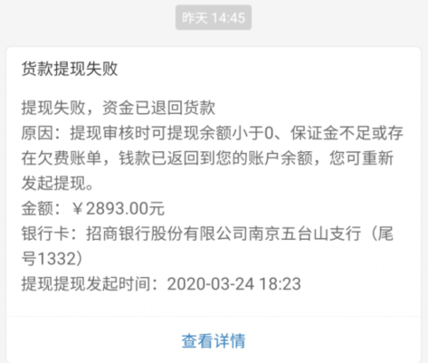
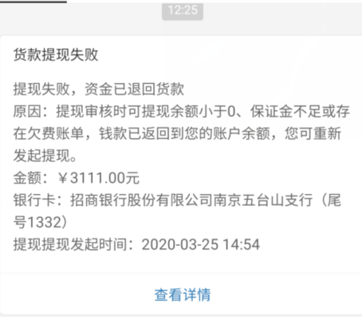
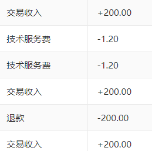

# 细数在拼多多开店遇到的坑

作为一个在拼多多一个半月的小本商家，从 2 月 7 日开店以来，我已经在拼多多平台卖出了近 7000 块钱的货，发起提现四次，三次失败，目前只提现出了 800 块的现金，导致我急着用钱却提不出钱。我承认这有我提现操作粗心的因素，但我觉得拼多多各种阻拦商家提现的骚操作才是最主要的原因。这期间，我对拼多多的体验就是一句话：恶心！各种阴招来坑商家，让人说不出来的那种恶心。

我知道天下没有免费的午餐，我也知道我利用拼多多赚钱需要缴纳一定的平台费用，我就是单纯觉得拼多多这些逼迫商家的手段不够光明真大，数据不透明，真的恶心，让人说不出得难受。

拼多多这些手段的目标只有一个，就是将商家在平台上的资金流转进行模糊化，企图在商家不知不觉的情况下，扣除尽可能多的交易费，并且尽可能地阻拦商家提现，进而保证自己的现金流。

## 阻拦商家提现的手段

拼多多不止在营销方面是一把好手，在阻拦商家提现的手段上，也是不遗余力。

我第一次 800 块钱提现失败，就是因为填错了网点。商家的第一次提现，在填写银行卡信息，输入银行卡号，确认验证码后，**竟然需要填写开户的银行网点**，只有选择正确的银行网点，才能提现成功。我转账了这么多年，头一次遇到提现转账时需要填写银行网点的，有谁能记得清楚当初办理银行卡时的开户网点？这种给商家提现故意制造困难的骚操作，真的恶心！

第二次提现失败，拼多多给出的原因是：

我就搞不懂了，为什么我发起提现的时候，你们拼多多不审核好了到底能不能提现，我急着用钱等了快一天了，然后告诉我提现失败？Execuse me？

第二次提现失败后，我惊奇的发现，我不能提现了，因为没有缴纳保证金 2000 块钱。我了解没有缴纳保证金只能提现三次的政策，但是我没想到**提现失败的两次也算提现**，现在好了，5000 块钱的现金卡在了拼多多里面，如果想要把现金提出来，方法有两个：

1. 缴纳 2000 块钱保证金
2. 退店，需要等待 20 天左右的时间

为了继续使用拼多多的平台，我只好缴纳 2000 块钱的保证金，然后发起第三次提现。

第三次提现，我申请把缴纳保证金后剩余的 3111 全部提了出来，结果就是这个第三次提现失败！

我仔细查了一下后台的账单，发现不知道什么原因导致**开店保证金低于 2000，也会提现失败**。我忍无可忍，缴纳了两毛四分钱的保证金后，我发起了第五次提现，希望这一次拼多多不要再作妖了。

除了上面这些妖魔鬼怪，拼多多还设立了一天只能提现一次的规定，就算交了店铺保证金，也是一天只能提现一次。还有提现时间审核太长的问题，但从我的提现记录看的话，提现到账大概需要一天的时间。微信和支付宝提现需要一天的时间吗？提现的技术问题需要花费一天的时间吗？这不就是在卡商家的现金流吗？疫情期间，中小商家的现金流都很紧张，淘宝发起活动，号召消费者确认收货，而拼多多呢？呵呵，想方设法阻止商家提现。当然，这些妖魔鬼怪的目的只有一个嘛，卡商家的现金流，这样自己账上就有了更多的钱。

## 逼迫商家缴纳 2000 保证金的手段

* 不缴纳保证金，只能提现三次，提现失败也算一次
* 不缴纳保证金，那么用户确认收货 15 天后资金才能到账，加上消费者往往没有收货后确认收货的习惯，导致资金滞留拼多多平台长达半个多月
* 如果坚决不缴纳保证金，资金提不出来，退店也需要等待 20 天左右的时间

## 技术服务费

一笔交易200 块钱，需要缴纳 1.2 的技术服务费，这个我可以理解。但是请拼多多告诉我，用户购买商品后退货退款 200，商家也需要缴纳技术服务费 1.2，这个怎么解释？？？

最后，我写这篇文章的目的，是为了揭露拼多多的丑恶行径，为自己出一口气。我不反对缴纳保证金，我也不反对缴纳技术服务费，毕竟我使用了拼多多的平台，就需要按规定缴纳一定的费用，我只是一个大学生，急着用钱，所以才会推迟缴纳保证金。我享受了拼多多给我带来的平台，就需要付出一定的代价。但是我没想到的是，竟然因为我没有缴纳保证金，拼多多给我整出这么多恶心的骚操作。

这一个多月里，我一共卖出了将近 7000 块钱的货款，发起提现四次，但是三次失败，目前只提现出了 800 块的现金。但凡拼多多能够让我舒服一点，我也不至于花两个小时的时间，来细数这些在拼多多遇到的坑！

