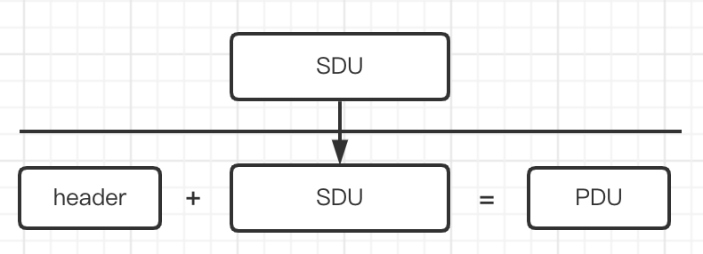

# Computer Networks and the Internet

[TOC]

## 有哪些网络

* 互联网 Internet

  以 TCP/IP 这一簇协议支撑工作的网络。

  互联网中有几十亿台设备，伴随着物联网的发展，以后会有上百亿设备，几百万个网络。

* 军用网络

* 专用网络：银行，通信服务商

* ……

## 分层协议

* 物理层

  在媒体之上，传输电信号和光信号，把链路层传过来的 0,1 信号转换，发走。

* 链路层

  点到点 peer to peer。相邻两点之间，传输以帧为单位的数据。一个交换机连接的两个点，就是相邻的两个点。

  常见协议：PPP，WiFi，Ethernet

* 网络层

  端到端 end to end。在链路层提供的相邻两点传输的基础上，实现源主机到目标主机之间数据的传输。端到端之间会经过很多点到点。转发和路由。

  网络层端到端的传输比较粗糙，不可靠，best ever 尽力而为。

  主要协议：IP，路由选择协议

* 传输层

  传输层在网络层的基础上，加强了可靠性，细分了服务。将端到端细分到进程到进程，将不可靠变成了可靠。实现了进程到进程的通信。

  两个协议：TCP（在吗，在。一起吃饭去，好的。） / UDP （一起吃饭去，好的。）

* 应用层

  按照应用层协议，在 TCP 和 UDP 两种连接的基础上，交换应用报文。

  基于 TCP 的应用：HTTP，Telnet，FTP，SMTP
  
  基于 UDP 的应用：DNS，流媒体，远程电话

## SDU 和 PDU

SDU：Service Data Unit 服务数据单元

PDU：Protocol Data Unit 协议数据单元

层与层之间的数据交换：上层往下层传递的数据是 SDU，下层拿到 SDU 后，再在 SDU 的基础上，加上本层的附加的一些控制信息，形成了本层的 PDU。

货物装在卡车上，卡车头就是 header，货物就是 SDU，卡车就是 PDU。

对等的实体在进行信息交换的时候，交换的是 PDU。每一层的 PDU 都有不同的名字，应用层的 PDU，叫做应用报文 message，传输层的 PDU，叫做报文段，segment，网络层的 PDU 叫做分组，链路层的 PDU 叫做数据帧。 

## 服务和协议

在一个 TCP 的实体上，可以跑 web 应用，可以跑 Telnet 应用，可以跑 SMTP 应用。TCP 实体就是服务提供者，这些应用层的应用就是 TCP 实体的用户。服务访问点 SAP 用于区分运行在一个 TCP 实体上的多个应用（用户）。Socket 就是对应用层的应用传下来信息加以标注。应用通过 SAP 告诉服务提供者，我要使用什么服务。服务提供者通过原语，来告诉其所服务的用户，我能提供什么服务。

服务是通过通过层间的接口，在系统的内部，在 SAP 上，通过原语的形式，向上层提供服务。是底层实体向上层实体提供它们之间通信的能力，是通过原语来操作的，是计算机网络相邻层间的垂直关系。

协议是对等的实体，在通信过程中，应该遵守的规则的集合。是水平关系。

服务和协议的关系：本层协议的实现要靠下层提供的服务来实现。本层实体通过协议为上层提供更高级的服务。

## Socket API

应用层使用传输层（TCP/IP 协议簇）提供的服务的一种形式。

## Internet 标准的制定

* RFC：Request for Comment 请求评述。

* IETF ：Internet Engineering Task Force 互联网工程任务组，非盈利组织。

任何一名工程师，关于任何关于互联网的观点和演化，都可以向 IETF 提交文档，IETF 觉得靠谱的话，就将文档编号放到网上，让全球的工程师对其评价，评价的文档也被提交给 IETF，并被编号。互联网所有标准的指定，都是以 RFC 文档的形式在 IETF 网站上发布。包括 TCP，UDP。

## P2P

peer to peer 对等。

P2P 不同于 Client Server 模式，P2P 是没有服务端的。P2P 应用既是客户端，也是服务端。

迅雷就是一个 P2P 软件，他在下载文件的时候，是从其他的迅雷客户端（其他人的电脑）获取一段一段的文件，最后再拼凑成一个文件。同时，自己的迅雷客户端，也被其他客户端请求获取本地的资源。

## 网速单位

100M，实际上是 100Mbps，bps 是比特率，指的是单位时间内传输的比特数。

100M 高速网络，就是 1s 最多传输 100M 个比特，实际上是 1s 传输 100/8 = 12.5M 个字节，即 100Mbps = 12.8MByte 

计算机网络中数据单位通常是比特，和通常的数据计量单位 Byte 不一样。

网速也不单单看我们进入运营商（ISP Internet Service Provider）的网速，也要看整个小区接入网络的网速。假设我们和通信服务商买了 100Mbps 的宽带，也就是说，我们接入小区的交换机的带宽是 100Mbps，但是如果我们小区接入主网的带宽也是 100Mbps，那么就是我们整个小区在共享这 100Mbps 的带宽，运营商 (ISP) 承诺得高带宽，就是文字游戏。

## ISP

Internet Service Provider 提供接入互联网的服务（移动，联通，电信，学校）。

普通人想要接入互联网，都要通过 ISP 进行接入。互联网公司也要通过 ISP 接入互联网。

## ICP

Internet Content Provider 互联网内容提供商（百度，Google，字节，腾讯），提供互联网内容的。

## 数据中心

DC DataCenter

很多大的互联网公司，在全球各地建立大量的机房，而且机房的位置，通常都靠近核心 ISP。主要是因为 ISP 提供的服务不稳定，很难给用户带来高质量的服务，而且收费还很贵。所以 Google 在全球自己搭建机房，机房和机房之间，采用自己搭建的专用网络进行连接（自己铺设太平洋光缆），进而给用户提供高质量的服务，而且很便宜。

## socket 编程

传输层向应用层提供的 API，应用程序借助应用程序接口来跟对方的应用实体交换报文，实现各种各样的网络应用。
