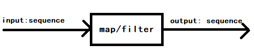

# Chapter5. First-Class Functions

从第五章开始，一直到第七章，都是在研究函数。

[TOC]

## What is First-Class Functions

Functions are treated like any other variable. Treating functions as objects.

函数也被作为一个对象，其和对象一样，是 Python 语言中的第一公民。一个对象，其可以拥有属性，也可以定义其对应的方法，也可以将其赋值为其他变量。

Demo:

```python
def factorial(n):
    """return n!"""
    return 1 if n < 2 else n * factorial(n-1)

fact = factorial # function 作为变量传递给另外一个变量
# fact 作为变量传入 map 方法，其参数为 range 生成的数据，map 返回一个 iterated 的对象
list(map(fact, range(10))) 
# 等价于
list(map(factorial, range(10)))
```

### 函数的 attributes

Demo:

```python
print(factorial.__doc__) # return n!
# __doc__ 用于生成 help text of and object
print(help(factorial))
"""
Help on function factorial in module __main__:
factorial(n)
    return n!
None
"""

dir(factorial) # 查看 factorial 的属性
"""
['__annotations__', '__call__', '__class__', '__closure__', '__code__', '__defaults__', '__delattr__', '__dict__', '__dir__', '__doc__', '__eq__', '__format__', '__ge__', '__get__', '__getattribute__', '__globals__', '__gt__', '__hash__', '__init__', '__init_subclass__', '__kwdefaults__', '__le__', '__lt__', '__module__', '__name__', '__ne__', '__new__', '__qualname__', '__reduce__', '__reduce_ex__', '__repr__', '__setattr__', '__sizeof__', '__str__', '__subclasshook__']
"""
```

**赋予 function attribute**

```Python
factorial.short_desc = "阶乘"
```

**查看 function 所有自定义的 attribute**

```python
print(factorial.__dict__)
# {'short_desc': '阶乘'}
```

| 属性                   | desc                                                  |
| ---------------------- | ----------------------------------------------------- |
| `__dict__`             | 获取 function 的所有自定义的 attribute                |
| `__defaults__`         | tuple(位置参数和关键字参数的默认值)                   |
| `__code__.co_varnames` | tuple(存储了函数参数的name还有函数中定义的name)       |
| `__code__.co_argcount` | value: 参数的个数，不包括以 `*` 和 `**` 打头的参数    |
| `__annotations__`      | dict{ 函数的注解，包括输入和输出的注解}，Python3 引入 |


### 函数的 methods


## Higer-Order Functions

A function that takes a function as argument or returns a function as the result is a higher-order function.

传入或者**返回**一个函数的函数叫做 higer-order-function。

Higer-Order Functions: **sort, map, filter, reduce**

### Demo: sort\(\)

```python
def reverse(word):
    """逆置word"""
    return word[::-1]
fruits = ["straberry", "fig", "cherry", "apple", "banana"]
sorted(fruits, key=reverse) # key 为一个 function，返回排序后的 sorted object，是一个新的 object, sorted 并不是 inplcae 方法，lst.sort() 是 inplace 方法
# 结果为：["banana","apple", "fig", "straberry", "cherry"]
# 上述代码执行的步骤：
# 1. 根据传入的 key 函数，对 fruits 进行变换，得到变换后的 list
# 2. 对 fruits 按照变换后的规则进行排序

# 其他变换规则
sorted(fruits, key=len)
```

### Modern Replacements for map/filter/reduce

Chapter2 中已经指出，任何用到 map 和 filter 的地方，都可以用 列表推导式 和 生成器表达式来替换。而 reduce 可以被 `sum, all, any` 等 Python 自带的built-ins 取代。Demo:

```python
list(map(factoria, filter(lambda n: n % 2, range(6)))) # list of factorial of odd numbers up to 5!, using both map and filter

from functools import reduce
from operator import add
reduce(add, range(100)) # 两者等价
sum(range(100))

all(iterable)
any(iterable)
```



**reduce**

The common idea of **reduce** is to apply some operation to successive items in a sequence, **accumulating** previous result, thus reducing a sequence of values to a single value.

reduce 用于对一个 sequence 进行 successive compute，从而得到一个 single value。降维。


```python
from functools import reduce
from operator import add, sub

reduce(add, range(10)) # 等价于 0 + 1 + 2 + ……  + 9
reduce(sub, [1,2,3]) # 等价于 1 - 2 - 3
```

Other reducing built-ins:

```python
all(iterable) # return true if all value is true
any(iterable) # return true if one value is true

all(["1", [1], (1), {1:2}]) # true
all(["1", [1], (1), {}]) # false

any(["1", [1], (1), {}]) # true
```

注意：

* 在 Python3 中， **map** 和 **filter** 会返回一个 **generator** \(iterable\)对象，并不是一个 sequence

### Anonymous Functions

keyword lambda 用于创建一个匿名函数，其本质上是一个**语法糖**（syntactic sugar）。

**lambda expression 的优点和应用场景：**简洁，适合处理 sequence，通常用于 Higher-Order-Function 的函数参数

**lambda expression 的缺点：**不能处理复杂的逻辑，比较晦涩，unreadable

Demo:

```python
fruits = ["straberry", "fig", "cherry", "apple", "banana"]
sorted(fruits, key=lambda fruit: fruit[::-1])
# 其等价于
sorted(fruits, key=reverse)
```

值得注意的是，lambda expression 除了应用在 High-Order-Function 中，其他地方使用得不多。

**去 lambda expression 的四个步骤**

如果我们发现一个 lambda expression 十分晦涩难懂，那么可以用如下步骤来解决：

1. 理解这个 lambda expression 的业务逻辑
2. 对业务逻辑进行重命名
3. 用步骤二的名字 def 一个 function，用 function 替代 lambda expression
4. 移除 lambda expression

## Callable Objects

### Definition

**A _callable object_ is an object that can accept some arguments \(also called parameters\) and possibly return an object (often a tuple containing multiple objects)**. A function is the simplest callable object in Python, but there are others, such as [classes](https://en.wikibooks.org/wiki/Python_Programming/Classes) or certain class instances. [From wikibooks](https://en.wikibooks.org/wiki/Python_Programming/Functions>)

如何判断一个 object 是否是 callable object:

```python
[callable(obj) for obj in (abs, str, 13)]
# print [True, True, False]
```

### What are the methods, functions, built-in？

**Class 中定义的方法叫 method**

**非 Class 中定义的方法叫 function**

|              | methods                                                      | functions                                 |
| ------------ | ------------------------------------------------------------ | ----------------------------------------- |
| built-in     | Python 自带类中定义的 method，例如：`dict.get()` 的 `get` 方法 | Python 自带的 function，例如 `len`, `str` |
| user-defined | 用户定义类中定义的 method                                    | 用户定义的 function                       |

### Seven Callable Objects

#### User-defined Functions

Created with `def` statements or `lambda` expressions.

```Python
import pandas as pd

def get_columns(pd_data):
    return pd_data.columns.tolist()
```

#### Built-in Functions

A function implemented in C (for CPython), like `len()` or `time.strftime`

#### Built-in methods

Methods implemented in C, like `dict.get`

#### Methods

Functions defined in the body of a class.

#### Classes

For example, pd_data = pd.DataFrame([(1,2,3),(4,5,6)], columns=["a"， "b", "c"])

#### Class instances

If a class defined a **`__call__`* method, then its instances may be invoked as functions. 

也就是说，如果一个 class 实现了 `__call__()` 方法，那么其对象就可以像方法一样被调用，参考 [User-Defined Callable Types](#User-Defined Callable Types)

#### Generator functions

Functions or methods that use the `yield` keyword. When called, generator functions return a generator object.

### User-Defined Callable Types

一个类只要实现了 `__call__` 方法，那么其对象就是一个 callable object

```python
class BingoCage:
	def __init__(self, items):
        self._items = list(items) # deep copy
        random.shuffle(self._items)
        
    def pick(self):
        try:
            return self._items.pop()
        except IndexError:
            raise LookupError("pick from empty BingoCage")
            
    def __call__(self):
        """ 实现了该方法后，该类的对象，就可以被当成函数一样调用该方法 """
        return self.pick()
```

```Python
bingo = BingoCage(range(3))
print(bingo.pick()) # 1
print(bingo()) # 0，注意这里，一个对象，也可以是 callable object, shortcut to bingo.pick: bingo()
print(callable(bingo)) # True
```

## Function Introsepction (Function 深挖)

### Get Function All Attributes

如何查看一个对象的属性，包括一个函数对象的属性？

```python
dir(factorial)
"""
['__annotations__', '__call__', '__class__', '__closure__', '__code__', '__defaults__', '__delattr__', '__dict__', '__dir__', '__doc__', '__eq__', '__format__', '__ge__', '__get__', '__getattribute__', '__globals__', '__gt__', '__hash__', '__init__', '__init_subclass__', '__kwdefaults__', '__le__', '__lt__', '__module__', '__name__', '__ne__', '__new__', '__qualname__', '__reduce__', '__reduce_ex__', '__repr__', '__setattr__', '__sizeof__', '__str__', '__subclasshook__']
"""
```

上述大多数的属性，都是 Python 对象通用的属性，我们主要分析和 Function 作为 object 相关的属性：`__dict__`。

### attribute: `__dict__`

Function 作为一个 object，其肯定和其他对象一样，也有 attribute 和 method。`__dict__` 就是用于查看 function object 的 attribute，`__dict__` 用于存储 function 的 attribute 和对应的值。

```Python
factorial.short_desc = "斐波那契数列"
print(factorial.__dict__)
# {'short_desc': '斐波那契数列'}
```

### Positional Parameters vs Keyword-Only Parameters

从位置参数到关键字参数。Python 3 中引入 Keyword-Only Parameters.

**关键字参数的优点**：

* 可以利用 `*param` 传入更多的位置参数，可以利用 `**attrs` 传入更多的键值参数
* `cls=None` 的规则可以用于设置 default 参数，例如： `cls=default_value`

**注意**：

* 位置参数在调用时必须给定

* 函数调用时，可以不传入关键字参数，而只传入位置参数
* 关键字参数应该在位置参数后面进行定义

**Demo1**:

```Python
def tag(name, *content, cls=None, **attrs):
    """Generate one or more HTML tags"""
    if cls is not None:
        attrs['class'] = cls
    if attrs:
        attr_str = ''.join(' %s="%s"' % (attr, value) for attr, value in sorted(attrs.items()))
    else:
        attr_str = ''
    if content:
        return '\n'.join('<%s%s>%s</%s>' % (name, attr_str, c, name) for c in content)
    else:
        return '<%s%s />' % (name, attr_str)
```

```Python
>>> tag('br')
'<br />'
>>> tag('p', 'hello')
'<p>hello</p>'
>>> print(tag('p', 'hello', 'world'))
<p>hello</p>
<p>world</p>
>>> tag('p', 'hello', id=33)
'<p id="33">hello</p>'
>>> print(tag('p', 'hello', 'world', cls='sidebar'))
<p class="sidebar">hello</p>
<p class="sidebar">world</p>
>>> tag(content='testing', name="img")
''
>>> my_tag = {'name': 'img', 'title': 'Sunset Boulevard',
... 'src': 'sunset.jpg', 'cls': 'framed'}
>>> tag(**my_tag)
''
```

**Demo2**:

```Python
def run(a, b):
    print a + b
    
dictionary = {'a': 1, 'b': 2}
run(**dictionary)
```

### Retriving Information About Parameters: inspect

我们在只知道函数接口的情况下，如何获知 function 的所有参数及其类型？Python标准库: **inspect**

| 属性                   | desc                                               |
| ---------------------- | -------------------------------------------------- |
| `__defaults__`         | tuple(位置参数和关键字参数的默认值)                |
| `__code__.co_varnames` | tuple(存储了函数参数的name还有函数中定义的name)    |
| `__code__.co_argcount` | value: 参数的个数，不包括以 `*` 和 `**` 打头的参数 |

通过 `__defaults__` 变量，我们可以得到函数的参数的默认值，通过 `__code__` 变量，我们可以知道变量的名字还有变量的个数。通过这两个变量，我们就可以倒推出所有的变量和默认值。

```Python
def factorial(n=5):
    """return n!"""
    return 1 if n < 2 else n * factorial(n-1)

factorial.__defaults__ # (5,)
factorial.__code__.co_argcount # 1
factorial.__code__.co_varnames # ('n',)
```

不过有一个 Python 的 built-in package 已经帮我们封装好了该功能：`inspect`, Demo:

```Python
from inspect import signature
def foo(num, mul=10):
    pass
sig = signature(foo) # <class 'inspect.Signature'>
    for name, param in sig.parameters.items(): # inspect.Signature.parameters 是一个 map object
    print(param.kind, ":", name, "=", param.default)

"""
POSITIONAL_OR_KEYWORD : num = <class 'inspect._empty'>
POSITIONAL_OR_KEYWORD : mul = 10
"""
```

其中，inspect._empty 表示该参数没有 default value，kind 表示该参数的参数类型。

inspect.Signature 对象有一个 **`bind` 方法**，用于将参数绑定到函数进行测试，看看传入的参数是否满足函数的要求。Demo:

```Python
>>> import inspect
>>> sig = inspect.signature(tag)
>>> my_tag = {'name': 'img', 'title': 'Sunset Boulevard',
... 'src': 'sunset.jpg', 'cls': 'framed'}
>>> bound_args = sig.bind(**my_tag)
>>> bound_args
<inspect.BoundArguments object at 0x...>
>>> for name, value in bound_args.arguments.items():
... print(name, '=', value)
...
name = img
cls = framed
attrs = {'title': 'Sunset Boulevard', 'src': 'sunset.jpg'}
>>> del my_tag['name']
>>> bound_args = sig.bind(**my_tag)
Traceback (most recent call last):
...
TypeError: 'name' parameter lacking default value
```

很多 Framework 和 IDE 会利用 `inspect.Signature.bind()` 方法来判断用户输入的参数是否合理，从而给出错误提示。

### Function Annotation: 函数注解

Python3 中引入了函数注解，用于解释函数的参数和返回值等信息，函数注解存储在 `__annotations__` 中。

语法：

```Python
def foo(html:str, num:"int > 0"=10) -> str:
    
    pass
```

输出函数注解：

```Python
foo.__annotations__
{'html': <class 'str'>, 'num': 'int > 0', 'return': <class 'str'>}
```

注意，Python 对于这些函数注解，只是将其放在了 `__annotations__` 中，其他就没有进行任何的操作，更不会进行代码的check。事实上，函数的注解 Annotation 更多的被 IDE 和 **装饰器** 使用，其对于 Python 的解释器来说，没有任何作用。

### Packages for Functional Programming

Python 语言的创立者 Guido 并没有想要 Python 成为一个函数式编程语言，但是通过两个标注库的帮助，我们可以实现 Python 的函数式编程：`operator, functools`。在函数式编程中，函数常常被当作参数进行传递，而 `operator` 中恰恰就提供了一些基础的函数操作，`operator` 中提供的**操作符，实际上就是函数**。


#### operator

`operator` 提供了很多操作符，这些操作符实际上就是匿名函数。其中有两类操作符：

* 算数操作符：`add, mul, sub`
* 用来从 sequence 选取元素、从对象中读取属性的操作符：`itemgetter, attrgetter`，返回元素为 tuple 的 sequence。（itemgetter 使用了 [] operator，只要是实现了 `__getitem__()` 这个魔法方法的类型，都可以将 itemgetter 应用到其中）

注意，itemgetter 和 attrgetter 这两个操作符，实际上都是函数，其返回的对象也是函数。

**算数操作符举例**：

```Python
from functools import reduce
from operator import mul
def fact(n):
    return reduce(mul, range(1, n+1))
	# 如果我们不适用 operator，则需要创建一个 lambda expression，(匿名函数)
    # return reduce(lambda x,y: x*y, range(1, n+1))
```

**选取元素操作符举例**：

```python
from operator import itemgetter

students = [
    ("wansho", 23, "lianyungang", (99, 100)),
    ("wangkai", 25, "qingdao", (99, 100)),
    ("zhanganman", 24, "xuzhou", (99, 100))
]

sorted_students_in_ages = sorted(students, key=itemgetter(1)) # 根据学生的年龄排序
print(sorted_students_in_ages)

print(list(map(itemgetter(0,1), students))) # 取 0，1列，此处的 itemgetter 定义了一个抓取数据的规则

```

**获取属性操作符**

```python
from operator import attrgetter
from collections import namedtuple

Student = namedtuple("Student", "name age home scores")
Score = namedtuple("Score", "math, english")
students_namedtuple = [Student(name, age, home, Score(math, english))
    for (name, age, home, (math, english)) in students]
print(students_namedtuple)

attrgetter_name_score = attrgetter("name", "scores.math") # 定义了一个函数
for item in students_namedtuple:
    print(attrgetter_name_score(item)) # 将 item(namedtuple) 作为参数传入预先定义好的规则
```

**获取所有的操作符**

```python
import operator
print([item for item in dir(operator) if not item.startswith("_")])

"""
['abs', 'add', 'and_', 'attrgetter', 'concat', 'contains', 'countOf', 'delitem', 'eq', 'floordiv', 'ge', 'getitem', 'gt', 'iadd', 'iand', 'iconcat', 'ifloordiv', 'ilshift', 'imatmul', 'imod', 'imul', 'index', 'indexOf', 'inv', 'invert', 'ior', 'ipow', 'irshift', 'is_', 'is_not', 'isub', 'itemgetter', 'itruediv', 'ixor', 'le', 'length_hint', 'lshift', 'lt', 'matmul', 'methodcaller', 'mod', 'mul', 'ne', 'neg', 'not_', 'or_', 'pos', 'pow', 'rshift', 'setitem', 'sub', 'truediv', 'truth', 'xor']

其中，以字母 i 为前缀的操作符，其都是 inplace 函数

"""

from operator import iadd
num1 = 10
num2 = 2
num1 = iadd(num1, num2) # 等价于 num1 += num2
```

**methodcaller**

methodcaller 可以对函数进行二次封装，然后返回封装后的函数，通常用于 freezing arguments。

```python
from operator import methodcaller

my_replace = methodcaller("replace", " ", "-") # 注意：封装的函数名必须是 stringed method
print(my_replace("nihao hello world")) # nihao-hello-world

```

#### functools

functools 中有很多 high-order functions，也就是说，可以传入函数参数或者返回函数的函数。

functools 中最常用的两个函数：reduce, partial, partialmethod

partial 和 partialmethod 通常用于对 function 和 classmethod 进行二次封装，其中 partialmethod 可以用于方法的重载。

```python
from functools import partial, partialmethod
from operator import mul

my_mul = partial(mul, 3) # mul 是一个 function，freeze 好一个参数，剩下另一个参数
lst = [my_mul(num) for num in range(10)] 
print(lst)

>>> class Cell(object):
...     def __init__(self):
...         self._alive = False
...     @property
...     def alive(self):
...         return self._alive
...     def set_state(self, state):
...         self._alive = bool(state)
...     set_alive = partialmethod(set_state, True)
...     set_dead = partialmethod(set_state, False)
...
>>> c = Cell()
>>> c.alive
False
>>> c.set_alive()
>>> c.alive
True

# 注意, functools.partial 的 operator.methodcaller 的不同之处在于，methodcaller 封装的函数名必须是 string method，而 functools.partial 封装的函数名必须是 function，functools.partialmethod 封装的函数名必须是 method
```

