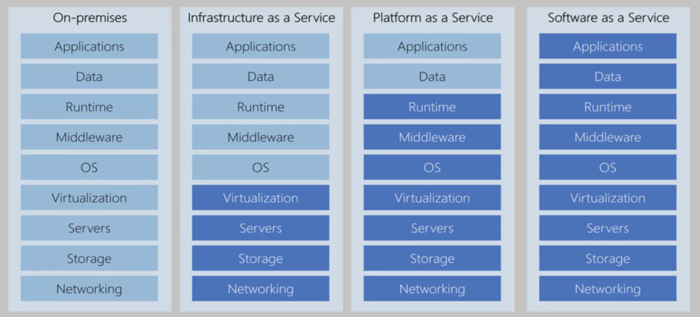

# Chapter7. Virtualization and Cloud

[TOC]

## 云计算

### 什么是云计算

**对用户来说**，云计算就是像水电一样提供计算资源。未来，算力和水电一样，应该是按需收费的。目前，大多数年轻人人手一部智能手机，但是我们的手机大多数时间都在待机，这其实是非常浪费资源的，最佳的资源分配方法，是我们的手机连上云端，所有的计算和存储，都由云计算完成。

**对开发者来说**，云计算就是对硬件资源进行虚拟化和管理。物理机 虚拟化为 虚拟机，本质上是操作系统虚拟化的知识。

### 云计算分类：IaaS，PaaS，SaaS

|      | 全称                        | Demo                                                         |
| ---- | --------------------------- | ------------------------------------------------------------ |
| IaaS | Infrastructure as a Service | 阿里云申请的虚拟机（实体）                                   |
| PaaS | Platform as a Service       | Google App Engine(GAE)，Aws Lambda，Azure Pipelines，Sina App Engine |
| SaaS | Software as a Service       | 手机 App                                                     |

从上到下，用户需要关注的自主权越来越小，需要关注的细节越来越少。

浅色的是自己需要管理的部分，深色的是不用自己操心的。

### 云计算的分类

公有云，私有云，混合云

### 学习资料

- [Modern Operation System Chapter7: Virtualization and Cloud]()
- [Docker]()

先搞定上面两个知识

### OpenStack

OpenStack 是用来创建公有云和私有云的开源云操作系统。OpenStack is a cloud operating system that controls large pools of compute, storage, and networking resources throughout a datacenter