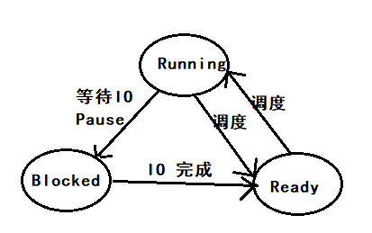

# 第二章：进程与线程

[TOC]

## 引入进程的重要性

进程概念的引入，使得多个任务可以在一个 CPU 上并发执行，**实现了 CPU 的虚拟化**，提高了 CPU 的利用率。

## 进程：Processes

**Pseudoparallelism  伪并行**

在一个单核的操作系统中，任何一个时刻，CPU 都只在做一件事情，CPU 通过在多个任务之前来回切换，来实现进程的并发。

注意：pseudoparallelism 和 hardware parallelism of multiprocessor systems 有本质的区别，后者是真正的在多个 CPU 上进行并行计算。

### 进程的定义: Process Model 进程模型

**进程就是运行在计算机上的任务**。所有在计算机上执行的**任务**，包括**操作系统**，都被看做一个进程。In process model, each has its own virtual cpu.

**Program and Process 的区别**

Program 是静态的，而 process 是动态的。**进程是运行着的程序**。

### 进程的创建：Process Creation

#### 操作系统中创建进程的几个场景

从创建进程的发起者角度，可以分为三个场景：

| 发起者   | short-desc                                       | desc                                                         |
| -------- | ------------------------------------------------ | ------------------------------------------------------------ |
| 操作系统 | 系统初始化创建大量进程                           | 系统在初始化的时候，会创建大量的进程，有很多都是常驻后台的守护进程 |
| 进程     | 进程发起 process-creation 的系统调用，创建子进程 | 如果一个任务可以由多个进程协作，并且高效的完成时，进程就可以通过系统调用创建多个子进程，用于工作协同，加快效率 |
| 用户     | 用户请求创建一个进程                             | 在类 Unix 系统中，用户可以通过在 shell 中输入命令，创建子进程；在 Windows 系统中，用户可以通过操作鼠标键盘，打开软件（创建进程） |

实际上，上述所有的进程创建，都是父进程通过**发起创建进程的系统调用**，由操作系统创建的子进程。区别在于，进程创建的发起者不同，是操作系统，还是正在运行的进程，还是用户。What that process does is execute a system call to create the new process.  

#### 进程的分类

1. **Background Process** 

   后台进程，后台进程中有一类特殊的进程，类似邮件服务/Web服务/打印服务等任务叫做  **daemons**  （守护进程），Linux 中通过在 cmd 后面加上 `&` 来实现后台进程，例如：`sleep 100&`

2. **Foreground Process**

   前台进程，与用户交互，Linux 中的 shell 就是一个前台进程，用于和用户进行交互

#### 创建进程的系统调用

* In Unix： **fork**

  在 Unix 系统中，只有唯一的一个系统调用：fork，用于创建进程

  fork 会对发起系统调用的进程，创建一个**完全一样的副本**（相同的内存镜像，相同的环境变量），也就是 fork 一个子进程。例如用户在 shell 中输入 sort 命令，shell 进程就会 fork 一个子进程，然后执行 sort 命令。

* In Windows: **win32 function call: CreateProcess**

  CreateProcess 用于创建进程，加载 program。该系统调用有 10 个参数。除了 CreateProcess，Windows 系统还提供了 100+ 个 function 用于管理进程。

注意：子进程一旦创建，其地址空间（address space）相对于父进程就独立了，没有任何一块可写空间是共享的。**Again, no writable memory is shared**.  这也解释了，Linux 中 子 shell 对 父 shell 变量只读的机制。

### 进程的终止：Process Termination 

#### 进程终止的两种情况

1. **自然终止**：正常终止，异常终止 **exit**
2. **非自然终止**：致命错误导致的终止，被其他程序终止 **kill**

#### 进程终止的 system call

|         | 自然终止的 system call | 被其他程序终止的 system call |
| ------- | ---------------------- | ---------------------------- |
| Unix    | exit                   | kill                         |
| Windows | ExitProcess            | TerminateProcess             |

### 进程的层次结构：Process Hierarchies 

#### Linux 进程层级

Linux 的进程都是单继承(Fork from 父进程)

Windows 没有进程层次的说法，所有的进程都是平等的。

### 进程的状态：Process States

进程的三大状态：**Running/Ready/Blocked**

### 进程的实现：Implementation of Processes 

#### Process Control Block (PCB)

进程控制块，其数据结构为 array。

注意：

* 一个进程在执行的过程中，可能会遇到上千个中断，关键在于，每次中断过后，进程能否精确恢复到中断之前的状态。（中断发生时，所有信息入栈，进入 Ready 状态，中断结束后，信息出栈，恢复 Runable 状态）
* CPU 在运行时，也就是 process 在运行时，有大量的时间是花费在了 IO 上，举例来说，交互式进程 bash 的大多数时间就是被 IO 所阻塞(等待输入)

## 线程：Threads

### 进程与线程的区别：Thread Usage

#### 从计算机角度（冯诺伊曼架构的三个角度）

* **存储**：内存地址空间的差别

  进程的**地址空间**的**相互隔离**的，而线程间的地址空间是**共享**的，这导致了进程之间**切换**和**通信**的代价远远大于线程直接的调度和通信

* **计算**：并行计算 / 调度代价

  1. 线程可以充分利用多核 CPU 进行并行计算

  2. CPU 对于线程**调度**的代价也远远小于进程，线程更加轻量，更加 Lite，易于**创建**和**销毁**。在很多系统中，线程的速度，是进程的 10—100 倍

* **输入输出设备**

  输入输出设备常常伴随着大量的 IO，有 IO 就会有阻塞，线程的出现解决了**进程内 IO 阻塞**导致主进程无法推进的问题

#### 从程序员角度

线程的出现，使得程序员可以方便的对**很多不同种类的业务逻辑进行解耦**，以下不同的业务，都可以用线程解决，从而使得主进程不受影响：

* IO 型业务：键盘监听，文本读写
* 后台服务型业务：自动纠错，自动保存等

### 线程使用场景举例

#### WPS 

new a thread for 定时保存用户编辑的内容

new a thread for 监听用户键入的快捷键命令并相应

new a thread for 自动格式化用户刚输入的文本

……

#### Web 服务端

客户端每发起一个新的请求，就 new 一个 thread

​	

## 进程间通信：InterProcess Communication (IPC)

IPC 方式：信号、管道、消息队列、共享内存

