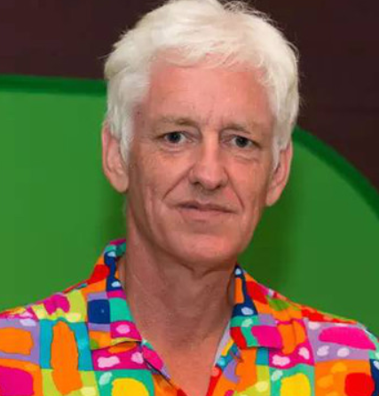
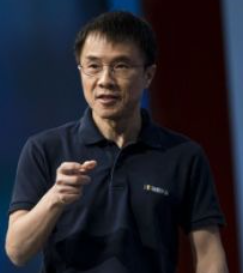
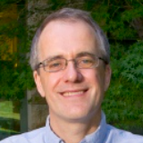
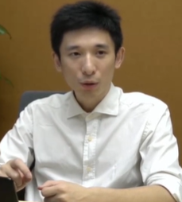
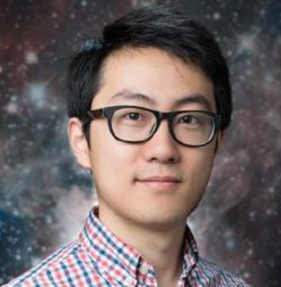
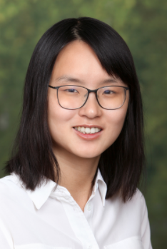
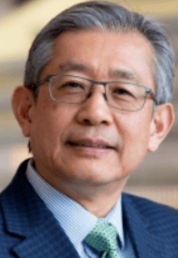

# Pioneer 见贤思齐

[TOC]

见贤思齐

## Peter Norvig

* [Homepage](<http://norvig.com/>) | [Wiki](<https://en.wikipedia.org/wiki/Peter_Norvig>)
* 1956 — , director of research in Google, Once work in NASA, AAAI Fellow, co-author of  *Artificial Intelligence: A Modern Approach*
* Main Contributions:
  * [AI: A Modern Approach](http://aima.cs.berkeley.edu/)
  * [Teach Yourself Programming in 10 Years](http://norvig.com/21-days.html)
  * [Design Patterns in Dynamic Languages](http://norvig.com/design-patterns)

* Teach Yourself Programming in Ten Years
  - Bad programming is easy. *Idiots* can learn it in *21 days*, even if they are *dummies*.
  - 研究者发现，在很多领域，需要深耕 10 年，才能成为专家
  - The key is *deliberative* practice: not just doing it again and again, but challenging yourself with a task that is just beyond your current ability, trying it, analyzing your performance while and after doing it, and correcting any mistakes.
  - How to become a real programmer:
    - 兴趣
    - 交流，前沿知识
    - 掌握多门语言
    - 不断学习，精进
    - 动手实践

## 陆奇

卡耐基梅隆大学毕业，历任微软副总裁，百度总裁。

人生就是不断地战斗！

## 周明

ACL 主席，微软亚洲研究院副院长

* [一起拥抱 ACL 和 NLP 的光明未来](<https://mp.weixin.qq.com/s/heaNhSYZwF-FC1lpdH8Swg>)
* [如何在NLP领域第一次做成一件事](<https://www.msra.cn/zh-cn/news/features/nlp-20161124>)

## Christopher Manning

* [Index](<https://nlp.stanford.edu/manning/>)
* [Fireside Chat with Christopher Manning](<https://www.youtube.com/watch?v=bZMKhQSERA4>)

## 孙正义

祖籍：福建莆田，祖先出海飘到韩国，曾祖父漂到日本

收购 arm

## 吴翰清

阿里云

https://www.bilibili.com/video/BV1sh411R7JR

## 尤雨溪

## 陈丹琦

女神，师从 [Christopher Manning](https://nlp.stanford.edu/manning/)

## 刘国瑞

IEEE 首位华人主席

