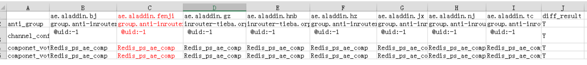
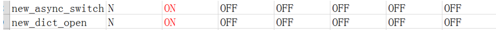
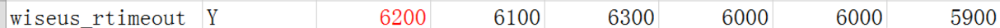
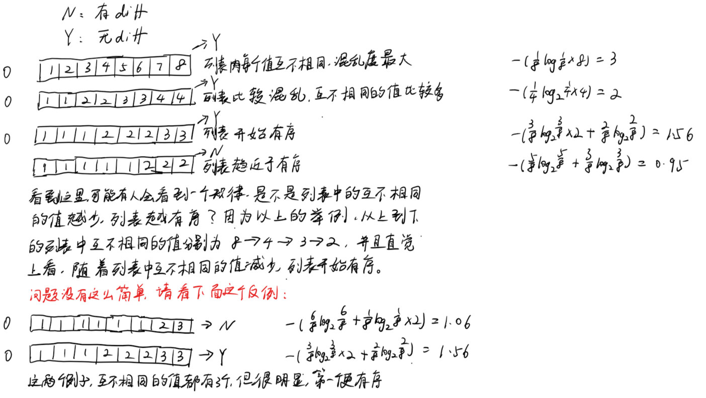

# 信息熵

## 直觉与信息

### 一个实际问题

一个程序更新要上线 8 个机房，其中有一个是用来做 分级发布 的机房，剩余 7 个是服务线上的机房，简称线上机房。一个程序包中有8个配置文件，分别对这8个机房进行了配置。由于分级机房前期不够重视，导致分级的配置文件中，很多配置没有及时和其他机房同步，现在需要 diff 分级机房的配置文件和其他 7 个线上机房的配置文件，然后找出 分级机房中没有及时同步的配置。我们定下规则，只要有一个线上机房的conf值与分级机房的 conf 值相同，那么就默认分级机房的值与线上机房的值是同步的。下面举几个例子：
如图，我们可以看到，对于大多数的 conf，分级机房的值和所有线上机房的值都相同，diff_result 设置为 Y；

之前已经说过，只要 分级 机房的 conf 值在其他机房中存在，那么就默认分级机房该值与线上机房同步。那么，如果分级机房的 conf 值不在其他机房中呢？我们来看下一个例子：

线上机房的值都是 OFF，只有分级机房的值是 ON，那么显然，分级机房的值并没有和线上机房同步，diff_result 为 N。
还有一种情况没有考虑，虽然分级机房的值并不在线上机房，但是每个线上机房的值都是不同的，或者大多数线上机房的值都是不同的，例如：

分级机房 wiseus_rtimeout 的值为 6200，与其他线上机房的值都不相同，而且所有线上机房的 wise_rtimeout 的值基本上都不相同，这种情况，就可以认为每个机房都有自己的特有配置，所有分级机房的值也是合理的，与线上机房的同步的，diff_result 为 Y。而如果大多数线上机房的值都相同，那么分级机房就可能与线上机房不同步，如下图所示，分级机房的值是 6200，而其他大多数线上机房的值都是 6000，只有一个线上机房的值为 5900.我们直观的感觉到：大多数线上机房的值都是相同的，只有分级机房的值例外，那么分级机房的值可能就没有和线上机房同步，diff_result 标记为 N

事实上，上面这个问题可以抽象成如下一个数学问题：
给定一个固定长度（不妨设置长度为8，8个线上机房）的列表 L，列表中的字符串是任意值的。现在有一个字符串 S（一个分级机房）要和列表中的 8 个字符串进行比较，看看 S 与列表中的字符串是否存在diff，diff规则如下：
如果存在列表 L 中的值与 S 值相同，那么 S 与 L 无 diff
如果 S 值不存在于 L 中，那么就要看 L 中值的混乱度，如果 L 中值的混乱度越大，那么 L 中的值大多数都是互不相同的，那么可以认为 S 与 L 无 diff，如果 L 中的值大多数都是相同的，那么 S 与 L 就是有 diff 的。
现在问题来了，如何来衡量数组 L 的混乱度呢，如何来计算这种靠感觉一眼就可以分辨的混乱度呢？

### 信息熵

为了更深刻的理解这个问题，我们把问题再抽象一点，并尝试在举一些例子，寻找解题思路。
我们以一个长度为 8 的列表举例，分别用 8 个数（1—8）来表示 8 个可能装入该列表的数字。

到了这一步，我们已经看到，靠硬编码似乎并不能量化直觉，也就是靠硬编码似乎不能衡量列表的混乱度。
这个时候，我联想到了在《数学之美》上读过的信息熵算法，熵是一个系统的混乱度，熵越大，系统越混乱，从信息论角度上讲，熵就是信息量，即混乱度就是信息熵。列表内的元素越混乱，说明该列表传递的信息量越大。这与我们的直觉正好符合，如果列表内的所有值都相同，那么该列表就是有序的，其传递的信息就很少，如果列表内的值互不相同，那么此时的列表就最混乱，其信息量也最大。
在上图中，我已经算出了每一个情况的信息熵，第一个列表最混乱，其信息熵也最大，同时 3 也是最大信息量；随着列表变得有序，信息熵也在逐渐变小。最后再比较一下最后两个列表，如果按照之前提出的算法，根据列表中互不相同的元素的个数，来衡量列表的混乱度，那么这两个列表的混乱度是一样的（都是3），但是直觉告诉我们，最后一个列表明显更混乱，而信息熵确实反映出了这个差别（最后一个列表的信息熵稍大）。
如此，将一个实际问题抽象成 混乱度的衡量，再将混乱度与信息熵挂钩，实现了数学建模。

### 几点感悟

**直觉**
对于一个问题，如果用硬编码的方式很难编码，而靠直觉，又很容易解决，那么可以往信息论、概率论和数理统计上多想想
**建模的步骤**
对于一个实际问题的解决，往往要先把该问题转换成一个数学问题（将问题转换成列表混乱度的衡量），然后再针对这个数学问题，找对应的解决方法
**读研的意义**
当我看到我的本科同学在群里讨论各种技术难题，当我来百度后发现很多双非学校的学生技术比我还要好的时候，我都会有点怀疑读研的价值。但是，值得欣慰的是，考研和读研的这段时间，我总会有一些意外的收获，让我感觉，读研是很有意义的。例如这一次利用信息论来解决问题，这是我第一次用在学校科研学到的知识来解决实际的问题，单纯的学技术，对信息熵没有进行深入研究的人，是很难想到用这个方法来解决问题的。读研还是很有意义的， 虽然短期来看收益不是很大，但是它总会时不时的给我一个惊喜，而这份惊喜，就是读研最好的馈赠。
**如何学习算法**
学习算法的意义在于运用，在于遇到实际问题时能想到用某个算法来解决。想要灵活运用某种算法，就要深刻了解该算法的本质，该算法的推导和来龙去脉。学习算法，在质而不在量，吃透一种算法，比蜻蜓点水地看十种算法，要有用的多。