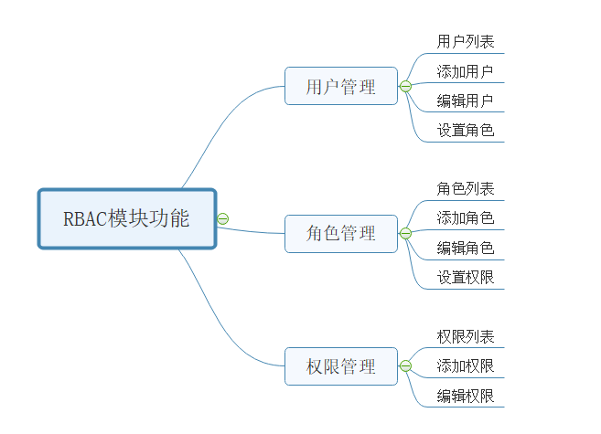

# RBAC

Role Based Access Control

[TOC]

## 学习资源

* [尚硅谷RBAC权限实战教程(rbac项目框架实战)](https://www.bilibili.com/video/BV1pp411o7UX)
* 可能是史上最全的权限系统设计 - 老刘的文章 - 知乎 https://zhuanlan.zhihu.com/p/73414693

## 一篇教程

### 转载自

 [《RBAC权限系统分析、设计与实现》](https://shuwoom.com/?p=3041)

### RBAC 介绍

RBAC 认为权限管理可以抽象为：

> Who是否可以对What进行How的访问操作，并对这个逻辑表达式进行判断是否为True的求解过程，也即是将权限问题转换为What、How的问题，Who、What、How构成了访问权限三元组。

### RBAC 三大概念

在RBAC模型里面，有3个基础组成部分，分别是：用户、角色和权限。

RBAC通过定义角色的权限，并对用户授予某个角色从而来控制用户的权限，实现了用户和权限的逻辑分离（区别于ACL模型），极大地方便了权限的管理。

下面在讲解之前，先介绍一些名词：

- User（用户）：每个用户都有唯一的UID识别，并被授予不同的角色
- Role（角色）：不同角色具有不同的权限
- Permission（权限）：访问权限
- 用户-角色映射：用户和角色之间的映射关系（多对多）
- 角色-权限映射：角色和权限之间的映射（多对多）

它们之间的关系如下图所示：

例如下图，管理员和普通用户被授予不同的权限，普通用户只能去修改和查看个人信息，而不能创建创建用户和冻结用户，而管理员由于被授 予所有权限，所以可以做所有操作。

例如下图，管理员和普通用户被授予不同的权限，普通用户只能去修改和查看个人信息，而不能创建创建用户和冻结用户，而管理员由于被授予所有权限，所以可以做所有操作。

### RBAC 支持的安全原则

RBAC支持三个著名的安全原则：最小权限原则、责任分离原则和数据抽象原则

- 最小权限原则：RBAC可以将角色配置成其完成任务所需的最小权限集合
- 责任分离原则：可以通过调用相互独立互斥的角色来共同完成敏感的任务，例如要求一个计账员和财务管理员共同参与统一过账操作（角色互斥）
- 数据抽象原则：可以通过权限的抽象来体现，例如财务操作用借款、存款等抽象权限，而不是使用典型的读、写、执行权限

### RBAC 三种模型

#### RBAC0

RBAC0，是最简单、最原始的实现方式，也是其他RBAC模型的基础。

在该模型中，用户和角色之间可以是多对多的关系，即一个用户在不同场景下是可以有不同的角色，例如：项目经理也可能是组长也可能是架构师。同时每个角色都至少有一个权限。这种模型下，用户和权限被分离独立开来，使得权限的授权认证更加灵活。

#### RBAC1

基于RBAC0模型，引入了角色间的继承关系，即角色上有了上下级的区别。

角色间的继承关系可分为一般继承关系和受限继承关系。一般继承关系仅要求角色继承关系是一个绝对偏序关系，允许角色间的多继承。而受限继承关系则进一步要求角色继承关系是一个树结构，实现角色间的单继承。

这种模型适合于角色之间层次分明，可以给角色分组分层。

#### RBAC2

RBAC2，基于RBAC0模型的基础上，进行了角色的访问控制。

RBAC2中的一个基本限制是互斥角色的限制，互斥角色是指各自权限可以互相制约的两个角色。对于这类角色一个用户在某一次活动中只能被分配其中的一个角色，不能同时获得两个角色的使用权。

该模型有以下几种约束：

- 互斥角色 ：同一用户只能分配到一组互斥角色集合中至多一个角色，支持责任分离的原则。互斥角色是指各自权限互相制约的两个角色。对于这类角色一个用户在某一次活动中只能被分配其中的一个角色，不能同时获得两个角色的使用权。常举的例子：在审计活动中，一个角色不能同时被指派给会计角色和审计员角色。
- 基数约束 ：一个角色被分配的用户数量受限；一个用户可拥有的角色数目受限；同样一个角色对应的访问权限数目也应受限，以控制高级权限在系统中的分配。例如公司的领导人有限的；
- 先决条件角色 ：可以分配角色给用户仅当该用户已经是另一角色的成员；对应的可以分配访问权限给角色，仅当该角色已经拥有另一种访问权限。指要想获得较高的权限，要首先拥有低一级的权限。就像我们生活中，国家主席是从副主席中选举的一样。
- 运行时互斥 ：例如，允许一个用户具有两个角色的成员资格，但在运行中不可同时激活这两个角色。

### 如何设计 RBAC 系统

这一节，我会介绍设计基于RBAC模型的权限系统的功能模块组成、流程以及数据库的设计。

#### RBAC的功能模块

#### RBAC执行流程

#### RBAC数据库设计

