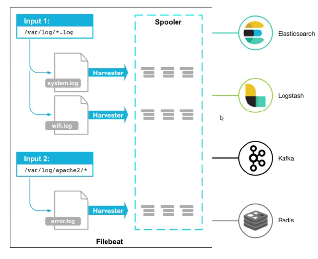
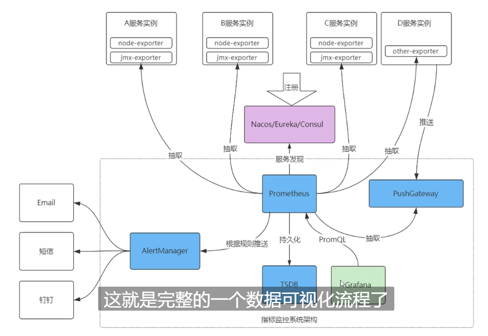

# Logstash

[TOC]

logstash 是一个管道！可以类比成 Linux 中的管道 `|`。

## Logstash Introduction

Logstash is an open source data collection engine with real-time pipelining capabilities. Logstash can dynamically unify data from disparate sources and normalize the data into destinations of your choice. Cleanse and democratize all your data for diverse advanced downstream analytics and visualization use cases.

While Logstash originally drove innovation in log collection, its capabilities extend well beyond that use case. Any type of event can be enriched and transformed with a broad array of input, filter, and output plugins, with many native codecs further simplifying the ingestion process. Logstash accelerates your insights by harnessing a greater volume and variety of data.


## Logstash 日志采集方案

程序中集成 Logback 插件 LogstashTcpSocketAppender，将日志通过 tcp socket 推送给 Logstash。

缺点：侵入式，与代码耦合在一块了。不合适！


## FileBeat

elastic 开发的轻量级日志采集，非侵入式，可以直接配置对日志文件进行监听，不需要改源码，不和源码耦合。

FileBeat 顾名思义，文件的心跳，就是对文件进行监听！

FileBeat 的短板：只能有一个输出。



解决 FileBeat 只能有一个输出的短板：FileBeat 把消息送给 Kafka，其他应用再订阅 Kafka


## 服务器监控的三种数据

* 指标监控 Monitor

  CPU，内存，进程监控

* 链路监控 Tracing

  业务相关的监控，常用于分布式系统的监控

* 日志采集 Logging


## Logstash vs Prometheus

Logstash 更倾向于日志采集，Prometheus 更倾向于指标监控。

Kibana 和 Grafana 也是如此，Kibana 倾向于日志采集和分析，Grafana 倾向于监控。


## Prometheus + Grafana 

支持多种 exporter 采集指标数据，支持 PushGateway 进行数据上报，Prometheus 性能足够支撑上万台规模的集群。

Prometheus 用于指标采集，Grafana 用于可视化。



node-exporter 和 jmx-exporter 是额外安装到节点上的，用来进行监控。Prometheus 支持自定义 exporter。

TSDB（Time Series Database） 是时序数据库。

Prometheus 自带的常用的 exporter：

```
node_exporter： Linux 类操作系统相关数据的采集程序
jmx_exporter: Java 进程指标采集程序
mysqld_exporter: MySQL server 数据采集程序
redis_exporter: Redis 数据采集程序
```

